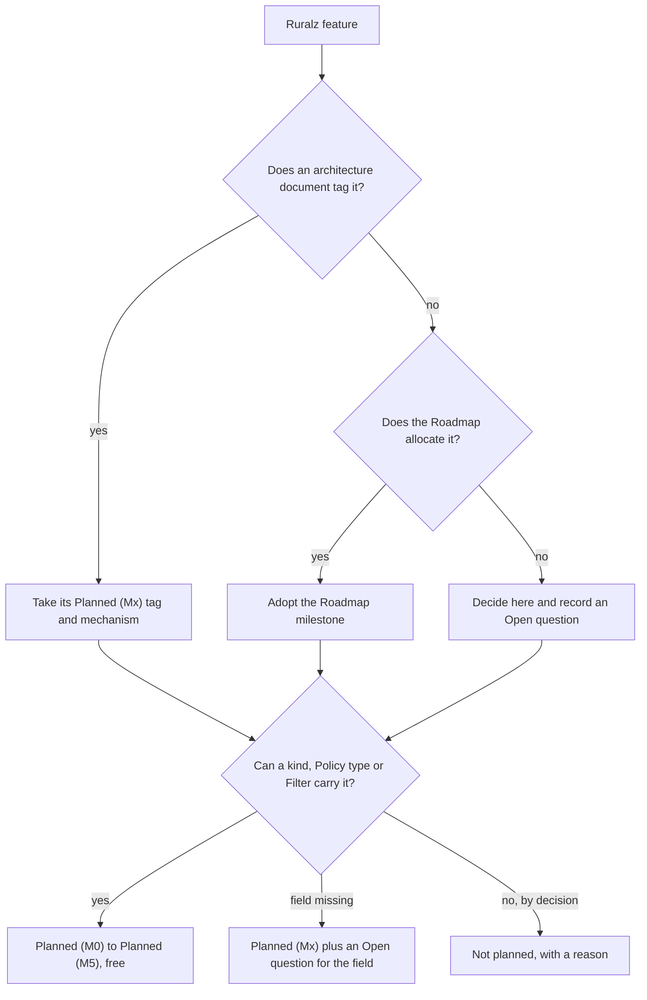
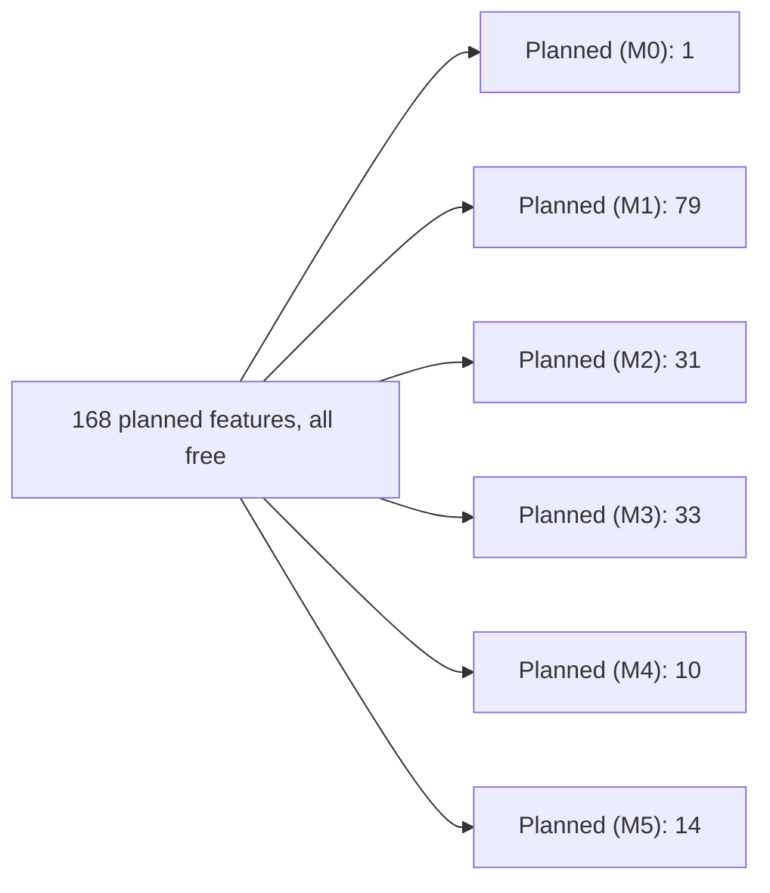

# Feature Catalog

## Summary

This catalog lists every feature Ruralz plans, grouped in ten categories, with the milestone that delivers it, the kind, Policy type, Filter or command that carries it, and the document section that owns its design. It also lists deliberate exclusions with their reasons and counts features per category and milestone. Every feature is free under Apache-2.0 in every public build, with no feature gating. Evaluators read the Status column to judge fit and timing; architects follow the Mechanism and Design columns into the owning documents. Nothing is implemented yet: every row is `Planned (M0)` to `Planned (M5)`.

## Scope and non-goals

In scope: every Ruralz feature planned for M0 to M5, one row each; its milestone, carrying mechanism and owning design section; the features Ruralz deliberately does not plan, with a reason; and counts per category and milestone. The [Roadmap](../roadmap/01-roadmap-and-milestones.md) defers to this catalog on the milestone of a single feature, and M1 exit criterion 6 is measured against it. Terms follow the binding [foundation pack](../_meta/foundation-pack.md), whose section 13 makes this document the owner of the feature list.

Non-goals:

- Field and Policy type design, owned by the [Configuration model](../architecture/02-configuration-model.md); a missing field becomes an Open question here, never an invented field.
- Behavior, failure semantics and performance of each feature, owned by the architecture document linked in its Design cell.
- Performance figures, owned by [Performance budgets and benchmarking](../architecture/12-performance-budgets-and-benchmarking.md), whose M4 bench suite measures Ruralz against its own Performance Budgets and previous releases.
- Calendar dates, which no milestone carries (OQ-roadmap-and-milestones-2).
- Commercial support and Ruralz Cloud terms, which sell help and operations, never a feature ([Vision and positioning](../vision/01-vision-and-positioning.md)).

## How to read this catalog

Each category section holds one table with four columns.

| Column | Values | Meaning |
|---|---|---|
| Feature | Ruralz terms | What an operator, developer or Consumer gets |
| Status | `Planned (M0)` to `Planned (M5)` | The milestone whose exit delivers the feature, free in every build; nothing is implemented yet |
| Mechanism | Kinds, fields, Policy types, commands | Kinds in `PascalCase` (`Route`), fields as `spec` paths (`match.hosts`), Policy types as registered strings (`ratelimit`), commands as `ruralz <noun> <verb>`; an OQ ID marks an open design decision |
| Design | Link | The section of the owning Ruralz document |

| Milestone | Name |
|---|---|
| M0 | Foundations |
| M1 | Core gateway |
| M2 | WASM + Control/GitOps |
| M3 | AI gateway + gRPC/GraphQL/WS/SSE + HTTP/3 |
| M4 | Event protocols + multi-region + bench suite |
| M5 | Enterprise hardening (SSO/SAML for Ruralz Console, FIPS build, monetization hooks) |

A **Policy** is configuration; a **Filter** (built-in Go) or a **Plugin** (WASM) implements it. Every row names only kinds, fields, Policy types and Filters of the [Configuration model](../architecture/02-configuration-model.md#kind-catalog) and commands of the [CLI and API surface](../reference/01-cli-and-api-surface.md). Where a feature needs a field or Policy type that is not registered yet, the Mechanism cell names the kind that would carry it and the Open question that decides it.

Rules applied to every row:

1. The status comes from the `Planned (Mx)` tag of the owning architecture document; where none exists, the Roadmap allocation applies, and where neither decides, this catalog decides and records an Open question.
2. Every planned feature is free under Apache-2.0 with the same feature set in every public build, including the FIPS build ([ADR-0002](../adr/0002-apache-2-license-no-feature-gating.md), P1). There is no license key, license file or entitlement check.
3. A feature excluded from M0 to M5 appears under [Not planned](#not-planned) with a reason and an alternative, never in a category table.

*Figure 1: how a feature receives its status.*

## CI/CD, GitOps and development tools

Ruralz treats configuration as code: a Bundle in Git is validated, rendered, diffed and built into a content-addressed Revision by the `ruralz` CLI, and Ruralz Control delivers Revisions to Clusters through Rollouts ([ADR-0007](../adr/0007-control-stream-protocol.md)). Configuration is YAML 1.2 with a published JSON Schema ([ADR-0003](../adr/0003-configuration-format.md)). Every tool is a free `ruralz` command or a Ruralz Console feature.

| Feature | Status | Mechanism | Design |
|---|---|---|---|
| Editor integration through a published JSON Schema | Planned (M0) | JSON Schema draft 2020-12 authoring view for all ten kinds, from `Gateway` to `Cluster`; existing YAML language servers apply | [Configuration model: Schema keywords that drive tooling](../architecture/02-configuration-model.md#schema-keywords-that-drive-tooling) |
| Configuration validation and linting | Planned (M1) | `ruralz bundle validate` checks every kind against the published schema with source-mapped `RZ-CFG` diagnostics and `--output json` | [Configuration model: Validation and diff semantics](../architecture/02-configuration-model.md#validation-and-diff-semantics) |
| YAML and JSON configuration | Planned (M1) | YAML 1.2 under the restricted profile; JSON accepted as a strict subset through the same loader, yielding the same Revision digest | [Configuration model: Restricted YAML profile](../architecture/02-configuration-model.md#restricted-yaml-profile) |
| Multi-file Bundles | Planned (M1) | Base files form a union in lexical byte order of their relative paths; a duplicate `(kind, metadata.name)` is `RZ-CFG-008` | [Configuration model: Bundle layout and merge](../architecture/02-configuration-model.md#bundle-layout-and-merge) |
| Environment overlays and variables | Planned (M1) | `overlays/<env>/` strategic merge and `${VAR}` substitution, selected by `Environment` `spec.overlay` and `spec.variables` | [Configuration model: Overlays](../architecture/02-configuration-model.md#overlays) |
| Rendering with the effective Filter Chain | Planned (M1) | `ruralz bundle render --env` renders one Environment; `--effective --route` prints the resolved Filter Chain per Phase | [CLI and API surface: Bundle verbs in detail](../reference/01-cli-and-api-surface.md#bundle-verbs-in-detail) |
| Configuration diff | Planned (M1) | `ruralz bundle diff` compares Bundles, files or a Node's `/config/dump`, exiting 0, 1 or 2; Revision sources Planned (M2) | [Configuration model: Diff semantics](../architecture/02-configuration-model.md#diff-semantics) |
| Revision build | Planned (M1) | `ruralz bundle build` produces a Revision whose `sha256` digest covers the rendered Bundle, with an online Plugin check unless `--offline` | [Control plane and GitOps: Building and recording a Revision](../architecture/04-control-plane-and-gitops.md#building-and-recording-a-revision) |
| Hot Reload with Last-Known-Good boot | Planned (M1) | Atomic swap of the active Revision's compiled snapshot on every Node; `ruralz dev run` watches a local Bundle; a Node boots from Last-Known-Good when no source answers | [Data plane: Configuration snapshots and hot reload](../architecture/03-data-plane.md#configuration-snapshots-and-hot-reload) |
| Zero-Downtime Upgrade of `ruralzd` | Planned (M1) | In-place handover through `SO_REUSEPORT` and Drain on VMs and file-mode hosts; edge sites Planned (M2) ([ADR-0015](../adr/0015-zero-downtime-upgrades-so-reuseport.md)) | [Zero-downtime upgrades and hot reload: Binary upgrades](../operations/02-zero-downtime-upgrades-and-hot-reload.md#binary-upgrades) |
| Configuration dump | Planned (M1) | `ruralz node dump` saves a Node's active Revision from `/config/dump` with secrets omitted | [Data plane: Admin endpoints](../architecture/03-data-plane.md#admin-endpoints) |
| GitOps with Ruralz Control | Planned (M2) | Ruralz Control watches the Git repository, validates pull requests and builds a Revision per Environment; `ruralz bundle push` sends a source Bundle or publishes a signed Revision to an OCI registry | [Control plane and GitOps: GitOps model](../architecture/04-control-plane-and-gitops.md#gitops-model) |
| Canary Rollouts with automatic rollback | Planned (M2) | `Cluster` `spec.rollout` (`all-at-once` or `canary`, `autoRollback`); Control Stream ACK and NACK; `ruralz rollout start`, `ruralz rollout status`, `ruralz rollout pause`, `ruralz rollout resume` and `ruralz rollout rollback` | [Control plane and GitOps: Rollout plan, batches and gates](../architecture/04-control-plane-and-gitops.md#rollout-plan-batches-and-gates) |
| Environment promotion with approval | Planned (M2) | Branch-to-Environment mapping; `Environment.spec.promotion.requireApproval` gates promotion; `ruralz rollout approve` approves it | [Control plane and GitOps: Branch-to-Environment mapping](../architecture/04-control-plane-and-gitops.md#branch-to-environment-mapping) |
| Visual Bundle editor in Ruralz Console | Planned (M2) | Ruralz Console edits `Route`, `Upstream` and `Policy` resources with live diagnostics and writes changes back to Git | [Control plane and GitOps: Ruralz Console](../architecture/04-control-plane-and-gitops.md#ruralz-console) |
| Ruralz Console RBAC and audit log | Planned (M2) | Roles over the REST API on 8090; every change recorded in the audit log held in the Control Store | [Control plane and GitOps: RBAC and SSO](../architecture/04-control-plane-and-gitops.md#rbac-and-sso) |
| Drift detection | Planned (M2) | Ruralz Control compares each Node's reported active Revision digest with the Cluster's target and flags Drift | [Control plane and GitOps: Drift detection](../architecture/04-control-plane-and-gitops.md#drift-detection) |
| SSO and SAML for Ruralz Console | Planned (M5) | Operator sign-in through an external identity provider over OIDC and SAML; timing per OQ-feature-catalog-15 | [Security and identity: Operator identity, SSO and RBAC](../architecture/08-security-and-identity.md#operator-identity-sso-and-rbac) |
| Configuration audit | Planned (M2) | `ruralz bundle audit` reports findings such as a `Route` without an auth Policy or broad `Plugin` Capabilities, on the rendered Bundle | [CLI and API surface: CLI command tree](../reference/01-cli-and-api-surface.md#cli-command-tree) |
| End-to-end testing | Planned (M2) | `ruralz test run` sends declarative request cases, kept outside the Bundle, to a local `ruralzd` or a URL and checks each `Route` response | [CLI and API surface: Test case format](../reference/01-cli-and-api-surface.md#test-case-format) |
| OpenAPI import | Planned (M2) | `ruralz bundle import openapi` generates `Route` and `Upstream` resources from an OpenAPI 3.x document into an ordinary Bundle | [CLI and API surface: Bundle verbs in detail](../reference/01-cli-and-api-surface.md#bundle-verbs-in-detail) |
| OpenAPI export | Planned (M2) | `ruralz bundle export openapi` emits OpenAPI 3.x for a rendered Bundle's HTTP `Route` resources | [CLI and API surface: Bundle verbs in detail](../reference/01-cli-and-api-surface.md#bundle-verbs-in-detail) |
| OpenAPI document serving | Planned (M5) | Ruralz Gateway serves the exported document for a `Route` set; design per OQ-vision-and-positioning-11, and until then operators publish the exported file | [CLI and API surface: CLI command tree](../reference/01-cli-and-api-surface.md#cli-command-tree) |
| Postman collection export | Planned (M2) | `ruralz bundle export postman` emits a collection for the same `Route` resources | [CLI and API surface: Bundle verbs in detail](../reference/01-cli-and-api-surface.md#bundle-verbs-in-detail) |
| Graphviz DOT export | Planned (M2) | `ruralz bundle export dot` emits a DOT graph of `Route`, `Policy` and `Upstream` resources | [CLI and API surface: Bundle verbs in detail](../reference/01-cli-and-api-surface.md#bundle-verbs-in-detail) |
| Plugin project scaffolding | Planned (M2) | `ruralz plugin init` scaffolds a `Plugin` project with a PDK; Rust and TinyGo PDKs first | [WASM plugin system: SDK matrix](../architecture/05-wasm-plugin-system.md#sdk-matrix) |
| Plugin build, test and publishing | Planned (M2) | `ruralz plugin build` compiles to WASM for Plugin ABI v1; `ruralz plugin test` runs on the same wazero host as `ruralzd`; `ruralz plugin push` publishes and signs; `ruralz plugin inspect` shows ABI, Phases and Capabilities | [WASM plugin system: Plugin commands](../architecture/05-wasm-plugin-system.md#plugin-commands) |
| Kubernetes CRDs and Helm chart | Planned (M2) | CRDs in `ruralz.io/v1alpha1` mirroring every kind, and a Helm chart ([ADR-0016](../adr/0016-kubernetes-helm-and-crds.md), proposed) | [Configuration model: Kubernetes mapping](../architecture/02-configuration-model.md#kubernetes-mapping) |

## Request and response transformation

Ruralz shapes traffic with `Route` composition, CEL ([ADR-0011](../adr/0011-expressions-and-authorization-engines.md)) and the `headers`, `transform.request` and `transform.response` Policy types, whose `config` schema is authored in Data plane's Transform Policies, pending Configuration model registration. Anything these cannot express runs in a WASM `Plugin` ([ADR-0004](../adr/0004-wasm-runtime-wazero.md), [ADR-0005](../adr/0005-plugin-abi-v1.md)).

| Feature | Status | Mechanism | Design |
|---|---|---|---|
| Response aggregation (backend for frontend) | Planned (M1) | `Route` `composition.mode: aggregate` runs `Upstream` legs in parallel and merges JSON bodies under `group`; a failed `optional` step yields a partial response | [Data plane: Composition engine](../architecture/03-data-plane.md#composition-engine) |
| Field selection, renaming and grouping | Planned (M1) | Composition step fields `target`, `select`, `rename`, `group` and `collection` | [Data plane: Merge rules](../architecture/03-data-plane.md#merge-rules) |
| Sequential composition | Planned (M1) | `Route` `composition.mode: sequential`; later steps read earlier results through the CEL `steps` variable | [Data plane: Composition engine](../architecture/03-data-plane.md#composition-engine) |
| Linear workflows | Planned (M1) | `sequential` composition with per-step `when`; dependency graphs of parallel and sequential stages need declared edges (OQ-data-plane-3) | [Data plane: Workflow composition](../architecture/03-data-plane.md#workflow-composition) |
| Conditional requests and responses with CEL | Planned (M1) | `Policy.spec.when`, composition step `when` and `authz.cel` `config.rule`, compiled and cost-checked at validation | [Configuration model: CEL expressions and allowed places](../architecture/02-configuration-model.md#cel-expressions-and-allowed-places) |
| Header manipulation | Planned (M1) | `headers` Policy at `Gateway`, `Route` or `Upstream` scope, setting, adding and removing request and response headers | [Configuration model: Policy](../architecture/02-configuration-model.md#policy) |
| Request body fields to headers or query | Planned (M1) | `transform.request` `set[]` copies body fields into headers or the query string | [Data plane: Transform Policies](../architecture/03-data-plane.md#transform-policies) |
| CEL-built Upstream request bodies | Planned (M1) | `transform.request` `body` builds the Upstream body with CEL | [Data plane: Transform Policies](../architecture/03-data-plane.md#transform-policies) |
| CEL response shaping and queries | Planned (M1) | `transform.response` `body` or `set[]` CEL expressions over `response.body` build or query the client body | [Data plane: Transform Policies](../architecture/03-data-plane.md#transform-policies) |
| Regular expression replacement | Planned (M1) | `transform.response` `replace[]`, literal or regular expression | [Data plane: Transform Policies](../architecture/03-data-plane.md#transform-policies) |
| Array operations on responses | Planned (M1) | `transform.response` `arrayOps[]` moves, deletes and appends array elements | [Data plane: Transform Policies](../architecture/03-data-plane.md#transform-policies) |
| Cache-Control headers for CDNs | Planned (M1) | `headers` Policy `response.set[]` writes `Cache-Control` | [Configuration model: Policy](../architecture/02-configuration-model.md#policy) |
| Pass-through and JSON output | Planned (M1) | A `Route` passes Upstream bytes through unchanged; `composition` merges emit JSON; other encodings per OQ-feature-catalog-2 | [Data plane: Composition engine](../architecture/03-data-plane.md#composition-engine) |
| Error pass-through and partial responses | Planned (M1) | Upstream statuses pass through; composition step `optional`; gateway errors use the `RZ-<AREA>-<NNN>` response format | [Data plane: Error response format](../architecture/03-data-plane.md#error-response-format) |
| Response Cache | Planned (M1) | `cache` Policy in the State Store, partitioned by CEL `config.key` and shared by all Nodes of a Cell; RFC 9111 shared cache with `stale-while-revalidate` | [Traffic management and resilience: Response caching](../architecture/09-traffic-management-and-resilience.md#response-caching) |
| JSON Schema request validation | Planned (M1) | `validation.json-schema` in `onRequestBody`, draft 2020-12 | [Configuration model: Policy](../architecture/02-configuration-model.md#policy) |
| Static (mock) responses | Planned (M2) | A `plugin` Policy short-circuits a request Phase with a static response; a built-in type per OQ-feature-catalog-3 | [Data plane: Short-circuit](../architecture/03-data-plane.md#short-circuit) |
| WASM Plugins in every Phase | Planned (M2) | `Plugin` on Plugin ABI v1, attached by a `plugin` Policy in any Phase including `onChunk`, run by wazero with deny-by-default Capabilities | [WASM plugin system: Plugin ABI v1](../architecture/05-wasm-plugin-system.md#plugin-abi-v1) |
| Plugin hot-swap with canary percentage | Planned (M2) | A new `Plugin` digest arrives in a new Revision, compiled once per digest and swapped by Hot Reload, optionally to a canary share of traffic | [WASM plugin system: Hot-swap lifecycle](../architecture/05-wasm-plugin-system.md#hot-swap-lifecycle) |
| proxy-wasm ABI adapter | Planned (M4) | An adapter runs modules written against the proxy-wasm ABI inside the Plugin host | [WASM plugin system: proxy-wasm stance](../architecture/05-wasm-plugin-system.md#proxy-wasm-stance) |
| JSON Schema response validation | Planned (M5) | `validation.json-schema` extended to response Phases per OQ-feature-catalog-3; a validation-class `plugin` Policy meanwhile | [Configuration model: Policy](../architecture/02-configuration-model.md#policy) |
| Response compression | Planned (M5) | A `Policy` of a built-in compression type, not yet registered, at `Gateway` or `Route` scope in `onResponse`; type per OQ-feature-catalog-3, a pack section 10 amendment | [Data plane: Filter Chain execution](../architecture/03-data-plane.md#filter-chain-execution) |
| Faster JSON decoding for merges and transforms | Planned (M5) | The JSON decoder behind `composition` merges, `transform.response` and `validation.json-schema`, measured against Performance Budgets (OQ-feature-catalog-11) | [Performance budgets and benchmarking: Per-stage latency budget](../architecture/12-performance-budgets-and-benchmarking.md#per-stage-latency-budget) |

## Security

Browser protections are one Gateway `headers` Policy with `overridable: false`, so no Route can drop them. Supply-chain features sign every Revision and Plugin artifact with Sigstore ([ADR-0017](../adr/0017-artifact-signing.md)), and the FIPS build is a build flavor with the same features and license.

| Feature | Status | Mechanism | Design |
|---|---|---|---|
| TLS termination for HTTPS and HTTP/2 | Planned (M1) | `Gateway` `listeners[].tls` with `minVersion` and `certificates` chosen by SNI; HTTP/2 negotiated by ALPN ([ADR-0009](../adr/0009-http-stack-net-http-quic-go.md)) | [Security and identity: Transport security](../architecture/08-security-and-identity.md#transport-security) |
| Host restriction | Planned (M1) | `Gateway` listener `hostnames` and `Route` `match.hosts`; an unmatched host reaches no Route | [Data plane: Router](../architecture/03-data-plane.md#router) |
| Browser security headers | Planned (M1) | A Gateway `headers` Policy with `overridable: false` sets `X-Frame-Options`, `X-Content-Type-Options`, `Content-Security-Policy`, `Strict-Transport-Security` and any other response header, including on generated responses | [Security and identity: Request hardening](../architecture/08-security-and-identity.md#request-hardening) |
| CORS | Planned (M1) | `cors` Policy with `allowOrigins` and `allowMethods`, first in the chain; preflights skip authentication | [Configuration model: Policy](../architecture/02-configuration-model.md#policy) |
| Upstream forwarding control | Planned (M1) | Upstream-scoped `headers` Policies remove client headers; `auth.api-key` and `auth.basic` strip their credential; an allowlist per OQ-feature-catalog-5 | [Security and identity: Request hardening](../architecture/08-security-and-identity.md#request-hardening) |
| Pre-authentication throttling for Basic credentials | Planned (M1) | A per-Node throttle with a success cache, username buckets and a bounded hash queue in front of `auth.basic` verification | [Security and identity: Pre-authentication throttling](../architecture/08-security-and-identity.md#pre-authentication-throttling) |
| Secrets by reference | Planned (M1) | `secretRef` with `env` and `file` sources; `kubernetes` and `vault` sources Planned (M2) | [Configuration model: secretRef](../architecture/02-configuration-model.md#secretref) |
| Signed Revisions and Plugin artifacts | Planned (M2) | Digest pinning and Sigstore signatures verified by every Node before activation | [Security and identity: Signed Revisions and Plugin artifacts](../architecture/08-security-and-identity.md#signed-revisions-and-plugin-artifacts) |
| Plugin sandbox | Planned (M2) | Deny-by-default Capabilities, memory and time limits per `Plugin`, no filesystem access | [Security and identity: Plugin sandbox](../architecture/08-security-and-identity.md#plugin-sandbox) |
| Node Enrollment over mTLS | Planned (M2) | `ruralz node token` issues a one-time Enrollment token; the Control Stream runs over mTLS; `ruralz node revoke` revokes a Node identity | [Security and identity: Enrollment](../architecture/08-security-and-identity.md#enrollment) |
| FIPS build | Planned (M5) | `GOFIPS140` build flavor of `ruralzd` with the same `Gateway` listeners and Policy types; HTTP/3 off per OQ-tech-stack-and-libraries-9 and OQ-feature-catalog-19 | [Tech stack and libraries: FIPS build](../engineering/01-tech-stack-and-libraries.md#fips-build) |

## Routing

The header match fixes the Route before `onRequestHeaders`; body-dependent criteria then choose among its Upstream legs in `onRoute`. Routes are ranked by the Data plane precedence rules, so every request reaches at most one Route.

| Feature | Status | Mechanism | Design |
|---|---|---|---|
| Pass-through proxying | Planned (M1) | A `Route` with `upstreams` streams request and response bodies unchanged | [Data plane: Upstream layer](../architecture/03-data-plane.md#upstream-layer) |
| Virtual hosts | Planned (M1) | `Route` `match.hosts` with listener `hostnames`; wildcard hosts per OQ-data-plane-2 | [Data plane: Router](../architecture/03-data-plane.md#router) |
| Path matching with prefixes, templates and regular expressions | Planned (M1) | `Route` `match.path` with `prefix`, `template` or `regex`, plus `match.methods` | [Data plane: Precedence](../architecture/03-data-plane.md#precedence) |
| Header and query string routing | Planned (M1) | `Route` `match.headers`, `match.when` over `request.query`, or `conditional` composition; CEL `match.when` sees no body | [Data plane: Router](../architecture/03-data-plane.md#router) |
| Conditional routing | Planned (M1) | `Route` `composition.mode: conditional` with CEL step `when` | [Data plane: Composition engine](../architecture/03-data-plane.md#composition-engine) |
| JWT claim-based routing | Planned (M1) | `conditional` composition with step `when` over `auth.claims` after `auth.jwt`; the header match stays claim-free | [Data plane: Composition engine](../architecture/03-data-plane.md#composition-engine) |
| Catch-all fallback Route | Planned (M1) | A lowest-ranked `Route` whose only criterion is `match.when: "true"`; keep it the only such Route or name it to sort last | [Data plane: Precedence](../architecture/03-data-plane.md#precedence) |
| URL rewrite | Planned (M1) | Composition step `path` or `pathExpression`; rewrites on plain `upstreams` per OQ-traffic-management-and-resilience-13 | [Data plane: Composition engine](../architecture/03-data-plane.md#composition-engine) |
| Weighted splits, blue-green and header canaries | Planned (M1) | `upstreams[].weight` per request; a higher-ranked `Route` with `match.headers` or `match.when` for header, cookie or query canaries | [Traffic management and resilience: Traffic shaping](../architecture/09-traffic-management-and-resilience.md#traffic-shaping) |
| Traffic mirroring | Planned (M2) | `Route` mirroring to a second `Upstream`, declared per OQ-traffic-management-and-resilience-12; mirrored legs stay within `limits.maxBufferedBytes` and are dropped with a counter when exhausted | [Data plane: Bounded resources](../architecture/03-data-plane.md#bounded-resources) |
| Client redirects | Planned (M2) | Upstream 3xx responses pass through; Route-issued redirects use a `plugin` Policy until built-in fields land per OQ-traffic-management-and-resilience-13 | [Traffic management and resilience: Traffic shaping](../architecture/09-traffic-management-and-resilience.md#traffic-shaping) |

## Authentication and authorization

Client authentication types share slot `auth` and fail closed; authorization types run after authentication in request Phases ([ADR-0011](../adr/0011-expressions-and-authorization-engines.md)). Upstream authentication types share slot `upstream-auth` on an `Upstream`.

| Feature | Status | Mechanism | Design |
|---|---|---|---|
| JWT, OpenID Connect and OAuth2 validation | Planned (M1) | `auth.jwt` with `issuers[]` (`issuer`, `jwksUrl`, `audiences`); RS256, PS256, ES256 and EdDSA; `Consumer` `credentials.jwt` and `credentials.oauthClients` bindings | [Security and identity: JWT and OIDC](../architecture/08-security-and-identity.md#jwt-and-oidc) |
| Any OpenID Connect identity provider | Planned (M1) | An `auth.jwt` `issuers[]` entry with the provider's `issuer` and `jwksUrl`, for example an Okta, Auth0, Keycloak or Microsoft Entra ID tenant | [Security and identity: JWT and OIDC](../architecture/08-security-and-identity.md#jwt-and-oidc) |
| Several identity providers or credential types per Route | Planned (M1) | Several `issuers[]` entries in one `auth.jwt` Policy; JWT or API key on one Route through distinct Policies with complementary `when` | [Security and identity: Accepting more than one credential type](../architecture/08-security-and-identity.md#accepting-more-than-one-credential-type) |
| API keys | Planned (M1) | `auth.api-key` (`header`) matched by hash against `Consumer` `credentials.apiKeys`, with named keys for rotation | [Security and identity: Authentication](../architecture/08-security-and-identity.md#authentication) |
| Basic authentication | Planned (M1) | `auth.basic` binding a `Consumer` through `credentials.basic` with PBKDF2 hashes | [Security and identity: Basic and mTLS schemas](../architecture/08-security-and-identity.md#basic-and-mtls-schemas) |
| Client mTLS | Planned (M1) | `auth.mtls` `config.caCertificate` with `Consumer` `credentials.certificates` | [Security and identity: Basic and mTLS schemas](../architecture/08-security-and-identity.md#basic-and-mtls-schemas) |
| CEL authorization rules | Planned (M1) | `authz.cel` `config.rule` over the `request`, `consumer` and `auth.claims` variables, with the strings and encoders extensions | [Security and identity: Authorization](../architecture/08-security-and-identity.md#authorization) |
| OAuth2 client credentials toward Upstreams | Planned (M1) | `auth.upstream-oauth2` (`tokenUrl`, `clientId`, `clientSecret`, `scopes`) on an `Upstream` | [Security and identity: Upstream authentication](../architecture/08-security-and-identity.md#upstream-authentication) |
| Upstream mTLS | Planned (M1) | `Upstream.spec.tls` `clientCertificate` toward the Upstream | [Security and identity: Mutual TLS](../architecture/08-security-and-identity.md#mutual-tls) |
| OPA and Cedar authorization | Planned (M2) | `authz.opa` and `authz.cedar` Policies with engine configuration and memory limits | [Security and identity: OPA and Cedar schemas](../architecture/08-security-and-identity.md#opa-and-cedar-schemas) |
| Service-account JWT-bearer grant toward Upstreams | Planned (M2) | `auth.upstream-oauth2` with `grantType: jwt-bearer`, `serviceAccountKey` and `audience`, for example for Google Cloud services, pending registration (OQ-security-and-identity-12) | [Security and identity: Upstream authentication](../architecture/08-security-and-identity.md#upstream-authentication) |
| AWS SigV4 request signing | Planned (M2) | `auth.upstream-sigv4` on an `Upstream`, signing at the transport on every attempt; signer per OQ-tech-stack-and-libraries-17 | [Security and identity: Upstream authentication](../architecture/08-security-and-identity.md#upstream-authentication) |
| JWT signing | Planned (M2) | A `Policy` of a built-in signing type, not yet registered, on a `Route`, with keys only through `secretRef`; type per OQ-security-and-identity-11 | [Security and identity: JWT and OIDC](../architecture/08-security-and-identity.md#jwt-and-oidc) |
| Token revocation | Planned (M2) | A signed revocation list that `auth.*` Policies check on every Node, fed by the Ruralz Control revocation API; capped at 100,000 entries per Cluster (target); API per OQ-security-and-identity-4 | [Security and identity: Revocation](../architecture/08-security-and-identity.md#revocation) |

## AI gateway

In Ruralz, LLM providers are Upstreams governed by the same Policies, Consumers and State Store as every other Route (P8). Every feature below is part of [AI/LLM gateway](../architecture/06-ai-llm-gateway.md) under [ADR-0014](../adr/0014-ai-api-surface.md).

| Feature | Status | Mechanism | Design |
|---|---|---|---|
| Unified OpenAI-compatible API | Planned (M3) | `AIProvider`, `AIModel` and an `Upstream` with `protocol: ai` and `ai.surface: openai`, translating to each provider dialect | [AI/LLM gateway: Unified API](../architecture/06-ai-llm-gateway.md#unified-api) |
| Native provider passthrough | Planned (M3) | `ai.surface` set to a provider's native API; request and response formats pass unchanged while Policies still apply | [AI/LLM gateway: Native passthrough](../architecture/06-ai-llm-gateway.md#native-passthrough) |
| OpenAI provider | Planned (M3) | `AIProvider` `dialect: openai` | [AI/LLM gateway: AIProvider, AIModel and dialect translation matrix](../architecture/06-ai-llm-gateway.md#aiprovider-aimodel-and-dialect-translation-matrix) |
| Anthropic provider | Planned (M3) | `AIProvider` `dialect: anthropic` | [AI/LLM gateway: AIProvider, AIModel and dialect translation matrix](../architecture/06-ai-llm-gateway.md#aiprovider-aimodel-and-dialect-translation-matrix) |
| Google Gemini provider | Planned (M3) | `AIProvider` `dialect: gemini`; native passthrough keeps the model path segment | [AI/LLM gateway: AIProvider, AIModel and dialect translation matrix](../architecture/06-ai-llm-gateway.md#aiprovider-aimodel-and-dialect-translation-matrix) |
| Mistral provider | Planned (M3) | `AIProvider` `dialect: mistral` through façade translation | [AI/LLM gateway: AIProvider, AIModel and dialect translation matrix](../architecture/06-ai-llm-gateway.md#aiprovider-aimodel-and-dialect-translation-matrix) |
| AWS Bedrock provider | Planned (M3) | `AIProvider` `dialect: bedrock` with `auth.upstream-sigv4` on the `ai` Upstream (OQ-ai-llm-gateway-12) | [AI/LLM gateway: AIProvider, AIModel and dialect translation matrix](../architecture/06-ai-llm-gateway.md#aiprovider-aimodel-and-dialect-translation-matrix) |
| Ollama provider | Planned (M3) | `AIProvider` `dialect: ollama` for self-hosted models | [AI/LLM gateway: AIProvider, AIModel and dialect translation matrix](../architecture/06-ai-llm-gateway.md#aiprovider-aimodel-and-dialect-translation-matrix) |
| Model routing strategies | Planned (M3) | `AIModel` `strategy` (`weighted`, `latency`, `cost`, `fallback`) over `candidates[]` with per-candidate `when`; `ruralz ai models` lists them | [AI/LLM gateway: Model routing](../architecture/06-ai-llm-gateway.md#model-routing) |
| Provider Fallback | Planned (M3) | The next `AIModel` candidate serves a request after a retryable provider failure, before the response is committed | [AI/LLM gateway: Provider Fallback](../architecture/06-ai-llm-gateway.md#provider-fallback) |
| Multi-model aggregation | Planned (M3) | `composition` over several `ai` Upstreams, buffered only, with no streamed merge, under the proposed option of OQ-feature-catalog-7 | [AI/LLM gateway: Model routing](../architecture/06-ai-llm-gateway.md#model-routing) |
| Prompt templates | Planned (M3) | Prompts shaped by `transform.request` `body` with CEL or by a `plugin` Policy | [Data plane: Transform Policies](../architecture/03-data-plane.md#transform-policies) |
| Token Budgets | Planned (M3) | `ai.token-budget` against `Consumer` `quotas` with `unit: tokens`: atomic reservation, then settlement on provider-reported usage; calendar windows per OQ-traffic-management-and-resilience-10 and currency units per OQ-ai-llm-gateway-7 | [AI/LLM gateway: Token-aware rate limits and budgets](../architecture/06-ai-llm-gateway.md#token-aware-rate-limits-and-budgets) |
| Token-aware rate limits | Planned (M3) | Rate limits counted in input and output tokens per `Consumer` and `AIModel` | [AI/LLM gateway: Token-aware rate limits and budgets](../architecture/06-ai-llm-gateway.md#token-aware-rate-limits-and-budgets) |
| Cost tracking and attribution | Planned (M3) | `AIProvider` `pricing` tables with provider-reported usage; `ruralz ai cost` reports cost per `Consumer`, `Route` and `AIModel` | [AI/LLM gateway: Cost tracking and attribution](../architecture/06-ai-llm-gateway.md#cost-tracking-and-attribution) |
| Guardrails | Planned (M3) | `ai.guardrail` in `onRequestBody`, `onChunk` and `onResponse`, plus `auth.*` and `authz.cel` on AI Routes; detector schema per OQ-ai-llm-gateway-4 | [AI/LLM gateway: Guardrail hooks](../architecture/06-ai-llm-gateway.md#guardrail-hooks) |
| Data residency routing | Planned (M3) | `AIProvider` `region` restricts candidates to permitted Regions | [AI/LLM gateway: Security and data residency routing](../architecture/06-ai-llm-gateway.md#security-and-data-residency-routing) |
| Semantic Cache | Planned (M3) | `ai.semantic-cache` on a `Route`, backed by vector commands in the State Store | [AI/LLM gateway: Prompt caching and semantic caching](../architecture/06-ai-llm-gateway.md#prompt-caching-and-semantic-caching) |
| Prompt Cache passthrough | Planned (M3) | `AIModel` `cache.prompt.mode: passthrough` keeps provider cache markers intact through native passthrough (SM-11) | [AI/LLM gateway: Prompt caching and semantic caching](../architecture/06-ai-llm-gateway.md#prompt-caching-and-semantic-caching) |
| MCP gateway | Planned (M3) | `Route` to MCP servers on `http` Upstreams with auth Policies and `authz.cel` tool allow lists; per-client affinity through `ring-hash` on `consumer.name`; per-session affinity per OQ-ai-llm-gateway-10 | [AI/LLM gateway: MCP and A2A stance](../architecture/06-ai-llm-gateway.md#mcp-and-a2a-stance) |
| MCP Server from existing Routes | Planned (M3) | MCP tools generated from existing `Route` resources; surface per OQ-ai-llm-gateway-10 | [AI/LLM gateway: MCP Server](../architecture/06-ai-llm-gateway.md#mcp-server) |
| A2A over HTTP and SSE Routes | Planned (M3) | Agent-to-agent traffic on ordinary HTTP and SSE Routes with the same auth, authz and admission Policies | [AI/LLM gateway: MCP and A2A stance](../architecture/06-ai-llm-gateway.md#mcp-and-a2a-stance) |
| A2A-aware gateway | Planned (M5) | Agent cards, per-skill authorization and usage attribution on `Route` resources; timing per OQ-feature-catalog-16 | [AI/LLM gateway: MCP and A2A stance](../architecture/06-ai-llm-gateway.md#mcp-and-a2a-stance) |

## Services connectivity

Ruralz carries protocols natively through `Route` matching and `Upstream.spec.protocol` (P7, [Multi-protocol](../architecture/07-multi-protocol.md)). Message brokers are mediated, not wire-proxied, so every message passes through a Route and its Filter Chain ([ADR-0013](../adr/0013-messaging-client-libraries.md)).

| Feature | Status | Mechanism | Design |
|---|---|---|---|
| Load balancing | Planned (M1) | `Upstream` `loadBalancing.algorithm`: `round-robin`, `least-request`, `ring-hash` or `random`, weighted by `endpoints[].weight` or SRV weights | [Traffic management and resilience: Load balancing](../architecture/09-traffic-management-and-resilience.md#load-balancing) |
| DNS service discovery | Planned (M1) | `Upstream` `discovery.type: dns` with A, AAAA or SRV records, refreshed every 30 s (target) | [Traffic management and resilience: Service discovery](../architecture/09-traffic-management-and-resilience.md#service-discovery) |
| Kubernetes service discovery | Planned (M2) | `Upstream` `discovery.type: kubernetes` watching EndpointSlices, which avoids DNS TTL lag | [Traffic management and resilience: Service discovery](../architecture/09-traffic-management-and-resilience.md#service-discovery) |
| HTTP/3 listeners | Planned (M3) | `Gateway` `listeners[].http3` on quic-go, UDP 8443; off in FIPS builds ([ADR-0009](../adr/0009-http-stack-net-http-quic-go.md)) | [Multi-protocol: HTTP/1.1, HTTP/2 and HTTP/3](../architecture/07-multi-protocol.md#http11-http2-and-http3) |
| gRPC, gRPC-Web and Connect serving | Planned (M3) | `Route` `match.grpc` by service and method, serving gRPC, gRPC-Web and Connect clients | [Multi-protocol: gRPC](../architecture/07-multi-protocol.md#grpc) |
| gRPC Upstreams | Planned (M3) | `Upstream` `protocol: grpc` with per-method retries and balancing | [Multi-protocol: gRPC](../architecture/07-multi-protocol.md#grpc) |
| REST to gRPC transcoding | Planned (M3) | A REST `Route` to a `grpc` Upstream with HTTP/JSON transcoding; descriptors per OQ-multi-protocol-1 | [Multi-protocol: HTTP/JSON transcoding and reflection](../architecture/07-multi-protocol.md#httpjson-transcoding-and-reflection) |
| GraphQL Upstreams and federation | Planned (M3) | `Upstream` `protocol: graphql` and `Route` `match.graphql` by operation; federation versions 1 and 2 ([ADR-0012](../adr/0012-graphql-engine-graphql-go-tools.md)) | [Multi-protocol: GraphQL](../architecture/07-multi-protocol.md#graphql) |
| GraphQL subscriptions | Planned (M3) | Subscriptions over WebSocket and SSE through the `graphql` Upstream | [Multi-protocol: Subscriptions](../architecture/07-multi-protocol.md#subscriptions) |
| GraphQL depth, complexity and persisted queries | Planned (M3) | Depth and complexity limits after fragment expansion, with persisted queries | [Multi-protocol: Depth, complexity and persisted queries](../architecture/07-multi-protocol.md#depth-complexity-and-persisted-queries) |
| Server-Sent Events with per-event Policies | Planned (M3) | SSE responses stream through `onChunk`, where Policies such as `ai.guardrail` act per event | [Multi-protocol: Server-Sent Events](../architecture/07-multi-protocol.md#server-sent-events) |
| Direct WebSockets | Planned (M3) | `Upgrade: websocket` on a `Route` to a `websocket` Upstream; `onChunk` per message; idle session cost tag per OQ-feature-catalog-14 | [Multi-protocol: Backpressure and per-message Policies](../architecture/07-multi-protocol.md#backpressure-and-per-message-policies) |
| WebSocket multiplexing | Planned (M3) | `Upstream` `protocol: websocket` with one shared connection per Route and Endpoint per Node, envelope `ruralz.mux.v1`; settings per OQ-multi-protocol-6 | [Multi-protocol: Multiplexing](../architecture/07-multi-protocol.md#multiplexing) |
| HTTP publish to Kafka, NATS and MQTT | Planned (M4) | A REST `Route` to a `kafka`, `nats` or `mqtt` Upstream publishes the body as a message | [Multi-protocol: Publishing from HTTP](../architecture/07-multi-protocol.md#publishing-from-http) |
| Kafka Upstreams | Planned (M4) | `Upstream` `protocol: kafka` with `messaging.topic` and CEL `messaging.key` | [Multi-protocol: Kafka, NATS JetStream and MQTT](../architecture/07-multi-protocol.md#kafka-nats-jetstream-and-mqtt) |
| Advanced Kafka options | Planned (M4) | Further `messaging` options on the `kafka` Upstream; options per OQ-multi-protocol-8, credentials per OQ-multi-protocol-9 | [Multi-protocol: Advanced Kafka options](../architecture/07-multi-protocol.md#advanced-kafka-options) |
| NATS JetStream Upstreams | Planned (M4) | `Upstream` `protocol: nats` with `messaging.topic` | [Multi-protocol: Kafka, NATS JetStream and MQTT](../architecture/07-multi-protocol.md#kafka-nats-jetstream-and-mqtt) |
| MQTT Upstreams | Planned (M4) | `Upstream` `protocol: mqtt` toward external brokers | [Multi-protocol: Kafka, NATS JetStream and MQTT](../architecture/07-multi-protocol.md#kafka-nats-jetstream-and-mqtt) |
| Topic ingress (async consumers) | Planned (M4) | `Route` `match.topic` consuming from `kafka`, `nats` or `mqtt` Upstreams into the Filter Chain; ingress per OQ-multi-protocol-10 and OQ-configuration-model-11 | [Multi-protocol: Topic ingress](../architecture/07-multi-protocol.md#topic-ingress) |
| Embedded MQTT broker mode | Planned (M4) | Ruralz Gateway terminates MQTT so each PUBLISH gets a Route | [Multi-protocol: Embedded MQTT broker mode](../architecture/07-multi-protocol.md#embedded-mqtt-broker-mode) |
| SOAP and XML envelope integration | Planned (M5) | `transform.request` `body` builds XML envelopes with CEL string functions and `contentType: text/xml` for an `http` Upstream; reading XML responses needs a decoder (OQ-data-plane-17), a `plugin` Policy meanwhile | [Data plane: Transform Policies](../architecture/03-data-plane.md#transform-policies) |
| Static content serving | Planned (M5) | A `Policy` of a built-in static-content type, not yet registered, short-circuiting a request Phase on a `Route`; type per OQ-feature-catalog-3 | [Data plane: Short-circuit](../architecture/03-data-plane.md#short-circuit) |
| Egress through an HTTP proxy | Planned (M5) | An `Upstream` reaches its Endpoints through an outbound HTTP proxy; field per OQ-feature-catalog-6 | [Data plane: Upstream layer](../architecture/03-data-plane.md#upstream-layer) |

## Traffic management

Ruralz rate limiting is a local token bucket at a per-Node ceiling plus GCRA in the State Store, failing open by default ([ADR-0008](../adr/0008-rate-limiting-local-bucket-and-gcra.md)). Resilience is per Node: each Node judges Upstream health alone and keeps its own breakers and retry budgets.

| Feature | Status | Mechanism | Design |
|---|---|---|---|
| Route rate limits | Planned (M1) | Route-scoped `ratelimit` with `limits[]` (`requests`, `window`) and CEL `config.key` | [Traffic management and resilience: Rate limiting](../architecture/09-traffic-management-and-resilience.md#rate-limiting) |
| Spike arrest and burst | Planned (M1) | `ratelimit` `limits[]` with a short `window` and `limits[].burst` | [Traffic management and resilience: Per-Node ceiling](../architecture/09-traffic-management-and-resilience.md#per-node-ceiling) |
| Distributed rate limits with bounded over-admission | Planned (M1) | `ratelimit` with GCRA on the `redis` State Store driver, failing open by default; over-admission at most N × per-Node ceiling per window (target) through `limits[].perNodeCeiling` | [Scalability and distributed state: Distributed rate limits](../architecture/11-scalability-and-distributed-state.md#distributed-rate-limits) |
| Service-wide rate limit | Planned (M1) | Gateway-scoped `ratelimit` with a constant `config.key`; above about 25,000 requests per second (hypothesis) it needs `limits[].perNodeCeiling` or `config.localOnly`, whose pack 8.8 amendment is OQ-scalability-and-distributed-state-11 | [Traffic management and resilience: Service and tiered limits](../architecture/09-traffic-management-and-resilience.md#service-and-tiered-limits) |
| Tiered rate limits | Planned (M1) | One `ratelimit` per Tier guarded by `Policy.spec.when` on `consumer.tier` (OQ-traffic-management-and-resilience-4) | [Traffic management and resilience: Service and tiered limits](../architecture/09-traffic-management-and-resilience.md#service-and-tiered-limits) |
| Upstream protection limits | Planned (M1) | A `ratelimit` with a constant key on each `Route` reaching the `Upstream`, plus `circuitBreaker.maxPendingRequests`; Upstream scope per OQ-feature-catalog-4 | [Traffic management and resilience: Circuit breakers](../architecture/09-traffic-management-and-resilience.md#circuit-breakers) |
| RateLimit response headers | Planned (M1) | Structured Field `RateLimit` and `RateLimit-Policy` headers on limited Routes | [Traffic management and resilience: RateLimit response headers](../architecture/09-traffic-management-and-resilience.md#ratelimit-response-headers) |
| Circuit breakers and bulkheads | Planned (M1) | `Upstream` `circuitBreaker` (`consecutiveFailures`, `openDuration`, `maxConnections`) with CEL `failureWhen` over `response.status` and `error`; an open breaker fails fast with an `RZ-UP` code | [Traffic management and resilience: Circuit breakers](../architecture/09-traffic-management-and-resilience.md#circuit-breakers) |
| Health checks and outlier detection | Planned (M1) | Active probes and passive ejection per Node on each `Upstream` | [Traffic management and resilience: Health checking and outlier detection](../architecture/09-traffic-management-and-resilience.md#health-checking-and-outlier-detection) |
| Granular timeouts | Planned (M1) | `Route` `timeout`, `Upstream` `timeout`, `retries.perTryTimeout` and Policy `stateStoreTimeout`, nested per request, leg and attempt | [Traffic management and resilience: Deadlines](../architecture/09-traffic-management-and-resilience.md#deadlines) |
| Retries with a retry budget | Planned (M1) | `retries.attempts` and CEL `retryOn` with full-jitter backoff; in-flight retries capped at max(3, 20% of in-flight originals) (target) | [Traffic management and resilience: Retries](../architecture/09-traffic-management-and-resilience.md#retries) |
| IP filtering | Planned (M1) | `authz.ip` by CIDR on `source.ip`; trusted proxies per OQ-security-and-identity-6, and until it closes, deployments behind a load balancer SHOULD NOT rely on `source.ip` | [Security and identity: IP filtering and GeoIP](../architecture/08-security-and-identity.md#ip-filtering-and-geoip) |
| User-agent filtering | Planned (M1) | `authz.cel` `config.rule` matching `request.headers["user-agent"]`; a list beyond the `RZ-CFG-015` cost bound of 10,000 units (target) uses a `plugin` Policy | [Security and identity: Authorization](../architecture/08-security-and-identity.md#authorization) |
| GeoIP filtering | Planned (M2) | `authz.geoip` by ISO 3166 country from a local MaxMind-format database; reader per OQ-tech-stack-and-libraries-24; a `source.country` CEL variable per OQ-security-and-identity-14 | [Security and identity: IP filtering and GeoIP](../architecture/08-security-and-identity.md#ip-filtering-and-geoip) |
| Request hedging | Planned (M4) | A second attempt to another Endpoint after a delay, for idempotent methods with replayable bodies, spending retry budget; `hedgeDelay` per OQ-traffic-management-and-resilience-5 | [Traffic management and resilience: Hedging](../architecture/09-traffic-management-and-resilience.md#hedging) |
| Multi-region Cells | Planned (M4) | One `Cluster` and State Store per Region, optionally with a regional Ruralz Control; regional or global quotas | [Scalability and distributed state: Multi-region](../architecture/11-scalability-and-distributed-state.md#multi-region) |

## Observability

Ruralz is OpenTelemetry-first ([ADR-0010](../adr/0010-telemetry-opentelemetry-first.md)): a Node exports OTLP to the operator's OpenTelemetry Collector, which owns delivery to any backend, so no vendor SDK is linked.

| Feature | Status | Mechanism | Design |
|---|---|---|---|
| OpenTelemetry tracing | Planned (M1) | `Gateway` `telemetry.otlp.endpoint` and `traceSampling`; TLS for OTLP export per OQ-observability-2, blocking M1 | [Observability: Tracing](../architecture/10-observability.md#tracing) |
| Spans per Filter and upstream leg | Planned (M1) | Spans `ruralz.filter.<name>`, `ruralz.upstream.<name>` and `ruralz.route.match`; per-Route sampling per OQ-observability-5 | [Observability: Span model](../architecture/10-observability.md#span-model) |
| Trace context propagation | Planned (M1) | `traceparent` and `tracestate` injected into every HTTP leg; gRPC legs Planned (M3); Kafka, NATS and MQTT 5 legs Planned (M4) | [Observability: Propagation](../architecture/10-observability.md#propagation) |
| Prometheus metrics | Planned (M1) | `/metrics` on admin port 9901 with `ruralz_<component>_<name>_<unit>` metrics labeled by `Route` and `Upstream` | [Observability: Metrics catalog](../architecture/10-observability.md#metrics-catalog) |
| Structured process logs | Planned (M1) | `slog` JSON lines on stdout at the level from `RURALZ_LOG_LEVEL`; OTLP logs when `Gateway` `telemetry.otlp` is set | [Observability: Process logs](../architecture/10-observability.md#process-logs) |
| Selectable access logs | Planned (M1) | `Gateway` `telemetry.accessLog.when` selects records written in `onLog`, keyed by `Route`, `Consumer` and `Upstream`; format and destination per OQ-observability-3 | [Observability: Access logs](../architecture/10-observability.md#access-logs) |
| Delivery to any backend through the Collector | Planned (M1) | OTLP traces, metrics and logs from `Gateway` `telemetry.otlp` to an operator-run OpenTelemetry Collector, which exports to the chosen backend | [Observability: Telemetry pipeline](../architecture/10-observability.md#telemetry-pipeline) |
| Grafana dashboard pack | Planned (M1) | Apache-2.0 dashboards over `Route`, `Upstream` and `Policy` metrics; Plugin and Ruralz Control panels Planned (M2); AI panels Planned (M3) | [Observability: Grafana dashboard pack](../architecture/10-observability.md#grafana-dashboard-pack) |
| Degraded-state reporting | Planned (M1) | `ruralz_node_degraded_info` with a reason per degraded condition, such as `lkg_boot` or `state_store_breaker_open` | [Observability: Degraded states](../architecture/10-observability.md#degraded-states) |
| Debugging tools | Planned (M1) | `/debug/pprof/` profiles on 9901 and `ruralz dev tap` streaming redacted traffic from `/tap` | [Observability: Debugging tools](../architecture/10-observability.md#debugging-tools) |
| Ruralz Control observability | Planned (M2) | Ruralz Control exports metrics, traces and logs like a Node, including Rollouts, NACKs, Drift and audit lag | [Observability: Control plane observability](../architecture/10-observability.md#control-plane-observability) |
| AI telemetry | Planned (M3) | OpenTelemetry `gen_ai` attributes and AI metrics for tokens, cost, time to first token, fallbacks and budgets per `AIModel` | [Observability: AI observability](../architecture/10-observability.md#ai-observability) |
| Authenticated OTLP export | Planned (M5) | Credentials on `Gateway` `telemetry.otlp` export; settings per OQ-observability-2 | [Observability: Telemetry pipeline](../architecture/10-observability.md#telemetry-pipeline) |
| Per-Route telemetry export selection | Planned (M5) | A `Route` selects its exporter within `Gateway` `telemetry`, per OQ-feature-catalog-9 | [Observability: Telemetry pipeline](../architecture/10-observability.md#telemetry-pipeline) |
| Per-Upstream log records | Planned (M5) | Log records per `Upstream` leg beside the access log, per OQ-feature-catalog-9 | [Observability: Access logs](../architecture/10-observability.md#access-logs) |

## API governance and monetization

Ruralz governs APIs with Consumers, Quotas and non-overridable Gateway Policies. Monetization stays a hook over usage records, not a billing engine ([product non-goals](../vision/01-vision-and-positioning.md#product-non-goals), non-goal 2).

| Feature | Status | Mechanism | Design |
|---|---|---|---|
| Consumers and tiers | Planned (M1) | `Consumer` resources with credentials, `tier`, `quotas` and tags, bound by the `auth.*` Policies | [Security and identity: Consumers and tiers](../architecture/08-security-and-identity.md#consumers-and-tiers) |
| Request quotas | Planned (M1) | `quota` against `Consumer` `quotas` with `unit: requests`, reserving in `onRequestHeaders` and refunding in `onLog`; weighted costs per OQ-traffic-management-and-resilience-10 | [Traffic management and resilience: Quotas](../architecture/09-traffic-management-and-resilience.md#quotas) |
| Non-overridable Gateway Policies | Planned (M1) | Gateway-scoped Policies with `overridable: false` enforce organization rules no `Route` can replace | [Configuration model: Attachment and precedence](../architecture/02-configuration-model.md#attachment-and-precedence) |
| Monetization hooks | Planned (M5) | Usage records per `Consumer`, `Route` and `AIModel` exposed without vendor-specific code; surface per OQ-feature-catalog-8 | [Observability: Access logs](../architecture/10-observability.md#access-logs) |

## Not planned

These features are deliberately outside M0 to M5. Each stays reviewable, and a reversal needs an ADR or a closed Open question.

| Feature | Reason | Alternative |
|---|---|---|
| Feature-gated editions, license keys or entitlement checks | Every feature is Apache-2.0 in every public build (P1, [ADR-0002](../adr/0002-apache-2-license-no-feature-gating.md)) | Commercial support and Ruralz Cloud, which sell help and operations, never features |
| An embedded scripting language runtime, such as Lua | CEL covers expressions with static cost bounds and WASM Plugins cover code; a third runtime would duplicate both ([ADR-0011](../adr/0011-expressions-and-authorization-engines.md)) | CEL fields or a WASM `Plugin`, Planned (M2) |
| Native Go plugins or shared-object loading | Couples extensions to the exact Go toolchain and runs them unsandboxed in the Node (vision non-goal 3) | A WASM `Plugin`, Planned (M2) |
| A configuration template language | Overlays and `${VAR}` substitution keep every render deterministic and schema-checked ([ADR-0003](../adr/0003-configuration-format.md)) | `overlays/<env>/` and `Environment` variables, Planned (M1) |
| Configuration formats other than YAML and JSON (TOML, HCL, properties files) | One loader and one schema yield one Revision digest; HCL has a weak schema and IDE story and no CRD path (ADR-0003) | YAML 1.2, or JSON as its strict subset |
| NTLM authentication toward Upstreams | NTLM authenticates a TCP connection, breaking connection pooling, and needs MD4 and HMAC-MD5, which fail the FIPS build | `auth.upstream-oauth2` or Upstream mTLS |
| A serverless function invocation protocol | No researched invocation library or `Upstream.spec.protocol` value (OQ-feature-catalog-10) | An `http` `Upstream` to an HTTP-reachable function |
| AMQP brokers and cloud queues (AMQP consumers and producers, Azure Service Bus, Google Cloud Pub/Sub, Amazon SNS, Amazon SQS) | No researched Go library (OQ-multi-protocol-14, option (a)) | `kafka`, `nats` or `mqtt` Upstreams, or a bridge |
| Native broker wire-protocol proxying (Kafka, transparent MQTT, NATS client protocol) | A wire proxy would hide messages from the Route and Filter Chain model (P7); Kafka proxying is revisited at M4 (OQ-multi-protocol-11) | Mediated `kafka`, `nats` and `mqtt` Upstreams and the embedded MQTT broker mode, Planned (M4) |
| Vendor-specific telemetry SDKs and native exporters | OpenTelemetry-first: one OTLP path, with delivery owned by the Collector ([ADR-0010](../adr/0010-telemetry-opentelemetry-first.md)) | OTLP through the OpenTelemetry Collector, Planned (M1) |
| Prebuilt dashboards for tools other than Grafana | Ruralz maintains one dashboard pack; other views are community work | JSON access logs and OTLP signals in any backend |
| Kubernetes Gateway API conformance | Deferred by [ADR-0016](../adr/0016-kubernetes-helm-and-crds.md) (proposed) in favor of CRDs that mirror every kind | Ruralz CRDs and the Helm chart, Planned (M2) |
| Developer portal, API catalog and billing engine | Ruralz is a gateway, not a full API management suite (vision non-goal 2) | Monetization hooks, Planned (M5), feeding external tools |

## Summary counts

Counts of catalog rows per category and milestone; each row sums across to its Total, and the category rows sum to the Total row. Not planned features are counted separately below.

| Category | M0 | M1 | M2 | M3 | M4 | M5 | Total |
|---|---|---|---|---|---|---|---|
| CI/CD, GitOps and development tools | 1 | 10 | 15 | 0 | 0 | 2 | 28 |
| Request and response transformation | 0 | 16 | 3 | 0 | 1 | 3 | 23 |
| Security | 0 | 7 | 3 | 0 | 0 | 1 | 11 |
| Routing | 0 | 9 | 2 | 0 | 0 | 0 | 11 |
| Authentication and authorization | 0 | 9 | 5 | 0 | 0 | 0 | 14 |
| AI gateway | 0 | 0 | 0 | 22 | 0 | 1 | 23 |
| Services connectivity | 0 | 2 | 1 | 10 | 7 | 3 | 23 |
| Traffic management | 0 | 13 | 1 | 0 | 2 | 0 | 16 |
| Observability | 0 | 10 | 1 | 1 | 0 | 3 | 15 |
| API governance and monetization | 0 | 3 | 0 | 0 | 0 | 1 | 4 |
| Total | 1 | 79 | 31 | 33 | 10 | 14 | 168 |

Not planned: 13 features, listed in [Not planned](#not-planned).

*Figure 2: catalog rows by milestone.*

Rows tagged Planned (M1) that wait on Configuration model registration of the `transform.*` `config` schema, authored in Data plane's Transform Policies: request body fields to headers or query, CEL-built Upstream request bodies, CEL response shaping and queries, regular expression replacement and array operations.

## Open questions

IDs keep their original numbers; gaps belong to closed or withdrawn questions.

| ID | Question | Options | Owner | Blocking? |
|---|---|---|---|---|
| OQ-feature-catalog-2 | Should Ruralz re-encode responses to XML, YAML or a negotiated format? | (a) No: pass-through and JSON merges (current); (b) an encoding option in `transform.response`; (c) a `plugin` Policy | data-plane | No |
| OQ-feature-catalog-3 | Which built-in types, each a pack section 10 amendment, serve response compression, static content serving, response JSON Schema validation and static (mock) responses? | (a) A compression type, a static-content type, and `validation.json-schema` in `onResponse` (proposed); (b) `plugin` Policies only, marking static content serving Not planned; (c) a mix decided per feature | configuration-model | Yes, for the M5 transformation and connectivity rows |
| OQ-feature-catalog-4 | Should `ratelimit` be allowed at Upstream scope to protect a shared Upstream? | (a) No: a Route-scoped `ratelimit` with a constant key plus `circuitBreaker.maxPendingRequests` (current); (b) Upstream scope, amending pack section 10 | traffic-management-and-resilience | No |
| OQ-feature-catalog-5 | How does a `headers` Policy express an allowlist of client headers and query strings forwarded to an Upstream? | (a) Remove and allowlist fields in `headers` `config` (proposed); (b) `transform.request`; (c) a `plugin` Policy | security-and-identity | No |
| OQ-feature-catalog-6 | Where does an `Upstream` declare an egress HTTP proxy? | (a) A new `Upstream.spec` field; (b) a Node process setting; (c) Not planned | configuration-model | Yes, for the M5 egress proxy row |
| OQ-feature-catalog-7 | Can one Route aggregate completions from several `AIModel` resources through `composition` over `ai` Upstreams, and how do streamed completions merge? | (a) Buffered aggregation only, no streaming (proposed); (b) Not planned; (c) a `plugin` Policy | ai-llm-gateway | No |
| OQ-feature-catalog-8 | What surface do monetization hooks take without a Revington-operated service (P1)? | (a) Usage records in access logs and OTLP metrics per `Consumer`, `Route` and `AIModel` (proposed); (b) a signed usage export from Ruralz Control; (c) a `plugin` Policy at `onLog` | observability | Yes, for the M5 monetization hooks row |
| OQ-feature-catalog-9 | OQ-observability-5 asks only about per-Route sampling: does per-Route exporter selection extend it or need a new Observability Open question, and do per-`Upstream` log records need new access log fields? | (a) Resolve OQ-observability-2 and -3, extend -5 to per-Route exporter selection, then add per-leg access log fields (proposed); (b) Collector-side routing only, marking per-Route export selection Not planned; (c) a `plugin` Policy at `onLog` | observability | Yes, for the M5 observability rows |
| OQ-feature-catalog-10 | Should serverless function invocation (such as AWS Lambda) get a mechanism or stay Not planned? | (a) Not planned (current); (b) an `http` `Upstream` with `auth.upstream-sigv4` after research on the invocation API; (c) a `lambda` protocol value by ADR | multi-protocol | No |
| OQ-feature-catalog-11 | Is faster JSON decoding a catalog feature or a Performance Budget, and which decoder would it need? | (a) Keep the row, met when the transform and merge budgets pass (proposed); (b) Not planned, with the budget as the commitment; (c) a tech stack catalog row for a faster decoder | performance-budgets-and-benchmarking | No |
| OQ-feature-catalog-14 | Is the idle WebSocket session cost a hypothesis of about 96 KiB, as Multi-protocol states, or a ceiling of 96 KiB or less (target), as Performance budgets and the Roadmap M3 exit state? | (a) Multi-protocol adopts the Performance budgets ceiling as its target (proposed); (b) Performance budgets and the Roadmap tag it (hypothesis) until the M3 measurement | multi-protocol | No |
| OQ-feature-catalog-15 | Should SSO for Ruralz Console move earlier than M5? | (a) Keep Planned (M5); (b) OIDC at M2 and SAML at M5; (c) all of it at M3 | control-plane-and-gitops | No |
| OQ-feature-catalog-16 | Should the A2A-aware gateway (agent cards, per-skill authorization, usage attribution) move earlier than M5? A2A over plain HTTP and SSE Routes stays Planned (M3) either way | (a) Keep Planned (M5); (b) move to M4; (c) ship A2A-aware features as Plugins first | ai-llm-gateway | No |
| OQ-feature-catalog-17 | Should Ruralz add an out-of-process extension point beside WASM Plugins and CEL? | (a) Not planned; (b) a registered Policy type; (c) a Plugin Host Function | wasm-plugin-system | No |
| OQ-feature-catalog-18 | gRPC is Planned (M3), so deployments that need gRPC before M3 cannot adopt Ruralz. Should part of it arrive earlier? | (a) Keep Planned (M3); (b) gRPC passthrough over HTTP/2 earlier, with gRPC-aware Policies at M3 | multi-protocol | No |
| OQ-feature-catalog-19 | Pack section 1, P1 and vision product non-goal 8 promise one feature set in every public build, including the FIPS build, while pack section 8.4 turns HTTP/3 off in FIPS builds (OQ-tech-stack-and-libraries-9). Which rule wins? | (a) Amend the pack, P1 and non-goal 8 to exempt HTTP/3 from the FIPS build; (b) ship HTTP/3 in the FIPS build with a caveat (OQ-tech-stack-and-libraries-9 option (b)) | ruralz-core | Yes, for the FIPS build |

Closed: OQ-feature-catalog-1 with option (a), decided by Data plane: [Transform Policies](../architecture/03-data-plane.md#transform-policies) is one CEL-based schema covering body extraction to headers, CEL-built bodies, CEL queries, regular expression replacement, array operations and XML request building; the XML response part moved to OQ-data-plane-17.
