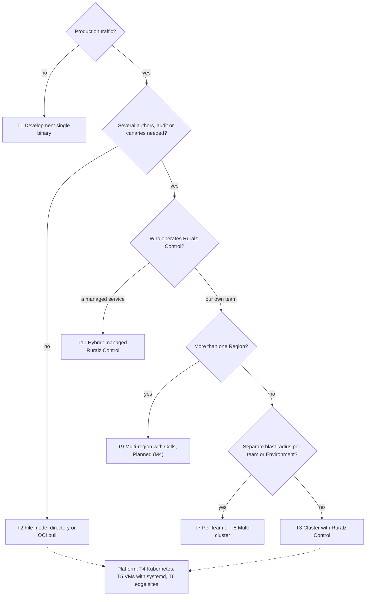
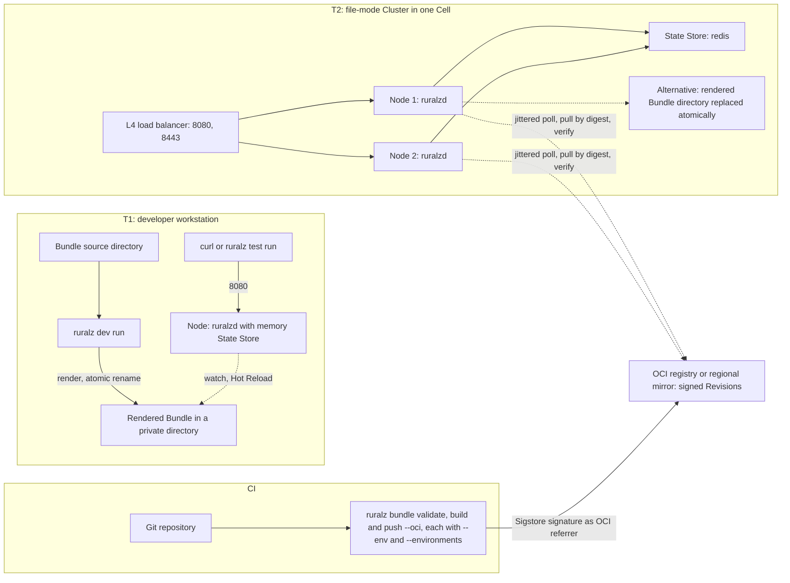
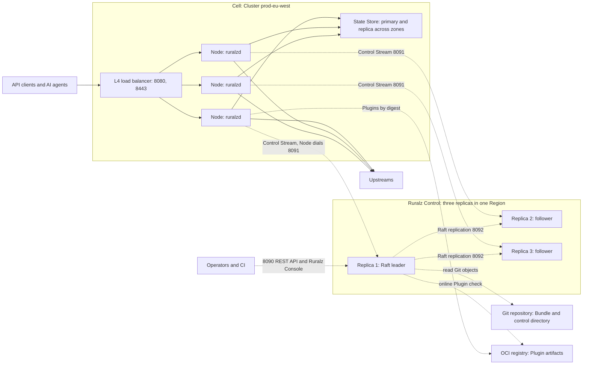
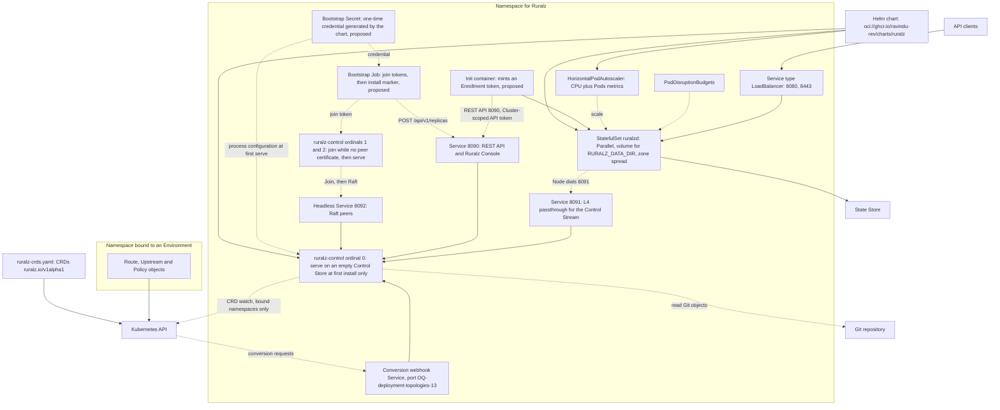
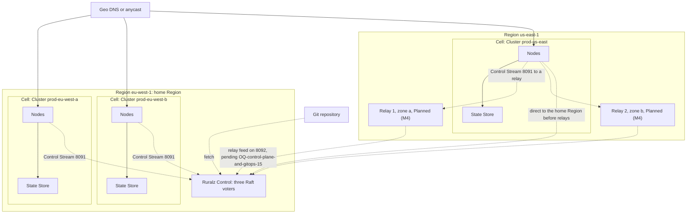
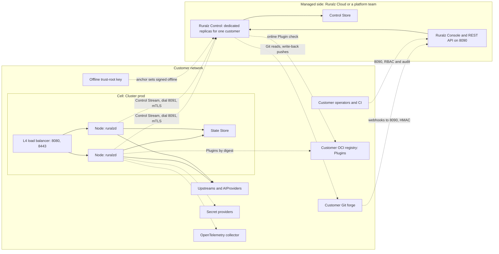
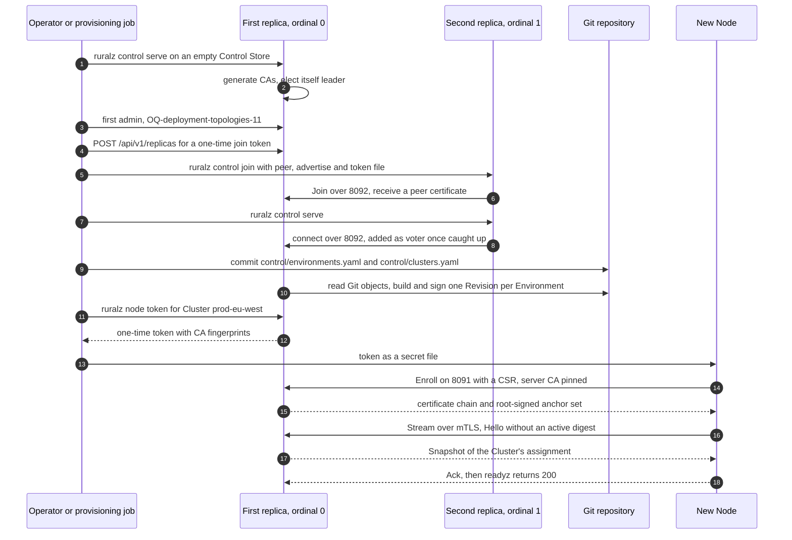

# Deployment Topologies

## Summary

This document fixes where Ruralz runs: ten topologies with ports, bootstrap, starting sizes and three reference architectures, and ADR-0016's Kubernetes stance: a Helm chart and mirrored CRDs, Planned (M2), Gateway API conformance deferred. Nothing is implemented yet.

## Scope and non-goals

In scope: the sections below and [ADR-0016](../adr/0016-kubernetes-helm-and-crds.md) (proposed). "Pack 8.4" names a section of the [foundation pack](../_meta/foundation-pack.md).

Non-goals: kinds and fields ([Configuration model](../architecture/02-configuration-model.md)); control-plane internals ([Control plane and GitOps](../architecture/04-control-plane-and-gitops.md)); performance values ([Performance budgets](../architecture/12-performance-budgets-and-benchmarking.md)); sizing formulas ([Capacity planning](03-capacity-planning.md)); upgrades ([Zero-downtime upgrades](02-zero-downtime-upgrades-and-hot-reload.md)); runbooks ([HA and DR](04-high-availability-and-disaster-recovery.md)); and Ruralz Cloud beyond T10.

## Topology catalog

A Node runs in one mode, chosen at boot, never merging sources ([System overview](../architecture/01-system-overview.md#deployment-modes)). File mode watches a rendered Bundle directory, Planned (M1), or pulls a signed OCI Revision by digest, Planned (M2), without Ruralz Control (P2); Control mode enrolls and receives Rollouts over the Control Stream it dials on 8091, Planned (M2) ([ADR-0007](../adr/0007-control-stream-protocol.md)).

Ruralz Gateway is stateless (P4): a Node persists only identity, Last-Known-Good and caches under `${RURALZ_DATA_DIR}` (pack 8.11), which a reschedulable Node MUST keep on persistent storage (OQ-scalability-and-distributed-state-7).

| Topology | When to use | Components | Failure domain | Configuration delivery | Scaling | Planned |
|---|---|---|---|---|---|---|
| T1 Development single binary | Authoring, Plugin work, CI | `ruralz dev run`; `memory` State Store | The workstation | CLI render, Hot Reload | One Node | Planned (M1) |
| T2 File mode | One team; no canary or audit | Nodes, L4 load balancer, `redis` State Store, CI, OCI registry | All Nodes reading one source | Rendered directory, or signed Revision by digest | Nodes to Cell ceilings, then Cells; declared per-Node ceilings bound fail-open | Planned (M1) directory; Planned (M2) OCI pull |
| T3 Cluster with Ruralz Control | Several authors, audit, canaries | Nodes, three `ruralz-control` replicas, State Store, Git | One Cluster per Rollout, stopped at canary | Rollout with ACK/NACK | Nodes by token; replicas by streams | Planned (M2) |
| T4 Kubernetes (Helm, HPA, CRDs) | Kubernetes operators | Helm chart, CRDs, StatefulSets | As T2 or T3, across zones | As T2 or T3; CRDs via Ruralz Control | HorizontalPodAutoscaler | Planned (M2) |
| T5 VM with systemd | No Kubernetes | systemd services, L4 load balancer | One VM per Node | As T2 or T3 | Add VMs; in-place Zero-Downtime Upgrade ([ADR-0015](../adr/0015-zero-downtime-upgrades-so-reuseport.md)) | Planned (M1) file mode; Planned (M2) Control mode |
| T6 Edge | Many small sites, intermittent links | Few Nodes and a State Store per site | One site | Mirror pull (default), or mostly detached Control mode | One Cluster per site | Planned (M2) |
| T7 Per-team | Own blast radius or pace per team | A Bundle and Clusters per team | One team's Clusters | As T2 or T3 | Clusters per team; voters too with a Ruralz Control each | Planned (M2) |
| T8 Multi-cluster | Staging and production, or several Cells | One Ruralz Control; Clusters in Environments | One Cluster, one Cell | Commit promotion | Clusters, then Cells, to 10,000 Nodes per Ruralz Control (target) | Planned (M2) |
| T9 Multi-region with Cells | Latency, residency, Region failure | Cells per Region, home-Region voters, relays | One Cell; home Region loss stops changes | One Revision per Environment everywhere | Cells per Region; R / (R − 1) pre-provisioning | Planned (M4) |
| T10 Hybrid: managed Ruralz Control with self-hosted Nodes | Ruralz Control operated for you | Managed `ruralz-control` per customer; self-hosted Nodes and State Store | Management: one customer; traffic: each Cell | Outbound Control Stream | As T3 | Planned (M2) topology; Ruralz Cloud has no milestone |

*Figure 1: choosing a topology.*



### T1 and T2: development and file mode

`ruralz dev run` renders the source Bundle by atomic rename into a private directory for a local `ruralzd`, which Hot Reloads and keeps its active Revision on a failed render ([CLI](../reference/01-cli-and-api-surface.md#local-ruralzd-launched-by-the-cli)). macOS `ruralzd` is development-only; Windows has none.

File-mode `ruralzd` applies no overlay, so every watched directory SHOULD hold the same `ruralz bundle render --env <env>` output, trusting the filesystem. OCI Revisions are Sigstore-signed by `ruralz bundle push --oci`, verified by each Node, `enforce` by default ([ADR-0017](../adr/0017-artifact-signing.md), pack 8.14; reference variable: OQ-system-overview-19). Nodes MUST poll with jitter and backoff (OQ-deployment-topologies-16); as a registry serves N / interval polls plus one pull per Node per digest (hypothesis), a local mirror SHOULD serve above 100 Nodes per Region or site (hypothesis).

*Figure 2: T1 and a CI-fed T2 Cluster.*



### T3: Cluster of Nodes managed by Ruralz Control

Three `ruralz-control` replicas, or five (Sizing defaults), form the Raft Control Store on 8092 ([ADR-0006](../adr/0006-control-store-raft-boltdb.md), proposed); all serve 8090 and 8091, only the leader watching Git, signing, enrolling and running Rollouts ([Replica roles](../architecture/04-control-plane-and-gitops.md#replica-roles)). In an outage (P3) Nodes keep serving, restarted ones boot Last-Known-Good within 5 s (target), and new ones stay not ready: Clusters SHOULD keep 30% headroom above peak (target) ([Ruralz Control availability](../architecture/11-scalability-and-distributed-state.md#ruralz-control-availability)).

*Figure 3: T3; dashed edges are off the request path.*



### T4: Kubernetes with Helm, HPA and CRDs

Per [ADR-0016](../adr/0016-kubernetes-helm-and-crds.md) (proposed), the Helm chart `oci://ghcr.io/ravindu-rev/charts/ruralz` and CRDs mirroring the ten kinds are Planned (M2), applied in [Release artifacts](../engineering/04-release-versioning-and-compatibility.md#release-artifacts) order; Gateway API conformance is deferred beyond M5, an adapter needing no kind change (OQ-vision-and-positioning-4). CRD `ruralz.io/v1alpha1` differs from Bundle `ruralz/v1alpha1` only in group ([Kubernetes mapping](../architecture/02-configuration-model.md#kubernetes-mapping)).

| Chart object | Rule |
|---|---|
| `ruralz-control` StatefulSet | Three pods with volumes; `OnDelete`, leadership moved off first (OQ-deployment-topologies-6). A pod with a peer certificate runs `serve`. On an empty volume only ordinal 0 at first install (no marker ConfigMap, no peer on headless 8092) runs `serve`; any other pod waits not ready for a join token, from the Job at install, else once an `admin` removes its old voter (OQ-deployment-topologies-20), then runs `join` |
| Bootstrap Secret and Job (proposed) | The chart generates a one-time bootstrap credential Secret, imported as process configuration by ordinal 0's first `serve` (OQ-deployment-topologies-11 (b)); the Job uses it to mint join tokens at `/api/v1/replicas` into Secrets ordinals 1 and 2 mount, then writes the marker; the credential expires once both join (OQ-deployment-topologies-12) |
| `ruralz-control` Services | 8090 behind a load balancer or Ingress; 8091 as L4 passthrough for mTLS; headless 8092; a conversion webhook (port: OQ-deployment-topologies-13), `caBundle` from the server CA, `conversion.strategy: None` while only `ruralz.io/v1alpha1` is served |
| Node StatefulSet | `podManagementPolicy: Parallel`, so a not-ready pod blocks none; `RollingUpdate`, `maxUnavailable` matching the PodDisruptionBudget; a persistent `${RURALZ_DATA_DIR}` volume |
| Zone loss | Pods on unreachable nodes count until force-deleted or their nodes removed (`node.kubernetes.io/out-of-service` taint), their zonal volumes stuck; HPA reads them as idle on scale-up (below). The zone-loss procedure force-deletes them, releasing the volumes; replacements re-enroll via Ruralz Control (OQ-deployment-topologies-20) |
| Zone spread | `topologySpreadConstraints` on the zone label, `maxSkew: 1`, `whenUnsatisfiable: DoNotSchedule` |
| Node Service | LoadBalancer for TCP 8080 and 8443; UDP 8443 (`http3: true`, Planned (M3)) needs a UDP balancer |
| Probes | `/readyz` and `/healthz` on 9901, or 9902 for `ruralz-control` |
| HorizontalPodAutoscaler | [Autoscaling signals](../architecture/11-scalability-and-distributed-state.md#autoscaling-signals) at their thresholds (target): CPU as a Resource metric, the rest as adapter Pods metrics, connections at 10,000 (target) or half Sizing option (b)'s cap, 1,250 (hypothesis). `behavior.scaleDown` removes at most one zone's share per stabilized period (target); half-threshold scale-in is OQ-deployment-topologies-14. `minReplicas` holds the headroom and, without an adapter, peak connections / threshold; State Store shards bound `maxReplicas` ([Sizing defaults](#sizing-defaults)). As the Node count lags ([Warm-up](../architecture/11-scalability-and-distributed-state.md#warm-up)), Control-mode Clusters SHOULD declare per-Node ceilings c, below |
| PodDisruptionBudgets | One `ruralz-control` pod; for Nodes, one zone's share at minimum scale (target) |
| Termination | `terminationGracePeriodSeconds` MUST exceed the preStop wait plus the Drain deadline |
| RBAC | Nodes: `get` and `watch` on own-namespace Secrets, only for `provider: kubernetes`; `list` and `watch` on `endpointslices.discovery.k8s.io` via a Role per Upstream namespace (OQ-deployment-topologies-1). `ruralz-control`: `list` and `watch` on `ruralz.io` CRDs in bound namespaces, reads of cluster-scoped `Environment` and `Cluster` CRDs, cluster-scoped CRD status updates. Bootstrap Job, in its namespace: `get` on the bootstrap Secret, `create` on token Secrets and the marker. None reads Secrets cluster-wide |

Declared ceilings bind healthy admission too (pack 8.8): pick c per limit between the bounds below, at least one token per window, and declare `requests` / `maxReplicas` only where that under-admission is acceptable, else narrow the HPA range to `minReplicas` / `maxReplicas` ≥ 0.5. A declared cap on the derived ceiling: OQ-deployment-topologies-22.

```text
Healthy Cell              each request first takes a local token at c: admits ≤ min(requests, N_serving × c)
                          per window; a client pinned to one Node gets c                                (target)
c = requests / N_max      fail-open ≤ requests; healthy ≥ N_min / N_max × requests, 20% at 6 of 30   (target)
c = 2 × requests / N_min  healthy exact; fail-open ≤ 2 × N_max / N_min × requests, 10 × at 6 of 30   (target)
Zone loss, 2 of 6 pods    4 survivors at x% CPU; HPA ratio 4x / (6 × 53%) > 1.1 only once x > 87.5%   (hypothesis)
```

Once a second version is served, Planned (M3), non-storage-version CRD reads fail while every `ruralz-control` replica is down ([Migration tooling](../engineering/04-release-versioning-and-compatibility.md#migration-tooling)).

Decisions:

- **OQ-release-versioning-and-compatibility-11:** option (b): separate image tags, two upgrades, Ruralz Control first ([Upgrade order](../engineering/04-release-versioning-and-compatibility.md#upgrade-order)), each `OnDelete` replacement awaiting readiness and Raft catch-up.
- **OQ-configuration-model-2:** option (a): `ruralzd` never reads CRDs; without Ruralz Control, Nodes use T2.
- **OQ-system-overview-8:** options (a) and (b) per Environment, whose Clusters share one Revision: one primary source from process configuration (OQ-control-plane-and-gitops-1), a Git path or one bound namespace whose CRD objects are assembled into a Bundle; `ruralz bundle push` stays an audited Drift exception ([other sources](../architecture/04-control-plane-and-gitops.md#ruralz-console-write-back-and-other-sources)). Until OQ-deployment-topologies-19 decides, a namespace source (a digest, not a commit) shows as Git divergence Drift, is refused under `requireApproval` unless overridden (audited), and never promotes.
- **OQ-configuration-model-3:** option (a): kind names unchanged; CRDs join category `ruralz`, short names `rz` plus the lower-case kind (`rzroute`, `rzaimodel`), except `rzgw` and `rzenv`.

*Figure 4: T4 in Control mode.*



### T5 and T6: VMs with systemd and edge sites

**T5.** One `ruralzd` service per VM keeps `${RURALZ_DATA_DIR}` on local disk; two per network namespace: Not planned ([listeners](../architecture/11-scalability-and-distributed-state.md#so_reuseport-and-listeners)). `systemctl stop` starts a Drain, so `TimeoutStopSec` MUST exceed the Drain deadline. Upgrades hand over through `SO_REUSEPORT` ([ADR-0015](../adr/0015-zero-downtime-upgrades-so-reuseport.md), OQ-deployment-topologies-7).

**T6.** A multi-Node site needs a local `redis` State Store; one Node MAY use `memory`. Nodes pull signed Revisions from a site mirror by default, verifying offline, or in Control mode dial 8091 when the uplink allows; certificates live 30 days (target), and a restarted detached Node forgets revocations (OQ-security-and-identity-5).

Clusters of one Environment promote one at a time (OQ-control-plane-and-gitops-4), so one site stops the rest: an uplink lost mid-Rollout fails a multi-Node site's batch, stopping promotion until an `operator` retries; a canary gate under 200 requests (target) pauses. Intermittent or low-traffic sites, and Environments above 50 sites (hypothesis), SHOULD use file mode or several Environments (OQ-deployment-topologies-4):

```text
Per canary Cluster   canary.bake + 3 batches × max(30 s, 3 × 15 s heartbeats) = bake + 135 s, plus ACKs (target)
500 sites            500 × (15 min + 135 s) = 500 × 17.25 min ≈ 6 days                          (hypothesis)
```

### T7 and T8: per-team and multi-cluster

**T7.** A Bundle has one Gateway, so a team needing its own blast radius or pace needs its own Bundle and Clusters, under its own or, once OQ-deployment-topologies-5 closes, a shared Ruralz Control; until then teams may share a Bundle with per-directory code owners and RBAC per Environment and Cluster.

**T8.** With `promotion.from: staging`, a commit reaches `prod` only after its `staging` Revision reached `complete` (pack 8.1). A Cell splits at whichever [Cell sizing](../architecture/11-scalability-and-distributed-state.md#cell-sizing) ceiling in [Sizing defaults](#sizing-defaults) saturates first.

### T9: multi-region with Cells

Each Region's Nodes resolve their own `stateStore.url` through `secretRef`, so Regions share one Revision and no request crosses Regions to a State Store (pack 8.13). Raft voters SHOULD share the home Region; remote Nodes dial it until read-only relays without signing keys serve them, Planned (M4), their 8092 feed awaiting OQ-control-plane-and-gitops-15's pack 8.4 amendment ([Relay feed](../architecture/04-control-plane-and-gitops.md#relay-feed)); losing a Region's relays is OQ-deployment-topologies-17.

Losing the home Region stops Enrollment and Rollouts everywhere, so active-active Regions SHOULD each hold R / (R − 1) times their peak share (target) ([Home Region loss](../architecture/11-scalability-and-distributed-state.md#topologies)) in every Cell resource, within Cell ceilings: Nodes, State Store calls under 50% of shard capacity (hypothesis), client limits above 10 × N_serving (target). A shared Revision allows up to R × each limit (target) unless Consumers are Region-pinned or quotas divided.

*Figure 5: T9 Cells; no edge crosses a Region to a State Store.*



### T10: hybrid managed Ruralz Control with self-hosted Nodes

A managed party (Ruralz Cloud, no milestone yet, OQ-vision-and-positioning-3, or a platform team) operates `ruralz-control` and its Control Store, the customer Nodes and the State Store: Control mode across a network boundary, Planned (M2), per [Managed cloud](../vision/01-vision-and-positioning.md#managed-cloud):

- **Same binaries (P1).** Both sides run the public `ruralzd` and `ruralz-control` images: no fork, license key, feature gating or cloud-only hook.
- **One tenant per deployment** (pack section 1).
- **Crossings.** Nodes dial 8091 over mTLS, opening no inbound port. The managed side dials the customer's forge (write credentials only for write-back) and Plugin registry (online Plugin check); the forge sends webhooks to 8090 (private forges and registries: OQ-deployment-topologies-10). Secrets and State Store data stay with the customer.
- **Customer-held trust root.** The customer SHOULD keep the offline anchor-set key (OQ-deployment-topologies-9).
- **Exit.** `ruralz control backup` and `restore` move to a self-hosted T3; Nodes re-enroll while serving.

*Figure 6: T10 hybrid.*



## Network and ports

Ports follow pack 8.4; Ruralz Control never dials a Node, and Nodes never dial each other.

| Port | Process | Who connects | Exposure | Authentication | Planned |
|---|---|---|---|---|---|
| 8080 TCP | `ruralzd` | Clients via the balancer | Client networks | Consumer credentials per Policy | Planned (M1) |
| 8443 TCP | `ruralzd` | Clients via the balancer | Client networks | TLS; Consumer credentials | Planned (M1) |
| 8443 UDP | `ruralzd` | HTTP/3 clients when `http3: true` | Client networks, UDP balancer; off in FIPS builds, Planned (M5) | QUIC; Consumer credentials | Planned (M3) |
| 9901 TCP | `ruralzd` | Probes, scrapers, operators | Operator networks; binds all interfaces, so network policies SHOULD fence it | Only `/healthz` and `/readyz` unauthenticated ([Admin ports](../architecture/08-security-and-identity.md#admin-ports)) | Planned (M1) |
| 8090 TCP | `ruralz-control` | Operators, CI, forge webhooks | Operator networks; the forge | Sessions or tokens, RBAC, audit log; HMAC for webhooks | Planned (M2) |
| 8091 TCP | `ruralz-control` | Every Node | Node networks, L4 passthrough | mTLS, per-Node certificates; a one-time token for `Enroll` | Planned (M2) |
| 8092 TCP | `ruralz-control` | Other replicas; relays and token `Join` pending OQ-control-plane-and-gitops-15 | Replica networks only; unused with `postgres` | mTLS peer certificates; Node certificates rejected | Planned (M2); relays Planned (M4) |
| 9902 TCP | `ruralz-control` | Probes, scrapers, operators | As 9901 | As 9901 | Planned (M2) |

| Flow | From | To | Topologies |
|---|---|---|---|
| State Store calls, TLS, authenticated | Nodes | Own Cell's State Store only | With `redis` |
| Pulls by digest | Nodes, CI, Ruralz Control | OCI registry or mirror | Revisions: T2, T6; Plugins: all |
| Git reads, write-back pushes | Ruralz Control leader, CI | Git forge | T3, T4, T7 to T10 |
| CRD watch and status; conversion webhook | Ruralz Control leader; API server | Kubernetes API; `ruralz-control` | T4 |
| Secret, discovery reads | Nodes | Kubernetes API or Vault | Those providers |
| Upstream calls, JWKS, telemetry | Nodes; Ruralz Control telemetry | Upstreams, IdPs, OpenTelemetry collector | All |

Balancers follow [L4 load balancing](../architecture/11-scalability-and-distributed-state.md#l4-load-balancing): `/readyz` checks on 9901, TLS passthrough, no stickiness, idle timeout above the Node's 120 s (target), 30 to 60 s slow start (target). Across Regions only 8091, 8092, telemetry, backups, configured Upstreams and calls to a single-Region forge, registry or 8090 cross.

## Bootstrap and enrollment

### File-mode bootstrap

A file-mode Node needs no Enrollment: at first boot it creates `node.id` under `${RURALZ_DATA_DIR}/identity/`, loads `RURALZ_CONFIG`, resolves every `secretRef` and boots a valid Bundle, else Last-Known-Good, else stays not ready (pack 8.2); signed pulls need a process-configuration trust policy ([Security and identity](../architecture/08-security-and-identity.md)).

### Control-mode bootstrap

This order brings up T3, T4, T5 and T10; later Nodes repeat steps 6 to 8.

1. **State Store.** Primary and replica with failover across zones, `noeviction` where limit keys live ([State Store availability](../architecture/11-scalability-and-distributed-state.md#state-store-availability)).
2. **First replica.** `ruralz control serve` on an empty Control Store creates or loads the CAs and leads, with Git source and Plugin trust policy from process configuration (OQ-control-plane-and-gitops-1); after install, no replica of any ordinal does.
3. **First administrators.** Steps 4 and 6 need an `admin` and a `security-admin`; creating the first is OQ-deployment-topologies-11.
4. **More replicas.** An `admin` gets a one-time join token from `POST /api/v1/replicas` or Ruralz Console; on the new host, `ruralz control join --peer <leader>:8092 --advertise <self>:8092 --join-token-file <file>` stores a peer certificate, then `serve` starts a voter once caught up (OQ-cli-and-api-surface-14). `join` runs only while the data directory lacks a peer certificate; after volume loss, remove the old voter and issue a new token (OQ-deployment-topologies-20).
5. **Environments and Clusters.** Commit `control/environments.yaml` and `control/clusters.yaml`; one Revision per Environment is signed.
6. **Enrollment token.** A `security-admin` runs `ruralz node token --cluster prod-eu-west`: one-time, valid 1 hour (target), pinning the 8091 server CA and trust root.
7. **Node start.** Given Control mode, address and token (OQ-control-plane-and-gitops-13), the Node generates a key pair and calls `Enroll` on 8091.
8. **First delivery.** It persists its identity, opens the Control Stream, activates its Cluster's Snapshot and ACKs; `/readyz` returns 200.

*Figure 7: Control-mode bootstrap order.*



### Enrollment per topology

| Topology | Token minted by | Identity storage | Re-enrollment when |
|---|---|---|---|
| T3, T5 | `security-admin`, or a job with a Cluster-scoped API token under quota and Node cap | Local disk | Identity lost, certificate expired, Environment changed |
| T4 | An init container via `enrollment-tokens`, just in time (proposed, OQ-deployment-topologies-2) | Persistent volume per pod | Volume deleted; scale-in leftovers (OQ-deployment-topologies-3) |
| T6 | The installer while the uplink works | Local disk | Offline beyond the certificate lifetime |
| T9 | As T3 or T4, against the home Region | As T3 or T4 | Also after a restore without a revocation list |
| T10 | Customer `security-admin` or job, on the managed side | Customer disks | Also on exit |

`Enroll` rate-limits each source and locks it out after 10 failures in 10 minutes (target); behind NAT (T10, many T4 clusters) Nodes share one source and lockout. The rate MUST cover the largest scale-out step per egress address, such as CE-9's 90 Enrolls in 2 minutes (target); mint tokens just in time and alert on RZ-CP-001 bursts (keying: OQ-deployment-topologies-15).

## Configuration delivery per topology

| Topology | Source of truth | Path to Nodes | Canary and rollback | Verification |
|---|---|---|---|---|
| T1 | Local source Bundle | CLI render, atomic rename | None | Digest only |
| T2 directory | Git, rendered by CI | Atomic directory replacement | Only if CI stages it; replace again | Filesystem trust root |
| T2 OCI, T6 mirror | Git, built by CI | `ruralz bundle push --oci`; jittered poll, pull by digest | Only through a staged reference; republish an older digest | Sigstore, `enforce` |
| T3, T5, T7 to T10 | Git, the customer's in T10 | Rollout over the Control Stream, through relays in T9 | `Cluster.spec.rollout`; `ruralz rollout rollback`; Clusters in turn | Ruralz Control signature, end to end |
| T4 | Git or one bound namespace per Environment | As T3, CRDs assembled into a Bundle | As T3; namespace sources per OQ-system-overview-8 | As T3 |
| T6 Control mode | Git | As T3 when connected | As T3; lagging or thin sites stop promotion (T6) | As T3; re-enrollment after 30 days offline (target) |

Rules:

- **Equal digests, equal behavior.** Only `secretRef` values and `RURALZ_*` settings differ between Nodes, so Region-specific values use `secretRef` (OQ-configuration-model-12 (a)).
- **No mixed modes in one Cluster.** Moving from T2 to T3 replaces Nodes: a Node restarted in Control mode stays not ready until it enrolls and activates a Revision (pack 8.11), so move Nodes one at a time, or add enrolled Nodes before draining file-mode ones.
- **Last-Known-Good follows the mode:** on activation in file mode, at the promoted digest in Control mode (pack 8.2).

## Sizing defaults

Starting points; [Capacity planning](03-capacity-planning.md) replaces them with benchmark formulas (P10).

| Item | Starting value | Owner |
|---|---|---|
| Node container | 4 vCPU (target) and 4 GiB (hypothesis) for idle TLS connections and default buffered-bytes and state-table budgets only; the fixed ceilings' worst case, about 19 GiB plus snapshots, needs 32 GiB (hypothesis, [Performance budgets](../architecture/12-performance-budgets-and-benchmarking.md)). (a) Size for it, or (b) cap connections per Node at the L4 balancer near 2,500 (hypothesis; OQ-deployment-topologies-21). Plugins add `limits.maxPluginMemoryBytes`, 2 GiB by default (target) | [Memory budget](../architecture/12-performance-budgets-and-benchmarking.md#memory-budget); OQ-deployment-topologies-8 |
| S2 planning throughput | 16,000 rps per 4-vCPU Node at half saturation (target) | [Throughput targets](../architecture/12-performance-budgets-and-benchmarking.md#throughput-targets) |
| `GOMEMLIMIT` | About 90% of the container memory limit (target) | [Scale unit](../architecture/11-scalability-and-distributed-state.md#scale-unit) |
| Nodes per Cluster | At least three in two or more equal zones (target), scaling out at 40% CPU with two zones, 53% with three, 60% with four (target); unequal zones at 80% × (N − N_largest_zone) / N (target) | [Autoscaling signals](../architecture/11-scalability-and-distributed-state.md#autoscaling-signals) |
| Nodes per Cell | 1,000 at most (target) | [Cell sizing](../architecture/11-scalability-and-distributed-state.md#cell-sizing) |
| State Store calls per Cell | 1,000,000 per second (hypothesis), binding at about 200 Nodes of 5,000 calls per second (hypothesis) | [Bottlenecks](../architecture/11-scalability-and-distributed-state.md#cell-and-cluster-bottlenecks) |
| State Store shards per Cell | 16 at most (target); GCRA at 50% of about 100,000 calls per second each (hypothesis); memory at 70% of `maxmemory` (target) | Cell sizing |
| State Store client limit | Above 10 × N_serving, a MUST above 900 Nodes (target) | Same |
| Ruralz Control voters | Three, or five to survive two failures (target) | [Sizing and failover](../architecture/04-control-plane-and-gitops.md#sizing-and-failover) |
| Ruralz Control replicas; relays per Region | ceil(N / 5,000) + 1 across zones, at least the voters, N counting relay-served Nodes; relays with N_region (hypothesis) | [Scaling Ruralz Control](../architecture/11-scalability-and-distributed-state.md#scaling-ruralz-control-and-the-state-store) |
| Nodes per Ruralz Control deployment | 10,000, counting every Environment and relay-served Node (target) | [Heartbeat](../architecture/04-control-plane-and-gitops.md#heartbeat-and-backpressure) |
| `${RURALZ_DATA_DIR}` volume | 1 GiB (hypothesis) | OQ-deployment-topologies-8 |
| Ruralz Control replica | 2 vCPU and 4 GiB (hypothesis) until F2 measures Snapshots in flight, send queues, Raft log and Revisions | Same |

A first-order example, one Cell at the three-zone threshold; S2 uses the `memory` driver, so `redis` rates await S5 and G1, and 5,000 calls per second per Node (hypothesis) suits only unknown mixes:

```text
Peak                 60,000 rps of S2-like traffic, one ratelimit per request         (hypothesis)
Per-Node capacity    32,000 rps × 0.53 ≈ 16,960 rps per 4-vCPU Node, upper bound       (hypothesis)
With 30% headroom    60,000 × 1.3 = 78,000 rps → 78,000 / 16,960 ≈ 4.6                (hypothesis)
Nodes                5, rounded up to 6 for two per zone                             (hypothesis)
State Store calls    admitted rps × blocking calls per request = 60,000 × 1 GCRA
                     = 60,000 calls/s at peak, 78,000 with headroom                   (hypothesis)
Shards               ceil(78,000 / 50,000 at 50% of a shard) = 2, each with a replica  (hypothesis)
Ruralz Control       3 voters; ceil(6 / 5,000) + 1 = 2 replicas → 3                   (hypothesis)
Node memory          20,000 × 96 KiB + 256 MiB = 2.2 GiB                              (target)
                     + 512 MiB maxBufferedBytes + about 475 MiB state tables ≈ 3.2 GiB (hypothesis)
                     → 4 GiB container; Performance budgets' informational run: 2.5 GiB (target)
Connection cap (b)   (3,686 MiB GOMEMLIMIT − 1,243 MiB budgets) / (592 KiB per connection
                     + 320 KiB per in-flight unit) ≈ 2,700 → about 2,500 per Node       (hypothesis)
maxReplicas bound    ≤ shards × 50,000 / (per-Node rps × blocking calls per request)
                     RA-2: ceil(30 × 16,960 × 1 / 50,000) = 11 shards, within 16        (hypothesis)
```

`maxReplicas` MUST NOT exceed that bound (hypothesis); autoscaling misses State Store saturation, so alert on script CPU, the Cell sizing signal.

## Reference architectures

### RA-1: single team on VMs in file mode

One team's internal APIs in one Region, Planned (M2) for OCI pull.

| Component | Count and placement | Notes |
|---|---|---|
| Nodes | Four VMs, two per zone, systemd (T5); peak CPU at most 40% each (target) | Last-Known-Good on local disk |
| Configuration | CI: `ruralz bundle validate`, `ruralz bundle build` and `ruralz bundle push --oci <registry>/<repository>`, Sigstore-signed, each with `--env prod --environments control/environments.yaml`, which push needs to render without Ruralz Control | Nodes poll with jitter, pull by digest, verify offline |
| State Store | `redis` primary and replica across zones | Rate Limits exact per Cell |
| Load balancer | L4 on 8080 and 8443, `/readyz` checks on 9901 | TLS passthrough |

Failure behavior: a lost zone leaves two Nodes under 80% CPU (target); a registry outage stops changes, not traffic.

### RA-2: single-Region production on Kubernetes

A platform team serving product teams in one Region, Planned (M2).

| Component | Count and placement | Notes |
|---|---|---|
| Ruralz Control | Three pods in three zones | Hourly `ruralz control backup` (target) off-cluster, revocation list exported beside it (proposed) |
| Nodes | HorizontalPodAutoscaler, 6 to 30 pods, at least two per zone (target) | Ceilings c per limit (T4) from `requests` / 30, admitting 20% at 6 healthy pods and c per pinned client, to `requests` / 3, failing open up to 10 × `requests` (target) |
| Environments and Clusters | `staging` and `prod`, one Cluster each; `prod` `Environment.spec.promotion`: `from: staging`, `requireApproval`; its `Cluster.spec.rollout`: `strategy: canary`, `canary: {percent: 10, bake: 15m}` | Git sources; CRDs off |
| State Store | One per Cluster: 11 shards for 30 pods, each with a replica across zones (hypothesis, Sizing defaults) | Each Cluster is a Cell; script CPU alerts |
| Network | LoadBalancer Node Service; 8091 passthrough; 8090 behind an Ingress | Network policies keep 9901, 9902 and 8092 internal |

Failure behavior: a lost zone leaves at least four Nodes under 80% CPU at unchanged load (target), its stranded pods blocking scale-out until force-deleted (T4); a Ruralz Control outage freezes Rollouts and the Node count, not traffic; a bad Revision stops at the canary Nodes of `prod`.

### RA-3: multi-region active-active with Cells

A public API in two Regions with residency constraints, Planned (M4).

| Component | Count and placement | Notes |
|---|---|---|
| Home Region | Ruralz Control, three voters; Cells | Hourly backups (target) with the revocation list, copied to the second Region |
| Second Region | Cells; relays per Sizing defaults, at least two (hypothesis) | Relay feed pending OQ-control-plane-and-gitops-15 |
| Cells | One Cluster and State Store each | No cross-Region State Store dial |
| Steering | Geo DNS or anycast; Region-pinned tenants for spend-bearing Quotas | Up to R × each limit (target) |
| Capacity | R / (R − 1) of each Region's peak share, 100% of global peak with two (target), per Cell resource (T9) | Autoscaler minimums hold it |
| Environments | `prod` shared, or `prod-eu` and `prod-us` for divided quotas | Shares render from `${VAR}` |

Failure behavior: a lost Region's traffic moves to pre-provisioned capacity. A lost home Region also holds Rollouts and Enrollment until `ruralz control restore` runs in the other Region ([HA and DR](04-high-availability-and-disaster-recovery.md)), which MUST supply the exported revocation list, else every Node re-enrolls at about 20 per second per leader (hypothesis), bulk tokens under the minting quota (OQ-deployment-topologies-18).

## Open questions

| ID | Question | Options | Owner | Blocking? |
|---|---|---|---|---|
| OQ-deployment-topologies-1 | Which Helm values select mode, persistence, autoscaling, RBAC namespaces and CRD bindings? | (a) With a JSON Schema (proposed); (b) documented only | deployment-topologies | Yes, for the Planned (M2) chart |
| OQ-deployment-topologies-2 | How does an autoscaled Control-mode pod get its Enrollment token? | (a) A just-in-time init container with a Cluster-scoped API token (proposed); (b) a pool; (c) a service account credential | control-plane-and-gitops | Yes, for Planned (M2) autoscaling |
| OQ-deployment-topologies-3 | What happens to scaled-in Nodes' identities and volumes? | (a) Kept until certificates expire (current); (b) revoked after disconnection; (c) deleted and revoked | control-plane-and-gitops | No |
| OQ-deployment-topologies-4 | What changes serial promotion at the edge (T6)? | (a) Parallel waves (OQ-control-plane-and-gitops-4 (c)); (b) skipping failed Clusters, or lag-tolerant plans; (c) fewer, larger Clusters; (d) file mode (current) | control-plane-and-gitops | No |
| OQ-deployment-topologies-5 | Can one Ruralz Control serve several Bundles? | (a) Process configuration binds Environments to Bundle paths (proposed; OQ-control-plane-and-gitops-1); (b) no | control-plane-and-gitops | Yes, for Planned (M2) per-team layouts |
| OQ-deployment-topologies-6 | How is leadership moved off a replica before replacement? | (a) Transfer on SIGTERM (proposed); (b) a REST API action; (c) none | control-plane-and-gitops | Yes, for Planned (M2) upgrades |
| OQ-deployment-topologies-7 | Should releases ship a systemd unit hosting the `SO_REUSEPORT` handover? | (a) Unit and helper; (b) documentation | zero-downtime-upgrades-and-hot-reload | No |
| OQ-deployment-topologies-8 | Measured Node, `${RURALZ_DATA_DIR}` and Ruralz Control replica sizes? | (a) From F2, memory runs and Data plane's cache layout (proposed); (b) hypotheses | capacity-planning | No |
| OQ-deployment-topologies-9 | In T10, who holds the offline trust-root key and Plugin trust policy? | (a) The customer (proposed; OQ-control-plane-and-gitops-8); (b) the managed party | security-and-identity | No |
| OQ-deployment-topologies-10 | How does a managed Ruralz Control reach a forge or registry refusing inbound connections? | (a) Customer CI pushes Bundles and runs the Plugin check; (b) reachable mirrors; (c) both | deployment-topologies | No |
| OQ-deployment-topologies-11 | How are the first `admin` and `security-admin` created? | (a) The first `ruralz control serve` writes a one-time bootstrap credential (proposed for T3, T5); (b) process configuration imports one (proposed for T4, chart-generated) | security-and-identity | Yes, for Planned (M2) |
| OQ-deployment-topologies-12 | How do chart ordinals 1 and 2 get join tokens? | (a) A bootstrap Job with OQ-deployment-topologies-11 (b)'s credential (proposed); (b) a manual step | deployment-topologies | Yes, for the Planned (M2) chart |
| OQ-deployment-topologies-13 | Which port serves the CRD conversion webhook, absent from pack 8.4? | (a) A new port by pack amendment (proposed); (b) a path on 8090 | deployment-topologies | Yes, before `ruralz.io/v1beta1`, Planned (M3) |
| OQ-deployment-topologies-14 | How does the chart scale in only below half of every threshold? | (a) Scale-down policies only (current); (b) an external autoscaler | deployment-topologies | No |
| OQ-deployment-topologies-15 | How are `Enroll` rates and lockouts keyed when Nodes share an egress address? | (a) Source plus the token's Cluster (proposed); (b) per token; (c) an allowed-CIDR exemption | control-plane-and-gitops | Yes, for Planned (M2) autoscaling |
| OQ-deployment-topologies-16 | Which setting holds a file-mode Node's jittered OCI poll interval? | (a) A process setting beside OQ-system-overview-19 (proposed); (b) a Gateway field | configuration-model | No |
| OQ-deployment-topologies-17 | What do Nodes do when all their Region's relays are lost? | (a) Stay detached; (b) dial the home Region, sized to cover them | control-plane-and-gitops | Yes, for Planned (M4) |
| OQ-deployment-topologies-18 | How do thousands of Nodes re-enroll after a restore without a revocation list? | (a) Bulk procedure, batched tokens (proposed); (b) require the list | high-availability-and-disaster-recovery | No |
| OQ-deployment-topologies-19 | Should a namespace-primary Environment show as Drift, and can object sets promote? | (a) A normal source whose object sets promote (proposed); (b) Drift, no promotion | control-plane-and-gitops | Yes, for the Planned (M2) CRD source |
| OQ-deployment-topologies-20 | After volume or zone loss, how are a `ruralz-control` replica replaced, as `/api/v1/replicas` removes no voter, and stranded Node pods released ([HA and DR](04-high-availability-and-disaster-recovery.md))? | (a) A chart Job removes the stale voter and mints a join token under a standing credential; runbooks force-delete Node pods (proposed); (b) manual steps; (c) higher `minReplicas` or zone-replicated volumes; (d) Nodes as a Deployment | high-availability-and-disaster-recovery | Yes, for the Planned (M2) chart |
| OQ-deployment-topologies-21 | Can the connection ceiling be lowered, sparing small Nodes a balancer cap? | (a) Fixed (current, OQ-data-plane-1 (a)); (b) or (c) of OQ-data-plane-1 | data-plane | No |
| OQ-deployment-topologies-22 | Should a declared per-Node cap bound the derived ceiling, min(derived, cap), not replace it? | (a) Yes (proposed; OQ-traffic-management-and-resilience-1, -19); (b) replace (current) | traffic-management-and-resilience | No |
