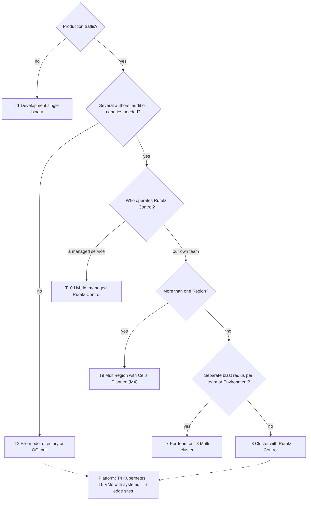
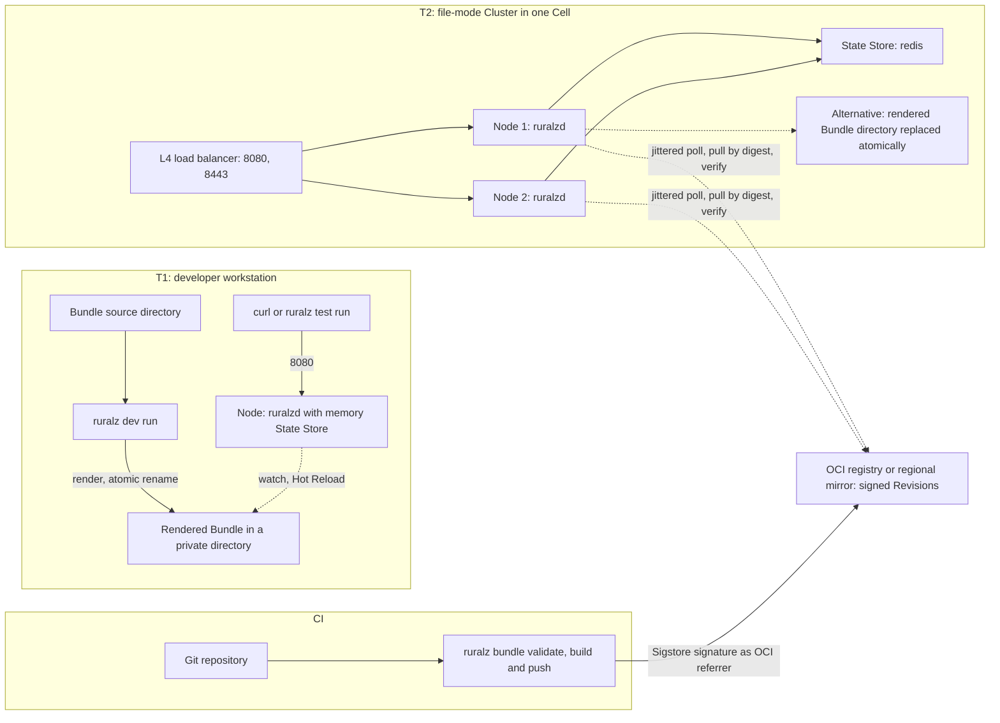
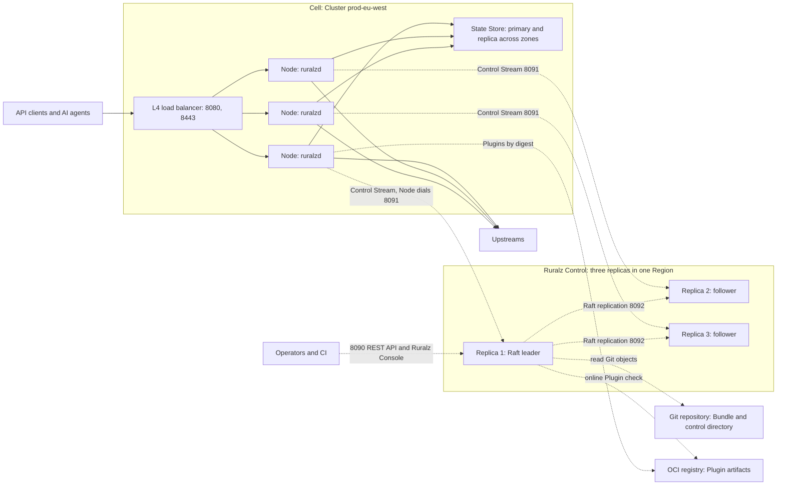
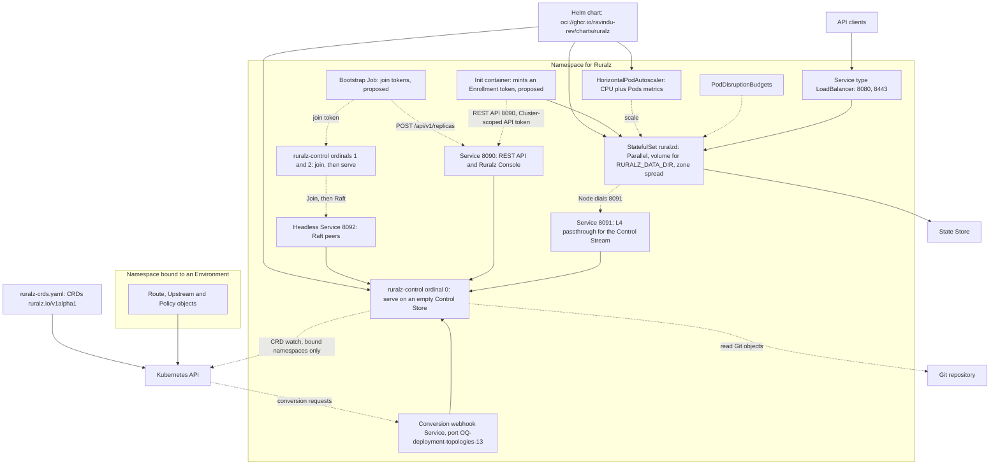
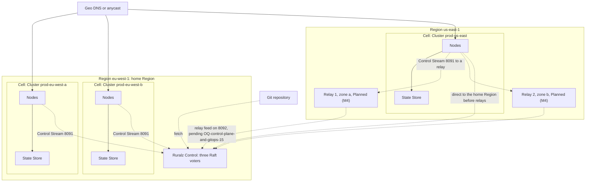
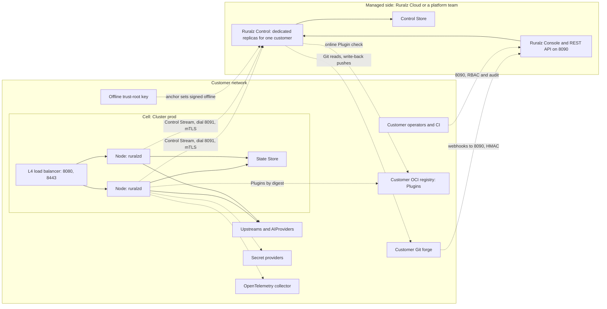
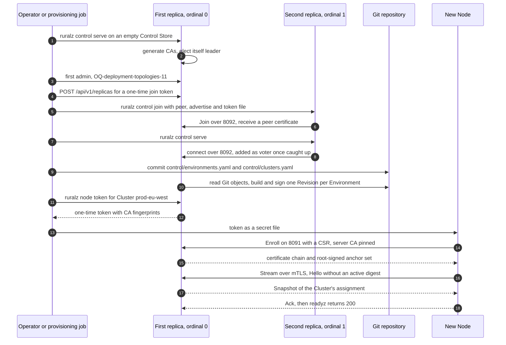

# Deployment Topologies

## Summary

This document fixes where Ruralz runs: ten topologies, from a single development binary to multi-region Cells and a hybrid layout in which a managed Ruralz Control drives self-hosted Nodes. For each it states when to use it, components, failure domains, configuration delivery and scaling, then fixes ports, the bootstrap and Enrollment order, starting sizes and three reference architectures. It owns the Kubernetes stance of ADR-0016: a Helm chart and CRDs mirroring the kinds, Planned (M2), with Gateway API conformance deferred. Nothing is implemented yet; operators and architects read it before building a Cluster or adding a Region.

## Scope and non-goals

In scope: topologies, network flows and ports, bootstrap and Enrollment, configuration delivery, starting sizes, reference architectures, and the Helm chart and CRD packaging of [ADR-0016](../adr/0016-kubernetes-helm-and-crds.md) (proposed). "Pack 8.4" names a section of the binding [foundation pack](../_meta/foundation-pack.md).

Non-goals: kinds and fields ([Configuration model](../architecture/02-configuration-model.md)); Control Stream and Control Store internals ([Control plane and GitOps](../architecture/04-control-plane-and-gitops.md)); accuracy bounds and autoscaling signals ([Scalability and distributed state](../architecture/11-scalability-and-distributed-state.md)); performance values ([Performance budgets and benchmarking](../architecture/12-performance-budgets-and-benchmarking.md)); sizing formulas ([Capacity planning](03-capacity-planning.md)); upgrades ([Zero-downtime upgrades and hot reload](02-zero-downtime-upgrades-and-hot-reload.md)); runbooks ([High availability and disaster recovery](04-high-availability-and-disaster-recovery.md)); version skew ([Release, versioning and compatibility](../engineering/04-release-versioning-and-compatibility.md)); and Ruralz Cloud, described only in [Managed cloud](../vision/01-vision-and-positioning.md#managed-cloud). No cloud-only hook exists.

[T4](#t4-kubernetes-with-helm-hpa-and-crds) decides five questions this document owns: OQ-system-overview-8, OQ-configuration-model-2 and -3, OQ-release-versioning-and-compatibility-11 and OQ-vision-and-positioning-4. Their source documents close them at conformance.

## Topology catalog

Every topology pairs one configuration mode with one layout. A Node runs in exactly one mode, chosen at boot, and never merges sources ([System overview](../architecture/01-system-overview.md#deployment-modes)):

- **File mode:** the Node watches a rendered Bundle directory, Planned (M1), or pulls a signed Revision from an OCI registry by digest, Planned (M2); no Ruralz Control and no Enrollment (P2).
- **Control mode:** the Node enrolls with Ruralz Control and receives Rollouts over the Control Stream it dials on 8091, Planned (M2) ([ADR-0007](../adr/0007-control-stream-protocol.md)).

Either way Ruralz Gateway is stateless (P4): shared state lives in the State Store of the Node's Cell, and a Node persists only its identity, Last-Known-Good and disposable caches under `${RURALZ_DATA_DIR}` (pack 8.11), which every Node that may be rescheduled MUST keep on persistent storage (OQ-scalability-and-distributed-state-7).

| Topology | When to use | Components | Failure domain | Configuration delivery | Scaling | Planned |
|---|---|---|---|---|---|---|
| T1 Development single binary | Local authoring, Plugin work, CI tests | One `ruralzd` launched by `ruralz dev run`; `memory` State Store | The workstation | CLI render; Hot Reload per change | One Node | Planned (M1) |
| T2 File mode | One team, few Nodes, no canary, audit or Ruralz Console | Nodes, L4 load balancer, `redis` State Store from two Nodes, CI, optional OCI registry | Every Node reading one source: a wrong change reaches all at once | CI replaces a rendered directory, or Nodes pull a signed Revision; not a Rollout | Add Nodes up to the Cell ceilings, then add Cells; declare per-Node ceilings, since without them fail-open admits N × each limit | Planned (M1) directory; Planned (M2) OCI pull |
| T3 Cluster with Ruralz Control | Several authors, audit trail, canaries, Drift detection | Nodes, three `ruralz-control` replicas with the Control Store, State Store, Git | One Cluster per Rollout, stopped at canary; a Ruralz Control outage stops only changes | Rollout of a signed Revision with per-Node ACK/NACK | Nodes enroll with one-time tokens; replicas by stream count | Planned (M2) |
| T4 Kubernetes (Helm, HPA, CRDs) | Teams operating Kubernetes | Helm chart, CRDs, StatefulSets, HorizontalPodAutoscaler, PodDisruptionBudgets | As T2 or T3, spread evenly across zones | As T2 or T3; CRDs only through Ruralz Control | HorizontalPodAutoscaler on Nodes | Planned (M2) |
| T5 VM with systemd | Hosts without Kubernetes | `ruralzd` and `ruralz-control` as systemd services, L4 load balancer | One VM per Node | As T2 or T3 | Add VMs; in-place Zero-Downtime Upgrade ([ADR-0015](../adr/0015-zero-downtime-upgrades-so-reuseport.md)) | Planned (M1) file mode; Planned (M2) Control mode |
| T6 Edge | Many small sites with intermittent links | One to a few Nodes and a State Store per site; a site OCI mirror or outbound reach to Ruralz Control | One site; a lost uplink only detaches | OCI pull from a mirror (default), or Control mode detached between contacts | One Cluster per site | Planned (M2) |
| T7 Per-team | Own blast radius, RBAC or release pace per team | A Bundle and Clusters per team; shared or separate Ruralz Control | One team's Clusters | Per team, as T2 or T3 | Add Clusters per team; with a Ruralz Control per team, voters too | Planned (M2) |
| T8 Multi-cluster | Staging and production, or several Cells in one Region | One Ruralz Control; Clusters grouped into Environments | One Cluster, one Cell | Promotion of a source commit across Environments | Add Clusters, then Cells, up to 10,000 Nodes per Ruralz Control deployment (target) | Planned (M2) |
| T9 Multi-region with Cells | Latency, residency or Region-failure tolerance | Cells per Region, Raft voters in a home Region, regional Ruralz Control relays | One Cell; home Region loss stops changes everywhere | One Revision per Environment in every Region; relays serve remote Nodes | Cells per Region; R / (R − 1) pre-provisioning | Planned (M4) |
| T10 Hybrid: managed Ruralz Control with self-hosted Nodes | Teams wanting Ruralz Control operated for them | A managed `ruralz-control` and Control Store per customer; self-hosted Nodes and State Store | One customer's managed deployment, for management only; each customer Cell for traffic | Rollouts over a Control Stream dialed outbound from the customer network | As T3 | Planned (M2) topology; Ruralz Cloud has no milestone |

*Figure 1: choosing a topology; T4 to T6 are platform choices under T2 or T3.*



### T1 and T2: development and file mode

`ruralz dev run` renders the source Bundle into a private directory, launches a local `ruralzd` and swaps the rendered file by atomic rename on each change; the Node Hot Reloads and keeps its active Revision when a render fails ([CLI and API surface](../reference/01-cli-and-api-surface.md#local-ruralzd-launched-by-the-cli)). `ruralzd` on macOS is for development only; Windows has no `ruralzd` build.

File-mode `ruralzd` applies no overlay, so a watched directory SHOULD hold `ruralz bundle render --env <env>` output, and every Node of a Cluster SHOULD load the same rendered Bundle or OCI Revision. A watched directory is unsigned: the filesystem is the trust root. An OCI Revision is signed with Sigstore at `ruralz bundle push` and verified by each Node before activation, `enforce` by default ([ADR-0017](../adr/0017-artifact-signing.md), pack 8.14); the variable naming a Node's OCI reference is OQ-system-overview-19.

OCI pull fans out. Each Node MUST poll its reference with jitter and backoff (setting and default: OQ-deployment-topologies-16), so a registry serves N / poll interval requests plus one pull per Node for each new digest (hypothesis); above 100 Nodes per Region or site (hypothesis), a mirror there SHOULD serve them. Move from T2 to T3 when several teams change configuration, auditors need attribution, or a bad change must stop at a canary.

*Figure 2: development single binary (T1) and a file-mode Cluster (T2) fed by CI.*



### T3: Cluster of Nodes managed by Ruralz Control

Three `ruralz-control` replicas form the Raft-replicated Control Store on 8092 ([ADR-0006](../adr/0006-control-store-raft-boltdb.md), proposed), or five to survive two failures (target). Every replica serves the REST API and Ruralz Console on 8090 and Control Streams on 8091; only the leader watches Git, signs, enrolls and runs Rollouts ([Replica roles](../architecture/04-control-plane-and-gitops.md#replica-roles)).

Ruralz Control is never on the request path (P3). While it is unavailable, Nodes keep their active Revision and stay ready, and a restarted Node boots Last-Known-Good after a boot wait of up to 5 s (target). A new Node without Last-Known-Good stays not ready until it enrolls, so Clusters SHOULD keep 30% headroom above peak (target) ([Ruralz Control availability](../architecture/11-scalability-and-distributed-state.md#ruralz-control-availability)).

*Figure 3: one Cluster managed by three Ruralz Control replicas; dashed edges are off the request path.*



### T4: Kubernetes with Helm, HPA and CRDs

Per [ADR-0016](../adr/0016-kubernetes-helm-and-crds.md) (proposed), Ruralz ships a Helm chart and CRDs mirroring the ten kinds, Planned (M2); Kubernetes Gateway API conformance is deferred. The chart is `oci://ghcr.io/ravindu-rev/charts/ruralz` at the product version; `ruralz-crds.yaml` is applied separately, in the order [Release artifacts](../engineering/04-release-versioning-and-compatibility.md#release-artifacts) fixes. CRDs use `ruralz.io/v1alpha1`, translated to the Bundle `ruralz/v1alpha1` by changing only the group ([Kubernetes mapping](../architecture/02-configuration-model.md#kubernetes-mapping)).

| Chart object | Rule |
|---|---|
| `ruralz-control` StatefulSet | Three pods with a persistent volume each; `OnDelete` updates, one replica at a time, leadership moved off first (OQ-deployment-topologies-6). Only ordinal 0 runs `ruralz control serve` on an empty Control Store; ordinals 1 and 2 run `ruralz control join`, then `ruralz control serve`, never `serve` on an empty store |
| Bootstrap Job (proposed) | Mints join tokens for ordinals 1 and 2 through `/api/v1/replicas` with a one-time bootstrap `admin` credential from a Secret (OQ-deployment-topologies-12) |
| `ruralz-control` Services | 8090 through a load balancer or Ingress; 8091 as L4 passthrough, since per-Node mTLS terminates in `ruralz-control`; headless 8092 for peers; a conversion webhook Service (port: OQ-deployment-topologies-13) with a `caBundle` from the server CA, and `conversion.strategy: None` while only `ruralz.io/v1alpha1` is served |
| Node StatefulSet | `podManagementPolicy: Parallel`, so one not-ready pod never blocks creating others; `RollingUpdate` with `maxUnavailable` held to the Node PodDisruptionBudget; a persistent volume for `${RURALZ_DATA_DIR}` that every rescheduled pod MUST keep (OQ-scalability-and-distributed-state-7) |
| Zone spread | Node and `ruralz-control` pods carry `topologySpreadConstraints` on the zone label, `maxSkew: 1`, `whenUnsatisfiable: DoNotSchedule` |
| Node Service | Type LoadBalancer for TCP 8080 and 8443; UDP 8443 for `http3: true`, Planned (M3), needs a UDP-capable balancer |
| Probes | Readiness `/readyz`, liveness `/healthz`, on 9901 for Nodes and 9902 for `ruralz-control` |
| HorizontalPodAutoscaler | Every [Autoscaling signal](../architecture/11-scalability-and-distributed-state.md#autoscaling-signals) at its threshold (target): CPU as a Resource metric; in-flight units, connections, buffered bytes and gateway-added p99 as Pods metrics under those metric names, through an operator-chosen metrics adapter. `behavior.scaleDown` has a stabilization window and removes at most one zone's share of Nodes per period (target); scale-in only under half of every threshold is OQ-deployment-topologies-14. `minReplicas` holds the headroom Node count and, without an adapter, peak connections / 10,000 (target). Control-mode Clusters SHOULD declare per-Node Rate Limit ceilings of at most `requests` / `maxReplicas` (target), field OQ-traffic-management-and-resilience-1, since the published count lags scale-out ([Warm-up](../architecture/11-scalability-and-distributed-state.md#warm-up)) |
| PodDisruptionBudgets | At most one `ruralz-control` pod unavailable; Node `maxUnavailable` equal to one zone's Nodes at minimum scale (target) |
| Termination | `terminationGracePeriodSeconds` MUST exceed the preStop wait plus the Drain deadline ([Warm-up](../architecture/11-scalability-and-distributed-state.md#warm-up)) |
| RBAC | Node ServiceAccount: `get` and `watch` on Secrets in its own namespace, only for `provider: kubernetes` (`provider: file` mounts files); `list` and `watch` on `endpointslices.discovery.k8s.io` through a Role per namespace that Upstreams name, set in chart values (OQ-deployment-topologies-1). `ruralz-control` ServiceAccount: `list` and `watch` on `ruralz.io` CRDs in bound namespaces, reads of the cluster-scoped `Environment` and `Cluster` CRDs, and cluster-scoped updates of CRD status. Nothing needs cluster-wide Secret access |

The Kubernetes API server dials the conversion webhook, so once a second version is served, Planned (M3), CRD reads in non-storage versions fail while every `ruralz-control` replica is down ([Migration tooling](../engineering/04-release-versioning-and-compatibility.md#migration-tooling)).

Decisions on owned questions:

- **OQ-release-versioning-and-compatibility-11:** option (b). The chart deploys Ruralz Control and Nodes with separate image tags and two upgrades, Ruralz Control first ([Upgrade order](../engineering/04-release-versioning-and-compatibility.md#upgrade-order)); `OnDelete` lets each replacement wait for readiness and Raft catch-up. Value names: OQ-deployment-topologies-1.
- **OQ-configuration-model-2:** option (a). `ruralzd` never reads CRDs; without Ruralz Control, Kubernetes Nodes mount a rendered Bundle or pull OCI Revisions (T2).
- **OQ-system-overview-8:** options (a) and (b), applied per Environment, since its Clusters share one Revision. Ruralz Control assembles each bound namespace's CRD objects into one Bundle and runs the Git pipeline on it. Each Environment takes one primary source, a Git path or one bound namespace, fixed in process configuration (OQ-control-plane-and-gitops-1); unbound namespaces are never read. `ruralz bundle push` stays the audited exception shown as Drift ([other sources](../architecture/04-control-plane-and-gitops.md#ruralz-console-write-back-and-other-sources)). Under those rules a namespace source (1) records a digest, not a commit, so it shows as Git divergence Drift until Control plane and GitOps reclassifies it (OQ-deployment-topologies-19); (2) is refused under `requireApproval` unless process configuration overrides it, which is audited; and (3) takes no part in `promotion.from`, on either side, until OQ-deployment-topologies-19 defines object-set promotion.
- **OQ-configuration-model-3:** option (a). Kind names stay identical; every CRD joins category `ruralz` with a short name: `rzgw`, `rzroute`, `rzupstream`, `rzpolicy`, `rzplugin`, `rzconsumer`, `rzaiprovider`, `rzaimodel`, `rzenv` and `rzcluster`.
- **OQ-vision-and-positioning-4:** keep Gateway API conformance deferred beyond M5; mirrored CRDs expose every feature, and an adapter can follow without changing kinds.

*Figure 4: Kubernetes deployment with the Helm chart, HPA and CRDs, in Control mode.*



### T5 and T6: VMs with systemd and edge sites

**T5.** Each VM runs one `ruralzd` service with `${RURALZ_DATA_DIR}` on local disk; two Nodes per network namespace are Not planned, since a bigger host scales one Node vertically ([SO_REUSEPORT and listeners](../architecture/11-scalability-and-distributed-state.md#so_reuseport-and-listeners)). `systemctl stop` sends SIGTERM, which starts a Drain like `ruralz node drain`, so the unit's `TimeoutStopSec` MUST exceed the Drain deadline. A Zero-Downtime Upgrade starts the new binary beside the old one with `SO_REUSEPORT` and drains the old process once the new one is ready ([ADR-0015](../adr/0015-zero-downtime-upgrades-so-reuseport.md)); how a unit hosts both processes is OQ-deployment-topologies-7. Ruralz Control runs on three VMs: `ruralz control serve` on the first, `ruralz control join`, then `ruralz control serve` on the others.

**T6.** Edge sites run small Clusters over links that fail. A one-Node site MAY use the `memory` State Store; a multi-Node site needs a local `redis` State Store so its Cell stays exact. Two delivery choices:

- **File mode from a site mirror (default).** CI publishes signed Revisions, mirrored to each site; Nodes pull by digest and verify offline, so an unreachable center changes nothing at the site.
- **Control mode, mostly detached.** Nodes dial 8091 when the uplink allows and serve detached otherwise. Certificates live 30 days (target) and renew at two thirds, so a site offline longer re-enrolls with a new token. A detached Node that restarts forgets revocation entries (OQ-security-and-identity-5).

Clusters of one Environment promote one at a time (OQ-control-plane-and-gitops-4). Under `canary` each Cluster takes `canary.bake` + 3 × max(30 s, 3 × `heartbeatInterval`), about bake + 135 s at 15 s heartbeats (target), plus ACK time: 500 sites at a 15-minute bake take about 6 days (hypothesis). A site that loses its uplink mid-Rollout lags as a unit; with two or more Nodes it fails its batch and stops the promotion for every later Cluster until an `operator` retries, and a thin canary gate below 200 requests (target) pauses it too. Intermittent or low-traffic sites, and Environments above 50 sites (hypothesis), SHOULD therefore use file mode or be split into several Environments (OQ-deployment-topologies-4).

### T7 and T8: per-team and multi-cluster

**T7.** A Bundle has exactly one Gateway and a Cluster runs one Revision, so a team needing its own blast radius or release pace needs its own Bundle and Clusters:

| Layout | How | Trade-off |
|---|---|---|
| Shared Bundle, team directories (default until OQ-deployment-topologies-5 closes) | Forge code owners per directory; RBAC per Environment and Cluster | One Revision holds every team's Routes |
| Bundle per team, shared Ruralz Control | Each team's Environments bound to its Bundle | Needs an Environment-to-Bundle binding (OQ-deployment-topologies-5) |
| Ruralz Control per team | T3 per team | Most isolation; each team runs Raft voters |

**T8.** One Ruralz Control serves Clusters grouped into Environments, such as `staging` and `prod`, or several `prod` Cells in one Region. Promotion moves a source commit, never a digest: with `promotion.from: staging`, a commit reaches `prod` only after its `staging` Revision reached `complete` (pack 8.1). A Cell splits when any [Cell sizing](../architecture/11-scalability-and-distributed-state.md#cell-sizing) ceiling saturates: 1,000 Nodes (target), 16 shards (target) or 1,000,000 State Store calls per second (hypothesis), which binds first, at about 200 Nodes of 5,000 calls per second each (hypothesis).

### T9: multi-region with Cells

Multi-region is Planned (M4); single-Region Cells work from Planned (M1). Each Cell is one Cluster with its own State Store; no request crosses a Region to reach a State Store, and each Region resolves its own `stateStore.url` through `secretRef`, so Regions share one Revision (pack 8.13). Raft voters SHOULD share the home Region. Remote Nodes dial the home Region until a read-only regional Ruralz Control relay serves them, Planned (M4) (its 8092 feed awaits the pack 8.4 amendment of OQ-control-plane-and-gitops-15); it holds no signing key, so it cannot forge configuration ([Relay feed](../architecture/04-control-plane-and-gitops.md#relay-feed)). A Region runs ceil(N_region / 5,000) + 1 relays across zones (hypothesis); Nodes left without any relay are OQ-deployment-topologies-17.

Losing the home Region stops Enrollment and Rollouts everywhere while survivors serve their active Revisions, so each active-active Region SHOULD be pre-provisioned for R / (R − 1) times its peak share (target) ([Home Region loss](../architecture/11-scalability-and-distributed-state.md#topologies)). That covers every Cell resource: at that load, each surviving Cell keeps State Store calls under 50% of shard capacity (hypothesis), server client limits above 10 × the pre-provisioned N_serving (target), and Node and call counts under the Cell ceilings. A shared Revision allows up to R × each limit globally (target) unless Consumers are Region-pinned or quotas divided per Environment. Active-standby and file-mode Regions, each pulling from an OCI mirror, are the alternatives Scalability lists with their State behavior.

*Figure 5: multi-region deployment with Cells; no edge crosses a Region to reach a State Store.*



### T10: hybrid managed Ruralz Control with self-hosted Nodes

A managed party operates `ruralz-control`, its Control Store and Ruralz Console; the customer runs Nodes and the State Store. The managed party may be Ruralz Cloud, Revington's planned offering with no milestone yet (OQ-vision-and-positioning-3), or a central platform team. Either way this is Control mode across a network boundary, Planned (M2), under the rules of [Managed cloud](../vision/01-vision-and-positioning.md#managed-cloud):

- **Same binaries, no feature gating (P1).** Both sides run the public images `ghcr.io/ravindu-rev/ruralzd` and `ghcr.io/ravindu-rev/ruralz-control`: no fork, private patch or license key, and every feature works identically self-hosted.
- **One tenant per deployment.** Each customer gets a dedicated `ruralz-control` and Control Store.
- **Outbound from Nodes.** Nodes dial 8091 over mTLS, so Node networks open no inbound port. Ruralz Control never resolves `secretRef` or reads the State Store, so secrets and runtime state stay in the customer network.
- **Other crossings.** The managed side dials the customer's forge, holding Git read credentials, plus write credentials only if write-back is enabled, and the customer's Plugin registry for the online Plugin check; the forge sends webhooks to 8090. A private forge or registry that accepts no inbound connections is OQ-deployment-topologies-10.
- **Customer-held trust root.** The customer SHOULD keep the offline trust-root key that signs anchor sets, limiting a compromised managed side to what its online key signs (OQ-deployment-topologies-9).
- **Exit.** Bundles stay in the customer's Git; `ruralz control backup` and `ruralz control restore` move Control Store state to a self-hosted T3, and Nodes re-enroll while their active Revision keeps serving.

*Figure 6: hybrid topology; the boundary is crossed by the Control Stream, Git reads and write-back pushes, forge webhooks, the online Plugin check, operator access and offline-signed anchor sets.*



## Network and ports

Ports follow pack 8.4. Ruralz Control never dials a Node, and Nodes never connect to each other.

| Port | Process | Who connects | Exposure | Authentication | Planned |
|---|---|---|---|---|---|
| 8080 TCP | `ruralzd` | Clients through the L4 load balancer | Client networks | Consumer credentials per Policy | Planned (M1) |
| 8443 TCP | `ruralzd` | Clients through the L4 load balancer | Client networks | TLS; Consumer credentials | Planned (M1) |
| 8443 UDP | `ruralzd` | HTTP/3 clients when `http3: true` | Client networks, UDP balancer; off in FIPS builds, Planned (M5) | QUIC; Consumer credentials | Planned (M3) |
| 9901 TCP | `ruralzd` | Probes, scrapers, operators | Operator networks only | Only `/healthz` and `/readyz` unauthenticated ([Admin ports](../architecture/08-security-and-identity.md#admin-ports)) | Planned (M1) |
| 8090 TCP | `ruralz-control` | Operators, CI, forge webhooks | Operator networks; the forge | Sessions or tokens, RBAC, audit log; HMAC for webhooks | Planned (M2) |
| 8091 TCP | `ruralz-control` | Every Node | Every Node network, L4 passthrough | mTLS with per-Node certificates; a one-time token for `Enroll` | Planned (M2) |
| 8092 TCP | `ruralz-control` | Other replicas; relays and token `Join` pending OQ-control-plane-and-gitops-15 | Replica networks only; unused with `postgres` | mTLS peer certificates; Node certificates rejected | Planned (M2); relays Planned (M4) |
| 9902 TCP | `ruralz-control` | Probes, scrapers, operators | Operator networks only | As 9901 | Planned (M2) |

Admin ports bind all interfaces so probes work; network policies SHOULD still keep them off client networks.

| Flow | From | To | Topologies |
|---|---|---|---|
| State Store calls, TLS and authentication outside loopback | Nodes | The Cell's State Store, never another Region's | All with `redis` |
| Revision and Plugin pulls by digest | Nodes, CI, Ruralz Control | OCI registry or mirror | T2, T6; Plugins everywhere |
| Git object reads and write-back pushes | Ruralz Control leader, CI | Git forge | T3, T4, T7 to T10 |
| CRD watch and status updates | Ruralz Control leader | Kubernetes API | T4 with a bound namespace |
| Conversion webhook | Kubernetes API server | `ruralz-control` | T4 |
| Secret and discovery reads | Nodes | Kubernetes API or Vault | With `provider: kubernetes`, `provider: vault` or `kubernetes` discovery |
| Upstream calls, key refresh, telemetry | Nodes; Ruralz Control for telemetry | Upstreams, IdP and JWKS, OpenTelemetry collector | All |

Load balancer rules come from [L4 load balancing](../architecture/11-scalability-and-distributed-state.md#l4-load-balancing): health-check `/readyz` on 9901, pass TLS through, no stickiness, an idle timeout above the Node's 120 s (target), and slow start of new Nodes over 30 to 60 s (target). Across Regions only 8091, 8092, telemetry, backup copies, configured Upstream traffic, and Git, OCI and 8090 traffic to services hosted in one Region cross.

## Bootstrap and enrollment

### File-mode bootstrap

A file-mode Node needs no Enrollment. At first boot it creates `node.id` under `${RURALZ_DATA_DIR}/identity/`, loads its source from `RURALZ_CONFIG` and resolves every `secretRef`. It boots a valid Bundle, else Last-Known-Good, else stays not ready (pack 8.2). Nodes pulling signed Revisions need a trust policy in their process configuration, named by [Security and identity](../architecture/08-security-and-identity.md).

### Control-mode bootstrap

This order brings up T3, T4, T5 and T10; later Nodes repeat only the last three steps.

1. **State Store.** A primary with a replica and automatic failover across zones, `maxmemory-policy noeviction` where limit keys live ([State Store availability](../architecture/11-scalability-and-distributed-state.md#state-store-availability)).
2. **First replica.** `ruralz control serve` on an empty Control Store generates or loads the CAs and becomes leader; the Git source and Plugin trust policy come from process configuration (OQ-control-plane-and-gitops-1). Only this replica ever runs `serve` on an empty store.
3. **First administrators.** Steps 4 and 6 need an `admin` and a `security-admin`; how the first such principal exists is OQ-deployment-topologies-11.
4. **More replicas.** An `admin` obtains a one-time join token from Ruralz Console Settings or `POST /api/v1/replicas`. On the new host, `ruralz control join --peer <leader>:8092 --advertise <self>:8092 --join-token-file <file>` stores a peer certificate; then `ruralz control serve` starts the replica, which the leader adds as a voter once caught up (OQ-cli-and-api-surface-14).
5. **Environments and Clusters.** Commit `control/environments.yaml` and `control/clusters.yaml` outside the Bundle; Ruralz Control builds one signed Revision per Environment.
6. **Enrollment token.** A `security-admin` runs `ruralz node token --cluster prod-eu-west`, issuing a one-time token valid 1 hour (target) that embeds the 8091 server CA and trust-root fingerprints.
7. **Node start.** The Node receives Control mode, the address and the token (OQ-control-plane-and-gitops-13), generates its key pair locally and calls `Enroll` on 8091 with the server CA pinned.
8. **First delivery.** The Node persists its identity, opens the Control Stream, receives a Snapshot of its Cluster's assignment, activates it and ACKs; `/readyz` turns 200.

*Figure 7: bootstrap order of a Control-mode deployment.*



### Enrollment per topology

| Topology | Token minted by | Identity storage | Re-enrollment when |
|---|---|---|---|
| T3, T5 | `security-admin`, or a provisioning job with a Cluster-scoped API token under a minting quota and Node cap | Local disk | Identity lost, certificate expired, Cluster moves Environment |
| T4 | An init container calling the REST API `enrollment-tokens` resource just in time (proposed, OQ-deployment-topologies-2) | Persistent volume per pod | Volume deleted; scale-in leftovers (OQ-deployment-topologies-3) |
| T6 | The installer while the uplink works | Local disk | Offline beyond the certificate lifetime |
| T9 | As T3 or T4, against the home Region | As T3 or T4 | As T3, and after a restore without a revocation list |
| T10 | The customer's `security-admin` or provisioning job, on the managed side | Customer disks | As T3, and on exit to a self-hosted deployment |
| T1, T2 | Not applicable | `node.id` only | Never |

`Enroll` has a per-source rate limit and locks out a source after 10 failures in 10 minutes (target). Behind NAT or SNAT, as in T10 and many T4 clusters, every Node shares one source, so one lockout blocks the Cluster's Enrollment. The per-source rate MUST cover the largest scale-out step per egress address, such as 90 Enrolls in 2 minutes for CE-9 (target); tokens SHOULD be minted just in time, never pooled until they expire; operators SHOULD alert on bursts of RZ-CP-001. Keying is OQ-deployment-topologies-15.

## Configuration delivery per topology

| Topology | Source of truth | Path to Nodes | Canary and rollback | Verification |
|---|---|---|---|---|
| T1 | Local source Bundle | CLI render, atomic rename | None | Digest only |
| T2 directory | Git, rendered by CI | CI replaces the directory atomically | Only if CI stages it; roll back by replacing again | Filesystem is the trust root |
| T2 OCI, T6 mirror | Git, built by CI | `ruralz bundle push`; Nodes poll a reference with jitter and pull by digest | Only if CI stages it through a separate reference; roll back by republishing an older digest | Sigstore signature, `enforce` |
| T3, T5, T8 | Git | Rollout over the Control Stream | `Cluster.spec.rollout` `strategy` and `autoRollback`; `ruralz rollout rollback` | Ruralz Control signature, always verified |
| T4 | Git or one bound namespace per Environment | As T3; Ruralz Control assembles CRDs into a Bundle | As T3; a namespace source is refused under `requireApproval` unless overridden, audited, and never promoted (OQ-deployment-topologies-19) | As T3 |
| T6 Control mode | Git | As T3, when the uplink allows | As T3; a lagging site stops later promotions, and a thin canary pauses | As T3; re-enrollment after 30 days offline (target) |
| T7 | Per team | As T2 or T3 for the team's Bundle | As T2 or T3 | As T2 or T3 |
| T9 | Git | As T3; relays in remote Regions, Planned (M4) | As T3, one Cluster at a time across Regions | End to end through relays |
| T10 | Customer Git | As T3, across the network boundary | As T3 | As T3, trust root held by the customer |

Rules that hold everywhere:

- **Equal digests, equal behavior.** Only `secretRef` values and `RURALZ_*` process settings differ between Nodes; Region-specific values such as a State Store URL use `secretRef` (OQ-configuration-model-12, option (a)).
- **Only Control mode stops a bad Revision early,** at each Cluster's canary in turn.
- **No mixed modes in one Cluster.** Moving from T2 to T3 replaces Nodes: a Node restarted in Control mode with a token stays not ready until it enrolls and activates its first Revision (pack 8.11), so move Nodes one at a time behind the load balancer, or add enrolled Nodes before draining file-mode ones.
- **Last-Known-Good follows the mode.** File mode promotes on activation; Control mode at the Cluster's promoted digest (pack 8.2).

Where a private forge accepts no reads from the managed side in T10, customer CI sends the source Bundle with `ruralz bundle push` instead (OQ-deployment-topologies-10).

## Sizing defaults

Starting points only; [Capacity planning](03-capacity-planning.md) replaces them with formulas from published benchmarks (P10).

| Item | Starting value | Owner of the value |
|---|---|---|
| Node container | 4 vCPU (target); 4 GiB of memory (hypothesis), since Performance budgets' 2.2 GiB (target) excludes Plugins and full state tables; with Plugins add `limits.maxPluginMemoryBytes`, 2 GiB by default (target) | [Memory budget](../architecture/12-performance-budgets-and-benchmarking.md#memory-budget); OQ-deployment-topologies-8 |
| Node planning throughput, S2 | 16,000 rps per 4-vCPU Node at half saturation (target) | [Throughput targets](../architecture/12-performance-budgets-and-benchmarking.md#throughput-targets) |
| `GOMEMLIMIT` | About 90% of the container memory limit (target) | [Scale unit](../architecture/11-scalability-and-distributed-state.md#scale-unit) |
| Nodes per Cluster | At least three in at least two equal zones (target); with unequal zones, scale out at 80% × (N − N_largest_zone) / N CPU (target) | [Ruralz Gateway availability](../architecture/11-scalability-and-distributed-state.md#ruralz-gateway-availability) |
| CPU scale-out threshold | 40% at two equal zones, 53% at three, 60% at four (target) | [Autoscaling signals](../architecture/11-scalability-and-distributed-state.md#autoscaling-signals) |
| Headroom in Control mode | 30% above peak (target) | Scalability and distributed state |
| Nodes per Cell | 1,000 at most (target) | [Cell sizing](../architecture/11-scalability-and-distributed-state.md#cell-sizing) |
| State Store calls per Cell | 1,000,000 per second (hypothesis), binding at about 200 Nodes of 5,000 calls per second (hypothesis) | Cell sizing; [Cell and Cluster bottlenecks](../architecture/11-scalability-and-distributed-state.md#cell-and-cluster-bottlenecks) |
| State Store shards per Cell | 16 at most (target); GCRA keys at 50% of about 100,000 calls per second each (hypothesis); memory at 70% of `maxmemory` (target) | Cell sizing |
| State Store server client limit | Above 10 × N_serving, a MUST above 900 Nodes (target) | Cell and Cluster bottlenecks |
| Ruralz Control voters | Three, or five to survive two failures (target) | [Sizing and failover](../architecture/04-control-plane-and-gitops.md#sizing-and-failover) |
| Ruralz Control replicas | ceil(N / 5,000) + 1 across zones, never below the voter count, N counting every Node served, relay-served included (hypothesis) | [Scaling Ruralz Control and the State Store](../architecture/11-scalability-and-distributed-state.md#scaling-ruralz-control-and-the-state-store) |
| Relays per Region | ceil(N_region / 5,000) + 1 across zones (hypothesis) | Same |
| Nodes per Ruralz Control deployment | 10,000, counting every Environment and relay-served Node (target) | [Heartbeat and backpressure](../architecture/04-control-plane-and-gitops.md#heartbeat-and-backpressure) |
| `${RURALZ_DATA_DIR}` volume | 1 GiB (hypothesis) | OQ-deployment-topologies-8 |
| Ruralz Control replica resources | 2 vCPU and 4 GiB (hypothesis) for Snapshots in flight, send queues, the Raft log and retained Revisions, until the F2 scale benchmark measures them | OQ-deployment-topologies-8 |

A first-order example for one Cell in three zones at the three-zone threshold. S2 runs the `memory` driver, so its per-Node rate is an upper bound for a `redis` Cell until S5 and G1 publish results:

```text
Peak                     60,000 rps of S2-like traffic, one ratelimit per request       (hypothesis)
Per-Node capacity        32,000 rps × 0.53 ≈ 16,960 rps per 4-vCPU Node, upper bound     (hypothesis)
With 30% headroom        60,000 × 1.3 = 78,000 rps → 78,000 / 16,960 ≈ 4.6              (hypothesis)
Nodes                    5, rounded up to 6 for two per zone                           (hypothesis)
State Store calls        admitted rps × blocking calls per request = 60,000 × 1 GCRA
                         = 60,000 calls/s at peak, 78,000 with headroom                 (hypothesis)
Shards                   ceil(78,000 / 50,000 at 50% of a shard) = 2, each with a replica (hypothesis)
Ruralz Control           3 voters; ceil(6 / 5,000) + 1 = 2 replicas → 3                 (hypothesis)
Node memory              20,000 × 96 KiB + 256 MiB = 2.2 GiB                            (target)
                         + 512 MiB maxBufferedBytes + about 475 MiB state tables ≈ 3.2 GiB (hypothesis)
                         → 4 GiB container; Performance budgets' informational run: 2.5 GiB (target)
```

Scalability's 5,000 calls per second per Node (hypothesis) applies only when the request mix is unknown.

## Reference architectures

### RA-1: single team on VMs in file mode

One team serving internal APIs in one Region, Planned (M2) for OCI pull.

| Component | Count and placement | Notes |
|---|---|---|
| Nodes | Four VMs, two per zone in two zones, systemd (T5); static peak CPU per Node at most 40% (target) | `${RURALZ_DATA_DIR}` on local disk keeps Last-Known-Good across restarts |
| Configuration | CI runs `ruralz bundle validate --environments control/environments.yaml`, `ruralz bundle build --env prod --environments control/environments.yaml` and `ruralz bundle push` to an OCI registry | Nodes poll with jitter, pull by digest and verify signatures offline |
| State Store | One `redis` primary with a replica across the two zones | Rate Limits exact per Cell |
| Load balancer | L4 on 8080 and 8443, health-checking `/readyz` on 9901 | TLS passed through |

Failure behavior: a lost zone leaves two Nodes under 80% CPU (target); a lost VM costs its in-flight requests; a registry outage stops changes, not traffic. Grow into RA-2, or T3 on VMs, once a second team or a canary requirement appears.

### RA-2: single-Region production on Kubernetes

A platform team serving several product teams in one Region, Planned (M2).

| Component | Count and placement | Notes |
|---|---|---|
| Ruralz Control | Three pods in three zones, `OnDelete` StatefulSet | `ruralz control backup` hourly (target) to off-cluster storage, the restore point, with the revocation list exported beside it |
| Nodes | StatefulSet with HorizontalPodAutoscaler, six to 30 pods, two per zone at minimum (target) | Persistent `${RURALZ_DATA_DIR}`; just-in-time tokens from an init container, proposed; per-Node Rate Limit ceilings at most `requests` / 30 (target), else scaling from 6 to 30 fails open at up to 10 × `requests` while the count lags (hypothesis) |
| Environments and Clusters | `staging` and `prod`, one Cluster each; `prod`'s `Environment.spec.promotion` sets `from: staging` and `requireApproval`; its `Cluster.spec.rollout` sets `strategy: canary` and `canary: {percent: 10, bake: 15m}` | Promotion from `staging` |
| State Store | One per Cluster, primary and replica across zones | Each Cluster is a Cell |
| Sources | Git for both Environments; CRDs off | Bind a namespace only for an Environment without a Git source |
| Network | Node Service type LoadBalancer; 8091 passthrough; 8090 behind the operators' Ingress | Network policies keep 9901, 9902 and 8092 internal |

Failure behavior: a lost zone leaves at least four Nodes, which the three-zone CPU threshold keeps under 80% CPU (target); a Ruralz Control outage freezes Rollouts and the published Node count while traffic continues; a bad Revision stops on the canary Nodes of `prod`.

### RA-3: multi-region active-active with Cells

A public API in two Regions with residency constraints, Planned (M4).

| Component | Count and placement | Notes |
|---|---|---|
| Home Region | Ruralz Control with three voters; one or more Cells | Hourly backups (target) with the revocation list, copied to the second Region |
| Second Region | One or more Cells and at least two relays across zones, ceil(N_region / 5,000) + 1 (hypothesis) | Nodes dial a relay on 8091; relays feed from the home Region on 8092, pending OQ-control-plane-and-gitops-15 |
| Cells | One Cluster and one State Store each, within the Cell ceilings | No cross-Region State Store dial |
| Steering | Geo DNS or anycast; Region-pinned tenants for spend-bearing Quotas | Regional limits allow up to R × each limit (target) |
| Capacity | Each Region pre-provisioned for R / (R − 1) of its peak share, 100% of global peak with two Regions (target), in Nodes, State Store calls under 50% of shard capacity (hypothesis) and client limits above 10 × N_serving (target) | Autoscaler minimums hold it |
| Environments | `prod` shared, or `prod-eu` and `prod-us` for divided quotas | Divided shares render from `${VAR}` per Environment |

Failure behavior: a lost Region costs its Cells while the survivor absorbs traffic on pre-provisioned capacity. Losing the home Region also stops Rollouts and Enrollment everywhere until `ruralz control restore` runs in the surviving Region from the last backup ([High availability and disaster recovery](04-high-availability-and-disaster-recovery.md)). The restore MUST supply the exported revocation list so existing Node certificates stay accepted; without it every Node re-enrolls at about 20 Enrolls per second per leader (hypothesis), with tokens minted in bulk under the minting quota (OQ-deployment-topologies-18).

## Open questions

| ID | Question | Options | Owner | Blocking? |
|---|---|---|---|---|
| OQ-deployment-topologies-1 | Which Helm values select mode, persistence, autoscaling, RBAC namespaces and CRD bindings? | (a) Values with a published JSON Schema (proposed); (b) documented values only | deployment-topologies | Yes, for the Planned (M2) chart |
| OQ-deployment-topologies-2 | How does an autoscaled Control-mode pod get its one-time Enrollment token? | (a) Init container minting just in time through the REST API with a Cluster-scoped API token, under the minting quota and Node cap (proposed); (b) a pre-minted pool in a Secret; (c) a Kubernetes service account credential accepted by `Enroll` | control-plane-and-gitops | Yes, for Planned (M2) autoscaling |
| OQ-deployment-topologies-3 | What happens to identities and volumes of Nodes removed by scale-in? | (a) Keep them for reuse; certificates expire (current); (b) revoke after a disconnection period; (c) delete volumes and revoke on scale-in | control-plane-and-gitops | No |
| OQ-deployment-topologies-4 | Serial promotion takes about bake + 135 s per canary Cluster (target), and one lagging or thin site stops it. What changes for edge Environments? | (a) Parallel promotion in waves (OQ-control-plane-and-gitops-4 option (c)); (b) promotions that skip a failed Cluster, or lag-tolerant plans; (c) fewer, larger Clusters; (d) file mode from site mirrors (current recommendation) | control-plane-and-gitops | No |
| OQ-deployment-topologies-5 | Can one Ruralz Control serve several Bundles, each bound to its own Environments? | (a) Process configuration binds each Environment to a Git source and Bundle path (proposed, with OQ-control-plane-and-gitops-1); (b) one Bundle per Ruralz Control | control-plane-and-gitops | Yes, for Planned (M2) per-team layouts |
| OQ-deployment-topologies-6 | How is leadership moved off a replica before its pod or VM is replaced? | (a) The leader transfers leadership on SIGTERM (proposed); (b) a REST API action; (c) none, one election per replaced leader | control-plane-and-gitops | Yes, for Planned (M2) upgrades |
| OQ-deployment-topologies-7 | Should releases ship a systemd unit, and how does it host the two-process `SO_REUSEPORT` handover? | (a) A unit plus a handover helper; (b) documentation only | zero-downtime-upgrades-and-hot-reload | No |
| OQ-deployment-topologies-8 | What are measured sizes for Node memory, `${RURALZ_DATA_DIR}` and Ruralz Control replicas? | (a) Measure in the F2 scale job, the Performance budgets memory runs and Data plane's cache layout (proposed); (b) keep the hypotheses | capacity-planning | No |
| OQ-deployment-topologies-9 | In T10, who holds the offline trust-root key and the Plugin trust policy? | (a) The customer (proposed, with OQ-control-plane-and-gitops-8); (b) the managed party | security-and-identity | No |
| OQ-deployment-topologies-10 | How does a managed Ruralz Control reach a customer forge or Plugin registry that accepts no inbound connections, and hold write-back credentials? | (a) Customer CI uses `ruralz bundle push` and the Plugin check runs in customer CI; (b) a Git mirror and registry mirror reachable from the managed side; (c) both; write-back off unless the customer grants write credentials | deployment-topologies | No |
| OQ-deployment-topologies-11 | How is the first `admin` and `security-admin` principal created? | (a) The first `ruralz control serve` writes a one-time bootstrap credential to its data directory (proposed); (b) an initial admin from process configuration | security-and-identity | Yes, for Planned (M2) |
| OQ-deployment-topologies-12 | How do chart ordinals 1 and 2 get join tokens? | (a) A bootstrap Job mints them through `/api/v1/replicas` with a one-time bootstrap `admin` credential from a Secret (proposed); (b) a manual post-install step | deployment-topologies | Yes, for the Planned (M2) chart |
| OQ-deployment-topologies-13 | Which port serves the CRD conversion webhook, which pack 8.4 lacks? | (a) A new `ruralz-control` port through a pack amendment (proposed); (b) a path on 8090 | deployment-topologies | Yes, before `ruralz.io/v1beta1`, Planned (M3) |
| OQ-deployment-topologies-14 | How does the chart express "scale in only when every signal is under half its threshold", since the HorizontalPodAutoscaler takes the largest recommendation? | (a) Scale-down policies and stabilization only (current); (b) an external autoscaler reading all signals | deployment-topologies | No |
| OQ-deployment-topologies-15 | How are `Enroll` lockouts and rates keyed when Nodes share an egress address? | (a) Source plus the token's Cluster (proposed); (b) per token; (c) an exemption per allowed CIDR | control-plane-and-gitops | Yes, for Planned (M2) autoscaling behind NAT |
| OQ-deployment-topologies-16 | Which setting and default set a file-mode Node's jittered OCI poll interval and backoff? | (a) A process setting beside the OCI reference of OQ-system-overview-19 (proposed); (b) a Gateway field | configuration-model | No |
| OQ-deployment-topologies-17 | What do Nodes do when every relay in their Region is lost? | (a) Stay detached; (b) fall back to the home Region, whose replica count covers them | control-plane-and-gitops | Yes, for Planned (M4) |
| OQ-deployment-topologies-18 | How do thousands of Nodes re-enroll after a restore without a revocation list? | (a) A bulk re-enrollment procedure with batched tokens (proposed); (b) require the list | high-availability-and-disaster-recovery | No |
| OQ-deployment-topologies-19 | Should a namespace-primary Environment show as Drift, and can object sets promote? | (a) Reclassify it as a normal source and allow object-set promotion (proposed); (b) keep Drift and no promotion | control-plane-and-gitops | Yes, for the Planned (M2) CRD source |
