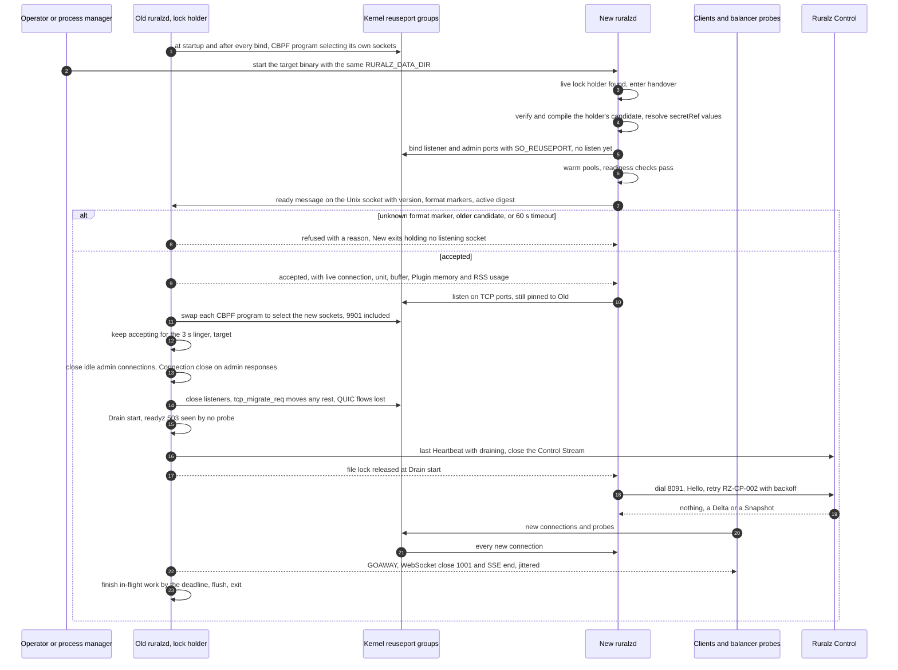
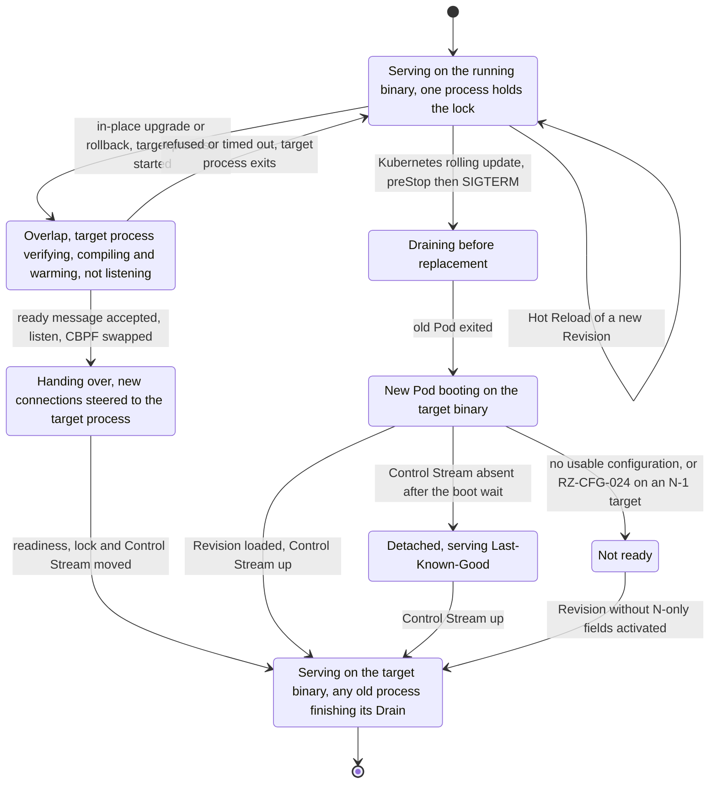
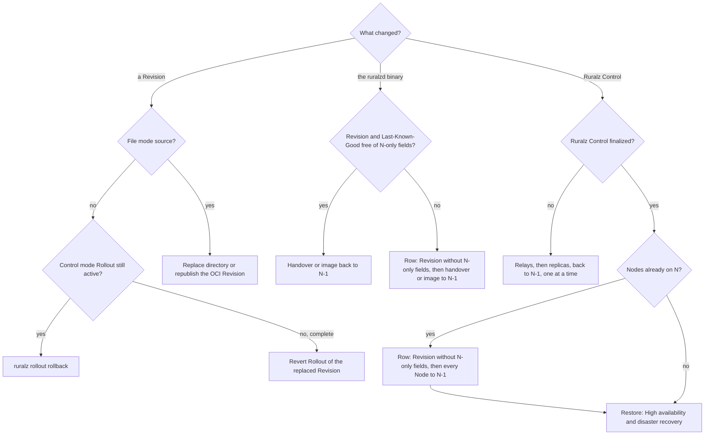

# Zero-Downtime Upgrades and Hot Reload

## Summary

This document decides how Ruralz changes what runs without dropping traffic: Hot Reload, the Zero-Downtime Upgrade of `ruralzd` through `SO_REUSEPORT` and Drain ([ADR-0015](../adr/0015-zero-downtime-upgrades-so-reuseport.md)), Raft rolling upgrades of Ruralz Control within N-1 skew, State Store upgrades, apiVersion migrations, rollback and verification. Nothing is implemented: Hot Reload and the in-place handover are Planned (M1); Plugin hot-swap and Kubernetes, edge and Ruralz Control upgrades Planned (M2). For operators changing production.

## Scope and non-goals

In scope: changing a running deployment. "Pack 8.2" names a [foundation pack](../_meta/foundation-pack.md) section.

Non-goals, with owners:

- Snapshot pinning, retirement and ending: [Data plane](../architecture/03-data-plane.md#configuration-snapshots-and-hot-reload).
- Control Stream, Rollouts, gates and fencing: [Control plane and GitOps](../architecture/04-control-plane-and-gitops.md) ([ADR-0007](../adr/0007-control-stream-protocol.md)).
- Versions, skew policy and upgrade order: [Release, versioning and compatibility](../engineering/04-release-versioning-and-compatibility.md).
- Restores and Region failover: [High availability and disaster recovery](04-high-availability-and-disaster-recovery.md).
- Budget values, Helm objects and fields: [Performance budgets](../architecture/12-performance-budgets-and-benchmarking.md), [Deployment topologies](01-deployment-topologies.md), [Configuration model](../architecture/02-configuration-model.md).
- Listener socket passing: Not planned; ADR-0015 keeps processes independent.

## Guarantees

These follow from P2, P4, P9 and P10 ([Vision](../vision/01-vision-and-positioning.md#principles)). Owned glossary terms (pack section 11):

| Term | Meaning |
|---|---|
| Hot Reload | One Node activating a new Revision without a restart: compile off the request path, then one atomic snapshot swap; in-flight requests keep their snapshot |
| Drain | Graceful shutdown of a Node: readiness fails, listeners stop accepting, HTTP/2 GOAWAY is sent, and in-flight requests finish within a bounded time |
| Zero-Downtime Upgrade | Replacing the `ruralzd` binary: the new process binds with `SO_REUSEPORT` and reports ready, then the old process Drains |

In place it is a handover; a Kubernetes (T4) Drain and restart keeps the Cluster serving but is not a per-Node Zero-Downtime Upgrade.

| ID | Guarantee | Verified by |
|---|---|---|
| ZG-1 | A Hot Reload ends no in-flight request unless K + 1 = 3 further activations occur during it, K = 2 (target): its streams then get a going-away close at once, and a request still pinned 30 s later (target) ends with `RZ-RT-014` | V-1, V-2 |
| ZG-2 | A Revision failing the validation gate never changes what a Node serves | V-1 |
| ZG-3 | With `net.ipv4.tcp_migrate_req=1`, an in-place handover refuses or resets no new TCP connection and balancer probes always see `/readyz` 200; without it, only handshakes needing a second SYN-ACK retransmission can be reset (hypothesis) | V-3 |
| ZG-4 | A Drain signals every long-lived connection first and ends all work within 30 s of SIGTERM (target) | V-4 |
| ZG-5 | A Ruralz Control upgrade changes no Node's active Revision or readiness and stays within N-1 skew | V-5 |
| ZG-6 | A State Store upgrade degrades only its Cell, under each Policy's `failureMode` | V-7 |
| ZG-7 | An apiVersion migration yields the same Revision digest and an empty `ruralz bundle diff` | Golden corpus |
| ZG-8 | Every rollback this document owns takes three steps or fewer, chained paths included | Runbook drills, V-6 |

Not guaranteed: QUIC connections on UDP 8443 surviving steering (OQ-system-overview-18; HTTP/3 Planned (M3)), long-lived connections migrating, or Node-local state such as token buckets surviving a new process, which admits at most one extra ceiling per key (target) ([Stateless data plane](../architecture/11-scalability-and-distributed-state.md#stateless-data-plane)).

## Configuration hot reload

Hot Reload is Planned (M1). File-mode Nodes reload on a directory replacement, a settled change or a new OCI digest (Planned (M2)), Control-mode Nodes on a `Snapshot` or `Delta`, through one gate.

### Validation gate

The Node re-runs the [Configuration model](../architecture/02-configuration-model.md#validation-and-diff-semantics) checks with CI's library, then Node-only checks; the first failure rejects the Revision: a `Nack` in Control mode, transient when not reproducible, or a rejected `ruralz_config_activations_total` count in file mode, after parse and schema checks (RZ-CFG-001 to RZ-CFG-013). Steps 2 and 3 skip an unsigned watched directory.

| Step | Check | Code on failure | Class in Control mode |
|---|---|---|---|
| 1 | Encoded size within the Node's limit, never below the CLI default | RZ-CFG-001 | Deterministic |
| 2 | Content matches the full `sha256:<64 hex>` digest, a `Delta` after patching | RZ-CFG-027 | Deterministic when reproduced, else transient |
| 3 | Ruralz Control's signature against Enrollment anchors, or Sigstore on OCI ([ADR-0017](../adr/0017-artifact-signing.md)) | RZ-CFG-033 | Deterministic |
| 4 | `storeEpoch` and `assignmentSeq` at or above the persisted pair; Environment and Cluster match the `EnrollResponse` | Lower pair: transient `Nack`; wrong binding: RZ-CFG-033 | Transient; deterministic |
| 5 | Every apiVersion served, every field at or below the Node's schema level | RZ-CFG-007, RZ-CFG-024 | Deterministic |
| 6 | Re-validation from reference resolution onward | Any Configuration model code from that stage | Deterministic |
| 7 | Plugin artifacts fetched by digest and signed; ABI and exported Phases equal `spec.abi` and `spec.phases`, requested Capabilities a subset of `spec.capabilities`, ABI level at or below the Node's ([ADR-0005](../adr/0005-plugin-abi-v1.md)) | RZ-CFG-028, RZ-CFG-033 | Deterministic for a spec mismatch; transient for a fetch failure or a level above the Node's, not reproducible ([rule 2](../engineering/04-release-versioning-and-compatibility.md#plugin-abi-versioning)) |
| 8 | Every `secretRef` resolves on this Node | RZ-CFG-026 | Transient, not reproducible |
| 9 | Compile Routers, Filter Chains, CEL and Plugins once per digest | The failing check's code | Deterministic; a compile timeout transient |
| 10 | Bind added or changed listeners; a reused port's CBPF program steers to the new socket before the old one closes | OQ-zero-downtime-upgrades-and-hot-reload-4 | Transient |
| 11 | Warm new connection and Plugin pools | None: a pool that does not fit warms to 0; `RZ-PLG` under `failureMode` follows | Not applicable |

Operators MUST NOT roll out a Plugin needing an ABI level some Node of the Cluster lacks: such Nodes are quarantined.

### Atomic swap

After the gate the loader follows [Compile before swap](../architecture/01-system-overview.md#compile-before-swap); the candidate it writes under `${RURALZ_DATA_DIR}/lkg/` becomes Last-Known-Good on activation in file mode, at the promoted digest in Control mode (pack 8.2).

Requests pin their snapshot until `onLog`. Beyond K = 2 retired snapshots (target) the oldest becomes closing: its streams end at once (WebSocket 1001, gRPC `UNAVAILABLE`, SSE end with a retry hint), and work pinned 30 s later (target) ends with `RZ-RT-014` ([Data plane](../architecture/03-data-plane.md#configuration-snapshots-and-hot-reload)). The latest pending Revision waits for that snapshot's release, at most rule 6's bound there (target), within the 60 s ACK timeout (target) while the largest Plugin `limits.timeout` is under 23 s, pending OQ-data-plane-13: its option (b), keeping System overview's "activation never waits", ends the closing snapshot's pins at once instead.

An `all-at-once` Rollout, or file-mode Nodes sharing a source, reach a third activation together, a rollback and re-rollout sufficing: up to 20,000 streams per Node (target) close in one second, 20 million per 1,000-Node Cell (hypothesis), until OQ-zero-downtime-upgrades-and-hot-reload-10 jitters them.

[Hot Reload stages](../architecture/12-performance-budgets-and-benchmarking.md#hot-reload-stages):

```text
PB-7, 5,000 Routes, idle Node   500 ms: verify 25, compile 400, swap 25 ms            (target)
Half-saturation load            1 s or less; compile workers yield every 100 µs       (target)
                                gateway-added p99 at 1.5 ms or less                   (hypothesis)
```

### Partial failure

A Node never activates part of a Revision:

| Where | What happens | What the operator sees |
|---|---|---|
| One Node, before the swap | Rejected; the active Revision keeps serving | The `Nack` code in `ruralz rollout status` |
| One Node, after the swap | The candidate write fails, as on a full disk | Drift of kind Last-Known-Good |
| Some Nodes, Control mode | Deterministic NACKs fail the gate; transient ones retry, then quarantine; over max(1, 5% of a batch) lagging fails it (target) | `rolled-back` with `autoRollback: true`, else `paused` |
| Some Nodes, file mode | Rejecting Nodes keep the old Revision | `ruralz_config_revision_info{role="active"}` differs |

### Plugin hot-swap

A Plugin changes only through a new Revision, so its swap is this Hot Reload, Planned (M2) ([Hot-swap lifecycle](../architecture/05-wasm-plugin-system.md#hot-swap-lifecycle), [ADR-0005](../adr/0005-plugin-abi-v1.md)): compiled once per digest and memory limit, new pools warm to the predecessor's 1-minute peak busy count plus headroom (target) within the Node-wide cap and 10% swap headroom (target); earlier requests keep their snapshot's pools through `onLog`. A cold compile of a 2 MiB Plugin takes up to 1 s on one core (hypothesis), delaying only the ACK.

### Hot Reload versus restart

| Change | How it takes effect |
|---|---|
| Any Bundle resource, listeners and TLS certificates included | Hot Reload |
| `secretRef` values from `file`, `kubernetes` or `vault` | Rotation in place ([secretRef](../architecture/02-configuration-model.md#secretref)) |
| `env` secrets, `RURALZ_*` settings, file-mode trust policy | Handover, or Drain and restart |
| Gateway `spec.stateStore` | Hot Reload, as a [State Store upgrade](#state-store-upgrades) |
| The `ruralzd` binary | Handover in place; Drain and restart on Kubernetes |

## Binary upgrades

A Zero-Downtime Upgrade follows [ADR-0015](../adr/0015-zero-downtime-upgrades-so-reuseport.md): `SO_REUSEPORT`, drain and readiness gating, and no listener socket passing. [Upgrade order](../engineering/04-release-versioning-and-compatibility.md#upgrade-order) moves Ruralz Control first, then Nodes from N-1 to N.

| Path | Where | Mechanism | Capacity during the upgrade |
|---|---|---|---|
| In-place Zero-Downtime Upgrade (handover) | VMs with systemd (T5), file-mode hosts (T2), Planned (M1); edge sites (T6), Planned (M2) | A second process on the same host and `${RURALZ_DATA_DIR}`; `SO_REUSEPORT` with CBPF pinning and steering | Unchanged; ceilings shared |
| Drain and restart, Planned (M2); not a Zero-Downtime Upgrade | Kubernetes (T4) | StatefulSet rolling update: preStop, Drain, new Pod | Minus up to `maxUnavailable` Pods, set to the PodDisruptionBudget: one zone's share at minimum scale (target) |

With `SO_REUSEPORT` alone, reloads fail connections, measured at 155 per million over 180 reloads, from sockets closed with queued connections ([source](https://www.haproxy.com/blog/truly-seamless-reloads-with-haproxy-no-more-hacks)). Steering alone still resets handshakes begun before the swap and children completing between the last `accept()` and `close()`; step 5's linger and `tcp_migrate_req` close that gap.

### In-place handover

*Figure 1: the `SO_REUSEPORT` handoff between `ruralzd` processes, then the old process's Drain.*



1. **Start** with the same `RURALZ_CONFIG`, `RURALZ_DATA_DIR` and effective user ID, as `SO_REUSEPORT` requires ([source](https://man7.org/linux/man-pages/man7/socket.7.html)); a live lock holder means handover ([handover rules](../architecture/01-system-overview.md#hot-reload-rollout-and-zero-downtime-upgrade)).
2. **Boot** the holder's active Revision without the boot wait (pack 8.2), through the full gate; an unknown format marker refuses the handover ([Versioned surfaces](../engineering/04-release-versioning-and-compatibility.md#versioned-surfaces)).
3. **Bind, not listen.** Binding each `listeners` `port` and `admin.port` catches port errors; listening only once accepted queues nothing on a process that may exit. The holder's `SO_ATTACH_REUSEPORT_CBPF` programs, one per group with UDP 8443 included, select its own sockets until step 5.
4. **Gate.** Over the owner-only Unix socket under `${RURALZ_DATA_DIR}`, the holder accepts only its active digest, has a newer candidate reloaded and reported again, and refuses an older one, left by a failed candidate write, at once. Probes meanwhile reach only the holder, `/readyz` 200. Unaccepted after 60 s (target), the new process exits; if the holder exits first, the new process takes the lock and listens.
5. **Steer.** Accepted, the new process listens; the holder swaps each program to select it through `golang.org/x/sys/unix`, keeps accepting for a 3 s linger (target), covering handshakes begun before the swap and one SYN-ACK retransmission, then closes its listeners, losing QUIC connections here. Handover hosts SHOULD set `net.ipv4.tcp_migrate_req=1` (Linux 5.14+, per network namespace) so closing migrates queued children and in-progress handshakes to the new socket, by hash despite CBPF (OQ-zero-downtime-upgrades-and-hot-reload-12).
6. **Move readiness.** During the linger, closing idle admin connections and answering in-flight admin requests with `Connection: close` moves keep-alive health checkers to the new process, so no balancer sees the Drain's 503.
7. **Move identity.** At Drain start the old process sends a last `Heartbeat` with `draining`, closes its Control Stream and releases the lock; the new one takes it, dials 8091 with `Hello` and retries `RZ-CP-002` from a replica still holding the old stream with full jitter, base 1 s, cap 60 s (target), staying ready (pack 8.5). Only the lock holder writes Last-Known-Good (pack 8.11).
8. **Drain** on the handover timeline below.

The handover carries no Node-local state, answering OQ-traffic-management-and-resilience-22 with (c) for Planned (M1): both processes keep full local token buckets within the one-extra-ceiling bound; until the new process's first `HeartbeatReply`, within 15 s (target), derived ceilings take the full limit under the clamp max(1, `requests` / 100) (target), reason `node_count_unknown` (OQ-zero-downtime-upgrades-and-hot-reload-5).

Node-wide ceilings are shared: the old process reports connections, in-flight units, buffered bytes, Plugin memory and RSS at acceptance and each second (target); the new one admits each ceiling minus that usage, under a soft memory limit of 90% of the limit minus the old RSS (target). Hosts MUST fit two processes until V-3 verifies this sharing, then the overlap extra ([Capacity planning](03-capacity-planning.md#headroom-and-failure-capacity)); State Store client limits MUST cover both:

```text
Two processes   host ≥ 2 × container until V-3 verifies sharing                   (hypothesis)
Overlap extra   second base RSS 100 MB + 2 KB per Route, its (K + 2) snapshots
                and state tables of 475 MiB: about 0.6 GiB plus snapshots         (hypothesis)
Shared          20,000 TLS connections × 96 KiB = 1.9 GiB, never doubled          (target)
State clients   2 pipelined + 8 dedicated per shard per process; server limit
                10 × (N_serving + Nodes in handover) per shard                    (target)
```

This answers OQ-deployment-topologies-7 with (a), a shipped systemd unit and helper (OQ-zero-downtime-upgrades-and-hot-reload-7); until then `systemctl stop` and start is a Drain and restart.

### Node count during upgrades

Handovers, Drains and replica replacements restart Control Streams, and `clusterNodeCount` counts only Nodes connected 10 minutes (target) ([Replica roles](../architecture/04-control-plane-and-gitops.md#replica-roles)): a `draining` Heartbeat drops a Node at once, and it rejoins only 10 minutes plus a 10%-per-minute ramp later (target), raising derived ceilings and hot-key GCRA calls until breakers open. Until OQ-scalability-and-distributed-state-14 (a) and OQ-zero-downtime-upgrades-and-hot-reload-11 keep qualification per `node.id`, derived-ceiling Clusters MUST upgrade at most 10% of Nodes per 10 minutes (target), about 100 minutes per Cluster (hypothesis); declared ceilings ([T4](01-deployment-topologies.md#t4-kubernetes-with-helm-hpa-and-crds)) need no pacing.

### Drain timeline defaults

A Drain starts on SIGTERM, `ruralz node drain` or an accepted handover, with fixed defaults in Planned (M1). A handover's Drain starts after the linger and fails `/readyz` like any Drain, unseen since step 6 moved every probe connection, and skips the accept window.

```text
Offset from SIGTERM   Step and default
Handover              Drain from the linger's end; deadline 20 s later, 23 s after steering (target)
Before, Kubernetes    preStop sleep hook: 5 s                                           (target)
0 s                   readiness failure at once: /readyz returns 503, heartbeats
                      set draining                                                      (target)
0 to 5 s              accept window while balancers observe /readyz: 5 s                (target)
5 s                   stop accepting; first HTTP/2 GOAWAY (last stream ID 2^31-1,
                      NO_ERROR); Connection: close on HTTP/1.1; idle connections close  (target)
5 to 6 s              final GOAWAY after one PING round trip, 1 s at most; Planned (M1)
                      sends one GOAWAY (OQ-zero-downtime-upgrades-and-hot-reload-3 (a))  (target)
5 to 15 s             going-away signals to long-lived connections, spread uniformly
                      over the 10 s jitter window                                       (target)
25 s                  Drain deadline, 20 s after stop-accepting: remaining work ends
                      through the Data plane ending protocol                            (target)
25 to 30 s            flush the post-commit queue and telemetry, 5 s at most, then exit;
                      exit bound 30 s after SIGTERM                                     (target)
Kubernetes            terminationGracePeriodSeconds 45 s                                (target)
systemd               TimeoutStopSec 40 s                                               (target)
```

The GOAWAY pair follows RFC 9113 ([source](https://www.rfc-editor.org/rfc/rfc9113.html)); `Server.Shutdown` ignores hijacked connections such as WebSockets ([source](https://pkg.go.dev/net/http#Server.Shutdown)), so the Drain tracks them.

Kubernetes runs preStop before SIGTERM inside the grace period ([source](https://kubernetes.io/docs/concepts/containers/container-lifecycle-hooks/)), 30 s by default ([source](https://kubernetes.io/docs/concepts/workloads/pods/pod-lifecycle/)), too short here:
`terminationGracePeriodSeconds` MUST exceed the preStop wait plus the exit bound (Drain deadline plus flush), 45 s against 5 s plus 30 s (target), as `TimeoutStopSec` exceeds 30 s (target).
preStop covers EndpointSlice updates, which by analysis run concurrently with termination ([source](https://kubernetes.io/docs/concepts/services-networking/endpoint-slices/)).
External balancers MUST detect a failed `/readyz` within the accept window, probe interval times unhealthy threshold at most 5 s (target); slower ones need OQ-zero-downtime-upgrades-and-hot-reload-1 (b) or (c) to lengthen it.
Routes with a `timeout` above the 20 s request deadline (target) are cut at it.

*Figure 2: drain timeline defaults on Kubernetes, seconds from Pod deletion (target).*



```mermaid
gantt
    title Drain timeline defaults, seconds after Pod deletion (target)
    dateFormat X
    axisFormat %M:%S
    section Kubernetes
    preStop sleep while EndpointSlices update :k1, 0, 5s
    terminationGracePeriodSeconds             :k2, 0, 45s
    section Readiness
    Ready and serving                         :r1, 0, 5s
    readyz returns 503 after SIGTERM          :r2, 5, 30s
    section Listeners
    Accept window for balancer probes         :l1, 5, 5s
    Stopped accepting                         :l2, 10, 25s
    section HTTP/2 and HTTP/1.1
    First GOAWAY and Connection close         :milestone, g1, 10, 0s
    Final GOAWAY after one round trip         :g2, 10, 1s
    section Long-lived connections
    WebSocket 1001 and SSE end, jittered      :s1, 10, 10s
    section In-flight work
    Requests finish before the deadline       :w1, 10, 20s
    Flush post-commit queue and telemetry     :w2, 30, 5s
    section Margin
    Exited, margin before SIGKILL             :m1, 35, 10s
```

### Long-lived WebSocket and SSE connections

Long-lived connections never migrate, so they end early with a jittered reconnect signal ([Termination per protocol](../architecture/07-multi-protocol.md#termination-per-protocol)). These protocols are Planned (M3), the MQTT broker Planned (M4); close 1012 is OQ-zero-downtime-upgrades-and-hot-reload-8.

| Traffic | At stop-accepting | Within the 10 s jitter window (target) | At the drain deadline |
|---|---|---|---|
| WebSocket sessions | Keep flowing | Close 1001 Going Away to client and Upstream ([source](https://www.iana.org/assignments/websocket/websocket.xhtml)) | Closed |
| SSE subscriptions on non-`ai` Upstreams | Keep flowing | End with a `retry` jittered from 1 to 10 s (target); clients resume with `Last-Event-ID` ([source](https://html.spec.whatwg.org/multipage/server-sent-events.html)) | Ended |
| AI completions over SSE from `ai` Upstreams | Keep flowing: a cut without usage charges the full reservation (pack 8.9) | Keep flowing | Ended; charged per pack 8.9 |
| gRPC streams | GOAWAY; new calls go elsewhere | Keep flowing | Trailers with `UNAVAILABLE` |
| MQTT embedded broker sessions | Keep flowing | MQTT 5 DISCONNECT 0x8B; 3.1.1 connection closed | Closed |
| Other requests | GOAWAY; `Connection: close` | Finish | 503 with an `RZ-RT` code that Data plane registers (OQ-zero-downtime-upgrades-and-hot-reload-2) |

```text
Reconnects   a Node holding 20,000 sessions sends about 2,000 per second over the
             window; a step of M Nodes adds M × 2,000 per second to the others  (hypothesis)
```

### Kubernetes Drain and restart

On T4, Planned (M2), an image change replaces Pods ([T4](01-deployment-topologies.md#t4-kubernetes-with-helm-hpa-and-crds)): preStop and SIGTERM follow the [Drain timeline](#drain-timeline-defaults), and the new Pod boots from the same `${RURALZ_DATA_DIR}` volume by pack 8.2, gating the next step on `/readyz`.

Each step replaces up to `maxUnavailable` Pods, M, one zone's share at minimum scale (target); a PodDisruptionBudget limits evictions, not the StatefulSet's rolling update. Operators MUST first add M Pods or confirm spare capacity, and halt on a zone incident, so a step plus a zone loss keeps survivors under 80% CPU (target). The chart's rolling update cannot pace to 10% of Nodes per 10 minutes, so on T4 a derived-ceiling Cluster MUST declare per-Node ceilings before an image change ([above](#node-count-during-upgrades)).

```text
Step         M of N Nodes out for 40 to 45 s; update takes ceil(N / M) × 45 s      (hypothesis)
Example      declared ceilings, N = 1,000, minReplicas 300, three zones:
             M = 100, 10 steps, 7.5 min                                        (hypothesis)
Reconnects   M × 2,000 per second: 200,000 per second onto 900 Nodes              (hypothesis)
```

### Node lifecycle during an upgrade

*Figure 3: one Node through an upgrade or binary rollback.*



### Skew and the binary rollback limit

Nodes follow the [skew policy](../engineering/04-release-versioning-and-compatibility.md#control-plane-and-data-plane-version-skew); Rollouts with fields newer than the oldest Node serves are refused (RZ-CFG-024). Rollback to N-1 works only while the active Revision and Last-Known-Good lack N-only fields; otherwise the N-1 process NACKs with RZ-CFG-024, stays not ready and is refused a handover ([Binary rollback limit](../engineering/04-release-versioning-and-compatibility.md#binary-rollback-limit)). Operators SHOULD soak N before adopting a new field and SHOULD NOT upgrade Nodes during a Rollout to their Cluster.

## Control plane upgrades

Upgrades follow [Ruralz Control upgrades](../engineering/04-release-versioning-and-compatibility.md#ruralz-control-upgrades) for the `raft` Control Store ([ADR-0006](../adr/0006-control-store-raft-boltdb.md), proposed), Planned (M2). N is the newest binary minor; until finalize the Control Store version stays N-1, and replicas write N-1 formats at N-1 schema levels. One minor at a time:

1. **Prepare.** Every replica reported a snapshot at the Control Store version, and every Node runs N-1 by its `service.version` (upgrade any N-2 Node to N-1 first); take `ruralz control backup` with `--revocation-list-file` and pause `ruralz bundle push`.
2. **One replica at a time.** Move leadership off (`POST /api/v1/replicas/{serverId}/transfer`), replace the binary with N, and await `/readyz` on 9902, Raft catch-up, a recovered `ruralz_control_connected_nodes` and, where required below, `ruralz_control_cluster_nodes`; three voters keep a quorum of two. A failing replica returns to N-1 and the upgrade stops.
3. **Regional Ruralz Control relays**, Planned (M4), one at a time; their Nodes stay on N-1.
4. **Finalize.** Once `GET /api/v1/control-store` shows every replica and relay at N and a 24-hour soak (target), an `admin` calls `POST /api/v1/control-store/finalize` (step-up; else `RZ-CP-021`); migrations run as log entries and replicas snapshot.
5. **After finalize.** Apply `ruralz-crds.yaml` if it adds a served version ([ADR-0016](../adr/0016-kubernetes-helm-and-crds.md), proposed), pin the CI CLI to N, resume pushes, then upgrade Nodes one Cluster at a time.

Replicas over one minor above the Control Store version, or meeting unknown entries, stop before serving. With `postgres`, Planned (M4), finalize and migrations are transactions.

```text
Pair                        In policy (N and N-1)
Ruralz Control and Nodes    N-1; N once the Control Store version is N
Replicas and relays         N-1 and N until finalize; N after
ruralz CLI                  N or N-1; ruralz bundle push at the Control Store version
Nodes within one Cluster    any mix of N and N-1, never newer than the Control Store version
```

A replaced replica fails `/readyz` and sends `Reconnect` (`drain`); its Nodes redial with full jitter, base 1 s, cap 60 s (target), staying ready (pack 8.5, [ADR-0007](../adr/0007-control-stream-protocol.md)); Rollouts resume from the persisted plan; ceil(Nodes / 5,000) + 1 replicas (hypothesis) avoid shedding. Until OQ-scalability-and-distributed-state-14 (a) closes, each replacement unqualifies its Nodes: for a derived-ceiling Cluster the operator MUST declare per-Node ceilings first or, between replacements, wait until `ruralz_control_cluster_nodes` regains its pre-step value, about 10 minutes plus the ramp, after a drop of about 1 / replicas (hypothesis).

## State Store upgrades

Ruralz never upgrades the State Store; every change runs under [State Store availability](../architecture/11-scalability-and-distributed-state.md#state-store-availability): one deadline per request, then `failureMode`, then no calls once the breaker opens.

| Change | Procedure | Effect on the Cell |
|---|---|---|
| Server patch or minor upgrade | One shard at a time, off peak: upgrade its replica, await near-zero replication lag (target), fail over, upgrade the old primary; only while another replica or the primary's zone is healthy, pausing on a zone incident | `failureMode` about 15 s per failover (hypothesis): Rate Limits fail open, `closed` Token Budgets return 503 `RZ-STS`; scripts reload |
| New deployment, such as an engine change | A new Cell on the new State Store; shift traffic by DNS or balancer weights | Counters start empty: one extra limit per open window (target) |
| Ruralz layout change in a release | Automatic ([State Store layout changes](../engineering/04-release-versioning-and-compatibility.md#state-store-layout-changes)) | None with mixed N-1 and N Nodes; up to 2x for one window after a rollback past lazy migration (hypothesis) |

Planned failovers keep [Scalability's bounds](../architecture/11-scalability-and-distributed-state.md#consistency-and-accuracy-bounds) for replication lag L:

```text
Per Cell        shards × 15 s of failureMode: 4 minutes at 16 shards              (hypothesis)
Rate Limit      L × a key's admitted rate extra; up to requests for a key
                first written within the lag                                     (hypothesis)
Token Budget    overspend up to L × reserved tokens per second per key           (hypothesis)
```

`noeviction` MUST stay set where limit, Quota or Token Budget keys live, persistence SHOULD stay on for windows over one day, and TLS MUST stay on. `ai.semantic-cache`, Planned (M3), needs vector commands; without them it bypasses under its default `open`, else fails with `RZ-STS-005` (pack 7). Every Node of a Cluster MUST resolve the same State Store ([Cells](../architecture/11-scalability-and-distributed-state.md#cells-and-blast-radius)), so a new `stateStore` or `secretRef` value follows the new-Cell row (OQ-zero-downtime-upgrades-and-hot-reload-9).

## apiVersion migrations

A Bundle moves from `ruralz/v1alpha1` to `ruralz/v1beta1`, Planned (M3), by hub conversion, which MUST yield the same Revision and an empty `ruralz bundle diff` ([Hub-and-spoke conversion](../architecture/02-configuration-model.md#hub-and-spoke-conversion)), so Nodes receive nothing new.

1. **Upgrade** Ruralz Control, then Nodes, to a release serving the target apiVersion; a new CRD version is served only after finalize ([Migration tooling](../engineering/04-release-versioning-and-compatibility.md#migration-tooling)).
2. **Convert.** `ruralz bundle render --api-version ruralz/v1beta1 --output-dir <dir> --environments <file>` converts base resources and overlays together, since an overlay must match its base's apiVersion (RZ-CFG-030), and exits 1 unless every Environment's diff is empty; comments are dropped (OQ-configuration-model-7).
3. **Prove.** CI repeats it with `ruralz bundle build` and `ruralz bundle diff` per Environment; merge only on equal digests and empty diffs.

A Bundle MAY mix apiVersions meanwhile; `ruralz/v1alpha1` stays served at least 2 minor releases, about 6 months, after its successor (target), warning with RZ-CFG-025, then failing with RZ-CFG-007. Adopt a new field only once every target Node serves its schema level ([Version skew](../architecture/02-configuration-model.md#version-skew)): the first N-only field ends binary rollback. Plugin ABI and Control Stream majors overlap 4 minor releases, about 12 months (target).

## Rollback

Every rollback takes three steps or fewer, a chained path being one row (Figure 4).

*Figure 4: choosing a rollback path by what changed.*



| Changed | Step 1 | Step 2 | Step 3 |
|---|---|---|---|
| Revision; Rollout `canary`, `progressing` or `paused` | `ruralz rollout status prod-eu-west` finds the Rollout | `ruralz rollout rollback <rollout-id>` | `ruralz rollout status <rollout-id>` shows `rolled-back` |
| Revision; Rollout `complete` | `ruralz rollout start --cluster prod-eu-west --revision sha256:<previous>` with step-up TOTP | Another `approver` runs `ruralz rollout approve` if held with `RZ-CP-006` | `ruralz rollout status <rollout-id> --wait` reaches `complete` |
| Revision in a watched directory | Replace the directory atomically with the previous `ruralz bundle render --env <env>` output | Check each Node's digest with `ruralz node dump` | None |
| Revision from OCI | `ruralz bundle push --env <env> --oci <reference>` from the previous commit | After one poll interval, check digests | None |
| Binary, in-place | Start the N-1 binary beside the N process: a reverse handover | Confirm `/readyz` and the logged version | None |
| Binary on Kubernetes | Set the N-1 image digest in the chart values | Watch every Pod replaced and ready | None |
| Binary past the rollback limit | `ruralz rollout start --cluster <name> --revision sha256:<last digest without N-only fields>`, approval included; file mode: that commit's directory or OCI Revision | `ruralz rollout status <rollout-id> --wait` reaches `complete`, promoting Last-Known-Good; file mode: digests match | Reverse handover or N-1 image |
| Ruralz Control before finalize | Return each relay at N, then each N replica, to N-1 one at a time, leadership moved off each replica first | Confirm `/readyz` on 9902 and Raft catch-up for every replica, and every relay | None |
| Ruralz Control after finalize, Nodes at N | On the N deployment, steps 1 and 2 of the rollback-limit row, every Cluster | Every Node to N-1 by reverse handover or image | Restore; on Kubernetes re-apply N-1's `ruralz-crds.yaml` first; relays at N-1 |

Control-mode rows are Planned (M2), directory rollback Planned (M1). The restore, rule 5 of [Ruralz Control upgrades](../engineering/04-release-versioning-and-compatibility.md#ruralz-control-upgrades), loses later writes and detaches Nodes until a revocation list arrives; the 24-hour soak (target) avoids it. Once Nodes run N, rule 6 orders the Rollout and handover steps here before [its restore runbook](04-high-availability-and-disaster-recovery.md), so no Node outruns the restored Control Store version or boots N-only fields.

## Verification runbook

Commands and milestones: [CLI and API surface](../reference/01-cli-and-api-surface.md); metrics: [Observability](../architecture/10-observability.md).

| When | Check | Pass |
|---|---|---|
| Before a Ruralz Control upgrade | `ruralz version` (the CLI only); `ruralz node list --cluster <name>`; Node versions from `service.version` or inventory until OQ-release-versioning-and-compatibility-4 lets `ruralz node list` show them; `ruralz control backup --output-file <file> --revocation-list-file <file>` | CLI at N or N-1; every Node at N-1; digests equal the promoted digest; backup off the replicas; pushes paused; derived ceilings declared, or replacements paced |
| Before a Node upgrade, after finalize | `ruralz node list --cluster <name>`; versions as above | Every Node at N-1 or N; digests equal the promoted digest |
| Before | `terminationGracePeriodSeconds` or `TimeoutStopSec`; balancer probe interval times unhealthy threshold | 45 s and 40 s; detection within 5 s (target) |
| During a Hot Reload or Rollout | `ruralz rollout status <cluster> --wait`; `ruralz_config_activation_duration_seconds` | No deterministic NACK; activation within the size class budget (target) |
| During a handover or Drain | Balancer view of `/readyz`; 5xx, `RZ-RT-014` and Drain-deadline code counts; the old process's exit log | 200 throughout a handover; no connection left at the deadline |
| During any upgrade (Ruralz Control count: next row) | `ruralz_control_cluster_nodes`; `ruralz_node_degraded_info{reason="state_store_breaker_open"}` | No breaker opens; paced derived-ceiling Clusters: count drops at most 10% (target); declared ceilings: count ungated, first-seen GCRA calls within Scalability's per-Cell budget (target) |
| During a Ruralz Control upgrade | `/readyz` on 9902; `ruralz_control_connected_nodes`; `ruralz_control_cluster_nodes` | Every Node reconnected, none shed; count down at most the replaced replica's share until OQ-scalability-and-distributed-state-14 (a) and, with derived ceilings, regained before the next replica |
| After | `ruralz node list`; `ruralz_control_drift_nodes`; `ruralz_node_degraded_info` | No Drift and no new degraded reason |

[Testing and quality strategy](../engineering/03-testing-and-quality-strategy.md) places these lab gates.

| ID | Test | Pass | Milestone |
|---|---|---|---|
| V-1 | R1 reload ladder; each gate step failing; three quick Rollouts over 20,000 sessions (target) | Budgets per step (target); rejections change nothing; reconnects spread over 10 s (target) after OQ-zero-downtime-upgrades-and-hot-reload-10 | Planned (M1) |
| V-2 | Plugin swap at 20,000 requests per second (target) | No `RZ-PLG-005`; each request stays on its version | Planned (M2) |
| V-3 | 1,000 handovers under S1 at half saturation (target), a keep-alive health checker on 9901, `tcp_migrate_req` at 1 and at 0; 1,000 refused or timed-out handovers | Resets per handover recorded: none at 1, only twice-retransmitted handshakes at 0; no refused connection or failed request; every probe 200; no OOM kill or State Store connection refusal; derived-ceiling count drops at most 10% (target) | Planned (M1) |
| V-4 | CE-2: SIGTERM a Node holding HTTP/2 connections, WebSockets and SSE | Zero failed new requests; exit within 30 s (target) | Planned (M1); WebSockets and SSE Planned (M3) |
| V-5 | Ruralz Control N-1 to N with 100 Nodes under load (target) | Zero request errors or unready Nodes; no breaker opens; derived-ceiling count drops at most 10% (target), needing OQ-scalability-and-distributed-state-14 (a), else per the runbook (CE-7, CE-10) | Planned (M2) |
| V-6 | Handover to N-1 past the binary rollback limit, then that three-step row | Refused, N keeps serving; the row ends on N-1 with no Node unready | Planned (M1) |
| V-7 | CE-5: State Store primary killed under at least 100 Nodes (target) | Every Node reconnected within 10 s and `failureMode` for at most 15 s (target); extra admissions within the lag bound | Planned (M1) |

## Open questions

| ID | Question | Options | Owner | Blocking? |
|---|---|---|---|---|
| OQ-zero-downtime-upgrades-and-hot-reload-1 | Where are the Drain timings and handover timeout set? | (a) Fixed defaults (current); (b) `RURALZ_*` settings (pack amendment); (c) Gateway `spec` fields | configuration-model | No |
| OQ-zero-downtime-upgrades-and-hot-reload-2 | Which code ends work still running at the drain deadline? | (a) Widen `RZ-RT-014`'s registered meaning to the Drain deadline; (b) A new `RZ-RT` code (recommended) | data-plane | No |
| OQ-zero-downtime-upgrades-and-hot-reload-3 | Can `net/http` send a first GOAWAY before `Server.Shutdown`? | (a) `Shutdown` alone, one GOAWAY (Planned (M1)); (b) Ruralz framing through non-deprecated `x/net/http2` APIs; (c) An upstream change | data-plane | No |
| OQ-zero-downtime-upgrades-and-hot-reload-4 | Which code NACKs a listener that cannot bind during a Hot Reload? | (a) A new transient `RZ-CFG` code; (b) An `RZ-RT` code | configuration-model | No |
| OQ-zero-downtime-upgrades-and-hot-reload-5 | Should a handover pass the published Node count, reopening OQ-traffic-management-and-resilience-22? | (a) Count only (proposed); (b) Count and rate-limit key table; (c) Neither (current) | zero-downtime-upgrades-and-hot-reload | No |
| OQ-zero-downtime-upgrades-and-hot-reload-6 | How do `GOMEMLIMIT` and host memory cover the handover overlap? | (a) Hosts sized for two processes, chosen until V-3; (b) Shared ceilings, a reduced soft limit and free overlap memory, after V-3; (c) Only hosts without a memory limit | capacity-planning | No (answered) |
| OQ-zero-downtime-upgrades-and-hot-reload-7 | Which systemd directives keep the new process as main process across a handover? | (a) Research, then a shipped unit and helper; (b) Documentation only | release-versioning-and-compatibility | Yes, for Planned (M1) handover on T5 |
| OQ-zero-downtime-upgrades-and-hot-reload-8 | Should Drain send WebSocket close 1012 Service Restart instead of 1001? | (a) 1001 everywhere (current, as Multi-protocol); (b) 1012 on Drain, 1001 on snapshot retirement | multi-protocol | No |
| OQ-zero-downtime-upgrades-and-hot-reload-9 | What does a Node do when a rotated `stateStore.url` value names another deployment? | (a) Keep the old connection until restart, warning; (b) Redial at once; (c) Require a new Revision | scalability-and-distributed-state | No |
| OQ-zero-downtime-upgrades-and-hot-reload-10 | Should closing-snapshot stream ends spread over the 10 s jitter window (target)? | (a) Spread (proposed); (b) At once (current) | data-plane | No |
| OQ-zero-downtime-upgrades-and-hot-reload-11 | Should a `Hello` with the same certificate supersede a stream whose last `Heartbeat` carried `draining`, keeping the 10-minute qualification? | (a) Supersede and keep (proposed); (b) Supersede only; (c) Neither: retry `RZ-CP-002`, pace upgrades (current) | control-plane-and-gitops | No |
| OQ-zero-downtime-upgrades-and-hot-reload-12 | Should pack section 7 and ADR-0015 make `net.ipv4.tcp_migrate_req` a complement to CBPF steering, with a linger, not an alternative? | (a) Complement, SHOULD set, 3 s linger (target) (proposed, used here); (b) Alternative (pack section 7) | system-overview | No |
