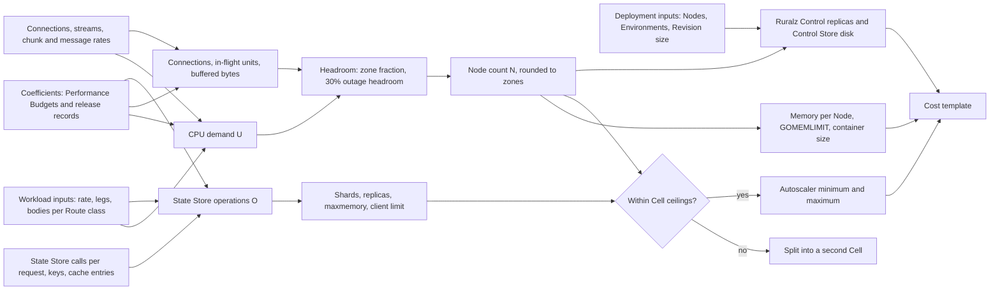

# Capacity Planning

## Summary

This document turns workload figures into Node counts, container sizes, State Store shards and Ruralz Control replicas. It fixes the planning inputs, one capacity model with named variables whose coefficients come only from [Performance budgets and benchmarking](../architecture/12-performance-budgets-and-benchmarking.md), three worked examples, the headroom each failure needs, autoscaling bounds, a cost template and measurable re-planning triggers. Nothing is implemented yet: every coefficient is a (target) or (hypothesis) until a published release record replaces it (P10). Operators sizing a Cell and architects checking a design against Cell ceilings should read it.

## Scope and non-goals

In scope: sizing Ruralz Gateway Nodes, the State Store of each Cell, Ruralz Control replicas and the Control Store, for one Region; multi-region pre-provisioning, Planned (M4), applies the same model per Region. "Pack 8.8" names a section of the [foundation pack](../_meta/foundation-pack.md). This document answers OQ-deployment-topologies-8, which it owns, with option (a): measured sizes replace the interim values below once F2, the memory runs and Data plane's cache layout publish results.

Non-goals, with owners:

- Budget values, reference hardware and benchmark method: [Performance budgets and benchmarking](../architecture/12-performance-budgets-and-benchmarking.md), which wins on conflict.
- Ceilings, accuracy bounds and autoscaling signals: [Scalability and distributed state](../architecture/11-scalability-and-distributed-state.md).
- Topologies, Helm objects and starting sizes: [Deployment topologies](01-deployment-topologies.md), whose [Sizing defaults](01-deployment-topologies.md#sizing-defaults) this model replaces.
- Rollout pacing and Control Store internals: [Control plane and GitOps](../architecture/04-control-plane-and-gitops.md); upgrade order: [Release, versioning and compatibility](../engineering/04-release-versioning-and-compatibility.md).
- Failover runbooks: [High availability and disaster recovery](04-high-availability-and-disaster-recovery.md). Prices: operators supply them to the [Cost template](#cost-template).

## Planning inputs

Collect one row per Route class, a set of Routes with the same protocol, Filter Chain and body shape (`ruralz bundle render --effective --route` prints each chain). Measured inputs come from the busiest 5 minutes (target) of the last 30 days; forecasts replace them before launch.

| Input | Symbol | Where it comes from |
|---|---|---|
| Peak request rate per Route class | λ_r | `ruralz_http_requests_total` by Route, or a forecast |
| Closest benchmark scenario (protocol and chain) | c_base | S1, S2, S3 or S7 in [Scenarios](../architecture/12-performance-budgets-and-benchmarking.md#scenarios) |
| Upstream legs per request; parallel steps | k_r; q_r | `composition` steps of the Route |
| Merged or transformed body per request | β_r (KiB) | `ruralz_http_response_body_bytes` |
| Plugin Phase calls per request | p_r | `Plugin.spec.phases` on the Route's `plugin` Policies |
| Prompt size on AI Routes | e_r (KiB) | `ruralz_http_request_body_bytes` |
| Mean request duration, Upstream included | W_r (s) | `ruralz_http_request_duration_seconds` |
| Concurrent client connections; new TLS connections per second | C; λ_hs | `ruralz_listener_open_connections`; `ruralz_listener_connections_total` |
| Concurrent streams; those with `onChunk` subscribed | S; S_sub | `ruralz_http_active_requests` on streaming Routes |
| Chunks or messages per stream per second | r_chunk | `ruralz_ai_time_per_output_chunk_seconds`, or the protocol's message rate |
| In-flight units per stream | u_s | 1 per SSE response; 3 per WebSocket session (hypothesis, OQ-capacity-planning-1) |
| Blocking and post-commit State Store calls per request | s_r; w_r | [State Store sizing](#state-store-sizing); `ruralz_state_calls_total` |
| Active rate-limit and Quota keys; cache entries and mean size | K_rl, K_q; E_c, b_c | Key cardinality of `config.key`, Consumers and Quotas |
| Routes in the active Revision | R | `ruralz bundle build` output |
| Zones per Cell; Regions | Z; R_g | Topology |
| Nodes across all Clusters of one Ruralz Control deployment | N_all | `ruralz_control_connected_nodes` |
| Environments; encoded Revision size; Rollouts per day | E; s_rev; f_ro | Ruralz Control |
| Growth and outage headroom | h | 30% above peak (target), [Ruralz Control availability](../architecture/11-scalability-and-distributed-state.md#ruralz-control-availability) |

## Capacity model

The model sizes each Cell independently, since no request crosses a Cell to reach its State Store (pack 8.13). A Node is sized by whichever resource binds first: CPU, client connections, in-flight units or buffered bytes.

*Figure 1: the capacity model from workload inputs to Node, State Store and Ruralz Control sizing.*



### Coefficients

Every coefficient comes from [Performance budgets and benchmarking](../architecture/12-performance-budgets-and-benchmarking.md) (PB), which takes them from the latest release record once published ([Production comparison](../architecture/12-performance-budgets-and-benchmarking.md#production-comparison)). Values are per 4-vCPU RH-1 core set; other hardware needs its own ladder run.

| ID | Coefficient | Value | PB source |
|---|---|---|---|
| K-1 | c_base, CPU per request: S1, S2, S3, S7 | 80, 125, 142, 133 µs (target) | [Resources per core](../architecture/12-performance-budgets-and-benchmarking.md#resources-per-core), [Throughput targets](../architecture/12-performance-budgets-and-benchmarking.md#throughput-targets) |
| K-2 | Δ_redis, extra CPU per blocking `redis` call (S5 minus S1) | 20 µs (target) | [Throughput targets](../architecture/12-performance-budgets-and-benchmarking.md#throughput-targets) |
| K-3 | c_leg, CPU per extra upstream leg (stage p50 used as a mean) | 14 µs (hypothesis) | [Per-stage latency budget](../architecture/12-performance-budgets-and-benchmarking.md#per-stage-latency-budget) |
| K-4 | c_merge, CPU per KiB merged or transformed | 30 µs (hypothesis) | Same, `transform.response` row |
| K-5 | c_plg, CPU per Plugin Phase call with guest logic | 30 µs (target) | [Throughput targets](../architecture/12-performance-budgets-and-benchmarking.md#throughput-targets), S4 |
| K-6 | c_chunk, CPU per streamed chunk or message | 12 µs (target) | Same, S6 |
| K-7 | c_est, CPU per KiB of prompt estimated | 25 µs (hypothesis) | [Per-stage latency budget](../architecture/12-performance-budgets-and-benchmarking.md#per-stage-latency-budget) |
| K-8 | c_hs, CPU per new TLS 1.3 handshake (2,000 per second per vCPU) | 500 µs (hypothesis) | [Resources per core](../architecture/12-performance-budgets-and-benchmarking.md#resources-per-core) |
| K-9 | M_fix: loaded RSS 256 MiB + `maxBufferedBytes` 512 MiB + state tables 475 MiB | 1,243 MiB (target) | [Memory budget](../architecture/12-performance-budgets-and-benchmarking.md#memory-budget) |
| K-10 | m_route, RSS per Route (PB-6) | 2 KB (target) | [Budget catalog](../architecture/12-performance-budgets-and-benchmarking.md#budget-catalog-and-slo-ties) |
| K-11 | m_tls, idle TLS connection or WebSocket session; m_clear, cleartext or pooled upstream connection | 96 KiB; 24 KiB (target) | [Memory budget](../architecture/12-performance-budgets-and-benchmarking.md#memory-budget) |
| K-12 | m_unit, in-flight request: header block plus copy buffers | 64 KiB plus headers (hypothesis) | Same |
| K-13 | m_worst, flood case per connection: 592 KiB connection plus a 320 KiB unit | 912 KiB (hypothesis) | [Constants the suite verifies](../architecture/12-performance-budgets-and-benchmarking.md#constants-the-suite-verifies) |
| K-14 | Per-Node ceilings: client connections; in-flight units | 20,000; 20,000 (target) | Same |
| K-15 | Stream share admission, 32 KiB per subscribed stream | About 4,000 streams per Node (hypothesis); not yet a PB row (OQ-capacity-planning-4) | Same, streamed chunk row |
| K-16 | q_shard, GCRA calls per shard at 70% script CPU | About 100,000 per second (hypothesis) | [Throughput targets](../architecture/12-performance-budgets-and-benchmarking.md#throughput-targets), G1 |
| K-17 | State Store connections per shard per Node | 2 pipelined plus 8 dedicated (target) | [Constants the suite verifies](../architecture/12-performance-budgets-and-benchmarking.md#constants-the-suite-verifies) |
| K-18 | m_key, State Store bytes per rate-limit or Quota key | 128 B (hypothesis); not yet measured (OQ-capacity-planning-2) | G1 |
| K-19 | Control Streams per replica; Snapshots per second per replica | 5,000; 20 (hypothesis) | [Control-plane scale timing](../architecture/12-performance-budgets-and-benchmarking.md#control-plane-scale-timing) |
| K-20 | Heartbeat interval; largest batch of a 10,000-Node Cluster | 15 s; 5 minutes (target) | Same, F2 |
| K-21 | Hot Reload peak configuration memory; snapshot live heap per Route | (K + 2) × snapshot; 0.5 KB (target) | [Startup and reload time](../architecture/12-performance-budgets-and-benchmarking.md#startup-and-reload-time-by-configuration-size) |

### Formulas

```text
CPU per Node class (vCPU), V vCPU per Node, Z zones, h headroom
  c_r    = c_base + Δ_redis × s_r + (k_r − 1) × c_leg + β_r × c_merge + p_r × c_plg + e_r × c_est
  U      = Σ_r λ_r × c_r  +  S × r_chunk × c_chunk  +  λ_hs × c_hs
  u_z    = 0.8 × (Z − 1) / Z             CPU fraction per Node; 0.53 at Z = 3          (target)
  N_cpu  = ceil((1 + h) × U / (V × u_z))

Ceilings (connections, in-flight units, buffered bytes)
  f_z    = min(0.5, u_z)                 ceiling fraction; 0.4 at Z = 2, 0.5 at Z ≥ 3  (target)
  I      = Σ_r λ_r × W_r × (1 + q_r)  +  S × u_s
  B      = Σ_r λ_r × W_r × b_r  +  S_sub × 32 KiB           b_r: buffered bytes per request
  N_conn = ceil((1 + h) × C / (f_z × 20,000))
  N_unit = ceil((1 + h) × I / (f_z × 20,000))
  N_buf  = ceil((1 + h) × B / (f_z × maxBufferedBytes))
  N      = round up to a multiple of Z ( max(3, N_cpu, N_conn, N_unit, N_buf) )

Memory per Node, sized for survivors of a zone loss: N_s = N × (Z − 1) / Z
  M_node     = M_fix + m_route × R + (1 + h) × (C × m_conn + I × m_unit) / N_s + P_plg
  GOMEMLIMIT ≥ max(M_node, M_fix + C_cap × m_worst)       C_cap: L4 connection cap per Node
  container  = GOMEMLIMIT / 0.9                                                          (target)

State Store per Cell
  O       = Σ_r λ_r × (s_r + w_r)  +  λ_open × s_open     λ_open: stream and session opens
  n_shard = max(1, ceil((1 + h) × O / (0.5 × q_shard)))   at most 16, else split the Cell
  maxmemory per shard ≥ ((K_rl + K_q) × m_key + E_c × (b_c + m_key)) / n_shard / 0.7
  maxclients ≥ 10 × N_max

Ruralz Control deployment
  replicas  = max(voters, ceil(N_all / 5,000) + 1)
  heartbeats per second = N_all / 15 s
  T_batch   ≈ n_batch / (replicas × 20 Snapshots per second), when a Delta does not fit
  D_store   = E × 50 × (s_rev + s_diff + s_src) + audit segments + Raft log + 2 snapshots
```

P_plg is `limits.maxPluginMemoryBytes` when any Route attaches a `plugin` Policy, 2 GiB by default (target). The 0.9 factor keeps `GOMEMLIMIT` at about 90% of the container limit (target), as [Scale unit](../architecture/11-scalability-and-distributed-state.md#scale-unit) advises; M_fix already reserves the full `maxBufferedBytes` and the state tables at their ceilings, so M_node is conservative for most Clusters.

## Worked examples

Every figure below is a planning (target) for a three-zone Cell (Z = 3, u_z = 0.53, f_z = 0.5) with h = 30%. Lines marked [H] rest on a coefficient that is still a (hypothesis) in the coefficient table, and each such line is re-derived when the benchmark publishes. Sizing inputs, results and headroom are tables.

### Example 1: REST aggregation at 20k rps (target)

A partner API aggregates three Upstreams per request over HTTP/2 and TLS, with `auth.jwt` and a `ratelimit` on the `redis` driver at the Gateway. Planned (M1); composition is part of the M1 Route kind.

| Input | Value |
|---|---|
| Peak λ | 20,000 rps (target) |
| Route shape | `composition.mode: aggregate`, k = 3, q = 3 parallel steps (target) |
| Bodies | 1 KiB per step, 3 KiB merged; b = 18 KiB buffered with decoded values (target) [H] |
| Mean duration W | 40 ms, the slowest of three legs (target) |
| Connections; new TLS per second | 12,000 HTTP/2 connections; 200 per second (target) |
| State Store calls | s = 1 GCRA, w = 0; 50,000 active keys (target) |
| Routes; Plugins | R = 500; none (target) |

| Result | Derivation | Value |
|---|---|---|
| CPU per request | 142 + 20 + 2 × 14 + 3 × 30 µs (target) [H] | 280 µs (target) |
| U | 20,000 × 280 µs + 200 × 500 µs (target) [H] | 5.7 vCPU (target) |
| N_cpu | ceil(1.3 × 5.7 / (4 × 0.53)) (target) | 4 (target) |
| N_conn; N_unit; N_buf | ceil(1.3 × 12,000 / 10,000); I = 3,200; B = 14 MiB (target) | 2; 1; 1 (target) |
| Nodes | max(3, 4, 2, 1, 1) rounded to three zones (target) | 6 Nodes of 4 vCPU (target) |
| Memory per Node | 1,243 MiB + 1 MB + (1.3 × 12,000 × 96 KiB + 1.3 × 3,200 × 64 KiB) / 4 (target) | 1,675 MiB (target) |
| Container | L4 cap 4,500 connections, above 3,900 per survivor: 1,243 MiB + 4,500 × 912 KiB = 5,251 MiB (target) [H] | 6 GiB, `GOMEMLIMIT` 5,530 MiB (target) |
| State Store | O = 20,000 per second, 26,000 with h; one shard suffices at 50,000 per shard (target) [H] | 2 shards, each with a replica, so the autoscaler can reach 12 Nodes (target) |
| Ruralz Control | max(3 voters, ceil(6 / 5,000) + 1) (target) | 3 replicas (target) |

| Headroom check | Survivors | Utilization |
|---|---|---|
| Zone loss at peak | 4 Nodes, 16 vCPU (target) | CPU 36%; connections 3,000 per Node, 15% (target) |
| Zone loss at peak plus 30% | 4 Nodes (target) | CPU 46%, under 80% (target) |
| Ruralz Control outage at peak plus 30% | 6 Nodes, no scale-out (target) | CPU 31% (target) |

Merging dominates the cost: c_merge makes 90 of 280 µs (target) [H], so larger step bodies move N_cpu first. The Upstreams see 60,000 legs per second (target), at least 99.9% on pooled connections (target).

### Example 2: AI with 500 concurrent streams (target)

An internal assistant streams completions over SSE and TLS from an `ai` Upstream, with `auth.jwt` and an `ai.token-budget` Policy, which subscribes `onChunk`. Planned (M3).

| Input | Value |
|---|---|
| Concurrent streams S = S_sub | 500 (target) |
| Chunk rate; mean stream duration | 100 chunks per second, the S6 rate; 20 s (target) |
| New streams λ | 500 / 20 s = 25 per second (target) |
| Prompt; output cap C | 16 KiB, about 2,000 tokens; `max_tokens` 4,096 (target) |
| Memory per stream | 96 KiB client TLS + 96 KiB provider TLS + 32 KiB stream share + 80 KiB buffered prompt with decoded values = 304 KiB (target) [H] |
| State Store calls | s = 1 reservation, w = 1 settlement; 2,000 Consumers with one token Quota (target) |

| Result | Derivation | Value |
|---|---|---|
| CPU per stream admission | 142 + 20 + 16 × 25 µs (target) [H] | 562 µs (target) |
| U | 500 × 100 × 12 µs + 25 × 562 µs + 25 × 500 µs (target) [H] | 0.63 vCPU (target) |
| N_cpu; stream share; N_unit | ceil(1.3 × 0.63 / 2.13); ceil(1.3 × 500 / (0.5 × 4,000)); I = 500 (target) [H] | 1; 1; 1 (target) |
| Nodes | High-availability minimum, one per zone (target) | 3 Nodes of 4 vCPU (target) |
| Memory per Node | 1,243 MiB + 1.3 × 500 × 304 KiB / 2 (target) [H] | 1,340 MiB; a 4 GiB container with the L4 cap near 2,500 connections of Sizing defaults (target) [H] |
| State Store | O = 50 per second (target) | 1 shard with a replica, persistence on (target) |
| Reserved tokens in flight | 500 × (2,000 + 4,096) (target) | 3,048,000 tokens (target) |
| Overshoot bound | 500 × 2,000 × 2% estimate error, the SM-10 assumption (target) [H] | 20,000 tokens (target) |

| Headroom check | Survivors | Utilization |
|---|---|---|
| Zone loss at peak plus 30% | 2 Nodes, 325 streams each (target) | CPU 10%; stream share 8% of 4,000 (target) [H] |
| State Store failover | Every Node (target) | About 15 s of `RZ-STS` 503s, about 375 refused admissions (target) [H] |

CPU never binds here; the Token Budget does. Each Consumer's Quota MUST cover its own concurrent reservations, 6,096 tokens per stream (target), or requests are refused while real usage is low. Because the `ai.token-budget` default is `closed` ([ADR-0014](../adr/0014-ai-api-surface.md)), this Cell's State Store needs a replica with automatic failover, and it MUST NOT also hold `cache` or `ai.semantic-cache` entries ([Distributed caches](../architecture/11-scalability-and-distributed-state.md#distributed-caches)).

### Example 3: 200k WebSocket connections (target)

A notification service holds 200,000 long-lived WebSocket sessions over TLS, with `auth.jwt` and a `ratelimit` on the upgrade request and no `onChunk` Policy, so sessions stay unsubscribed and reserve nothing from the stream share. Planned (M3).

| Input | Value |
|---|---|
| Concurrent sessions C = S | 200,000 (target) |
| In-flight units per session u_s | 3: the upgrade request plus one pump per direction (target) [H], OQ-capacity-planning-1 |
| Messages | 0.1 per second per direction per session: 40,000 per second (target) |
| Mean session lifetime | 1 hour, so 56 new sessions per second (target) |
| Upstream | `protocol: websocket`, cleartext inside the Region, one connection per session (target) |

| Result | Derivation | Value |
|---|---|---|
| Sessions per Node at f_z | min(0.5 × 20,000 connections, 0.5 × 20,000 / 3 units) (target) [H] | 3,333 (target) |
| N_unit; N_conn | ceil(1.3 × 600,000 / 10,000); ceil(1.3 × 200,000 / 10,000) (target) [H] | 78; 26 (target) |
| U | 40,000 × 12 µs + 56 × (142 + 20 + 500) µs (target) [H] | 0.52 vCPU, CPU never binds (target) |
| Nodes | 78, a multiple of three zones (target) [H] | 78 Nodes of 2 vCPU (target) |
| Memory per Node | 1,243 MiB + 5,000 × (96 + 24) KiB for survivors with h; pump buffers sit inside the 96 KiB session budget (target) [H] | 1,829 MiB (target) |
| Container | L4 cap 5,000 connections: 1,243 MiB + 5,000 × 912 KiB = 5,696 MiB (target) [H] | 8 GiB (target) |
| State Store | 56 GCRA calls per second, 6,667 in a reconnect storm (target) | 1 shard with a replica; `maxclients` above 780 (target) |
| Sensitivity | u_s = 2 if Data plane confirms it (target) | 54 Nodes (target) |

| Headroom check | Survivors | Utilization |
|---|---|---|
| Zone loss at peak | 52 Nodes, 3,846 sessions each (target) [H] | Units 58% of 20,000 (target) |
| Zone loss at peak plus 30% | 52 Nodes, 5,000 sessions each (target) [H] | Units 75%, under 80% (target) |
| Reconnect storm after zone loss | 66,667 sessions over a 30 s client backoff (target) | 2,222 handshakes per second, 1.1 vCPU of 104 (target) [H] |

Sessions are bound by in-flight units, not CPU, so small Nodes are cheaper, and every Node still needs memory for the flood case. A Hot Reload that retires a third snapshot closes sessions pinned to the oldest one with 1001 ([Data plane](../architecture/03-data-plane.md)), so 200,000 sessions may reconnect within the 30 s grace (target) after every three activations: at most 6,667 handshakes per second (target) [H], which the example absorbs.

## Headroom and failure capacity

Capacity is planned for the peak plus h on the survivors of the largest single failure. Failures compose only where the table says so.

| Failure or event | Capacity rule | Formula or value | Owner of the bound |
|---|---|---|---|
| Node loss | At least three Nodes; clients retry | N ≥ 3 (target) | [Ruralz Gateway availability](../architecture/11-scalability-and-distributed-state.md#ruralz-gateway-availability) |
| Zone loss | Survivors under 80% CPU and 80% of each ceiling | u_z = 0.8 × (Z − 1) / Z; f_z = min(0.5, u_z) (target) | [Autoscaling signals](../architecture/11-scalability-and-distributed-state.md#autoscaling-signals) |
| Ruralz Control outage or quorum loss | New Nodes cannot enroll, so autoscaling adds nothing | h = 30% above peak (target) | [Ruralz Control availability](../architecture/11-scalability-and-distributed-state.md#ruralz-control-availability) |
| Home Region loss, Planned (M4) | Multi-region Cells across Regions, each pre-provisioned | R_g / (R_g − 1) × its peak share (target) | [Topologies](../architecture/11-scalability-and-distributed-state.md#topologies) |
| State Store primary failover | A replica per shard across zones; `failureMode` for about 15 s (hypothesis) | Rate Limits fail open within N_serving × ceiling (target), pack 8.8 | [State Store availability](../architecture/11-scalability-and-distributed-state.md#state-store-availability) |
| Hot key | Keys above 25% of a shard use `localOnly` | About 25,000 calls per second (hypothesis) | [Distributed rate limits](../architecture/11-scalability-and-distributed-state.md#distributed-rate-limits) |
| Reconnect storm (zone loss, Drain, snapshot retirement) | Handshake CPU and upgrade GCRA calls fit | λ_storm × c_hs ≤ 10% of survivor CPU (target) | This document |
| Hot Reload under load | Peak configuration memory and reload time | (K + 2) × snapshot; 1 s at 5,000 Routes under S1 (target) | [Startup and reload time](../architecture/12-performance-budgets-and-benchmarking.md#startup-and-reload-time-by-configuration-size) |
| Zero-Downtime Upgrade on a VM | Old and new `ruralzd` share the host during Drain ([ADR-0015](../adr/0015-zero-downtime-upgrades-so-reuseport.md)) | Host memory ≥ 2 × M_node (hypothesis) | [Zero-downtime upgrades](02-zero-downtime-upgrades-and-hot-reload.md) |
| Ruralz Control replica loss | Survivors below the shedding onset | replicas ≥ ceil(N_all / 5,000) + 1 (hypothesis) | [Scaling Ruralz Control](../architecture/11-scalability-and-distributed-state.md#scaling-ruralz-control-and-the-state-store) |

At 80% of saturation, S2 allows a 2 ms gateway-added p99 (target, PB-16), so a zone loss burns SLO-GW-2 until OQ-performance-budgets-and-benchmarking-13 decides whether survivors size to 60% (target). A Cluster that must hold 1 ms (target) through a zone loss plans with u_z = 0.6 × (Z − 1) / Z (target) instead.

## Autoscaling policies

Autoscaling reacts inside the capacity the model plans; it never replaces the plan. The HorizontalPodAutoscaler and Helm chart are Planned (M2) ([T4](01-deployment-topologies.md#t4-kubernetes-with-helm-hpa-and-crds)); VM groups follow the same rules.

| Workload class | Binding resource | Primary signal at threshold | minReplicas | maxReplicas |
|---|---|---|---|---|
| Request-bound, Example 1 | CPU | Container CPU at u_z (target) | N from the model | Shard bound below, at most 1,000 per Cell (target) |
| Stream-bound, Example 2 | Stream share, in-flight units | `ruralz_node_buffered_bytes` and `ruralz_http_active_requests` at 50% (target) | max(3, N) | Shard bound |
| Connection-bound, Example 3 | In-flight units, connections | `ruralz_listener_open_connections` and `ruralz_http_active_requests` at 50% (target) | N, held static | N plus one zone's share |

Rules:

1. Scale out on the first signal over its threshold; scale in only when all are under half of it ([Autoscaling signals](../architecture/11-scalability-and-distributed-state.md#autoscaling-signals)).
2. minReplicas MUST hold the planned N, headroom and zone rounding included; scale-in never goes below it.
3. maxReplicas MUST NOT exceed floor(n_shard × 0.5 × q_shard / (λ_node × s)), where λ_node is one Node's rate at u_z (hypothesis): autoscaling does not see State Store saturation. Example 1 gives 1 × 50,000 / 7,619 = 6 Nodes on one shard (target) [H], hence its second shard.
4. Steps add or remove at most one zone's share per stabilization period (target), keeping zones balanced.
5. The L4 balancer slow-starts new Nodes over 30 to 60 s (target), because their rate-limit tables and Upstream pools start cold ([Warm-up](../architecture/11-scalability-and-distributed-state.md#warm-up)).
6. In Control mode the published Node count rises at most 10% per minute after a 10-minute qualification (target), so autoscaled Clusters SHOULD declare per-Node ceilings ([ADR-0008](../adr/0008-rate-limiting-local-bucket-and-gcra.md); field: OQ-traffic-management-and-resilience-1).
7. Enrollment MUST keep up with the largest scale-out step per egress address, about 20 per second per leader (hypothesis).
8. Long-lived connections pin to their Node: a new Node takes only new sessions, and rebalancing takes about one session lifetime. Connection-bound Clusters plan statically and autoscale only for growth.
9. Ruralz Control replicas and State Store shards are never autoscaled; they change through [Re-planning triggers](#re-planning-triggers), since adding a shard moves keys and a voter changes quorum ([ADR-0006](../adr/0006-control-store-raft-boltdb.md)).

## State Store sizing

The State Store is the only shared request-path dependency of a Cell, and more Nodes add State Store load, so shards are sized from operations, not Nodes. Rate Limits pair a local token bucket with GCRA in one Lua `EVAL` ([ADR-0008](../adr/0008-rate-limiting-local-bucket-and-gcra.md)), so local denials and over-limit cache hits cost no call.

| Policy type | Blocking calls before commit (s) | Post-commit writes (w) | Keys held |
|---|---|---|---|
| `ratelimit` | 1 GCRA per locally admitted request | None | One per key and `limits[]` entry for its window |
| `quota` | 1 reservation script | At most 1 refund | One per Consumer Quota and window |
| `ai.token-budget` | 1 reservation | 1 settlement | One per `consumerQuota` and window |
| `cache` (Response Cache) | 1 lookup, pipelined when independent | 1 store per cacheable miss; invalidations | One per entry |
| `ai.semantic-cache` | 1 vector search on dedicated connections, plus the declared embedding call | 1 store | One per vector |
| `plugin` using State Store Host Functions, Planned (M2) | 1 per Plugin Policy | 1 `onLog` write | Plugin-defined |

Consumptive calls whose keys share a hash tag run as one script (pack 8.7), so s can be lower than the Policy count. Where the mix is unknown, plan 5,000 calls per second per Node (hypothesis).

| Example | O at peak | O with h | Shards and replicas | maxclients | maxmemory per shard |
|---|---|---|---|---|---|
| 1, REST aggregation | 20,000 per second (target) | 26,000 per second (target) | 2 primaries, 2 replicas (target) | Above 10 × 12 = 120 (target) | 1 GiB; keys need 9 MiB (target) [H] |
| 2, AI streams | 50 per second (target) | 65 per second (target) | 1 primary, 1 replica, persistence (target) | Above 30 (target) | 1 GiB; keys need 0.4 MiB (target) [H] |
| 3, WebSockets | 6,667 per second in a storm (target) | 8,667 per second (target) | 1 primary, 1 replica (target) | Above 780 (target) | 1 GiB (target) |

Sizing rules:

- Shards run GCRA at up to 50% of q_shard (hypothesis), keeping margin under the 70% script CPU target for a Node count lagging 40% (hypothesis); a Cell holds at most 16 shards and 1,000,000 calls per second (hypothesis) ([Cell sizing](../architecture/11-scalability-and-distributed-state.md#cell-sizing)).
- Memory stays under 70% of `maxmemory` (target) with `noeviction` wherever limit, Quota or Token Budget keys live.
- `maxclients` MUST exceed 10 × N_serving above 900 Nodes (target): each Node opens 2 plus 8 connections per shard (target).
- Two of three zones reach a zonal primary across zones, at a 2 ms p99 round trip (hypothesis, PB-14); `stateStoreTimeout` stays at 5 to 10 ms (target).
- Persistence is on where Quota or Token Budget windows reach one day, and cache entries never share a deployment with Token Budget keys until OQ-scalability-and-distributed-state-3 adds a second connection.
- A layout change during an upgrade adds no calls but may admit up to 2 × `limit` for one window per Node without the switch signal (hypothesis) ([State Store layout changes](../engineering/04-release-versioning-and-compatibility.md#state-store-layout-changes)).

## Ruralz Control sizing

Ruralz Control is never on the request path, so its size follows Node count, Revision size and change rate, never traffic. It is Planned (M2); relays, Planned (M4), count their Nodes toward N_all.

| Item | Formula | Example: 3 Environments, 1,200 Nodes, 5,000 Routes |
|---|---|---|
| Voters | Three, or five to survive two failures (target) | 3 (target) |
| Replicas | max(voters, ceil(N_all / 5,000) + 1) (hypothesis) | 3; 400 streams each, 600 after a replica loss (target) |
| Heartbeats | N_all / 15 s (target) | 80 per second (target) |
| Encoded Revision s_rev | Resources × about 1.5 KiB (hypothesis, OQ-capacity-planning-3) | 5,751 × 1.5 KiB ≈ 8.4 MiB (target) [H] |
| Full resync after every replica restarts | N_all / (replicas × 20 Snapshots per second) (hypothesis) | 20 s; 504 MiB per second of egress across replicas (target) [H] |
| Control Store content | E × 50 retained × (s_rev + diff + source) (target) | 3.7 GiB; a 20 GiB volume per replica (target) [H] |
| Replica container | 2 vCPU and 4 GiB up to 5,000 streams (hypothesis) until F2 | 2 vCPU, 4 GiB (target) [H] |
| Enrollment of a scale-out step | Step / 20 per second per leader (hypothesis) | 90 Nodes in 4.5 s (target) [H] |
| `${RURALZ_DATA_DIR}` per Node | 2 × (s_rev + source) + Σ Plugins × (artifact + compiled code) (hypothesis) | 34 MiB, within a 1 GiB volume (target) [H] |

A deployment serves at most 10,000 Nodes (target): at that size three replicas hold 3,333 streams each and 5,000 each after one loss, exactly the shedding onset (hypothesis), so deployments above 8,000 Nodes (target) SHOULD add a fourth replica as a non-voter, keeping survivors of a replica loss at 4,000 streams, 80% of the onset (hypothesis), until F2 measures it. Deltas of at most 1 MiB (target) carry most Rollouts; Snapshot egress matters only for resyncs and large Revisions. The Control Store (embedded `hashicorp/raft` on bbolt, [ADR-0006](../adr/0006-control-store-raft-boltdb.md), proposed) is backed up with `ruralz control backup`, whose size is about the content store; restore capacity is owned by [High availability and disaster recovery](04-high-availability-and-disaster-recovery.md).

## Cost template

Monthly cost is Σ quantity × unit price × hours, with prices supplied by the operator; this document names no provider prices. Quantities for the three examples:

| Line item | Quantity formula | Example 1 | Example 2 | Example 3 |
|---|---|---|---|---|
| Node vCPU | N × V | 24 vCPU (target) | 12 vCPU (target) | 156 vCPU (target) |
| Node memory | N × container | 36 GiB (target) | 12 GiB (target) | 624 GiB (target) |
| `${RURALZ_DATA_DIR}` volumes | N × 1 GiB (hypothesis) | 6 GiB (target) | 3 GiB (target) | 78 GiB (target) |
| State Store servers | shards × 2 × maxmemory / 0.7 | 4 of 1 GiB (target) | 2 of 1 GiB (target) | 2 of 1 GiB (target) |
| Ruralz Control replicas | replicas × (2 vCPU, 4 GiB, 20 GiB) (hypothesis) | 3 (target) | 3 (target) | 3 (target) |
| L4 load balancer | Concurrent connections; new connections per second | 12,000; 200 (target) | 500; 25 (target) | 200,000; 56 (target) |
| Cross-zone traffic | State Store calls from other zones plus Upstream legs across zones | 13,333 calls per second (target) | 33 per second (target) | 37 per second (target) |
| Access-log records | λ_r, since `accessLog.when` unset logs every request | 20,000 per second (target) | 25 per second (target) | 56 per second (target) |
| Backups | Control Store content plus audit | 3.7 GiB per backup (target) [H] | Same deployment | Same deployment |

Ruralz Control is shared across every Environment it serves, so its cost divides across Cells. Nothing here depends on a license or edition: every build has the same features (P1).

## Re-planning triggers

A trigger fires on a measured value; each one reruns the model for the affected Cell.

| Trigger | Metric | Threshold | Action |
|---|---|---|---|
| Traffic growth | `ruralz_http_requests_total` peak | Above 1.15 × the planned λ (target) | Recompute N and n_shard |
| CPU above plan | Container CPU at peak | Above u_z on three days in seven (target) | Recompute c_r from profiles, then N |
| Latency budget | `ruralz_http_gateway_duration_seconds` p99 | Above its Performance Budget for 5 minutes (target) | Profile, then re-plan |
| Ceilings | `ruralz_listener_open_connections`, `ruralz_http_active_requests`, `ruralz_node_buffered_bytes` | Above 50% of the ceiling at peak (target) | Recompute N_conn, N_unit, N_buf |
| Overload | `RZ-RT-005` in `ruralz_http_node_responses_total` | Any outside a declared incident (target) | Add Nodes, then re-plan |
| Memory | `ruralz_runtime_heap_bytes` | Above 70% of `GOMEMLIMIT` at peak (target) | Resize containers |
| Shard CPU | State Store script CPU; `ruralz_state_call_duration_seconds{op="gcra"}` | Above 50% of a shard, or p99 above 1 ms (hypothesis) | Add a shard or `localOnly` keys |
| Shard memory | State Store `used_memory` | Above 70% of `maxmemory` (target) | Resize or add a shard |
| Skipped or dropped work | `ruralz_state_calls_total` skipped; `ruralz_state_writes_dropped_total` | Above 0.1% of calls, or drops for 10 minutes (target) | Check shard latency and queue classes |
| Ruralz Control streams | `ruralz_control_connected_nodes` / (replicas − 1); shed reconnects | Above 4,000 (hypothesis), or any shed outside a restart | Add a replica |
| Rollout time | `ruralz_control_rollout_duration_seconds` p95 | Above 30 s at 100 Nodes (target) | Check Revision size and replica egress |
| Configuration size | Routes; `ruralz_config_activation_duration_seconds{stage="total"}` p99 | R crosses 1,000, 5,000 or 10,000 (target), or reload above 1 s (target) | Recompute memory and reload headroom |
| Cell ceilings | Nodes; shards | Above 800 Nodes or 12 shards per Cell (target) | Plan a Cell split |
| Coefficients | Release record | Any coefficient moves by more than 10% (target) | Rerun every example |
| Design change | New Policy type with a State Store call, protocol class, Region or zone count | Any | Re-plan before the change ships |

Operators SHOULD also rerun the model at each minor upgrade, since coefficients move with releases ([Release cadence](../engineering/04-release-versioning-and-compatibility.md#release-cadence-and-support-windows)).

## Open questions

| ID | Question | Options | Owner | Blocking? |
|---|---|---|---|---|
| OQ-capacity-planning-1 | How many in-flight units does one upgraded WebSocket session hold: the upgrade request's unit plus two pumps, or two pumps only? | (a) Three, as planned here (current); (b) two, lowering Example 3 to 54 Nodes (target) | data-plane | Yes, for WebSocket sizing (M3) |
| OQ-capacity-planning-2 | Which bytes per key do GCRA, Quota and Token Budget keys and Response Cache entries use on Valkey and Redis? | (a) G1 records `used_memory` per key (proposed); (b) keep 128 B (hypothesis) | performance-budgets-and-benchmarking | No |
| OQ-capacity-planning-3 | What is the encoded Revision size per resource, and a replica's memory per Control Stream? | (a) F2 and R1 record both (proposed); (b) keep 1.5 KiB and 2 vCPU, 4 GiB (hypothesis) | performance-budgets-and-benchmarking | No |
| OQ-capacity-planning-4 | Should PB verify subscribed-stream admission (32 KiB each from a 128 MiB share, about 4,000 per Node (hypothesis)) and the per-leg and per-KiB merge costs used as K-3 and K-4? | (a) Add a composition scenario and a stream-share constant (proposed); (b) keep stage p50 values | performance-budgets-and-benchmarking | No |
| OQ-capacity-planning-5 | Should connection-heavy Clusters raise or configure the in-flight unit ceiling, since Example 3 buys 156 vCPU (target) to hold units? | (a) Fixed (current); (b) a Gateway `limits` field, with OQ-deployment-topologies-21 | data-plane | No |
| OQ-capacity-planning-6 | Should a Cluster that must hold 1 ms p99 (target) through a zone loss plan at 60% of saturation? | (a) Operator choice, u_z = 0.6 × (Z − 1) / Z (current); (b) mandatory, with OQ-performance-budgets-and-benchmarking-13 | scalability-and-distributed-state | No |
