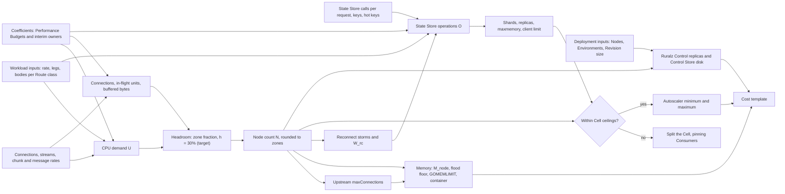

# Capacity Planning

## Summary

This document turns workload figures into Node counts, container sizes, State Store shards and Ruralz Control replicas. It fixes planning inputs, a capacity model whose coefficients cite [Performance budgets and benchmarking](../architecture/12-performance-budgets-and-benchmarking.md), three worked examples, failure headroom, autoscaling bounds, a cost template and measurable re-planning triggers. Nothing is implemented yet: every coefficient is a (target) or (hypothesis) until a published release record replaces it (P10). Operators sizing a Cell and architects checking a design against Cell ceilings should read it.

## Scope and non-goals

In scope: sizing Ruralz Gateway Nodes, each Cell's State Store, Ruralz Control replicas and the Control Store, for one Region; multi-region pre-provisioning, Planned (M4), applies the model per Region. "Pack 8.8" names a section of the [foundation pack](../_meta/foundation-pack.md). This document answers OQ-deployment-topologies-8, which it owns, with option (a): measured sizes replace interim values once F2, the memory runs and Data plane's cache layout publish.

Non-goals, with owners:

- Budget values and method: [Performance budgets and benchmarking](../architecture/12-performance-budgets-and-benchmarking.md), which wins on conflict.
- Ceilings, accuracy bounds and autoscaling signals: [Scalability and distributed state](../architecture/11-scalability-and-distributed-state.md).
- Topologies and starting sizes: [Deployment topologies](01-deployment-topologies.md), whose [Sizing defaults](01-deployment-topologies.md#sizing-defaults) this model replaces.
- Rollout pacing and Control Store internals: [Control plane and GitOps](../architecture/04-control-plane-and-gitops.md); upgrade order: [Release, versioning and compatibility](../engineering/04-release-versioning-and-compatibility.md).
- Failover runbooks: [High availability and disaster recovery](04-high-availability-and-disaster-recovery.md). Prices: operators, in the [Cost template](#cost-template).

## Planning inputs

Collect one row per Route class: Routes sharing protocol, Filter Chain (`ruralz bundle render --effective --route`) and body shape. Measure the busiest 5 minutes (target) in 30 days, or forecast. Access-log records carry `route` where [Observability](../architecture/10-observability.md#metrics-catalog) series carry only `listener` (OQ-capacity-planning-8).

| Input | Symbol | Source |
|---|---|---|
| Peak rate per Route class | λ_r | `ruralz_http_requests_total` by `route`, or a forecast |
| Closest benchmark scenario | c_base | S1, S2, S3 or S7 ([Scenarios](../architecture/12-performance-budgets-and-benchmarking.md#scenarios)) |
| Upstream legs; parallel steps | k_r; q_r | The Route's `composition` steps |
| Merged body; AI prompt size (KiB) | β_r; e_r | Access-log `response_bytes`, `request_bytes` by `route` |
| Plugin Phase calls per request | p_r | `Plugin.spec.phases` of attached `plugin` Policies |
| Mean duration, Upstream included; session lifetime | W_r; L | `ruralz_http_request_duration_seconds` (unary); access-log `duration` |
| Client connections; new TLS connections per second | C; λ_hs | `ruralz_listener_open_connections`; `ruralz_listener_connections_total` |
| Stream opens per second; streams; subscribed streams | λ_open; S; S_sub | `ruralz_http_requests_total` of streaming Routes; S = λ_open × L; S_sub on chains with `onChunk` |
| Chunks or messages per stream per second | r_chunk | `ruralz_ai_time_per_output_chunk_seconds` or message rate |
| State Store calls: blocking, post-commit, per open | s_r; w_r; s_open | [State Store sizing](#state-store-sizing); `ruralz_state_calls_total` by `op` checks them |
| Calls of the hottest key; hash slot | λ_key; λ_slot | min(offered, 2 × `requests`) per second of the busiest `config.key` ([hot keys](../architecture/11-scalability-and-distributed-state.md#distributed-rate-limits)) |
| Keys; cache entries and mean size | K_rl, K_q; E_c, b_c | Cardinality of `config.key`, Consumers and Quotas |
| Upstream attempts per second; duration; pooled connections | λ_u; W_u; C_up | Σ λ_r × legs; `ruralz_upstream_attempt_duration_seconds`; `ruralz_upstream_pool_connections` |
| Routes; snapshot size | R; s_snap | `ruralz bundle build`; K-17 |
| L4 connection cap per Node; client reconnect window | C_cap; W_rc | Balancer setting; client jitter, a (hypothesis) the client owner confirms |
| Zones; Regions | Z; R_g | Topology |
| Nodes planned, at maxReplicas, serving; largest Rollout batch | N; N_max; N_serving; n_batch | This model; autoscaler; `ruralz_control_cluster_nodes`; [Rollout plan](../architecture/04-control-plane-and-gitops.md#rollout-plan-batches-and-gates): N under `all-at-once`, half the non-canary Nodes under `canary` (target) |
| Nodes of one Ruralz Control deployment | N_all | Σ `ruralz_control_connected_nodes` over replicas and Clusters |
| Environments; Revision, diff and source sizes; Rollouts per day | E; s_rev, s_diff, s_src; f_ro | Ruralz Control; s_diff ≈ 0.1 × s_rev, s_src ≈ s_rev (hypothesis), OQ-capacity-planning-3 |
| Audit per day and days kept; Raft log; backups kept | d_audit; L_raft; n_bk | 10 MiB for 365 days, 1 GiB, 14 until measured (hypothesis) |
| Growth and outage headroom | h | 30% (target), [Ruralz Control availability](../architecture/11-scalability-and-distributed-state.md#ruralz-control-availability) |

## Capacity model

The model sizes each Cell independently, since every Node of a Cluster uses only its own Cell's State Store ([Cells and blast radius](../architecture/11-scalability-and-distributed-state.md#cells-and-blast-radius)) and no request crosses a Region to reach one (pack 8.13). Node count follows whichever binds first: CPU, connections, in-flight units or buffered bytes; memory follows the flood case.

*Figure 1: the capacity model from workload inputs to Node, State Store and Ruralz Control sizing.*



### Coefficients

Every coefficient cites [Performance budgets and benchmarking](../architecture/12-performance-budgets-and-benchmarking.md) (PB) or, where PB has no value yet, its owner and the Open question that adds it to PB. PB takes values from the latest release record once published ([Production comparison](../architecture/12-performance-budgets-and-benchmarking.md#production-comparison)). CPU values are per 4-vCPU RH-1 core set; other hardware needs its own ladder run.

| ID | Coefficient | Value | PB row | Interim owner |
|---|---|---|---|---|
| K-1 | c_base, CPU per request: S1, S2, S3, S7; Δ_redis, per blocking `redis` call | 80, 125, 142, 133 µs; 20 µs (target) | [Resources per core](../architecture/12-performance-budgets-and-benchmarking.md#resources-per-core), [Throughput targets](../architecture/12-performance-budgets-and-benchmarking.md#throughput-targets) | PB |
| K-2 | c_leg, per extra upstream leg; c_merge, per KiB merged | 14 µs; 30 µs (hypothesis) | [Per-stage budget](../architecture/12-performance-budgets-and-benchmarking.md#per-stage-latency-budget) | PB; OQ-capacity-planning-4 |
| K-3 | c_plg, per Plugin Phase call; c_chunk, per chunk or message | 30 µs; 12 µs (target) | Throughput targets, S4, S6 | PB |
| K-4 | c_est, per KiB of prompt estimated; c_hs, per TLS 1.3 handshake | 25 µs; 500 µs (hypothesis) | Per-stage budget; Resources per core | PB |
| K-5 | M_fix: loaded RSS, `maxBufferedBytes`, state tables; m_route per Route (PB-6) | 256 + 512 + 475 = 1,243 MiB; 2 KB (target) | [Memory budget](../architecture/12-performance-budgets-and-benchmarking.md#memory-budget) | PB |
| K-6 | m_tls, TLS connection or WebSocket session; m_clear, cleartext or upstream connection | 96 KiB; 24 KiB (target) | Memory budget | PB |
| K-7 | m_unit: request or step; stream pump | 64 KiB plus headers (hypothesis); 32 KiB (target) | Memory budget | [Data plane](../architecture/03-data-plane.md#streaming) |
| K-8 | Flood: m_c per connection; m_u per unit at a 256 KiB header block | 592 KiB; 320 KiB (hypothesis) | [Constants](../architecture/12-performance-budgets-and-benchmarking.md#constants-the-suite-verifies) | [Data plane](../architecture/03-data-plane.md#bounded-resources) |
| K-9 | C_max; I_max; n_str per HTTP/2 connection; M_rej, 2,000 pre-routing writes of 256 KiB | 20,000; 20,000; 250; 500 MiB (target) | Constants | Data plane |
| K-10 | m_share, 32 KiB per subscribed stream from a 128 MiB share | About 4,000 streams (hypothesis) | Pending (OQ-capacity-planning-4) | Data plane |
| K-11 | u_s, units per SSE response; per WebSocket session | 1; 3 (hypothesis) | Pending (OQ-capacity-planning-1) | Data plane |
| K-12 | q_shard, GCRA calls per shard at 70% script CPU | About 100,000 per second (hypothesis) | Throughput targets, G1 | [Cell sizing](../architecture/11-scalability-and-distributed-state.md#cell-sizing) |
| K-13 | State Store connections per shard per Node | 2 plus 8 (target) | Constants | Scalability |
| K-14 | m_key, bytes per limit or Quota key; calls per Node when the mix is unknown | 128 B; 5,000 per second (hypothesis) | Pending; G1 counts calls, not bytes (OQ-capacity-planning-2) | This document; [Sizing defaults](01-deployment-topologies.md#sizing-defaults) |
| K-15 | Control Streams; Snapshots per second, per replica | 5,000; 20 (hypothesis) | [Control-plane timing](../architecture/12-performance-budgets-and-benchmarking.md#control-plane-scale-timing), F2 | [Control plane](../architecture/04-control-plane-and-gitops.md#heartbeat-and-backpressure) |
| K-16 | Heartbeat interval; largest batch at 10,000 Nodes | 15 s; 5 minutes (target) | Control-plane timing | Control plane |
| K-17 | K retired snapshots; grace; snapshot heap per Route | 2; 30 s; 0.5 KB (target) | Constants; [Reload](../architecture/12-performance-budgets-and-benchmarking.md#startup-and-reload-time-by-configuration-size) | Data plane |
| K-18 | s_rev per resource; replica container; Enrollments per second per leader | About 1.5 KiB; 2 vCPU, 4 GiB; about 20 (hypothesis) | Pending (OQ-capacity-planning-3) | This document; Sizing defaults; [T9](01-deployment-topologies.md#t9-multi-region-with-cells) |
| K-19 | n_keep, Revisions kept per Environment | 50 (hypothesis) | None | OQ-capacity-planning-9 |
| K-20 | e, prompt estimate error (SM-10) | 2% (hypothesis) | None | [Vision](../vision/01-vision-and-positioning.md#success-metrics); OQ-vision-and-positioning-15 |
| K-21 | P_plg, `limits.maxPluginMemoryBytes` default | 2 GiB (target) | Memory budget | WASM plugin system |
| K-22 | `GOMEMLIMIT` share of container; `maxmemory` use; shard GCRA share | 0.9; 0.7; 0.5 (target) | None | [Scale unit](../architecture/11-scalability-and-distributed-state.md#scale-unit); Cell sizing |

### Formulas

```text
CPU per Node class (vCPU): V vCPU per Node, Z zones, h headroom
  c_r    = c_base + Δ_redis × s_r + (k_r − 1) × c_leg + β_r × c_merge + p_r × c_plg + e_r × c_est
  U      = Σ_r λ_r × c_r  +  S × r_chunk × c_chunk  +  λ_hs × c_hs
  u_z    = 0.8 × (Z − 1) / Z            CPU fraction per Node; 0.53 at Z = 3            (target)
  N_cpu  = ceil((1 + h) × U / (V × u_z))

Ceilings: C_max, I_max (K-9), maxBufferedBytes, stream share (K-10)
  f_z    = min(0.5, u_z)                ceiling fraction; 0.4 at Z = 2, 0.5 at Z ≥ 3    (target)
  I      = Σ_r λ_r × W_r × (1 + q_r)  +  S × u_s
  B      = Σ_r λ_r × W_r × b_r  +  S_sub × m_share          b_r: buffered bytes per request
  N_conn = ceil((1 + h) × C / (f_z × C_max))
  N_unit = ceil((1 + h) × I / (f_z × I_max))
  N_buf  = ceil((1 + h) × B / (f_z × maxBufferedBytes)), and S_sub within f_z of K-10
  N      = round up to a multiple of Z ( max(3, N_cpu, N_conn, N_unit, N_buf) )            (target)
  N_s    = N × (Z − 1) / Z              survivors of a zone loss

Upstreams: per Upstream u and survivor Node
  λ_u,node = (1 + h) × λ_u / N_s        attempts per second
  A_u      = (1 + h) × λ_u × W_u / N_s  attempts in flight; a stream or WebSocket leg holds one for life
  maxConnections_u ≥ max(λ_u,node, A_u) (target), with at least three Endpoints,
           since one Endpoint holds at most 50% of maxConnections                       (target)

Memory per Node
  m_conn = m_tls on `https` listeners, m_clear on `http`; m_up = m_tls or m_clear by Upstream TLS
  M_node  = M_fix + m_route × R + P_plg + (1 + h) × (C × m_conn + I × m_unit + C_up × m_up) / N_s
  M_flood = M_fix + m_route × R + P_plg + (K + 2) × s_snap + M_rej + C_cap × m_c
            + min(I_max, C_cap × n_str) × m_u + min(I_max, Σ_u maxConnections_u) × m_up  (hypothesis)
  C_cap   ≥ planned connections per survivor / 0.8                                      (target)
  GOMEMLIMIT ≥ max(M_node, M_flood);  container = GOMEMLIMIT / 0.9                       (target)

State Store per Cell
  O       = Σ_r λ_r × (s_r + w_r)  +  λ_open × s_open
  n_shard = max(ceil((1 + h) × O / (0.5 × q_shard)), ceil(N_max × λ_node × s / (0.5 × q_shard)))  (hypothesis)
            λ_node: one Node's rate at u_z; at most 16 shards (target), else split the Cell
  λ_key × (1 + h) ≤ 0.25 × q_shard;  λ_slot × (1 + h) ≤ 0.5 × q_shard                    (hypothesis)
  maxmemory per shard ≥ ((K_rl + K_q) × m_key + E_c × (b_c + m_key)) / n_shard / 0.7     (target)
  maxclients ≥ 10 × N_max               2 plus 8 connections per shard per Node (K-13)   (target)

Reconnect storms: c_up and s_up are the CPU and State Store calls of one upgrade or open
  S_pinned = sessions older than the activation two back: S × e^(−2 × T_act / L)       (hypothesis)
             for activations T_act apart and exponential lifetimes, nearing S as they bunch;
             plan S unless activations stay 1.5 × L apart                              (hypothesis)
  λ_storm  = S_pinned × n_batch / N / W_rc       snapshot retirement
           = (S / Z) / W_rc                      zone loss or a zone's Drain
  λ_storm × (c_hs + c_up) ≤ 10% of survivor CPU, and survivor CPU plus storm ≤ 80%      (target)
  (1 + h) × λ_storm × s_up ≤ 0.5 × q_shard × n_shard                                     (hypothesis)
  W_rc,min = S_pinned × n_batch / N × max((c_hs + c_up) / (0.1 × V × N),                (target)
             (1 + h) × s_up / (0.5 × q_shard × n_shard))                                 (hypothesis)

Ruralz Control deployment
  r_min    = smallest r with r − ceil(r / Z) ≥ N_all / (0.8 × 5,000 streams (K-15))     (hypothesis)
  replicas = voters = 3 when r_min ≤ 3, else 5 (target): 3 up to 8,000 Nodes,
             5 up to the 10,000-Node deployment ceiling at Z = 3                        (hypothesis)
  heartbeats per second = N_all / K-16 interval
  T_batch  ≈ n_batch / (replicas × K-15 Snapshots per second), when a Delta does not fit
  D_store  = E × n_keep × (s_rev + s_diff + s_src) + d_audit × days kept + L_raft
             + two Raft snapshots
  growth   = f_ro × (s_rev + s_diff + s_src) per day while no retention exists (OQ-capacity-planning-9)
  volume   ≥ D_store / 0.7                                                              (target)
```

P_plg is K-21 when a Route attaches a `plugin` Policy, else 0. M_fix reserves the full `maxBufferedBytes` and state tables, so M_node is conservative. Every `https` listener negotiates HTTP/2 by ALPN and every `http` listener accepts h2c ([Listeners and protocols](../architecture/03-data-plane.md#listeners-and-protocols)), so 80 connections can hold all 20,000 units (target): an L4 connection cap alone does not bound memory, and M_flood charges I_max × m_u, 6,250 MiB (hypothesis), on every Node until OQ-capacity-planning-5 closes. `ruralz_http_active_requests` counts requests, sessions included, not parallel steps or pumps, so it undercounts units by (1 + q_r) on composition Routes and by u_s on streams.

## Worked examples

Every figure below is a planning (target) for a three-zone Cell (Z = 3, u_z = 0.53, f_z = 0.5) with h = 30% (target). Lines marked [H] rest on a (hypothesis) coefficient and are re-derived when the benchmark publishes.

### Example 1: REST aggregation at 20k rps (target)

A partner API aggregates three Upstreams over HTTP/2 and TLS at 20,000 rps (target), with `auth.jwt` and a `redis` `ratelimit`. Planned (M1).

| Input | Value |
|---|---|
| Route shape | `composition.mode: aggregate`, k = 3, q = 3 parallel steps (target) |
| Bodies | 1 KiB per step, 3 KiB merged; b = 18 KiB buffered (target) [H] |
| Mean duration W | 40 ms, the slowest leg (target) |
| Connections; new TLS per second | 12,000 HTTP/2; 200 (target) |
| Upstreams | Three, cleartext HTTP/1.1, Endpoints in every zone (target) |
| State Store | s = 1 GCRA, w = 0; 50,000 keys; hottest key 5% of traffic (target) |
| Routes; Plugins | R = 500; none (target) |

```text
c_r      = 142 + 20 + 2 × 14 + 3 × 30 = 280 µs                                       (target) [H]
U        = 20,000 × 280 µs + 200 × 500 µs = 5.7 vCPU                                 (target) [H]
N_cpu    = ceil(1.3 × 5.7 / (4 × 0.53)) = 4; N_conn = ceil(1.3 × 12,000 / 10,000) = 2  (target)
I        = 20,000 × 0.04 × 4 = 3,200, N_unit = 1; B = 14 MiB, N_buf = 1              (target)
N        = max(3, 4, 2, 1, 1) = 4, rounded to 6 Nodes of 4 vCPU; N_s = 4             (target)
Upstream λ_u,node = 1.3 × 20,000 / 4 = 6,500 per second; A_u = 6,500 × 0.04 = 260     (target)
C_up     = 60,000 legs per second × 0.04 s = 2,400 pooled connections in use       (target)
M_node   = 1,243 + 1 + (1.3 × 12,000 × 96 KiB + 1.3 × 3,200 × 64 KiB                (target)
           + 1.3 × 2,400 × 24 KiB) / 4 = 1,693 MiB                                    (target)
C_cap    = 3,900 connections per survivor / 0.8 = 4,875                              (target)
M_flood  = 1,243 + 1 + 1 + 500 + 4,875 × 592 KiB + 20,000 × 320 KiB + 20,000 × 24 KiB  (target) [H]
         = 1,245 + 500 + 2,818 + 6,250 + 469 = 11,282 MiB                             (target) [H]
container = 11,282 / 0.9 = 12,536 MiB, so 13 GiB with GOMEMLIMIT 11,981 MiB           (target) [H]
O        = 20,000 GCRA per second, 26,000 with h: 1 shard; N_max = 12 at 7,619 rps  (target) [H]
           per Node needs ceil(12 × 7,619 / 50,000) = 2 shards                        (target) [H]
hottest key = 1.3 × 1,000 = 1,300 calls per second, under 25,000                      (target) [H]
```

| Result | Value |
|---|---|
| Nodes; container | 6 Nodes of 4 vCPU; 13 GiB, `GOMEMLIMIT` 11,981 MiB, L4 cap 4,875 (target) [H] |
| `circuitBreaker.maxConnections` per Upstream | 8,192, above 6,500 attempts per second (target) |
| State Store; Ruralz Control | 2 shards with replicas; 3 replicas (target) [H] |

| Headroom check | Survivors | Utilization |
|---|---|---|
| Zone loss at peak | 4 Nodes, 16 vCPU (target) | CPU 36%; 62% of C_cap (target) |
| Zone loss at peak plus 30% | 4 Nodes (target) | CPU 46%; 80% of C_cap (target) |
| Composite zone loss | 4,000 reconnects in 30 s, State Store failover, a replica lost (target) | CPU 47%; 15 s of fail-open Rate Limits (target) [H] |
| Ruralz Control outage at peak plus 30% | 6 Nodes, no scale-out (target) | CPU 31% (target) |

Merging dominates CPU, 90 of 280 µs (target) [H]; the flood floor sets memory. At 10x load (target), a key with 15% of traffic would send 39,000 calls per second (target) and need the Hot key rule.

### Example 2: AI with 500 concurrent streams (target)

An assistant streams completions over SSE and TLS from one `ai` Upstream, 500 streams (target), with `auth.jwt` and an `ai.token-budget` Policy, which subscribes `onChunk`. Its `AIModel` has one candidate, not `gemini` or `ollama`, so attempts = 1. Planned (M3).

| Input | Value |
|---|---|
| Streams S = S_sub; new streams λ | 500; 25 per second over 20 s each (target) |
| Chunk rate | 100 per second, the S6 rate (target) |
| Prompt; output cap C | 16 KiB, about 2,000 tokens; `max_tokens` 4,096 (target) |
| Memory per stream | 96 KiB client + 96 KiB provider TLS + 32 KiB share + 80 KiB prompt = 304 KiB (target) [H] |
| State Store | s = 1 reservation, w = 1 settlement; 2,000 Consumers with monthly token Quotas, none above 1% of streams (target) |

```text
c_admit  = 142 + 20 + 16 × 25 = 562 µs                                               (target) [H]
U        = 500 × 100 × 12 µs + 25 × 562 µs + 25 × 500 µs = 0.63 vCPU                 (target) [H]
N_cpu    = ceil(1.3 × 0.63 / 2.13) = 1; share ceil(1.3 × 500 / (0.5 × 4,000)) = 1     (target) [H]
N        = 3 Nodes of 4 vCPU, the high-availability minimum; N_s = 2                  (target)
Upstream A_u = 1.3 × 500 / 2 = 325 legs held; λ_u,node = 16 per second               (target)
M_node   = 1,243 + 1.3 × 500 × 304 KiB / 2 = 1,340 MiB                               (target) [H]
C_cap    = 325 / 0.8, rounded up to 500 connections                                   (target)
M_flood  = 1,243 + 500 + 500 × 592 KiB + 20,000 × 320 KiB + 1,024 × 96 KiB             (target) [H]
         = 1,243 + 500 + 289 + 6,250 + 96 = 8,378 MiB                                 (target) [H]
container = 8,378 / 0.9 = 9,309 MiB, so 10 GiB with GOMEMLIMIT 9,216 MiB              (target) [H]
reserved  = 500 × (2,000 + 4,096) = 3,048,000 tokens in flight                        (target)
overshoot = 500 × 2,000 × e + (attempts − 1) × 3,048,000 + hidden reasoning above C  (target) [H]
          = 20,000 at e = 2%, 300,000 at e = 30%; attempts = 2 adds 3,048,000         (target) [H]
```

| Result | Value |
|---|---|
| Nodes; container | 3 Nodes of 4 vCPU; 10 GiB, L4 cap 500 (target) [H] |
| `circuitBreaker.maxConnections`; State Store | 1,024 default; 1 shard, a replica, persistence for the monthly window (target) |
| Overshoot bound | 20,000 tokens at 2% error, 300,000 at 30% (target), a (hypothesis) [bound](../architecture/11-scalability-and-distributed-state.md#consistency-and-accuracy-bounds) of [AI/LLM gateway](../architecture/06-ai-llm-gateway.md#settlement) |

| Headroom check | Survivors | Utilization |
|---|---|---|
| Zone loss at peak plus 30% | 2 Nodes, 325 streams each (target) | CPU 10%; share 8%; 65% of C_cap (target) [H] |
| Composite zone loss | Plus a State Store failover (target) | About 15 s of `RZ-STS` 503s, 375 refused admissions (target) [H] |

The Token Budget binds, not CPU: each Consumer's Quota MUST cover its concurrent reservations, 6,096 tokens per stream (target). As the `ai.token-budget` default is `closed` ([ADR-0014](../adr/0014-ai-api-surface.md)), this State Store needs automatic failover and MUST NOT hold `cache` or `ai.semantic-cache` entries ([Distributed caches](../architecture/11-scalability-and-distributed-state.md#distributed-caches)). Spend alerts SHOULD use the 30% row until OQ-vision-and-positioning-15 closes.

### Example 3: 200k WebSocket connections (target)

A notification service holds 200,000 (target) WebSocket sessions over TLS, with `auth.jwt` and a `ratelimit` on the upgrade and no `onChunk` Policy, so no stream share. Planned (M3).

| Input | Value |
|---|---|
| Sessions C = S; u_s | 200,000; 3, the upgrade request and two pumps (target) [H] |
| Rate-limit key | Per client; the hottest under 1% of upgrades (target) |
| Messages | 0.1 per second each way per session: 40,000 per second (target) |
| Lifetime L; Route `timeout` | 1 hour, 56 opens per second; `timeout: 4h` (target) |
| Upstream | `protocol: websocket`, cleartext, a connection per session, three Endpoints (target) |
| Reconnect window W_rc | 30 s of client jitter (target) [H] |

```text
per Node at f_z = min(0.5 × 20,000, 0.5 × 20,000 / 3) = 3,333 sessions                (target) [H]
N_unit   = ceil(1.3 × 600,000 / 10,000) = 78; N_conn = 26: 78 Nodes of 2 vCPU, N_s = 52  (target) [H]
U        = 40,000 × 12 µs + 56 × (142 + 20 + 500) µs = 0.52 vCPU                     (target) [H]
survivor = 1.3 × 200,000 / 52 = 5,000 sessions, 15,000 units                        (target) [H]
M_node   = 1,243 + 5,000 × (96 + 24 + 68 + 2 × 32) KiB = 2,474 MiB, counting        (target) [H]
           the upgrade unit and two 32 KiB pumps per session                         (target) [H]
C_cap    = 5,000 / 0.8 = 6,250; maxConnections 6,250 for 5,000 legs held             (target)
M_flood  = 1,243 + 500 + 6,250 × 592 KiB + 20,000 × 320 KiB + 6,250 × 24 KiB           (target) [H]
         = 1,243 + 500 + 3,613 + 6,250 + 146 = 11,752 MiB                             (target) [H]
container = 11,752 / 0.9 = 13,058 MiB, so 13 GiB with GOMEMLIMIT 11,981 MiB           (target) [H]
retirement storm, all-at-once, S_pinned = 200,000: λ_storm = 200,000 / 30 s = 6,667 per second  (target) [H]
           CPU 6,667 × 662 µs = 4.4 vCPU, 2.8% of 156; GCRA 8,667 with h, 17% of 50,000  (target) [H]
W_rc,min = 200,000 × max(662 µs / 15.6 vCPU, 1.3 / 50,000) = max(8.5 s, 5.2 s) = 8.5 s  (target) [H]
           4.2 s under `strategy: canary`, whose largest batch holds half the Nodes     (target) [H]
zone-loss storm = 66,667 / 30 s = 2,222 per second, 1.5 vCPU of 104                   (target) [H]
timeout expiry after a mass reconnect: e^(−4) × 200,000 = 3,663 in 30 s, 122 per second  (target) [H]
           with the 1 h default, 73,576 in 30 s, 2,453 per second every hour            (target) [H]
```

| Result | Value |
|---|---|
| Nodes; container | 78 Nodes of 2 vCPU; 13 GiB, L4 cap 6,250 (target) [H] |
| `circuitBreaker.maxConnections` | 6,250 on a dedicated Upstream, kept after losing one of three Endpoints (target) ([Circuit breakers](../architecture/09-traffic-management-and-resilience.md#circuit-breakers)) |
| State Store | 56 GCRA calls per second, 6,667 in a storm: 1 shard with a replica (target) [H] |
| Sensitivity | 54 Nodes if Data plane confirms u_s = 2 (target) |

| Headroom check | Survivors | Utilization |
|---|---|---|
| Zone loss at peak | 52 Nodes, 3,846 sessions each (target) [H] | Units 58%; 62% of C_cap (target) |
| Zone loss at peak plus 30% | 52 Nodes, 5,000 sessions each (target) [H] | Units 75%; 80% of C_cap (target) |
| Composite zone loss | 2,222 handshakes per second, State Store failover, a replica lost (target) [H] | CPU 2.1%; upgrades fail open 15 s (target) [H] |
| Snapshot retirement, all-at-once | 200,000 sessions in W_rc = 30 s (target) [H] | CPU 2.8%; GCRA 17% of a shard's share (target) [H] |

When a third snapshot would be retired, streams pinned to the oldest end at once with 1001 ([Data plane](../architecture/03-data-plane.md#why-no-in-flight-request-is-dropped)); the 30 s grace (target) does not spread them, only client jitter (OQ-capacity-planning-7). Clients faster than W_rc,min need `strategy: canary`, shards or CPU. Activations 90 minutes apart, 1.5 × L (target), keep each retirement near 5% of sessions (hypothesis); the 4 h `timeout` stops hourly resynchronized expiry.

## Headroom and failure capacity

Capacity is planned for peak plus h on the survivors of the largest single failure. Failures compose only where the table says so; every example checks the composite zone loss.

| Failure or event | Capacity rule | Formula or value | Owner of the bound |
|---|---|---|---|
| Node loss | At least three Nodes; clients retry | N ≥ 3 (target) | [Ruralz Gateway availability](../architecture/11-scalability-and-distributed-state.md#ruralz-gateway-availability) |
| Zone loss | Survivors under 80% CPU, 80% of each ceiling and 80% of C_cap | u_z; f_z; C_cap (target) | [Autoscaling signals](../architecture/11-scalability-and-distributed-state.md#autoscaling-signals) |
| Composite zone loss | Plus a State Store primary and a Ruralz Control replica | Survivor CPU plus storm ≤ 80% (target); `failureMode` for about 15 s; N_all / (replicas − ceil(replicas / Z)) streams per replica (hypothesis) | This document |
| Header or stream flood | Memory holds every ceiling at once | `GOMEMLIMIT` ≥ M_flood (hypothesis) | [Data plane](../architecture/03-data-plane.md#bounded-resources) |
| Ruralz Control outage or quorum loss | No Enrollment, so autoscaling adds nothing | h = 30% (target) | [Ruralz Control availability](../architecture/11-scalability-and-distributed-state.md#ruralz-control-availability) |
| Home Region loss, Planned (M4) | Active-active Cells across Regions, one per Region | Pre-provision R_g / (R_g − 1) × each Region's peak share (target) | [Topologies](../architecture/11-scalability-and-distributed-state.md#topologies) |
| State Store primary failover | A replica per shard across zones | Rate Limits fail open within N_serving × ceiling for about 15 s (hypothesis), pack 8.8 | [State Store availability](../architecture/11-scalability-and-distributed-state.md#state-store-availability) |
| Hot key | Above 25% of a shard: a declared per-Node ceiling, a split `config.key` or its own Cell; `localOnly` mode is proposed (OQ-traffic-management-and-resilience-1 (c), OQ-scalability-and-distributed-state-11) | λ_key × (1 + h) ≤ about 25,000; λ_slot × (1 + h) ≤ 50,000 per second (hypothesis) | [Distributed rate limits](../architecture/11-scalability-and-distributed-state.md#distributed-rate-limits) |
| Reconnect storm (zone loss, Drain, snapshot retirement) | Handshakes and upgrade GCRA calls fit | λ_storm × (c_hs + c_up) ≤ 10% of survivor CPU (target); W_rc ≥ W_rc,min (hypothesis) | This document |
| Hot Reload under load | Configuration memory and reload time | (K + 2) × snapshot; 1 s at 5,000 Routes (target) | [Startup and reload time](../architecture/12-performance-budgets-and-benchmarking.md#startup-and-reload-time-by-configuration-size) |
| Zero-Downtime Upgrade on a VM | Both `ruralzd` processes hold their `GOMEMLIMIT` during Drain ([ADR-0015](../adr/0015-zero-downtime-upgrades-so-reuseport.md)) | Host memory ≥ 2 × container (hypothesis): 26 GiB for Example 1 (target) | [Zero-downtime upgrades](02-zero-downtime-upgrades-and-hot-reload.md) |
| Ruralz Control replica or zone loss | Survivors at 80% of shedding onset | r_min (hypothesis) | [Scaling Ruralz Control](../architecture/11-scalability-and-distributed-state.md#scaling-ruralz-control-and-the-state-store) |

Operators MAY instead split 90% of VM memory between both processes' `GOMEMLIMIT` (target), halving each C_cap. At 80% of saturation, S2 allows a 2 ms gateway-added p99 (target, PB-16), so a zone loss burns SLO-GW-2 until OQ-performance-budgets-and-benchmarking-13 decides; a Cluster that must hold 1 ms (target) plans with u_z = 0.6 × (Z − 1) / Z (target).

## Autoscaling policies

Autoscaling reacts inside the planned capacity, never replacing the plan. The HorizontalPodAutoscaler is Planned (M2) ([T4](01-deployment-topologies.md#t4-kubernetes-with-helm-hpa-and-crds)); VM groups follow the same rules. Thresholds use f_z and scale request gauges by units per request.

| Workload class | Binding resource | Signal at scale-out threshold | minReplicas | maxReplicas |
|---|---|---|---|---|
| Request-bound, Example 1 | CPU | Container CPU at u_z; `ruralz_http_active_requests` at f_z × 20,000 / (1 + q_r) = 2,500 (target) | N | 12, the shard bound (target) |
| Stream-bound, Example 2 | Stream share | `ruralz_node_buffered_bytes` at f_z × 128 MiB = 64 MiB (target) | max(3, N) | 6 (target) |
| Connection-bound, Example 3 | In-flight units | `ruralz_listener_open_connections` or `ruralz_http_active_requests` at f_z × 20,000 / u_s = 3,333 (target) | N, held static | N plus one zone's share, 104 (target) |

Rules:

1. Scale out on the first signal over its threshold; scale in only when all are under half of it ([Autoscaling signals](../architecture/11-scalability-and-distributed-state.md#autoscaling-signals)). Scale-in never goes below the planned N.
2. maxReplicas MUST NOT exceed floor(n_shard × 0.5 × q_shard / (λ_node × s)) (hypothesis) or 1,000 per Cell (target), since autoscaling misses State Store saturation: 13 for Example 1, rounded to 12 (target) [H].
3. Steps move at most one zone's share per stabilization period (target); balancers slow-start new Nodes over 30 to 60 s (target), as their tables and pools start cold ([Warm-up](../architecture/11-scalability-and-distributed-state.md#warm-up)).
4. In Control mode the published Node count rises at most 10% per minute after a 10-minute qualification (target) ([Replica roles](../architecture/04-control-plane-and-gitops.md#replica-roles), [Warm-up](../architecture/11-scalability-and-distributed-state.md#warm-up)), so autoscaled Clusters SHOULD declare per-Node ceilings (pack 8.8, [ADR-0008](../adr/0008-rate-limiting-local-bucket-and-gcra.md); field: OQ-traffic-management-and-resilience-1).
5. Enrollment MUST keep up with the largest scale-out step per egress address (K-18).
6. Long-lived connections pin to their Node, so connection-bound Clusters autoscale only for growth.
7. Ruralz Control replicas and State Store shards are never autoscaled: adding a shard moves keys and a voter changes quorum ([ADR-0006](../adr/0006-control-store-raft-boltdb.md)).

## State Store sizing

The State Store is a Cell's only shared request-path dependency, and more Nodes add load to it, so shards are sized from operations. Rate Limits pair a local token bucket with GCRA in one Lua `EVAL` ([ADR-0008](../adr/0008-rate-limiting-local-bucket-and-gcra.md)), so local denials and over-limit cache hits cost no call.

| Policy type | Blocking calls before commit (s) | Post-commit writes (w) | Keys held |
|---|---|---|---|
| `ratelimit` | 1 GCRA per locally admitted request | None | One per key and `limits[]` entry |
| `quota` | 1 reservation script | At most 1 refund | One per Consumer Quota and window |
| `ai.token-budget` | 1 reservation | 1 settlement | One per `consumerQuota` and window |
| `cache` (Response Cache) | 1 lookup, pipelined when independent | 1 store per cacheable miss | One per entry |
| `ai.semantic-cache` | 1 vector search, plus the declared embedding call | 1 store | One per vector |
| `plugin` with State Store Host Functions, Planned (M2) | 1 per Policy | 1 `onLog` write | Plugin-defined |

Consumptive calls whose keys share a hash tag run as one script (pack 8.7), so s can be lower than the Policy count. Where the mix is unknown, plan K-14.

| Example | O at peak | O with h | Shards and replicas | maxclients | maxmemory per shard |
|---|---|---|---|---|---|
| 1, REST aggregation | 20,000 per second (target) | 26,000 (target) | 2 primaries, 2 replicas (target) | Above 10 × 12 = 120 (target) | 1 GiB; keys need 9 MiB (target) [H] |
| 2, AI streams | 50 per second (target) | 65 (target) | 1 primary, 1 replica, persistence (target) | Above 10 × 6 = 60 (target) | 1 GiB; keys need 0.4 MiB (target) [H] |
| 3, WebSockets | 56; 6,667 in a storm at W_rc = 30 s (target) [H] | 73; 8,667 (target) [H] | 1 primary, 1 replica (target) | Above 10 × 104 = 1,040 (target) | 1 GiB (target) |

Sizing rules:

- GCRA runs at up to 50% of q_shard (hypothesis), leaving margin under 70% script CPU for a Node count lagging 40% (hypothesis). So 16 shards (target) carry 800,000 calls per second, 615,000 at peak with h (hypothesis), not the 1,000,000 (62.5% of 16 shards) of [Cell sizing](../architecture/11-scalability-and-distributed-state.md#cell-sizing).
- A hot key cannot be split and hash tags gather a Consumer's keys, so λ_key and λ_slot are checked apart from n_shard ([Hot key](#headroom-and-failure-capacity)).
- Memory stays under 70% of `maxmemory` (target) with `noeviction` wherever limit, Quota or Token Budget keys live. `maxclients` MUST exceed 10 × N_serving above 900 Nodes and SHOULD exceed 10 × N_max (target).
- Two of three zones reach a zonal primary across zones at a 2 ms p99 (hypothesis), PB-14; `stateStoreTimeout` stays at 5 to 10 ms (target).
- Persistence SHOULD be on where Quota or Token Budget windows exceed one day (OQ-scalability-and-distributed-state-13); cache entries never share a deployment with Token Budget keys until OQ-scalability-and-distributed-state-3 adds a second connection.
- A layout change adds no calls (pack 8.7). Only Quota counters that take the switch-boundary path may admit up to twice the Consumer quota for one window per Node that has not received the signal (hypothesis); GCRA and Token Budget counters add no admission ([State Store layout changes](../engineering/04-release-versioning-and-compatibility.md#state-store-layout-changes)).
- Limits are exact only inside one Cell ([bounds](../architecture/11-scalability-and-distributed-state.md#consistency-and-accuracy-bounds)), so a Consumer reaching C_cells Cells gets up to C_cells × each limit (target). A split therefore pins each Consumer to one Cell by hostname or tenant, or divides limits with one Environment per Cell ([Divided](../architecture/11-scalability-and-distributed-state.md#regional-versus-global-quotas)).

## Ruralz Control sizing

Ruralz Control, Planned (M2), is never on the request path, so its size follows Node count, Revision size and change rate ([Formulas](#formulas)). Relay-served Nodes, Planned (M4), dial their relay yet count toward N_all as in Sizing defaults, safely overstating replica streams.

| Item, for 3 Environments, 1,200 Nodes and 5,000 Routes (target) | Value |
|---|---|
| Voters and replicas, one voter per zone | 3; 400 streams each, 600 after a zone or replica loss (target) |
| Heartbeats | 80 per second (target) |
| Encoded Revision s_rev | 5,751 resources × 1.5 KiB ≈ 8.4 MiB (target) [H] |
| Full resync after every replica restarts | 20 s; 504 MiB per second of egress across replicas (target) [H] |
| Control Store content | 150 Revisions × 17.6 MiB ≈ 2.6 GiB (target) [H] |
| Audit, Raft log, two Raft snapshots | 3.6 + 1 + 0.2 GiB (target) [H] |
| Volume per replica | D_store 7.4 GiB / 0.7, so 20 GiB (target) [H] |
| Growth without retention, 20 Rollouts per day | 352 MiB per day: 70% of the volume in 19 days (target) [H] |
| Replica container | 2 vCPU, 4 GiB until F2 (target) [H] |
| Enrollment of a 90-Node step | 4.5 s (target) [H] |
| `${RURALZ_DATA_DIR}` per Node | 2 × (s_rev + s_src) = 34 MiB, within 1 GiB (target) [H] |

Every replica is a voter, since `ruralz control join` adds a voter ([Control plane](../architecture/04-control-plane-and-gitops.md#certificates-and-replica-join)); a deployment serves at most 10,000 Nodes (target). Across three zones, three voters keep zone-loss survivors at or below 4,000 streams, 80% of the shedding onset, up to 8,000 Nodes (hypothesis); above that, five voters (target) keep 3,333 at 10,000 Nodes and keep quorum when the zone holding two fails. This is stricter than Scalability's ceil(N / 5,000) + 1, which leaves survivors at the onset. `ruralz control backup` copies the Control Store ([ADR-0006](../adr/0006-control-store-raft-boltdb.md), proposed), about D_store each; [High availability and disaster recovery](04-high-availability-and-disaster-recovery.md) owns restores.

## Cost template

Monthly cost is Σ quantity × unit price × hours, with operator-supplied prices.

| Line item | Quantity formula | Example 1 | Example 2 | Example 3 |
|---|---|---|---|---|
| Node vCPU | N × V | 24 (target) | 12 (target) | 156 (target) |
| Node memory | N × container | 78 GiB (target) [H] | 30 GiB (target) [H] | 1,014 GiB (target) [H] |
| `${RURALZ_DATA_DIR}` volumes | N × 1 GiB (hypothesis) | 6 GiB (target) | 3 GiB (target) | 78 GiB (target) |
| State Store servers | shards × 2, each `maxmemory` plus overhead | 4 of 1 GiB (target) | 2 of 1 GiB (target) | 2 of 1 GiB (target) |
| Ruralz Control replicas | replicas × (K-18 container, 20 GiB volume) | 3 (target) | 3 (target) | 3 (target) |
| L4 load balancer | Connections; new per second | 12,000; 200 (target) | 500; 25 (target) | 200,000; 56, 6,667 in a storm (target) [H] |
| Cross-zone traffic | Two thirds of State Store calls and of Upstream legs or messages, without locality | 13,333 calls, 40,000 legs per second (target) | 33 calls per second (target) | 37 calls, 26,667 messages per second (target) |
| Access-log records | λ_r while `accessLog.when` is unset | 20,000 per second (target) | 25 per second (target) | 56 per second (target) |
| Backups | n_bk × D_store | 104 GiB, shared (target) [H] | Shared | Shared |

Ruralz Control's cost divides across its Cells. No cost depends on a license or edition: every build has the same features (P1).

## Re-planning triggers

Each trigger is a measured value or a checkable event, and reruns the model for its Cell.

| Trigger | Metric | Threshold | Action |
|---|---|---|---|
| Traffic growth | `ruralz_http_requests_total` peak | Above 1.15 × planned λ (target) | Recompute N and n_shard |
| CPU above plan | Container CPU at peak | Above u_z on three days in seven (target) | Recompute c_r, then N |
| Latency budget | `ruralz_http_gateway_duration_seconds` p99 | Above its Performance Budget for 5 minutes (target) | Profile, then re-plan |
| Ceilings | `ruralz_listener_open_connections`; `ruralz_http_active_requests` × units per request; `ruralz_node_buffered_bytes` | Above the Autoscaling policies thresholds at peak (target) | Recompute N_conn, N_unit, N_buf |
| Overload | `RZ-RT-005` or `RZ-UP-006` in `ruralz_http_node_responses_total` | Any outside a declared incident (target) | Add Nodes or raise `maxConnections`, then re-plan |
| Memory | `ruralz_runtime_heap_bytes` | Above 70% of `GOMEMLIMIT` at peak (target) | Resize containers |
| Shard CPU | Script CPU; `ruralz_state_call_duration_seconds{op="gcra"}` | Above 50% of a shard, or p99 above 1 ms same-zone, 2 ms across zones (hypothesis), OQ-performance-budgets-and-benchmarking-12 | Add a shard or split the hot key |
| Shard skew | Calls per shard | Hottest above 1.5 × the mean (target) | Check λ_key and λ_slot |
| Shard memory | `used_memory` | Above 70% of `maxmemory` (target) | Resize or add a shard |
| Skipped or dropped work | `ruralz_state_calls_total` skipped; `ruralz_state_writes_dropped_total` | Above 0.1% of calls, or drops for 10 minutes (target) | Check shard latency |
| Snapshot retirement | `ruralz_config_activations_total`; `ruralz_snapshot_retirement_ended_total` | Activations under 1.5 × L apart with long streams, or any ended stream (target) | Recheck W_rc,min; use `strategy: canary` |
| Ruralz Control streams | Σ `ruralz_control_connected_nodes` / (replicas − ceil(replicas / Z)); shed reconnects | Above 4,000 (hypothesis), or any shed outside a restart | Move to five voters |
| Control Store volume | Volume use per replica | Above 70% (target) | Prune (OQ-capacity-planning-9) or resize |
| Rollout time | `ruralz_control_rollout_duration_seconds` p95 | Above 30 s at 100 Nodes (target) | Check Revision size and egress |
| Configuration size | Routes; `ruralz_config_activation_duration_seconds{stage="total"}` p99 | R crosses 1,000, 5,000 or 10,000, or reload above 1 s (target) | Recompute memory and reload |
| Cell ceilings | Nodes; shards | Above 800 Nodes or 12 shards per Cell (target) | Plan a split with Consumer pinning |
| Coefficients | Release record | Any moves by more than 10% (target) | Rerun every example |
| Design change (event) | `ruralz bundle diff` against the active Revision; topology | New Policy type with a State Store call, protocol class, Region or zone count | Re-plan before shipping |

Operators SHOULD also rerun the model at each minor upgrade ([Release cadence](../engineering/04-release-versioning-and-compatibility.md#release-cadence-and-support-windows)).

## Open questions

| ID | Question | Options | Owner | Blocking? |
|---|---|---|---|---|
| OQ-capacity-planning-1 | Does an upgraded WebSocket session hold three in-flight units (upgrade request plus two pumps) or two? | (a) Three (current); (b) two, lowering Example 3 to 54 Nodes (target) | data-plane | Yes, for WebSocket sizing (M3) |
| OQ-capacity-planning-2 | Which bytes per key do limit, Quota and cache keys use, and which per-Node call rate replaces K-14? | (a) G1 and S5 variants measure them (proposed); (b) keep K-14 | performance-budgets-and-benchmarking | No |
| OQ-capacity-planning-3 | What are s_rev per resource, a replica's container and memory per Control Stream, and Enrollments per second per leader? | (a) F2 and R1 record them (proposed); (b) keep K-18 | performance-budgets-and-benchmarking | No |
| OQ-capacity-planning-4 | Should PB verify stream-share admission (K-10) and the leg and merge costs K-2? | (a) A composition scenario and a stream-share constant (proposed); (b) no | performance-budgets-and-benchmarking | No |
| OQ-capacity-planning-5 | Should small or connection-heavy Nodes get a lower in-flight unit or HTTP/2 stream ceiling, since an L4 cap leaves 6,250 MiB (hypothesis) of unit memory in every flood floor? | (a) Fixed 20,000 units and 250 streams (current); (b) Gateway `limits` fields, with OQ-deployment-topologies-21 and OQ-data-plane-1 | data-plane | No |
| OQ-capacity-planning-6 | Should a Cluster that must hold 1 ms p99 (target) through a zone loss plan at 60% of saturation? | (a) Operator choice (current); (b) mandatory, with OQ-performance-budgets-and-benchmarking-13 | scalability-and-distributed-state | No |
| OQ-capacity-planning-7 | Should a closing snapshot jitter its stream closes across the grace period, as Drain does, and long-lived streams jitter their `timeout` end (with OQ-scalability-and-distributed-state-6)? | (a) No, relying on client jitter W_rc (current); (b) jitter both over 30 s (target) | data-plane | No |
| OQ-capacity-planning-8 | Should Observability add a per-Node in-flight-unit gauge, a stream-share gauge and per-Route active-stream and body-size series? | (a) Yes, proposing `ruralz_node_inflight_units` and `ruralz_node_stream_share_bytes`; (b) access logs (current) | observability | No |
| OQ-capacity-planning-9 | Which retention and garbage collection apply to Revision content, diffs, sources and audit segments? | (a) n_keep Revisions per Environment, a fixed audit period (proposed); (b) time-based; (c) manual | control-plane-and-gitops | Yes, for Control Store sizing (M2) |
