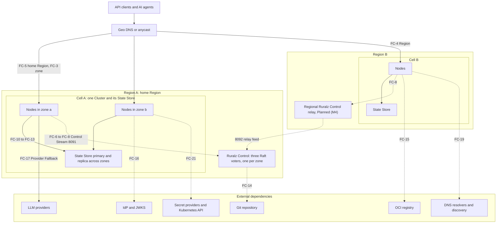
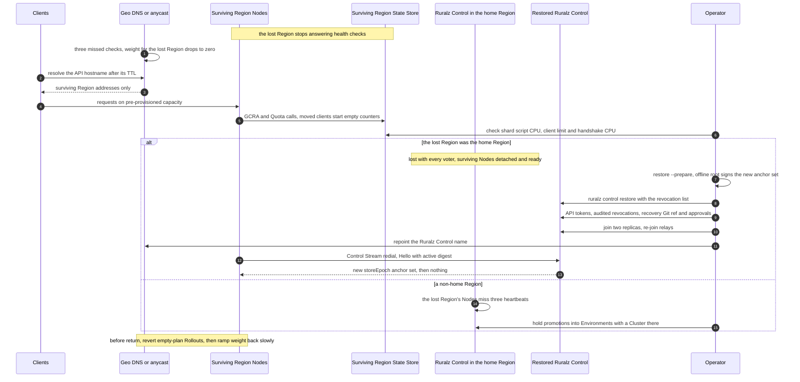

# High Availability and Disaster Recovery

## Summary

This document tells operators what fails, what keeps working and how to recover a Ruralz deployment: a failure catalog from one Node to a whole Region, degraded modes (Last-Known-Good, local rate-limit fallback, `failureMode`), recovery objectives per component, backup rules, runbooks and game days. Its central rule: Ruralz Control and Control Store failures cost requests nothing, because Nodes never wait on Ruralz Control; State Store and Region losses have their own traffic RTOs. Nothing is implemented: Node recovery is Planned (M1), Ruralz Control and backups Planned (M2), multi-region Planned (M4). Operators and architects should read it before production.

## Scope and non-goals

In scope: failure behavior at component boundaries, degraded modes, recovery objectives, `ruralz control backup` and `ruralz control restore` practice, runbooks and chaos drills. "Pack 8.2" names a section of the binding [foundation pack](../_meta/foundation-pack.md).

This document decides OQ-system-overview-13 (`/readyz` never fails for detachment) and OQ-scalability-and-distributed-state-7 (option (a) below). It carries OQ-system-overview-12 and OQ-deployment-topologies-18 and -20, with every option, into [Open questions](#open-questions); their original IDs close at conformance.

Non-goals, with owners: accuracy bounds and chaos pass criteria ([Scalability and distributed state](../architecture/11-scalability-and-distributed-state.md)); Control Store, fencing and backup internals ([Control plane and GitOps](../architecture/04-control-plane-and-gitops.md)); upgrade rollback ([Release, versioning and compatibility](../engineering/04-release-versioning-and-compatibility.md), [Zero-downtime upgrades](02-zero-downtime-upgrades-and-hot-reload.md)); layouts ([Deployment topologies](01-deployment-topologies.md)); performance values ([Performance budgets and benchmarking](../architecture/12-performance-budgets-and-benchmarking.md)); State Store product operations beyond the rules below.

## Failure catalog

Figure 1 shows the failure domains; edge labels name catalog rows.

*Figure 1: failure domains from Node to Region, Ruralz Control, State Store and external dependencies; dashed edges are off the request path.*



Symbols follow [Consistency and accuracy bounds](../architecture/11-scalability-and-distributed-state.md#consistency-and-accuracy-bounds): R active Regions; N Nodes on one Ruralz Control deployment; N_serving a Cell's serving Nodes; N_published the Node count Ruralz Control publishes, N_frozen that count frozen by an outage; N_cut Nodes cut off from the State Store; "ceiling" a `limits[]` entry's per-Node ceiling and `requests` its Cell-wide limit per window.

Rows are Planned in the milestone of the component named. "Traffic" means request handling; "management" means Rollouts, Enrollment, Drift, Ruralz Console and the REST API.

| ID | Failure | Blast radius | Behavior during the failure | Detection | Recovery |
|---|---|---|---|---|---|
| FC-1 | Node process or host lost | Its in-flight requests and connections (SG-3) | Survivors serve; at most one extra per-Node ceiling per key per restarted Node (target) | Balancer `/readyz` checks on 9901; missed heartbeats | Replacement boots Last-Known-Good or its Bundle; a lost `${RURALZ_DATA_DIR}` re-enrolls. Kubernetes: force-delete the pod or taint the host `node.kubernetes.io/out-of-service` (T4) to release its volume |
| FC-2 | Node restarted while Ruralz Control is down | One Node | Boots Last-Known-Good, detached, after up to 5 s (target); without it, not ready | Readiness | Automatic |
| FC-3 | Availability zone lost | Its Nodes, a zonal State Store primary, one voter, often a Vault node or Kubernetes API server (FC-21) | Survivors under 80% CPU when [sized](../architecture/11-scalability-and-distributed-state.md#high-availability) (target); black-holed connections suspect in about 1 s (target); State Store failover; quorum holds | Balancer health; failover; replica metrics | Force-delete stranded pods (T4); [replace the voter](#raft-quorum-loss-and-replica-replacement) |
| FC-4 | Region lost, not the home Region | Its Cells | Geo steering moves clients, counters start empty; survivors count alone, up to R × each limit (target), taking its State Store calls and TLS handshakes | Geo health checks; disconnected Nodes; survivor script CPU | [Region loss](#region-loss) |
| FC-5 | Home Region lost | Its Cells and every voter | Other Regions serve; Rollouts, Enrollment and Drift stop (`RZ-CP-004`); new Nodes stay not ready | Relays stale; REST API unreachable | [Region loss](#region-loss) |
| FC-6 | Ruralz Control leader lost | Management only | New leader in about 1 to 2 s plus election round trips (hypothesis); Rollouts resume; zero request errors (CE-7) | `ruralz_control_leader_info` | Automatic |
| FC-7 | Raft quorum lost | Management of every Cell served | Writes, logins, Enrollment stop (`RZ-CP-004`); stale replicas answer only Nodes without an active digest; the Node count freezes | `ruralz_control_leader_contact_age_seconds` | [Raft quorum loss](#raft-quorum-loss-and-replica-replacement) |
| FC-8 | Control Stream ([ADR-0007](../adr/0007-control-stream-protocol.md)) partition from Ruralz Control or a relay | Cut-off Nodes | Detached, `/readyz` 200; redial with full jitter, base 1 s, cap 60 s (target); revocations and promotions wait | Three missed heartbeats (target) | Automatic: `Hello` presents the active digest |
| FC-9 | Ruralz Control replica overloaded or restarted | Its Control Streams | `Reconnect` (`shed`, `rebalance`); after a full restart all Nodes return within 5 minutes (target) (CE-10) | `RZ-CP-010`; stream counts | ceil(N / 5,000) + 1 replicas (hypothesis) |
| FC-10 | State Store unreachable or black-holed | One Cell | At most one deadline per request, none once the breaker opens; [fail-open rules](#fail-open-and-fail-closed-behavior) apply | Reason `state_store_breaker_open`; `ruralz_state_ops_total`; `RZ-STS-001` to `RZ-STS-004` only under `closed` | Automatic; [rebuild](#state-store-rebuild) if data is lost |
| FC-11 | State Store partition: some Nodes, or one shard | Cut-off Nodes or the shard's keys | Cut-off Nodes admit per the fail-open ceiling rows, connected Nodes per the healthy GCRA row; combined bound: OQ-high-availability-and-disaster-recovery-10 | Breaker state differs across Nodes | Fix the path |
| FC-12 | State Store primary failover | One Cell | `failureMode` about 15 s (hypothesis); lag × rate extra per key (hypothesis) | `NOSCRIPT`, then `SCRIPT LOAD` | Automatic within 15 s (target) (CE-5) |
| FC-13 | State Store full or evicting | One Cell | Stores skip above 70% of `maxmemory` (target); once full, limits open, `closed` Token Budgets 503; eviction resets counters | Reason `state_store_eviction_policy` | Add shards; `noeviction` MUST be set |
| FC-14 | Git repository unavailable | Changes only | No new Revisions (`RZ-CP-011`); recorded Revisions, Rollouts and reverts work | `RZ-CP-011` | Forge recovery, or a mirror |
| FC-15 | OCI registry unavailable | Changes; Plugin activation without cached artifacts | File-mode Nodes keep serving and back off; Plugin fetches NACK transient, then quarantine | Transient NACKs; poll errors | A mirror above 100 Nodes per Region (hypothesis) |
| FC-16 | IdP or JWKS unreachable | Routes with `auth.jwt` for that issuer | Cached keys serve until expiry (`max-age` clamped to 5 minutes to 6 hours, default 1 hour (target)), then 401 `RZ-AUTH-006` | Reason `jwks_stale`; `ruralz_auth_jwks_age_seconds` | IdP recovery; closed by design (P9) |
| FC-17 | LLM provider outage or throttling | One `AIModel` candidate | Provider Fallback before commit, inside the residency class; after commit `RZ-AI-009`; exhausted `RZ-AI-005` | Cooldowns: about one failed attempt each per Node (hypothesis) | Automatic, Planned (M3) |
| FC-18 | Plugin crash: trap, timeout or memory cap | That Plugin's Routes | Instance discarded; `failureMode` decides (closed only for auth and authz classes); the Node never crashes; new instances refused at `limits.maxPluginMemoryBytes` | `RZ-PLG` counters; canary gate | Before `complete`, `ruralz rollout rollback`; after, `ruralz rollout start` of the replaced Revision (step-up TOTP; `RZ-CP-006` for `security` diffs); file mode: CI republishes the old digest; or roll forward |
| FC-19 | DNS failure | Discovery Upstreams; Nodes resolving Ruralz Control or the State Store | Discovery keeps its last set, counting NXDOMAIN after 3 refreshes (target); failed dials detach or apply `failureMode` | Reason `discovery_stale`; dial errors | Fix resolvers; short TTLs on gateway names |
| FC-20 | Bad Revision | Canary Nodes of one Cluster; all Nodes of a file-mode source | Gates fail: `rolled-back` or `paused` per `autoRollback` | Deterministic NACK; 5xx gate | As FC-18 |
| FC-21 | Secret provider (`vault`, `kubernetes`) or Kubernetes API down | Restarting, replacement and new Nodes using those references; `kubernetes` discovery | Running Nodes keep resolved values; cold starts stay not ready; discovery keeps its last set | `/readyz` reason; `ruralz_upstream_degraded_info` | Recovery; keep TLS keys and `stateStore.url` on `file` or `env` |

## Degraded modes

Every degraded mode is a metric (P10, SG-8) named by [Observability](../architecture/10-observability.md). Modes match [Control plane and GitOps](../architecture/04-control-plane-and-gitops.md#behavior-during-a-ruralz-control-outage) and [Scalability and distributed state](../architecture/11-scalability-and-distributed-state.md#consistency-and-accuracy-bounds), which win on conflict.

### Detached Nodes and Last-Known-Good

A detached Node serves its active Revision and stays ready for any duration (pack 8.5). This document decides OQ-system-overview-13 as "never": failing `/readyz` after a staleness limit would evacuate every Node of a Cell during the incident it signals, so staleness raises an alert instead.

| Situation | Behavior | Operator consequence |
|---|---|---|
| Running Node loses the Control Stream | Keeps active Revision; reason `detached`; jittered redial | None for traffic |
| Node restarts while detached | Pack 8.2 boot order: upgrade handover, then Last-Known-Good after up to 5 s (target) | Restarts boot Last-Known-Good within 30 s (target) (CE-8) |
| Last-Known-Good boot with unresolvable `secretRef` | Not ready until every reference resolves; secrets are never on disk (FC-21) | Keep TLS keys and the State Store URL on `file` or `env` |
| Last-Known-Good uses a field newer than the binary | `RZ-CFG-024`; not ready ([binary rollback limit](../engineering/04-release-versioning-and-compatibility.md#binary-rollback-limit)) | Never roll back a binary during a Ruralz Control outage |
| Last-Known-Good accepted from a removed signing key after `compromisedSince` | Refused at boot until the Control Stream delivers (proposed, OQ-control-plane-and-gitops-24) | Emergency key removal costs restarts during an outage |
| New Node, no Last-Known-Good | Not ready until it enrolls (pack 8.11) | Autoscaling adds nothing: hold 30% headroom (target) |
| Detached beyond the 30-day certificate lifetime (target) | Keeps serving; on return `RZ-CP-003` | Re-enroll ([OQ-high-availability-and-disaster-recovery-4](#open-questions)) |
| Restarted while detached | Forgets revocations until Ruralz Control returns (OQ-security-and-identity-5) | For urgent revocations in an outage, rotate the credential at its source (IdP key, API key) |

For OQ-scalability-and-distributed-state-7 this document keeps option (a): Clusters SHOULD hold 30% headroom above peak (target), and Nodes that may be rescheduled MUST keep `${RURALZ_DATA_DIR}` on persistent storage. OCI seeding (b) and Last-Known-Good in images (c) stay open in [OQ-high-availability-and-disaster-recovery-1](#open-questions).

### Local rate-limit fallback

While the State Store fails, each Node's local token bucket at its per-Node ceiling is the only limiter ([ADR-0008](../adr/0008-rate-limiting-local-bucket-and-gcra.md)). The breaker opens when 50% of at least 20 calls in 5 s fail (target) and half-opens after 1 to 3 s (target), so requests stop paying the deadline.

| Condition | Admission per key and window, from Scalability and distributed state |
|---|---|
| Declared per-Node ceiling | At most N_serving × ceiling (target) |
| Derived ceiling, current Node count | At most N_serving × max(1, 2 × `requests` / N_published) (target) |
| Count frozen by a Ruralz Control outage | At most N_serving × max(1, 2 × `requests` / N_frozen); 20 × `requests` after a 10 to 100 scale-out (hypothesis) |
| Control-mode Node restarted without a count | Clamp max(1, `requests` / 100) per such Node (target) |
| File mode without a declared ceiling | At most N_serving × `requests` (target) |

Autoscaled Control-mode Clusters SHOULD declare per-Node ceilings, since outages and scale-out combine the two worst rows.

### Fail-open and fail-closed behavior

`failureMode` follows pack 8.10: registry defaults apply unless a Policy overrides them, and security types are closed only (RZ-CFG-029).

| Policy type | Default | During a State Store or dependency failure |
|---|---|---|
| `auth.*`, `authz.*`, auth or authz `plugin` | Closed only | 401 or 403; JWKS keys serve until expiry first (FC-16) |
| `ratelimit` | Open | Local buckets only |
| `quota` | Open | Unmetered; such Routes SHOULD also carry a `ratelimit` |
| `cache`, `ai.semantic-cache` | Open | Bypassed; origin or provider load rises |
| `ai.token-budget` | Closed | 503 `RZ-STS-001` to `RZ-STS-004`: a State Store outage is an AI outage in that Cell (default: OQ-configuration-model-8) |
| Other `plugin` Policies | Closed | Per the Policy; a trap discards the instance only |

Upstream failures follow the [failure matrix](../architecture/09-traffic-management-and-resilience.md#failure-matrix); Token Budget semantics follow [ADR-0014](../adr/0014-ai-api-surface.md).

## RPO and RTO

The recovery point objective (RPO) bounds lost data; the recovery time objective (RTO), stated separately for traffic and management, bounds time to recovery. Management RTO ends when Ruralz Control accepts writes; Rollouts resume up to one ACK timeout, 60 s (target), later, as a new leader restarts gate windows. Runtime counters are never restored; [Scalability and distributed state](../architecture/11-scalability-and-distributed-state.md#consistency-and-accuracy-bounds) bounds the extra admission.

| Component and failure | Data at risk | RPO | Traffic RTO | Management RTO |
|---|---|---|---|---|
| Node lost | In-flight requests only | No configuration lost (target) | Survivors at once; replacement ready within 30 s of pod release (target); a lost Kubernetes host's pod released within 5 minutes (target), manually until OQ-high-availability-and-disaster-recovery-2 | Not affected (target) |
| Node disk lost | Identity, Last-Known-Good | Re-derived from Ruralz Control (target) | Survivors at once (target) | One Enrollment (target) |
| Availability zone lost | State Store writes within replication lag | Lag, 1 s or less (target) | 30 s or less on survivors (target); State Store 15 s or less (target) | Unchanged with three voters in three zones (target) |
| Non-home Region lost | That Region's counters and caches | Not recovered: one extra limit per open window (target) | About 2 minutes, at most 5 (target), below | Unchanged (target) |
| Ruralz Control leader lost | None committed | Zero committed writes (target) | Zero request errors (target) | 10 s or less (target) |
| Raft quorum lost, replicas recoverable | None committed | Zero committed writes (target) | Zero request errors (target) | 30 minutes or less (target) |
| Control Store lost with its Region, or a voter majority lost for good | Writes after the newest backup copied to the second Region | 75 minutes or less: hourly backups copied within 10 minutes (target) | Zero request errors (target); derived ceilings per the [hold](#holding-deliveries-during-recovery) | 4 hours or less, relay rebuild included, re-enrolling post-backup Nodes excluded (target) |
| Control Store and every backup lost | Rollout history, audit log, users, Enrollments | Configuration: none, Git holds it (target); records: all | As above | 8 hours or less, re-enrollment excluded (target) |
| Re-enrollment of every Node | Enrollment identities | None (target) | One zone's capacity drains at a time (target) | 30 minutes or less for 10,000 Nodes (target), below |
| State Store primary lost | Writes within replication lag | Lag, 1 s or less (target) | `failureMode` for 15 s or less (target) | Not affected (target) |
| State Store deployment lost | Every counter and cache entry | All, unless persistence is on (target) | `failureMode` until rebuilt, 30 minutes or less (target), plus a zone-by-zone Drain if `stateStore.url` changes | Not affected (target) |
| Bad Revision in Control mode | None | None (target) | Detection (canary bake or the 200-request sample) plus a revert within three ACK timeouts per Node (target) | Not affected (target) |

```text
Regional failover   3 missed geo checks × 10 s + API hostname TTL ≤ 60 s + client retry
                    ≈ 2 minutes; caches past the TTL extend it; anycast: route withdrawal (target)
Re-enrollment       Z × (t_drain + (N / Z) / min(20 per s per leader, L_src × A) + t_slow)  (hypothesis)
                    Z zones, t_drain about 30 s, L_src the per-source Enroll limit,
                    A egress addresses, t_slow the 30 to 60 s slow start                    (target)
                    10,000 Nodes, 3 zones: 3 × (30 s + 167 s + 60 s) ≈ 13 minutes           (hypothesis)
```

Behind shared egress, `Enroll` limits MUST be keyed so that L_src × A reaches 20 per second (OQ-deployment-topologies-15). A revocation list exported with every backup avoids re-enrollment after a restore.

## Backups

`ruralz control backup` and `ruralz control restore` are Planned (M2) ([ADR-0006](../adr/0006-control-store-raft-boltdb.md), proposed). A backup is a Raft snapshot plus referenced content, consistent at one index, encrypted and signed; downloads need `admin` and are audited ([Backup, restore and `postgres`](../architecture/04-control-plane-and-gitops.md#backup-restore-and-postgres)).

### What to protect

| Asset | Source of truth | Protection | Frequency |
|---|---|---|---|
| Bundle and `control/` directory | Git | Forge replication or a mirror Ruralz Control can fetch | Continuous |
| Control Store: metadata, Revision content, diffs, plans, audit segments, encrypted keys and CAs | Ruralz Control | `ruralz control backup`, copied off-cluster and to a second Region | Hourly (target) and before every Ruralz Control upgrade |
| Node revocation list | Control Store | Exported beside each backup (proposed; [OQ-high-availability-and-disaster-recovery-6](#open-questions)) | With each backup |
| Backup key (OQ-cli-and-api-surface-9), offline trust-root key; SHOULD also escrow CA keys and the key-encryption key, so a rebuild keeps the 8091 server CA | Operator custody | Offline, never with backups | On rotation |
| Audit log | Control Store | Export (OQ-control-plane-and-gitops-12) to a separate system; MUST for multi-region, the only record of revocations after the newest backup | Continuous |
| Signed Revisions and Plugins in OCI | Registry | Replication or a mirror, by digest | Continuous |
| State Store data | State Store | Persistence where Quota or Token Budget windows exceed one day (SHOULD); never restored from an old snapshot, which rewinds counters | Server setting |
| `${RURALZ_DATA_DIR}` on Nodes | Node | Persistent volume; not backed up | Not applicable |
| Secrets behind `secretRef` | Secret providers | The provider's own backup | Provider's |

Retain hourly backups for 7 days and daily ones for 90 days (target). The Control Store keeps the latest 50 Revisions per Environment (target); older ones re-render from Git only on the `ruralz-control` minor that built them (OQ-release-versioning-and-compatibility-12), and those from `ruralz bundle push` or CRD sources exist only in backups.

### Taking and checking backups

A scheduler outside Ruralz Control runs the backup with an `admin` API token (built-in scheduling: [OQ-high-availability-and-disaster-recovery-7](#open-questions)):

```bash
ruralz control backup \
  --control https://control.shop.example:8090 \
  --token-file /run/secrets/ruralz-backup-token \
  --output-file /backups/ruralz-control-2026-09-25T10.bak
```

Rules:

1. Copy each backup to a second Region within 10 minutes of its start (hypothesis); RA-3 in [Deployment topologies](01-deployment-topologies.md) requires it for multi-region.
2. Before a Ruralz Control upgrade, take a backup and pause `ruralz bundle push` until finalize ([Ruralz Control upgrades](../engineering/04-release-versioning-and-compatibility.md#ruralz-control-upgrades)); after finalize, rollback is a restore of that backup.
3. Restore with the binary minor that wrote the backup ([OQ-high-availability-and-disaster-recovery-8](#open-questions)).
4. Verify each backup's signature and decryption at creation, and restore the newest into an isolated scratch deployment monthly with GD-9 (target); an unrestored backup is unverified.
5. Measure freshness in the second Region, whose newest verified copy sets the Region-loss RPO: alert above 75 minutes, page at 2 hours (target).

## Runbooks

Each runbook is Planned in its component's milestone: Ruralz Control steps Planned (M2), relays and multi-region Planned (M4), State Store steps Planned (M1). Every runbook starts by confirming that request traffic is healthy, because most failures here are management-only.

### Holding deliveries during recovery

A Rollout to a Cluster with no connected Nodes has an empty plan and completes at once ([Rollout plan](../architecture/04-control-plane-and-gitops.md#rollout-plan-batches-and-gates)): the promoted digest advances, `promotion.from` counts it `complete`, and returning Nodes activate that Revision as late Nodes without a canary. A restored or rebuilt deployment renders the tracked branch head, which may hold untested commits: without `requireApproval` its empty plans complete; with it, each Environment holds one record, for the head. Until OQ-high-availability-and-disaster-recovery-3 decides, every restore and rebuild runs this hold before any Node connects:

1. Find each Cluster's served commit with `ruralz bundle diff` against sample Nodes in every zone (rebuild step 4); after a restore, start from the restored assignments' digests.
2. Push a recovery ref at that commit plus one commit setting `requireApproval: true` on every Environment in `control/environments.yaml`, which changes no digest. Point Ruralz Control's Git source, in process configuration (OQ-control-plane-and-gitops-1), at it before the Git watcher first runs.
3. In `promotion.from` order, approve only records whose digest equals every Cluster's served digest, with `ruralz rollout approve --env <env> --digest sha256:<served>`; their empty plans complete. Where one Environment's Clusters serve different commits, or a restored Rollout is still `canary`, `progressing` or `paused`, pause it, approve nothing and escalate: aligning needs a delivery, and a stale restored assignment would re-deliver an older Revision.
4. After reconnect, check with `ruralz node list` that every active digest equals its Cluster's promoted digest; only then is traffic unchanged. Point the Git source back at the tracked branch and restore normal gates by an approved change, so newer commits roll out with a canary.

After a rebuild, or a restore without a revocation list, no Node counts as qualified, so the first `HeartbeatReply` can collapse the published count; Clusters with derived ceilings SHOULD declare per-Node ceilings beforehand, until OQ-high-availability-and-disaster-recovery-9 decides:

```text
Derived ceiling   max(1, 2 × requests / N_published) → the full limit as N_published → 0
Hot-key GCRA      2 × requests → up to N_serving × 2 × requests per window, opening shard breakers
Count recovery    10 min qualification, then +10% per minute: 10 to 1,000 Nodes ≈ 58 minutes  (hypothesis)
```

### Region loss

*Figure 2: regional failover when one Region is lost; the alt branch applies when it is the home Region, Region A in Figure 1.*



Non-home Region lost (FC-4):

1. Confirm geo steering removed the Region within the [failover parameters](#rpo-and-rto); if checks lag, zero its weight by hand.
2. Check every survivor Cell resource at the moved load ([Capacity planning](03-capacity-planning.md)): Nodes at R / (R − 1) of peak (target); shard script CPU under 70% (target), pre-provisioned at 50% of shard capacity (hypothesis); client limit above 10 × N_serving (target); the reconnect storm, λ_storm × c_hs, within 10% of survivor CPU (target). Never scale Nodes past the shard-derived `maxReplicas` bound of [Sizing defaults](01-deployment-topologies.md#sizing-defaults) or 1,000 per Cell (target); add shards first.
3. Expect up to R × each regional limit, and one extra limit per open window for spend-bearing Quotas unless tenants are Region-pinned or quotas divided ([topologies](../architecture/11-scalability-and-distributed-state.md#topologies)).
4. A Rollout already running into the lost Cluster lags, then ends `rolled-back` or `paused` per `autoRollback`. A promotion reaching it later completes with an empty plan, so its returning Nodes would activate that Revision without a canary (OQ-high-availability-and-disaster-recovery-12). While the Region is lost, operators MUST hold promotions into every Environment with a Cluster there: approve nothing under `requireApproval`; elsewhere freeze merges to the tracked branch, or first commit `requireApproval: true`, which tightens a gate and applies without approval.
5. Before the Region returns, or at the latest before its weight rises, run `ruralz rollout status <cluster>` for its Clusters and revert each Rollout that completed with an empty plan during the loss by `ruralz rollout start` of the replaced Revision, unless that Revision passed a canary elsewhere; with the Nodes away, the revert completes at once too. Returning Nodes receive their assigned Revision and an empty State Store. Ramp geo weight back gradually; balancers slow-start each Node over 30 to 60 s (target).

Home Region lost (FC-5), Planned (M4) for multi-region, and the same for a single-Region total loss:

1. Run non-home steps 1, 2, 3 and 5 for the home Region's Cells; surviving Nodes are detached and ready. Restore only if Rollouts, Enrollment, revocations or scale-out cannot wait.
2. Keep the old replicas from starting on return: scale their StatefulSet to zero, or block 8090, 8091 and 8092 at the network or DNS; later wipe them, since they would run a second, older deployment ([OQ-high-availability-and-disaster-recovery-5](#open-questions)).
3. In the surviving Region, run `ruralz control restore --prepare --data-dir <dir>` and have the offline trust-root holder sign an anchor set with the new online key.
4. Before any Node reconnects, run `ruralz control restore <backup> --data-dir <dir> --advertise <host>:8092 --anchor-set <file> --backup-key-file <file> --revocation-list <file>` on the newest copy. It opens a higher `storeEpoch`, so Nodes reject older assignments ([fencing](../architecture/04-control-plane-and-gitops.md#fencing-stale-replicas)) and verify every signature against their anchors ([ADR-0017](../adr/0017-artifact-signing.md)). It resets Raft membership to this voter and drops old peer certificates, cutting every relay's 8092 feed.
5. Recreate API tokens, invalidated with sessions, then re-issue `ruralz node revoke` for each revocation after the backup in the external audit export; without the export, those certificates stay valid until they expire.
6. Run [hold](#holding-deliveries-during-recovery) steps 1 to 3.
7. Add two voters with `ruralz control join` and `ruralz control serve` in the Region; repoint forge webhooks and the name Nodes dial (OQ-control-plane-and-gitops-13). Wipe each relay and re-join it with a new relay-role token (OQ-control-plane-and-gitops-15), or point relay-served Nodes at the restored replicas meanwhile.
8. Finish hold step 4. Nodes enrolled after the backup lack restored Enrollment records and fail `Hello` with `RZ-CP-002` or `RZ-CP-003`: re-enroll them as in rebuild step 7 (OQ-high-availability-and-disaster-recovery-4).

### Ruralz Control rebuild from Git

Use this when every backup is lost or unusable. Configuration survives in Git; Rollout history, users, bindings, Enrollments, unexported audit entries and Revisions from `ruralz bundle push` or CRD sources do not.

1. Use the `ruralz-control` and `ruralz` CLI minor that built the served Revisions, from release and deployment records. Start one replica on an empty data directory with `ruralz control serve`, loading escrowed CAs, else generating new ones; create the first `admin` and `security-admin` (OQ-deployment-topologies-11).
2. Upload an anchor set signed by the existing offline trust-root key, keeping one root chain; it opens a `storeEpoch` above the one Nodes persisted, so they accept the new, low sequences.
3. An `admin` creates at least two `approver` accounts with TOTP, bound per Environment, and registers commit-signing keys; an unsigned commit needs two approvers.
4. Before Ruralz Control reads Git, render candidate commits against each Cluster's Nodes. Equal commits render equal digests only at the same binary minor and schema levels (OQ-release-versioning-and-compatibility-12); if none matches, hold that Cluster and escalate, never letting its promotion complete.

   ```bash
   ruralz bundle diff ./bundle https://node-a.shop.example:9901 --env prod \
     --admin-token-file /run/secrets/ruralz-admin-token   # exit 0: this commit is served
   ```

5. Run [hold](#holding-deliveries-during-recovery) steps 2 and 3, expecting the collapsed Node count described there.
6. Join two more replicas.
7. Re-enroll Cluster by Cluster, one zone at a time: the current answer to OQ-high-availability-and-disaster-recovery-4, still blocked on it. A kept identity ignores tokens and, without escrowed CAs, pins the old 8091 server CA. Traffic changes only by the draining zone's capacity (target).

   ```bash
   ruralz node drain --data-dir /var/lib/ruralz                   # each Node of the zone
   mv /var/lib/ruralz/identity /var/lib/ruralz/identity.old       # keep lkg/
   ruralz node token --cluster prod-eu-west --output-file /run/secrets/ruralz-enroll-token
   # restart ruralzd with that token; before the next zone:
   ruralz node list --cluster prod-eu-west                        # active equals promoted digest
   ```

8. Finish hold step 4, then take a backup at once.

### State Store rebuild

Use this when a Cell's State Store deployment is lost, corrupted or configured with eviction.

1. Confirm the scope: reason `state_store_breaker_open` and failing `ruralz_state_ops_total` results on the Cell's Nodes only. Rate Limits run on local buckets; `closed` Token Budgets return 503.
2. If spend-bearing AI traffic cannot wait, shift the Cell's geo or DNS weight to other Cells; receiving Cells admit one extra limit per open window (target).
3. Provision the replacement: a primary with a replica and automatic failover across zones, `maxmemory-policy noeviction`, TLS and authentication, persistence where windows exceed one day, and a client connection limit above 10 × N_serving (target) ([State Store availability](../architecture/11-scalability-and-distributed-state.md#state-store-availability)).
4. Prefer a replacement reachable at the same `stateStore.url` value, such as the same DNS name or service address, so no secret changes. Otherwise follow the new-Cell row of [State Store upgrades](02-zero-downtime-upgrades-and-hot-reload.md#state-store-upgrades), or change the value and Drain Nodes one zone at a time, for every provider, until OQ-zero-downtime-upgrades-and-hot-reload-9 decides how Nodes treat a rotated value.
5. Nodes redial with full jitter, base 100 ms, cap 5 s (target), run `SCRIPT LOAD` and close breakers after 3 successful probes (target).
6. Expect empty counters (one extra limit per open window, Quota windows up to 720 h (target)) and cold caches: watch origin and provider load.
7. Restore geo weight, then confirm `ruralz_state_writes_dropped_total` returns to baseline.

### Raft quorum loss and replica replacement

1. If a majority of voters can return, restart them; the Control Store resumes with zero committed writes lost (target).
2. To replace one voter after volume or zone loss, an `admin` removes the old voter (mechanism: [OQ-high-availability-and-disaster-recovery-2](#open-questions)), mints a join token at `/api/v1/replicas`, and the new host runs `ruralz control join` then `ruralz control serve`; it becomes a voter after catch-up.
3. If no majority can return, restore the newest backup as in home Region steps 2 to 8, discarding committed writes a surviving minority still holds.

## Game days

Game days rehearse the runbooks on staging Clusters under open-loop load; the Chaos job of [Scalability and distributed state](../architecture/11-scalability-and-distributed-state.md#chaos-experiments) automates the CE experiments (tooling: OQ-scalability-and-distributed-state-10). Each runs quarterly (target), GD-9 monthly (target), and gates the milestone shown.

| ID | Experiment | Fault injected | Pass criteria | Milestone |
|---|---|---|---|---|
| GD-1 | Node loss | SIGKILL one Node at 50% load (target), CE-1; on Kubernetes also power off a host | Errors only on its in-flight requests; no Quota under-charge; replacement ready within 30 s of pod release (target) | Planned (M1) |
| GD-2 | Zone loss | Black-hole one zone's Nodes and State Store primary | Survivors under 80% CPU (target); State Store `failureMode` 15 s or less (target) | Planned (M1) |
| GD-3 | State Store outage | Black-hole for 60 s (target), CE-4 | Admission within fail-open bounds; `closed` Token Budgets get `RZ-STS-001`, then `RZ-STS-003` | Planned (M1) |
| GD-4 | State Store partition | Cut half the Nodes from the State Store | Cut-off Nodes within the fail-open ceiling rows, connected Nodes within the healthy GCRA row (target) | Planned (M1) |
| GD-5 | State Store rebuild | Delete the deployment, run the runbook | Traffic RTO met; no `state_store_eviction_policy` reason afterward | Planned (M1) |
| GD-6 | Leader loss | Kill the leader mid-Rollout, CE-7 | Zero request errors; the Rollout resumes | Planned (M2) |
| GD-7 | Quorum loss with restarts | Remove quorum, restart 10% of Nodes (target), CE-8 | Restarts boot Last-Known-Good within 30 s (target) | Planned (M2) |
| GD-8 | Replica replacement | Delete one voter's volume | Replaced with no quorum loss | Planned (M2) |
| GD-9 | Restore drill | Restore the newest backup, with the hold, into a scratch deployment whose name production Nodes cannot resolve; anchor set per OQ-high-availability-and-disaster-recovery-11 | RPO and management RTO met; revocation list accepted; as GD-10 | Planned (M2) |
| GD-10 | Rebuild from Git | Rebuild a staging Ruralz Control with no backup, with the hold | Before reconnect, every Cluster's promoted digest equals its Nodes' active digest; the published count drops at most 10% (target); no State client breaker opens | Planned (M2) |
| GD-11 | External dependencies | Git, OCI registry and JWKS unreachable for 1 hour (target) | No request errors until cached keys expire, then `RZ-AUTH-006`; changes resume | Planned (M2) |
| GD-12 | LLM provider outage | Primary candidate returns 429 and 5xx | Provider Fallback before commit; no residency violation | Planned (M3) |
| GD-13 | Plugin crash | Plugin traps on every call | Node stays up; `failureMode` per Policy; canary rolls back | Planned (M2) |
| GD-14 | Region evacuation | Cut a Region with its State Store and relay, CE-11 and CE-17 | No cross-Region State Store dial; survivors serve full peak, 99% of requests within 5 minutes (target); script CPU under 70% (target); no breaker opens; handshake p99 within C2 (target) | Planned (M4) |
| GD-15 | Secret provider down in a zone loss | Stop Vault or the Kubernetes API with one zone | Nodes with only `file` or `env` references boot within 30 s (target); others stay not ready, counted | Planned (M2) |

## Open questions

| ID | Question | Options | Owner | Blocking? |
|---|---|---|---|---|
| OQ-high-availability-and-disaster-recovery-1 | Carries OQ-system-overview-12: how are break-glass changes made and new Nodes seeded during a Ruralz Control outage? | (a) None (current); (b) seed from a signed OCI-published Revision, amending pack 8.2 and 8.11 (proposed); (c) an admin override; (d) Last-Known-Good in images | high-availability-and-disaster-recovery | No |
| OQ-high-availability-and-disaster-recovery-2 | Carries OQ-deployment-topologies-20: how are a replica replaced after volume or zone loss, as `/api/v1/replicas` removes no voter, and stranded Node pods released? | (a) A chart Job removes the stale voter and mints a join token; runbooks force-delete pods (proposed); (b) manual steps (current); (c) higher `minReplicas` or zone-replicated volumes; (d) Nodes as a Deployment | control-plane-and-gitops | Yes, for the Planned (M2) chart |
| OQ-high-availability-and-disaster-recovery-3 | Should a restored or rebuilt deployment hold deliveries until an operator confirms assignments? | (a) The runbook hold (current); (b) a restore-hold mode adopting Nodes' reported digests; (c) hold returning Clusters until canaried | control-plane-and-gitops | Yes, for Planned (M2) restore |
| OQ-high-availability-and-disaster-recovery-4 | Carries OQ-deployment-topologies-18: how do serving Nodes re-enroll in bulk after a restore without a revocation list, a rebuild or certificate expiry, given a kept identity ignores tokens and pins the old server CA? | (a) Background re-enrollment on `RZ-CP-003` with batched tokens (proposed); (b) rolling Drain and restart per zone (current) | control-plane-and-gitops | Yes, for Planned (M2) restore |
| OQ-high-availability-and-disaster-recovery-5 | How is a pre-restore deployment fenced when its Region returns? | (a) Operator blocks, then wipes it (current); (b) a root-signed retirement record Nodes and replicas honor | control-plane-and-gitops | Yes, for Planned (M2) restore |
| OQ-high-availability-and-disaster-recovery-6 | Which command, format and signature export the revocation list beside a backup? | (a) `ruralz control backup` output (proposed); (b) a REST API export | cli-and-api-surface | Yes, for Planned (M2) restore |
| OQ-high-availability-and-disaster-recovery-7 | Should Ruralz Control schedule backups itself? | (a) External scheduler (current); (b) process configuration | control-plane-and-gitops | No |
| OQ-high-availability-and-disaster-recovery-8 | May a newer binary minor restore an older backup? | (a) Same minor only (proposed); (b) N restores N-1, then finalize | release-versioning-and-compatibility | No |
| OQ-high-availability-and-disaster-recovery-9 | Should a restored or rebuilt deployment withhold or seed `clusterNodeCount` until qualification catches up? | (a) Withhold, so Nodes keep their last count (proposed); (b) seed from `Hello` and heartbeats; (c) as written | control-plane-and-gitops | Yes, for Planned (M2) restore |
| OQ-high-availability-and-disaster-recovery-10 | Should the bounds table add a partial-partition row, such as `requests` plus N_cut × ceiling per window (proposed)? | (a) Add it; (b) separate rows (current) | scalability-and-distributed-state | No |
| OQ-high-availability-and-disaster-recovery-11 | May a restore drill sign its anchor set with a drill-only root no production Node trusts? | (a) Yes (proposed); (b) the offline root every drill | control-plane-and-gitops | No |
| OQ-high-availability-and-disaster-recovery-12 | Should a plan with zero members, or far fewer than the last published Node count, stay `pending` or `paused` instead of completing? | (a) Complete (current); (b) `pending` (proposed); (c) `paused` below a fraction | control-plane-and-gitops | Yes, for Planned (M4) multi-region |

This document also depends on OQ-zero-downtime-upgrades-and-hot-reload-9 (State Store rebuild step 4, GD-5), OQ-release-versioning-and-compatibility-12 (rebuild, retention) and OQ-deployment-topologies-15 (re-enrollment behind shared egress).
