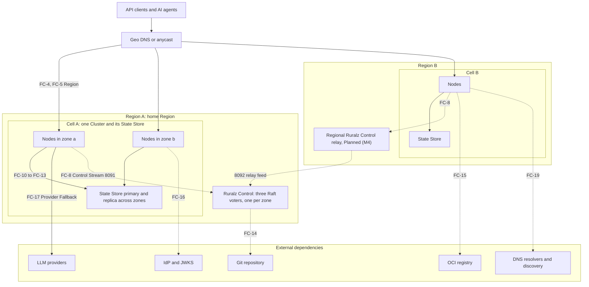
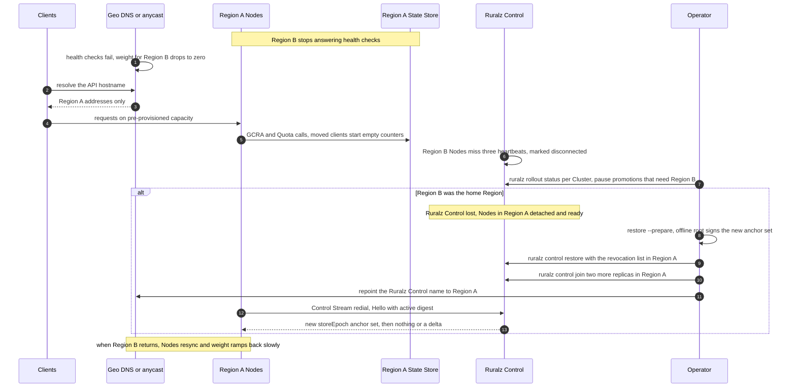

# High Availability and Disaster Recovery

## Summary

This document tells operators what fails, what keeps working and how to recover a Ruralz deployment. It catalogs failures from one Node to a whole Region, fixes the degraded modes (Last-Known-Good, local rate-limit fallback, `failureMode`), sets recovery point and recovery time objectives per component, and gives backup rules, runbooks and game days. Its central rule: a request-path RTO is near zero because Nodes never wait on Ruralz Control, while management recovery is measured separately. Nothing is implemented: Node recovery is Planned (M1), Ruralz Control and backups Planned (M2), multi-region Planned (M4). Operators and architects should read it before production.

## Scope and non-goals

In scope: failure behavior at component boundaries, degraded modes, recovery objectives, `ruralz control backup` and `ruralz control restore` practice, runbooks and chaos drills. "Pack 8.2" names a section of the binding [foundation pack](../_meta/foundation-pack.md).

This document decides two questions it owns: OQ-system-overview-13 (a Node's `/readyz` never fails for detachment, for any duration) and OQ-scalability-and-distributed-state-7 (option (a): 30% headroom (target) plus a persistent `${RURALZ_DATA_DIR}` wherever Nodes may be rescheduled). It carries OQ-system-overview-12 and OQ-deployment-topologies-18 and -20 into [Open questions](#open-questions); their original IDs close at conformance.

Non-goals, with owners: accuracy bounds and chaos pass criteria ([Scalability and distributed state](../architecture/11-scalability-and-distributed-state.md)); Control Store, fencing and backup internals ([Control plane and GitOps](../architecture/04-control-plane-and-gitops.md)); upgrade rollback ([Release, versioning and compatibility](../engineering/04-release-versioning-and-compatibility.md), [Zero-downtime upgrades](02-zero-downtime-upgrades-and-hot-reload.md)); layouts ([Deployment topologies](01-deployment-topologies.md)); performance values ([Performance budgets and benchmarking](../architecture/12-performance-budgets-and-benchmarking.md)); State Store product operations beyond the rules below.

## Failure catalog

Figure 1 shows the failure domains; each edge label names the catalog row that describes its loss.

*Figure 1: failure domains from Node to Region, Ruralz Control, State Store and external dependencies; dashed edges are off the request path.*



Every row is Planned in the milestone of the component it names. "Traffic" means request handling; "management" means Rollouts, Enrollment, Drift, Ruralz Console and the REST API.

| ID | Failure | Blast radius | Behavior during the failure | Detection | Recovery |
|---|---|---|---|---|---|
| FC-1 | Node process or host lost | Its in-flight requests and connections (SG-3) | Survivors serve; clients reconnect; at most one extra per-Node ceiling per key per restarted Node (target) | Balancer `/readyz` checks on 9901; missed heartbeats | Replacement boots Last-Known-Good or its Bundle; a lost `${RURALZ_DATA_DIR}` needs a new Enrollment |
| FC-2 | Node restarted while Ruralz Control is down | One Node | Boots Last-Known-Good after the boot wait of up to 5 s (target), detached; without Last-Known-Good, not ready | `ruralz node list` after recovery; readiness | Automatic once the Control Stream returns |
| FC-3 | Availability zone lost | Its Nodes, a zonal State Store primary, one Raft voter | Survivors stay under 80% CPU when sized per [High availability](../architecture/11-scalability-and-distributed-state.md#high-availability) (target); black-holed pooled connections are suspect in about 1 s (target); the State Store fails over; three voters keep quorum | Balancer health; State Store failover; replica metrics on 9902 | Force-delete stranded pods on Kubernetes; [replace the voter](#raft-quorum-loss-and-replica-replacement) |
| FC-4 | Region lost, not the home Region | Its Cells | Geo steering moves clients; survivors count alone, up to R × each limit (target); moved clients' counters start empty | Geo health checks; the Cluster's Nodes show disconnected | [Region loss](#region-loss) runbook |
| FC-5 | Home Region lost | Its Cells and every voter | Other Regions keep serving; Rollouts, Enrollment and Drift stop everywhere (`RZ-CP-004`); new Nodes stay not ready | Relays go stale; REST API unreachable | [Region loss](#region-loss) runbook, restore in a surviving Region |
| FC-6 | Ruralz Control leader lost | Management only | New leader in about 1 to 2 s plus election round trips (hypothesis); Rollouts resume from the persisted plan; zero request errors (CE-7) | Leader change metric on 9902 | Automatic |
| FC-7 | Raft quorum lost | Management of every Cell it serves | Writes, logins and Enrollment stop (`RZ-CP-004`); stale replicas answer only Nodes without an active digest; Nodes stay ready; the published Node count freezes | `RZ-CP-004`; stale-replica metric | [Raft quorum loss](#raft-quorum-loss-and-replica-replacement) runbook |
| FC-8 | Control Stream ([ADR-0007](../adr/0007-control-stream-protocol.md)) partition: Nodes cut from Ruralz Control or their relay | The cut-off Nodes | Detached: active Revision kept, `/readyz` 200; redial with full jitter, base 1 s, cap 60 s (target); revocations and promotions wait | Three missed heartbeats (target); Drift laggards | Automatic: `Hello` presents the active digest |
| FC-9 | Ruralz Control replica overloaded or restarted | Its Control Streams | `Reconnect` with `shed` or `rebalance`; after every replica restarts, all Nodes reconnect within 5 minutes (target) (CE-10) | `RZ-CP-010`; stream counts | Automatic; ceil(N / 5,000) + 1 replicas (hypothesis) |
| FC-10 | State Store unreachable or black-holed | One Cell | At most one deadline per request, none once the per-shard breaker opens; [fail-open and fail-closed](#fail-open-and-fail-closed-behavior) rules apply | `RZ-STS-001` to `RZ-STS-003`; breaker metrics | Automatic; [State Store rebuild](#state-store-rebuild) if data is lost |
| FC-11 | State Store partition: some Nodes, or one shard, unreachable | The cut-off Nodes or the shard's keys | Cut-off Nodes use local buckets only while the rest run GCRA: per key at most the healthy GCRA bound plus N_cut × ceiling per window (target) | Per-Node breaker state differs across the Cluster | Fix the network path; no data repair needed |
| FC-12 | State Store primary failover | One Cell | `failureMode` for about 15 s (hypothesis); lost writes admit lag × rate extra per key (hypothesis) | Reconnect burst; `NOSCRIPT` then `SCRIPT LOAD` | Automatic within 15 s (target) (CE-5) |
| FC-13 | State Store full or evicting | One Cell | Stores skip above 70% of `maxmemory` (target); once full, limits fail open and `closed` Token Budgets return 503; eviction silently resets counters | Reason `state_store_eviction_policy`; memory alerts | Add shards; `noeviction` MUST be set |
| FC-14 | Git repository unavailable | Changes only | No new Revisions (`RZ-CP-011`); recorded Revisions, Rollouts and reverts still work | `RZ-CP-011`; stale Git Drift | Restore the forge or point Ruralz Control at a mirror |
| FC-15 | OCI registry unavailable | Changes; Plugin activation on Nodes without cached artifacts | File-mode Nodes keep their active Revision and back off; Plugin fetches NACK as transient, then quarantine | Transient NACKs; poll errors | Registry recovery; a local mirror above 100 Nodes per Region (hypothesis) |
| FC-16 | IdP or JWKS unreachable | Routes with `auth.jwt` for that issuer | Cached keys serve degraded until expiry (`max-age` clamped to 5 minutes to 6 hours, default 1 hour (target)), then 401 `RZ-AUTH-006`, closed | Stale JWKS degradation metric | IdP recovery; closed by design (P9) |
| FC-17 | LLM provider outage or throttling | One `AIModel` candidate | Provider Fallback to the next candidate before commit, never leaving the residency class; after commit `RZ-AI-009`; exhausted `RZ-AI-005` | Cooldowns; about one failed attempt per cooldown per Node (hypothesis) | Automatic, Planned (M3) |
| FC-18 | Plugin crash: trap, timeout or memory cap | That Plugin's Routes | Instance discarded; `failureMode` decides (closed only for auth and authz classes); the Node never crashes; at `limits.maxPluginMemoryBytes` new instances are refused | `RZ-PLG` counters; canary gate | `ruralz rollout rollback`, or fix and roll forward |
| FC-19 | DNS failure | Discovery-based Upstreams; Nodes resolving Ruralz Control or the State Store | Discovery keeps the last set (`discovery_stale`), NXDOMAIN counts only after 3 repeated refreshes (target); a failed Control Stream dial detaches; a failed State Store redial applies `failureMode` | Reason `discovery_stale`; dial errors | Fix resolvers; keep TTLs short on gateway names |
| FC-20 | Bad Revision | Canary Nodes of one Cluster; every Node of the source in file mode | Gates fail, then `rolled-back` or `paused` per `autoRollback` | Deterministic NACK; 5xx gate | `ruralz rollout rollback`; in file mode CI republishes the previous digest |

## Degraded modes

Every degraded mode is a metric (P10, SG-8); [Observability](../architecture/10-observability.md) names them. Each mode below matches [Control plane and GitOps](../architecture/04-control-plane-and-gitops.md#behavior-during-a-ruralz-control-outage) and [Scalability and distributed state](../architecture/11-scalability-and-distributed-state.md#consistency-and-accuracy-bounds); on conflict they win.

### Detached Nodes and Last-Known-Good

A detached Node serves its active Revision and stays ready for any duration (pack 8.5). This document decides OQ-system-overview-13 as "never": failing `/readyz` after a staleness limit would evacuate every Node of a Cell during the very incident it signals, so staleness raises an alert, not a readiness failure.

| Situation | Behavior | Operator consequence |
|---|---|---|
| Running Node loses the Control Stream | Keeps active Revision; reason `detached`; jittered redial | None for traffic |
| Node restarts while detached | Boot order of pack 8.2: upgrade handover, then Last-Known-Good after the boot wait of up to 5 s (target) | Restarts boot Last-Known-Good within 30 s (target) (CE-8) |
| Last-Known-Good boot with unresolvable `secretRef` | Not ready until every reference resolves; secrets are never on disk | Keep TLS keys and the State Store URL on `file` or `env` providers |
| Last-Known-Good uses a field newer than the binary | `RZ-CFG-024`; not ready ([binary rollback limit](../engineering/04-release-versioning-and-compatibility.md#binary-rollback-limit)) | Never roll back a binary during a Ruralz Control outage |
| Last-Known-Good accepted from a removed signing key after `compromisedSince` | Refused at boot; not ready until the Control Stream delivers | Emergency key removal costs restarts during an outage |
| New Node, no Last-Known-Good | Not ready until it enrolls (pack 8.11) | Autoscaling adds nothing: hold 30% headroom (target) |
| Detached longer than the Node certificate lifetime of 30 days (target) | Keeps serving; on return `RZ-CP-003` | Re-enroll the Node ([OQ-high-availability-and-disaster-recovery-4](#open-questions)) |
| Restarted while detached | Forgets revocations until Ruralz Control returns (OQ-security-and-identity-5) | Revoke again after recovery if in doubt |

For OQ-scalability-and-distributed-state-7 this document keeps option (a): Clusters SHOULD hold 30% headroom above peak (target), and Nodes that may be rescheduled MUST keep `${RURALZ_DATA_DIR}` on persistent storage. Seeding new Nodes from an OCI-published Revision, option (b), stays open as [OQ-high-availability-and-disaster-recovery-1](#open-questions).

### Local rate-limit fallback

While the State Store fails, each Node's local token bucket at its per-Node ceiling is the only limiter ([ADR-0008](../adr/0008-rate-limiting-local-bucket-and-gcra.md)). The breaker opens when 50% of at least 20 calls in 5 s fail (target) and half-opens after 1 to 3 s (target), so requests stop paying the deadline.

| Condition | Admission per key and window, from Scalability and distributed state |
|---|---|
| Declared per-Node ceiling | At most N_serving × ceiling (target) |
| Derived ceiling, current Node count | At most N_serving × max(1, 2 × `requests` / N_published) (target) |
| Count frozen by a Ruralz Control outage | At most N_serving × max(1, 2 × `requests` / N_frozen); 20 × `requests` after a 10 to 100 scale-out (hypothesis) |
| Control-mode Node restarted without a count | Clamp max(1, `requests` / 100) per such Node (target) |
| File mode without a declared ceiling | At most N_serving × `requests` (target) |

Autoscaled Control-mode Clusters SHOULD declare per-Node ceilings, since outages and scale-out combine the two worst rows.

### Fail-open and fail-closed behavior

`failureMode` follows pack 8.10: registry defaults apply unless a Policy overrides them, and security types are closed only (RZ-CFG-029).

| Policy type | Default | During a State Store or dependency failure |
|---|---|---|
| `auth.*`, `authz.*`, auth or authz `plugin` | Closed only | 401 or 403; JWKS keys serve until expiry first (FC-16) |
| `ratelimit` | Open | Local buckets only |
| `quota` | Open | Unmetered; such Routes SHOULD also carry a `ratelimit` |
| `cache`, `ai.semantic-cache` | Open | Bypassed; origin or provider load rises |
| `ai.token-budget` | Closed | 503 `RZ-STS-<NNN>`: a State Store outage is an AI outage in that Cell (default: OQ-configuration-model-8) |
| Other `plugin` Policies | Closed | Per the Policy; a trap discards the instance only |

Upstream failures follow the [failure matrix](../architecture/09-traffic-management-and-resilience.md#failure-matrix) of Traffic management and resilience; Token Budget semantics follow [ADR-0014](../adr/0014-ai-api-surface.md).

## RPO and RTO

The recovery point objective (RPO) bounds lost data; the recovery time objective (RTO) bounds time to recovery. Each row states two RTOs, because request traffic and management recover independently. Runtime counters are deliberately never restored: [Scalability and distributed state](../architecture/11-scalability-and-distributed-state.md#consistency-and-accuracy-bounds) bounds the resulting extra admission instead.

| Component and failure | Data at risk | RPO | Traffic RTO | Management RTO |
|---|---|---|---|---|
| Node lost | In-flight requests only | No configuration lost (target) | Survivors at once; replacement ready within 30 s (target) | Not affected (target) |
| Node disk lost | Identity, Last-Known-Good | Re-derived from Ruralz Control (target) | Survivors at once (target) | One Enrollment (target) |
| Availability zone lost | State Store writes within replication lag | Lag, 1 s or less (target) | 30 s or less on survivors (target); State Store 15 s or less (target) | Unchanged with three voters in three zones (target) |
| Non-home Region lost | That Region's counters and caches | Not recovered: one extra limit per open window (target) | 5 minutes or less, bounded by DNS TTL (target) | Unchanged (target) |
| Ruralz Control leader lost | None committed | Zero committed writes (target) | Zero request errors (target) | 10 s or less (target) |
| Raft quorum lost, replicas recoverable | None committed | Zero committed writes (target) | Zero request errors (target) | 30 minutes or less (target) |
| Control Store lost with its Region | Writes since the last backup | 1 hour or less, hourly backups (target) | Zero request errors (target) | 4 hours or less, offline signing included (target) |
| Control Store and every backup lost | Rollout history, audit log, users, Enrollments | Configuration: none, Git holds it (target); records: all | Zero request errors (target) | 8 hours or less, re-enrollment excluded (target) |
| State Store primary lost | Writes within replication lag | Lag, 1 s or less (target) | `failureMode` for 15 s or less (target) | Not affected (target) |
| State Store deployment lost | Every counter and cache entry | All, unless persistence is on (target) | `failureMode` until rebuilt, 30 minutes or less (target) | Not affected (target) |
| Bad Revision in Control mode | None | None (target) | Revert within three ACK timeouts per Node (target) | Not affected (target) |

Re-enrollment after a restore without a revocation list runs at about 20 Nodes per second per leader (hypothesis), which dominates recovery above a few thousand Nodes; exporting the list with every backup avoids it.

## Backups

`ruralz control backup` and `ruralz control restore` are Planned (M2) ([ADR-0006](../adr/0006-control-store-raft-boltdb.md), proposed). A backup is a Raft snapshot plus referenced content, consistent at one index, encrypted and signed; downloads need `admin` and are audited ([Backup, restore and `postgres`](../architecture/04-control-plane-and-gitops.md#backup-restore-and-postgres)).

### What to protect

| Asset | Source of truth | Protection | Frequency |
|---|---|---|---|
| Bundle and `control/` directory | Git | Forge replication or a mirror Ruralz Control can fetch | Continuous |
| Control Store: metadata, Revision content, diffs, plans, audit segments, encrypted keys and CAs | Ruralz Control | `ruralz control backup`, copied off-cluster and to a second Region | Hourly (target) and before every Ruralz Control upgrade |
| Node revocation list | Control Store | Exported beside each backup (proposed; [OQ-high-availability-and-disaster-recovery-6](#open-questions)) | With each backup |
| Backup key (OQ-cli-and-api-surface-9) and offline trust-root key | Operator custody | Offline, never stored with backups | On rotation |
| Audit log | Control Store | Export (OQ-control-plane-and-gitops-12) to a separate system | Continuous |
| Signed Revisions and Plugins in OCI | Registry | Registry replication or a mirror, by digest | Continuous |
| State Store data | State Store | Persistence where Quota or Token Budget windows exceed one day (SHOULD); never restored from an old snapshot, which would rewind counters | Server setting |
| `${RURALZ_DATA_DIR}` on Nodes | Node | Persistent volume; not backed up | Not applicable |
| Secrets behind `secretRef` | Secret providers | The provider's own backup | Provider's |

Retain hourly backups for 7 days and daily ones for 90 days (target). Older Revisions are rebuilt from Git, since the Control Store keeps only the latest 50 per Environment (target).

### Taking and checking backups

A scheduler outside Ruralz Control runs the backup with an `admin` API token (built-in scheduling: [OQ-high-availability-and-disaster-recovery-7](#open-questions)):

```bash
ruralz control backup \
  --control https://control.shop.example:8090 \
  --token-file /run/secrets/ruralz-backup-token \
  --output-file /backups/ruralz-control-2026-09-25T10.bak
```

Rules:

1. Copy each backup to a second Region; RA-3 in [Deployment topologies](01-deployment-topologies.md) requires it for multi-region.
2. Before a Ruralz Control upgrade, take a backup and pause `ruralz bundle push` until finalize ([Ruralz Control upgrades](../engineering/04-release-versioning-and-compatibility.md#ruralz-control-upgrades)); after finalize, rollback is a restore of that backup.
3. Restore with the binary minor that wrote the backup ([OQ-high-availability-and-disaster-recovery-8](#open-questions)).
4. Prove every backup restorable monthly with GD-9 (target); an unrestored backup is unverified.
5. Alert when the newest successful backup is older than 2 hours (target).

## Runbooks

Each runbook is Planned in the milestone of its component: Ruralz Control steps Planned (M2), relays and multi-region Planned (M4), State Store steps Planned (M1). Every runbook starts the same way: confirm that request traffic is healthy, because most failures here are management-only.

### Region loss

*Figure 2: regional failover when Region B is lost, and the added restore when the lost Region is the home Region.*



Non-home Region lost (FC-4):

1. Confirm geo steering removed the Region; if health checks lag, set its weight to zero by hand.
2. Check survivors against their pre-provisioned R / (R − 1) share of peak (target) and the autoscaler minimums; scale Cells within their ceilings, never above 1,000 Nodes per Cell (target).
3. Expect up to R × each regional limit, and one extra limit per open window for spend-bearing Quotas unless tenants are Region-pinned or quotas divided ([topologies](../architecture/11-scalability-and-distributed-state.md#topologies)).
4. Promotions run Clusters one at a time, so a lost Cluster stops its Environment's promotion: pause affected Rollouts with `ruralz rollout pause`, or let them roll back, and retry after recovery.
5. On return, Nodes redial and receive their assigned Revision; their State Store starts empty. Ramp geo weight back gradually; balancers slow-start each Node over 30 to 60 s (target).

Home Region lost (FC-5), Planned (M4) for multi-region, and the same for a single-Region total loss:

1. Traffic needs nothing: every surviving Node is detached and ready. Decide whether management can wait; restore only if Rollouts, Enrollment, revocations or scale-out cannot wait for the home Region.
2. In the surviving Region, run `ruralz control restore --prepare --data-dir <dir>` and have the offline trust-root holder sign an anchor set with the new online key.
3. Before any Node reconnects, run `ruralz control restore <backup> --data-dir <dir> --advertise <host>:8092 --anchor-set <file> --backup-key-file <file> --revocation-list <file>`. It opens a higher `storeEpoch`, so Nodes reject older assignments ([fencing](../architecture/04-control-plane-and-gitops.md#fencing-stale-replicas)), and Nodes verify every signature against their anchors ([ADR-0017](../adr/0017-artifact-signing.md)).
4. Re-issue `ruralz node revoke` for every revocation audited after the backup, which the restored list lacks.
5. With no Nodes connected, let the Git watcher ingest the tracked branch: an empty plan completes at once, so each Cluster's promoted digest advances without delivery. Under `requireApproval`, approve only up to the commit each Cluster's Nodes serve (rebuild step 4); then their reconnect delivers nothing. A Cluster that was mid-Rollout, or unapproved promotions, would otherwise receive a newer Revision without a canary ([OQ-high-availability-and-disaster-recovery-3](#open-questions)).
6. Add two voters with `ruralz control join` and `ruralz control serve` in the same Region, repoint the name Nodes dial (OQ-control-plane-and-gitops-13) and forge webhooks, and recreate API tokens; sessions and tokens were invalidated.
7. When the old home Region returns, wipe its replicas' data before they start; they would otherwise run a second, older deployment ([OQ-high-availability-and-disaster-recovery-5](#open-questions)).

### Ruralz Control rebuild from Git

Use this when every backup is lost or unusable. Configuration survives in Git; Rollout history, users, bindings, Enrollments and unexported audit entries do not.

1. Start one replica on an empty data directory with `ruralz control serve`, loading the previous CAs if escrowed, else generating new ones; create the first `admin` and `security-admin` (OQ-deployment-topologies-11). Enrollment records are lost either way, so every Node re-enrolls in step 6.
2. Upload an anchor set signed by the existing offline trust-root key, so Nodes keep one root chain.
3. Configure the Git source; Ruralz Control reads `control/environments.yaml` and `control/clusters.yaml` from Git.
4. Identify the commit each Cluster runs: `ruralz bundle diff <bundle-dir> https://node-a.shop.example:9901 --env prod` exits 0 when a rendered commit equals a Node's active configuration. Equal commits render equal digests.
5. Let promotions complete in `promotion.from` order before Nodes connect, as in home Region step 5, approving under `requireApproval`.
6. Re-enroll Nodes Cluster by Cluster with tokens from `ruralz node token`, at most one zone's share at a time ([OQ-high-availability-and-disaster-recovery-4](#open-questions)); each Node's `Hello` carries a digest that equals its assignment, so traffic never changes.
7. Join two more replicas, then take a backup at once.

### State Store rebuild

Use this when a Cell's State Store deployment is lost, corrupted or configured with eviction.

1. Confirm the scope: `RZ-STS` codes and open breakers on the Cell's Nodes only. Rate Limits run on local buckets; `closed` Token Budgets return 503.
2. If spend-bearing AI traffic cannot wait, shift the Cell's geo or DNS weight to other Cells; receiving Cells admit one extra limit per open window (target).
3. Provision the replacement: a primary with a replica and automatic failover across zones, `maxmemory-policy noeviction`, TLS and authentication, persistence where windows exceed one day, and a client connection limit above 10 × N_serving (target) ([State Store availability](../architecture/11-scalability-and-distributed-state.md#state-store-availability)).
4. Change the value behind `stateStore.url`'s `secretRef`: a `file` provider rotates without a restart; `env` needs a rolling Drain of Nodes, one zone at a time. Rotating a value needs no Rollout.
5. Nodes redial with full jitter, base 100 ms, cap 5 s (target), run `SCRIPT LOAD` and close breakers after 3 successful probes (target).
6. Expect empty counters (one extra limit per open window, Quota windows up to 720 h (target)) and cold caches: watch origin and provider load.
7. Restore geo weight, then confirm `ruralz_state_writes_dropped_total` returns to baseline.

### Raft quorum loss and replica replacement

1. If a majority of voters can return, restart them; the Control Store resumes with zero committed writes lost (target).
2. To replace one voter after volume or zone loss, an `admin` removes the old voter (mechanism: [OQ-high-availability-and-disaster-recovery-2](#open-questions)), mints a join token at `/api/v1/replicas`, and the new host runs `ruralz control join` then `ruralz control serve`; it becomes a voter after catch-up.
3. If no majority can return, restore the newest backup into an empty deployment, as in the Region loss steps 2 to 7.

## Game days

Game days rehearse the runbooks against staging Clusters under open-loop load; the Chaos job of [Scalability and distributed state](../architecture/11-scalability-and-distributed-state.md#chaos-experiments) automates the CE experiments, tooling per OQ-scalability-and-distributed-state-10. Each runs quarterly (target) and gates the milestone shown.

| ID | Experiment | Fault injected | Pass criteria | Milestone |
|---|---|---|---|---|
| GD-1 | Node loss | SIGKILL one Node at 50% load (target), CE-1 | Errors only on its in-flight requests; no Quota under-charge | Planned (M1) |
| GD-2 | Zone loss | Black-hole one zone's Nodes and State Store primary | Survivors under 80% CPU (target); State Store `failureMode` 15 s or less (target) | Planned (M1) |
| GD-3 | State Store outage | Black-hole for 60 s (target), CE-4 | Admission within fail-open bounds; `closed` Token Budgets get `RZ-STS-001`, then `RZ-STS-003` | Planned (M1) |
| GD-4 | State Store partition | Cut half the Nodes from the State Store | Per key at most the healthy GCRA bound plus N_cut × ceiling (target) | Planned (M1) |
| GD-5 | State Store rebuild | Delete the deployment, run the runbook | Traffic RTO met; no `noeviction` alert afterward | Planned (M1) |
| GD-6 | Leader loss | Kill the leader mid-Rollout, CE-7 | Zero request errors; the Rollout resumes | Planned (M2) |
| GD-7 | Quorum loss with restarts | Remove quorum, restart 10% of Nodes (target), CE-8 | Restarts boot Last-Known-Good within 30 s (target) | Planned (M2) |
| GD-8 | Replica replacement | Delete one voter's volume | Replaced with no quorum loss | Planned (M2) |
| GD-9 | Restore drill | Restore the newest backup into an empty scratch deployment | RPO and management RTO met; anchor set and revocation list accepted | Planned (M2) |
| GD-10 | Rebuild from Git | Rebuild a staging Ruralz Control with no backup | No Node changes its active digest | Planned (M2) |
| GD-11 | External dependencies | Git, OCI registry and JWKS unreachable for 1 hour (target) | No request errors until cached keys expire, then `RZ-AUTH-006`; changes resume | Planned (M2) |
| GD-12 | LLM provider outage | Primary candidate returns 429 and 5xx | Provider Fallback before commit; no residency violation | Planned (M3) |
| GD-13 | Plugin crash | Plugin traps on every call | Node stays up; `failureMode` per Policy; canary rolls back | Planned (M2) |
| GD-14 | Region evacuation | Cut a Region with its State Store and relay, CE-11 and CE-17 | No cross-Region State Store dial; survivors serve full peak (target) | Planned (M4) |

## Open questions

| ID | Question | Options | Owner | Blocking? |
|---|---|---|---|---|
| OQ-high-availability-and-disaster-recovery-1 | Carries OQ-system-overview-12: how are break-glass changes made and new Nodes seeded during a Ruralz Control outage? | (a) None (current); (b) seed from a signed OCI-published Revision, amending pack 8.2 and 8.11 (proposed); (c) an admin override | high-availability-and-disaster-recovery | No |
| OQ-high-availability-and-disaster-recovery-2 | Carries OQ-deployment-topologies-20: how is a replica replaced after volume or zone loss, given `/api/v1/replicas` removes no voter, and how are stranded Node pods released? | (a) A chart Job removes the stale voter and mints a join token; runbooks force-delete pods (proposed); (b) manual steps (current runbook) | control-plane-and-gitops | Yes, for the Planned (M2) chart |
| OQ-high-availability-and-disaster-recovery-3 | Should a restored or rebuilt deployment hold deliveries until an operator confirms assignments, rather than completing empty plans that skip canaries? | (a) Empty-plan completion (current runbook); (b) a restore-hold mode adopting Nodes' reported digests | control-plane-and-gitops | Yes, for Planned (M2) restore |
| OQ-high-availability-and-disaster-recovery-4 | Carries OQ-deployment-topologies-18: how do serving Nodes re-enroll in bulk after a restore without a revocation list, a rebuild or certificate expiry, given the token is ignored while an identity exists? | (a) Background re-enrollment on `RZ-CP-003` with batched tokens (proposed); (b) rolling Drain and restart per zone | control-plane-and-gitops | Yes, for Planned (M2) restore |
| OQ-high-availability-and-disaster-recovery-5 | How is a pre-restore deployment fenced when its Region returns? | (a) Operator wipes its data (current); (b) a root-signed retirement record Nodes and replicas honor | control-plane-and-gitops | Yes, for Planned (M2) restore |
| OQ-high-availability-and-disaster-recovery-6 | Which command, format and signature export the Node revocation list beside a backup? | (a) Part of `ruralz control backup` output (proposed); (b) a REST API export | cli-and-api-surface | Yes, for Planned (M2) restore |
| OQ-high-availability-and-disaster-recovery-7 | Should Ruralz Control schedule backups itself? | (a) External scheduler (current); (b) a schedule in process configuration | control-plane-and-gitops | No |
| OQ-high-availability-and-disaster-recovery-8 | May a newer binary minor restore an older backup? | (a) Same minor only (proposed); (b) N restores N-1, then finalize | release-versioning-and-compatibility | No |
