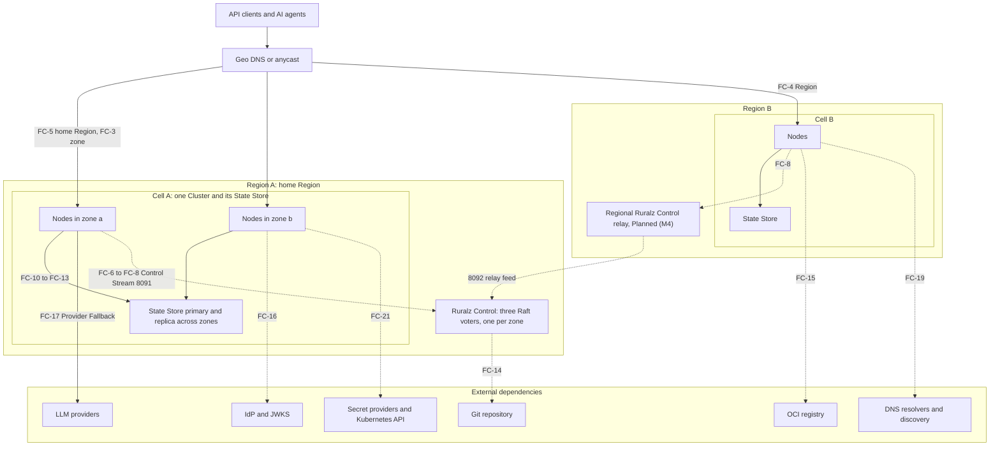
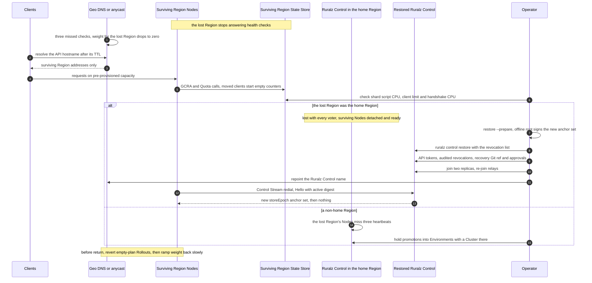

# High Availability and Disaster Recovery

## Summary

This document tells operators what fails, what keeps working and how to recover: degraded modes (Last-Known-Good, local rate-limit fallback, `failureMode`), recovery objectives, backups, runbooks and game days. Nodes never wait on Ruralz Control, so its failures cost requests nothing, except derived ceilings after a rebuild; State Store and Region losses have their own traffic RTOs. Nothing is implemented: Node recovery is Planned (M1), Ruralz Control and backups Planned (M2), multi-region Planned (M4). For operators and architects.

## Scope and non-goals

In scope: failure behavior at component boundaries, degraded modes, recovery objectives, backup practice, runbooks and chaos drills. "Pack 8.2" names a [foundation pack](../_meta/foundation-pack.md) section.

This document decides OQ-system-overview-13 (`/readyz` never fails for detachment) and OQ-scalability-and-distributed-state-7 (option (a) below), and carries OQ-system-overview-12 and OQ-deployment-topologies-18 and -20, with every option, into [Open questions](#open-questions); their original IDs close at conformance.

Non-goals, with owners: accuracy bounds and chaos pass criteria ([Scalability](../architecture/11-scalability-and-distributed-state.md)); Control Store, fencing and backup internals ([Control plane](../architecture/04-control-plane-and-gitops.md)); upgrade rollback ([Release](../engineering/04-release-versioning-and-compatibility.md), [Zero-downtime upgrades](02-zero-downtime-upgrades-and-hot-reload.md)); layouts ([Deployment topologies](01-deployment-topologies.md)); performance values ([Performance budgets](../architecture/12-performance-budgets-and-benchmarking.md)); State Store product operations beyond the rules below.

## Failure catalog

*Figure 1: failure domains and external dependencies; edge labels name catalog rows; dashed edges are off the request path.*



Symbols follow [Scalability](../architecture/11-scalability-and-distributed-state.md#consistency-and-accuracy-bounds):

```text
R              active Regions
N              Nodes per Ruralz Control deployment
N_serving      a Cell's serving Nodes
N_published    the published Node count; N_frozen that count frozen by an outage
N_reenrolled   unqualified Nodes re-enrolled or reconnected after a rebuild or list-less restore
list-less      a restore without the Node revocation list, which also loses qualification
ceiling        a limits[] entry's per-Node ceiling; requests its Cell-wide limit per window
```

Rows are Planned in their component's milestone. "Traffic" means request handling; "management" means Rollouts, Enrollment, Drift, Ruralz Console and the REST API.

| ID | Failure | Blast radius | Behavior during the failure | Detection | Recovery |
|---|---|---|---|---|---|
| FC-1 | Node process or host lost | Its in-flight requests and connections (SG-3) | Survivors serve; at most one extra ceiling per key per restarted Node (target) | `/readyz` on 9901; missed heartbeats | Replacement boots Last-Known-Good or its Bundle, or re-enrolls if `${RURALZ_DATA_DIR}` is lost; Kubernetes: force-delete the pod or taint the host `node.kubernetes.io/out-of-service` ([T4](01-deployment-topologies.md#t4-kubernetes-with-helm-hpa-and-crds)) |
| FC-2 | Node restarted while Ruralz Control is down | One Node | Boots Last-Known-Good, detached, after up to 5 s (target); without it, not ready | Readiness | Automatic |
| FC-3 | Availability zone lost | Its Nodes, a zonal State Store primary, one voter, often Vault or the Kubernetes API (FC-21) | Survivors under 80% CPU when [sized](../architecture/11-scalability-and-distributed-state.md#high-availability) (target); State Store failover; quorum holds | Balancer health; failover | Force-delete stranded pods (T4); [replace the voter](#raft-quorum-loss-and-replica-replacement) |
| FC-4 | Non-home Region lost | Its Cells | Clients move, counters empty; survivors count alone, up to R × each limit (target), absorbing its State Store calls and TLS handshakes | Geo health checks; survivor script CPU | [Region loss](#region-loss) |
| FC-5 | Home Region lost | Its Cells and every voter | Other Regions serve; Rollouts, Enrollment and Drift stop (`RZ-CP-004`); new Nodes stay not ready | Relays stale; REST API unreachable | [Region loss](#region-loss) |
| FC-6 | Ruralz Control leader lost | Management only | New leader in about 1 to 2 s plus election round trips (hypothesis); Rollouts resume; zero request errors (CE-7) | `ruralz_control_leader_info` | Automatic |
| FC-7 | Raft quorum lost | Management of every Cell served | Writes, logins, Enrollment stop (`RZ-CP-004`); stale replicas serve only Nodes without an active digest; the Node count freezes | `ruralz_control_leader_contact_age_seconds` | [Raft quorum loss](#raft-quorum-loss-and-replica-replacement) |
| FC-8 | Control Stream ([ADR-0007](../adr/0007-control-stream-protocol.md)) partition | Cut-off Nodes | Detached, `/readyz` 200; jittered redial, base 1 s, cap 60 s (target); revocations and promotions wait | Three missed heartbeats (target) | Automatic: `Hello` presents the active digest |
| FC-9 | Ruralz Control replica overloaded or restarted | Its Control Streams | `Reconnect` (`shed`, `rebalance`); all Nodes back within 5 minutes of a full restart (target) (CE-10) | `RZ-CP-010` | ceil(N / 5,000) + 1 replicas (hypothesis) |
| FC-10 | State Store unreachable or black-holed | One Cell | One deadline per request at most, none once the breaker opens; [fail-open rules](#fail-open-and-fail-closed-behavior) | Reason `state_store_breaker_open`; `ruralz_state_ops_total`; `RZ-STS` codes only under `closed` | Automatic; [rebuild](#state-store-rebuild) if data is lost |
| FC-11 | State Store partition: some Nodes, or one shard | Cut-off Nodes or the shard's keys | Cut-off Nodes admit per the fail-open rows, connected ones per the healthy GCRA row | Breaker state differs across Nodes | Fix the path |
| FC-12 | State Store primary failover | One Cell | `failureMode` about 15 s (hypothesis); lag × rate extra per key (hypothesis) | `NOSCRIPT`, then `SCRIPT LOAD` | Automatic within 15 s (target) (CE-5) |
| FC-13 | State Store full or evicting | One Cell | Stores skip above 70% of `maxmemory` (target); full: limits open, `closed` Token Budgets 503; eviction resets counters | Reason `state_store_eviction_policy` | Add shards; `noeviction` MUST be set |
| FC-14 | Git repository unavailable | Changes only | No new Revisions (`RZ-CP-011`); recorded Revisions, Rollouts and reverts work | `RZ-CP-011` | Forge recovery, or a mirror |
| FC-15 | OCI registry unavailable | Changes; Plugins not yet cached | File-mode Nodes keep serving; Plugin fetches NACK transient, then quarantine | Transient NACKs | A mirror above 100 Nodes per Region (hypothesis) |
| FC-16 | IdP or JWKS unreachable | `auth.jwt` Routes for that issuer | Cached keys serve until expiry (`max-age` clamped to 5 minutes to 6 hours, default 1 hour (target)), then 401 `RZ-AUTH-006` | Reason `jwks_stale`; `ruralz_auth_jwks_age_seconds` | Closed by design (P9) |
| FC-17 | LLM provider outage or throttling | One `AIModel` candidate | Provider Fallback before commit, inside the residency class; after commit `RZ-AI-009`; exhausted `RZ-AI-005` | Cooldowns: one failed attempt each per Node (hypothesis) | Automatic, Planned (M3) |
| FC-18 | Plugin crash: trap, timeout or memory cap | That Plugin's Routes | Instance discarded; `failureMode` decides (closed only for auth and authz); the Node survives; the memory cap refuses new instances | `RZ-PLG` counters; canary gate | Before `complete`, `ruralz rollout rollback`; after, `ruralz rollout start` of the replaced Revision (step-up TOTP; `RZ-CP-006` if `security`); file mode: CI republishes the old digest; or roll forward |
| FC-19 | DNS failure | Discovery Upstreams; Nodes resolving Ruralz Control or the State Store | Discovery keeps its last set, counting NXDOMAIN after 3 refreshes (target); failed dials detach or apply `failureMode` | Reason `discovery_stale` | Fix resolvers; short TTLs |
| FC-20 | Bad Revision | Canary Nodes of one Cluster; all Nodes of a file-mode source | Gates fail: `rolled-back` or `paused` per `autoRollback` | Deterministic NACK; 5xx gate | As FC-18 |
| FC-21 | Secret provider (`vault`, `kubernetes`) or Kubernetes API down | Restarting and new Nodes using them; `kubernetes` discovery | Running Nodes keep values; cold starts stay not ready; discovery keeps its last set | `/readyz` reason; `ruralz_upstream_degraded_info` | Recovery; TLS keys and `stateStore.url` on `file` or `env` |

## Degraded modes

Every degraded mode is a metric (P10, SG-8) named by [Observability](../architecture/10-observability.md); [Control plane](../architecture/04-control-plane-and-gitops.md#behavior-during-a-ruralz-control-outage) and [Scalability](../architecture/11-scalability-and-distributed-state.md#consistency-and-accuracy-bounds) win on conflict.

### Detached Nodes and Last-Known-Good

A detached Node serves its active Revision and stays ready indefinitely (pack 8.5), deciding OQ-system-overview-13 as "never": failing `/readyz` on staleness would evacuate a Cell's Nodes during the incident it signals.

| Situation | Behavior | Operator consequence |
|---|---|---|
| Node restarts while detached | Pack 8.2 boot order: upgrade handover, then Last-Known-Good after up to 5 s (target) | Restarts boot Last-Known-Good within 30 s (target) (CE-8) |
| Last-Known-Good boot with unresolvable `secretRef` | Not ready until every reference resolves; secrets are never on disk (FC-21) | Keep TLS keys and the State Store URL on `file` or `env` |
| Last-Known-Good uses a field newer than the binary | `RZ-CFG-024`; not ready ([rollback limit](../engineering/04-release-versioning-and-compatibility.md#binary-rollback-limit)) | Never roll back a binary during a Ruralz Control outage |
| Last-Known-Good accepted from a removed signing key after `compromisedSince` | Refused at boot until the Control Stream delivers (proposed, OQ-control-plane-and-gitops-24) | Emergency key removal costs restarts during an outage |
| New Node, no Last-Known-Good | Not ready until it enrolls (pack 8.11) | Autoscaling adds nothing: hold 30% headroom (target); reschedulable Nodes MUST keep `${RURALZ_DATA_DIR}` persistent |
| Detached beyond the 30-day certificate lifetime (target) | Keeps serving; on return `RZ-CP-003` | Re-enroll ([OQ-high-availability-and-disaster-recovery-4](#open-questions)) |
| Restarted while detached | Forgets revocations until Ruralz Control returns (OQ-security-and-identity-5) | Rotate urgent revocations at the credential's source (IdP key, API key) |

The new-Node row is option (a) of OQ-scalability-and-distributed-state-7, headroom being a SHOULD; (b) OCI seeding and (c) Last-Known-Good in images stay open in [OQ-high-availability-and-disaster-recovery-1](#open-questions).

### Local rate-limit fallback

While the State Store fails, local token buckets at per-Node ceilings are the only limiter ([ADR-0008](../adr/0008-rate-limiting-local-bucket-and-gcra.md)); the breaker opens when 50% of at least 20 calls in 5 s fail (target) and half-opens after 1 to 3 s (target).

Admission per key and window, at most:

```text
Declared per-Node ceiling                      N_serving × ceiling                                (target)
Derived ceiling, current Node count            N_serving × max(1, 2 × requests / N_published)     (target)
Count frozen by a Ruralz Control outage        N_serving × max(1, 2 × requests / N_frozen)        (target)
                                               20 × requests after a 10 to 100 scale-out          (hypothesis)
Control-mode Node restarted without a count    clamp max(1, requests / 100) per such Node         (target)
File mode without a declared ceiling           N_serving × requests                               (target)
Rebuild or list-less restore, count collapsed  N_reenrolled × 2 × requests until re-qualified     (hypothesis)
```

Autoscaled Control-mode Clusters, and any a rebuild or list-less restore may hit, SHOULD declare per-Node ceilings in advance, since outages and scale-out combine the worst cases and recovery cannot deliver them.

### Fail-open and fail-closed behavior

`failureMode` follows pack 8.10: registry defaults apply unless a Policy overrides them, and security types are closed only (RZ-CFG-029).

| Policy type | Default | During a State Store or dependency failure |
|---|---|---|
| `auth.*`, `authz.*`, auth or authz `plugin` | Closed only | 401 or 403; JWKS keys serve until expiry first (FC-16) |
| `ratelimit` | Open | Local buckets only |
| `quota` | Open | Unmetered; such Routes SHOULD also carry a `ratelimit` |
| `cache`, `ai.semantic-cache` | Open | Bypassed; origin or provider load rises |
| `ai.token-budget` | Closed | 503 `RZ-STS-001` to `RZ-STS-004`: a State Store outage is an AI outage in that Cell (default: OQ-configuration-model-8) |
| Other `plugin` Policies | Closed | Per the Policy; a trap discards the instance only |

Upstream failures follow the [failure matrix](../architecture/09-traffic-management-and-resilience.md#failure-matrix), Token Budgets [ADR-0014](../adr/0014-ai-api-surface.md).

## RPO and RTO

Recovery point (RPO) and time (RTO) objectives bound lost data and time to recovery, for traffic and management separately; management recovers when Ruralz Control accepts writes, Rollouts up to one ACK timeout, 60 s (target), later. Counters are never restored ([bounds](../architecture/11-scalability-and-distributed-state.md#consistency-and-accuracy-bounds)).

| Component and failure | Data at risk | RPO | Traffic RTO | Management RTO |
|---|---|---|---|---|
| Node lost | In-flight requests only | No configuration lost (target) | Survivors at once; replacement ready 30 s after pod release, itself up to 5 minutes on Kubernetes (target) until OQ-high-availability-and-disaster-recovery-2 | Not affected (target) |
| Node disk lost | Identity, Last-Known-Good | Re-derived from Ruralz Control (target) | Survivors at once (target) | One Enrollment (target) |
| Availability zone lost | State Store writes within replication lag | Lag, 1 s or less (target) | 30 s or less on survivors (target); State Store 15 s or less (target) | Unchanged with voters in three zones (target) |
| Non-home Region lost | That Region's counters and caches | Not recovered: one extra limit per open window (target) | About 2 minutes, at most 5 (target), below | Unchanged (target) |
| Ruralz Control leader lost | None committed | Zero committed writes (target) | Zero request errors (target) | 10 s or less (target) |
| Raft quorum lost, replicas recoverable | None committed | Zero committed writes (target) | Zero request errors (target) | 30 minutes or less (target) |
| Control Store lost with its Region, or a voter majority lost for good | Writes after the newest backup in the second Region | 75 minutes or less: hourly, copied within 10 minutes (target) | Zero request errors (target); Node count per the [hold](#holding-deliveries-during-recovery) | 4 hours or less with relay rebuild, excluding post-backup Nodes' re-enrollment (target) |
| Control Store and every backup lost | Rollout history, audit log, users, Enrollments | Configuration: none, Git holds it (target); records: all | Zero request errors with declared ceilings or OQ-high-availability-and-disaster-recovery-9 (a) (target); otherwise [hold step 0](#holding-deliveries-during-recovery) | 8 hours or less, re-enrollment excluded (target) |
| Re-enrollment of every Node | Enrollment identities | None (target) | One zone's capacity drains at a time (target); with derived ceilings, also [hold step 0](#holding-deliveries-during-recovery) | 30 minutes or less for 10,000 Nodes (target), below |
| State Store primary lost | Writes within replication lag | Lag, 1 s or less (target) | `failureMode` for 15 s or less (target) | Not affected (target) |
| State Store deployment lost | Every counter and cache entry | All, unless persistence is on (target) | `failureMode` until rebuilt, 30 minutes or less (target), plus a zonal Drain if `stateStore.url` changes | Not affected (target) |
| Bad Revision in Control mode | None | None (target) | Canary bake or 200-request sample, then a revert within three ACK timeouts per Node (target) | Not affected (target) |

```text
Regional failover   3 missed geo checks × 10 s + API hostname TTL ≤ 60 s + client retry  (target)
                    ≈ 2 minutes; caches past the TTL extend it; anycast: route withdrawal (target)
Re-enrollment       Z × (t_drain + (N / Z) / min(20 per s per leader, L_src × A) + t_slow)  (hypothesis)
                    Z zones, t_drain about 30 s (target), L_src the per-source Enroll limit,
                    A egress addresses, t_slow the 30 to 60 s slow start                    (target)
                    10,000 Nodes, 3 zones: 3 × (30 s + 167 s + 60 s) ≈ 13 minutes           (hypothesis)
```

Behind shared egress, `Enroll` limits MUST be keyed so L_src × A reaches 20 per second (hypothesis) (OQ-deployment-topologies-15).

## Backups

`ruralz control backup` and `ruralz control restore` are Planned (M2) ([ADR-0006](../adr/0006-control-store-raft-boltdb.md), proposed). A backup is a Raft snapshot plus referenced content, consistent at one index, encrypted and signed; downloads need `admin` and are audited ([backup internals](../architecture/04-control-plane-and-gitops.md#backup-restore-and-postgres)).

### What to protect

| Asset | Source of truth | Protection | Frequency |
|---|---|---|---|
| Bundle and `control/` directory | Git | Forge replication or a fetchable mirror | Continuous |
| Control Store, with Revision content, plans, audit segments, encrypted keys and CAs | Ruralz Control | `ruralz control backup`, copied off-cluster and to a second Region | Hourly (target) and before each upgrade |
| Node revocation list | Control Store | Exported beside each backup (proposed; [OQ-high-availability-and-disaster-recovery-6](#open-questions)) | With each backup |
| Backup key (OQ-cli-and-api-surface-9), offline trust-root key; SHOULD: CA keys and key-encryption key, so a rebuild keeps the 8091 server CA | Operator custody | Offline, never with backups | On rotation |
| Audit log | Control Store | Export (OQ-control-plane-and-gitops-12) to a separate system; MUST for multi-region, holding revocations after the newest backup | Continuous |
| Signed Revisions and Plugins in OCI | Registry | Replication or a mirror, by digest | Continuous |
| State Store data | State Store | Persistence for Quota or Token Budget windows over one day (SHOULD); never restore an old snapshot, which rewinds counters | Server setting |
| `${RURALZ_DATA_DIR}` on Nodes | Node | Persistent volume; not backed up | Not applicable |
| Secrets behind `secretRef` | Secret providers | The provider's own backup | Provider's |

Keep hourly backups 7 days and daily ones 90 days (target). The Control Store holds 50 Revisions per Environment (target); older ones re-render from Git only on the `ruralz-control` minor that built them (OQ-release-versioning-and-compatibility-12), and `ruralz bundle push` or CRD sources live only in backups.

### Taking and checking backups

An external scheduler runs the backup with an `admin` API token (built-in scheduling: [OQ-high-availability-and-disaster-recovery-7](#open-questions)):

```bash
ruralz control backup \
  --control https://control.shop.example:8090 \
  --token-file /run/secrets/ruralz-backup-token \
  --output-file /backups/ruralz-control-2026-09-25T10.bak
```

Rules:

1. Copy each backup to a second Region within 10 minutes of its start (hypothesis), as [RA-3](01-deployment-topologies.md#ra-3-multi-region-active-active-with-cells) requires for multi-region.
2. Before a Ruralz Control upgrade, back up and pause `ruralz bundle push` until finalize ([upgrades](../engineering/04-release-versioning-and-compatibility.md#ruralz-control-upgrades)); after finalize, rollback restores that backup.
3. Restore with the binary minor that wrote the backup ([OQ-high-availability-and-disaster-recovery-8](#open-questions)).
4. Verify each backup's signature and decryption at creation; monthly, restore the newest into an isolated scratch deployment with GD-9 (target), as an unrestored backup is unverified.
5. Measure freshness in the second Region, whose newest verified copy sets the Region-loss RPO: alert above 75 minutes, page at 2 hours (target).

## Runbooks

Runbooks are Planned per component: Ruralz Control Planned (M2), relays and multi-region Planned (M4), State Store Planned (M1). First confirm request traffic is healthy; most failures here are management-only.

### Holding deliveries during recovery

A Rollout to a Cluster with no connected Nodes has an empty plan and completes at once ([Rollout plan](../architecture/04-control-plane-and-gitops.md#rollout-plan-batches-and-gates)): the promoted digest advances, `promotion.from` counts it `complete`, and returning Nodes activate the Revision without a canary. A restored or rebuilt deployment renders the tracked branch head, possibly untested: without `requireApproval` its plans complete, and with it each Environment holds one record, for the head. Until OQ-high-availability-and-disaster-recovery-3 decides, restores and rebuilds run this hold before any Node connects:

0. After a rebuild or list-less restore, until OQ-high-availability-and-disaster-recovery-9 (a) ships, check each Cluster using derived ceilings: keys above 25% of a shard (hypothesis) should use `config.localOnly` (proposed, OQ-scalability-and-distributed-state-11). Otherwise, before its Nodes reconnect or re-enroll, shift its weight to other Cells, or accept the bound below and watch State client breakers.
1. Find each Cluster's served commit with `ruralz bundle diff` against sample Nodes in every zone, passing each candidate's own `control/environments.yaml` (rebuild step 4); after a restore, start from restored assignments' digests.
2. Push a recovery branch at that commit, plus a commit setting `promotion.requireApproval: true` on every Environment with `promotion.from` (no digest changes), and set Ruralz Control's `git.branch` (process configuration) to it; until then, run the replica without a Git source. A root Environment, without `promotion.from`, cannot be gated; the branch alone pins what it renders.
3. In `promotion.from` order, approve records at or before each Environment's served commit; they complete empty. If Environments serve different commits, advance the branch through them, oldest first, ending at the root Environments' served commit, since their plans complete at whatever it names. Final promoted digests MUST equal served digests. If an Environment's Clusters serve different commits, or a restored Rollout is still `canary`, `progressing` or `paused`, pause it, approve nothing and escalate: aligning needs a delivery, and a stale restored assignment would re-deliver an older Revision.

   ```bash
   ruralz rollout approve --control https://control.shop.example:8090 --token-file ~/.ruralz/token \
     --env prod --digest sha256:<served digest>
   ```

4. After reconnect, confirm with `ruralz node list` that every active digest equals its Cluster's promoted digest; only then is traffic unchanged. Set `git.branch` back to the tracked branch and restore normal gates by an approved change, so newer commits get a canary.

After a rebuild or list-less restore no Node is qualified, so the first `HeartbeatReply` can collapse the published count until OQ-high-availability-and-disaster-recovery-9 decides; [declared ceilings](#local-rate-limit-fallback) avoid it, step 0 bounds it:

```text
Derived ceiling   max(1, 2 × requests / N_published) → the full limit as N_published → 0
Hot-key GCRA      2 × requests → up to N_reenrolled × 2 × requests per window, opening shard breakers
Breakers open     co-tenant Rate Limits use local buckets; closed Token Budgets return RZ-STS-003
Over-admission    up to N_reenrolled × 2 × requests per key per window                   (hypothesis)
Count recovery    10 min qualification, then +10% per minute: 10 to 1,000 Nodes ≈ 58 minutes  (hypothesis)
```

### Region loss

*Figure 2: regional failover; the alt branch covers losing the home Region, Region A in Figure 1.*



Non-home Region lost (FC-4):

1. Confirm geo steering removed the Region within the [failover parameters](#rpo-and-rto); if checks lag, zero its weight by hand.
2. Check survivor Cell resources at the moved load ([Capacity planning](03-capacity-planning.md)). Keep Nodes within the shard-derived `maxReplicas` ([Sizing defaults](01-deployment-topologies.md#sizing-defaults)) and 1,000 per Cell (target); add shards first.

   ```text
   Nodes             R / (R − 1) of peak                                  (target)
   Script CPU        under 70% (target), from 50% provisioned             (hypothesis)
   Client limit      above 10 × N_serving                                 (target)
   Reconnect storm   λ_storm × c_hs within 10% of CPU                     (target)
   ```

3. Expect up to R × each regional limit, plus one extra per open window for spend-bearing Quotas unless tenants are Region-pinned or quotas divided ([topologies](../architecture/11-scalability-and-distributed-state.md#topologies)).
4. A running Rollout into the lost Cluster lags, then ends `rolled-back` or `paused` per `autoRollback`; a later promotion completes with an empty plan, activated by returning Nodes without a canary (OQ-high-availability-and-disaster-recovery-3). While the Region is lost, operators MUST hold promotions into every Environment with a Cluster there: approve nothing under `requireApproval`, else commit `promotion.requireApproval: true` where `promotion.from` exists, a tightening that needs no approval, and freeze merges to the tracked branch while it holds a root Environment's Cluster.
5. Before the Region returns or its weight rises, check its Clusters with `ruralz rollout status <cluster>` and revert each empty-plan Rollout from the loss (`ruralz rollout start` of the replaced Revision) unless it passed a canary elsewhere; with the Nodes away, the revert also completes at once. Returning Nodes get their assigned Revision and an empty State Store; ramp weight back gradually, slow-starting 30 to 60 s (target).

Home Region lost (FC-5), Planned (M4) for multi-region, or a single-Region total loss:

1. Run non-home steps 1 to 3 and 5 for the home Region's Cells. Restore only if Rollouts, Enrollment, revocations or scale-out cannot wait.
2. Stop the old replicas, a second, older deployment, from starting on return: scale their StatefulSet to zero or block 8090 to 8092 at the network or DNS, then wipe them ([OQ-high-availability-and-disaster-recovery-5](#open-questions)).
3. In the surviving Region, prepare a new online key; the offline trust-root holder signs an anchor set holding it.
4. Before any Node reconnects, restore the newest copy. Its higher `storeEpoch` makes Nodes reject older assignments ([fencing](../architecture/04-control-plane-and-gitops.md#fencing-stale-replicas)), and they verify every signature ([ADR-0017](../adr/0017-artifact-signing.md)); it resets Raft membership to this voter and drops old peer certificates, cutting relays' 8092 feed.

   ```bash
   ruralz control restore --prepare --data-dir /var/lib/ruralz-control          # step 3
   ruralz control restore /backups/newest.bak --data-dir /var/lib/ruralz-control \
     --advertise control-b1.shop.example:8092 --anchor-set anchors.signed \
     --backup-key-file /run/secrets/backup-key --revocation-list revoked.list
   ```

5. Recreate API tokens, then re-issue `ruralz node revoke` for each post-backup revocation in the external audit export; without it, those certificates stay valid until expiry.
6. Run [hold](#holding-deliveries-during-recovery) steps 0 to 3.
7. Add two voters (`ruralz control join`, then `ruralz control serve`); repoint forge webhooks and the name Nodes dial (OQ-control-plane-and-gitops-13). Re-join each wiped relay with a new relay-role token (OQ-control-plane-and-gitops-15), or point its Nodes at the restored replicas.
8. Finish hold step 4. Nodes enrolled after the backup, lacking Enrollment records, fail `Hello` with `RZ-CP-002` or `RZ-CP-003`: re-enroll them as in rebuild step 7 (OQ-high-availability-and-disaster-recovery-4).

### Ruralz Control rebuild from Git

For when every backup is lost or unusable. Git keeps configuration; Rollout history, users, bindings, Enrollments, unexported audit entries and `ruralz bundle push` or CRD Revisions are lost.

1. Use the `ruralz-control` and `ruralz` CLI minor that built the served Revisions, per release and deployment records. Start one replica with `ruralz control serve` on an empty data directory, with escrowed CAs or new ones; create the first `admin` and `security-admin` (OQ-deployment-topologies-11).
2. Upload an anchor set signed by the existing offline trust-root key, keeping one root chain; its higher `storeEpoch` lets Nodes accept the new, low sequences.
3. An `admin` creates at least two `approver` accounts with TOTP, bound per Environment, and registers commit-signing keys; an unsigned commit needs two approvers.
4. Before Ruralz Control reads Git, render candidate commits against each Cluster's Nodes. Equal commits render equal digests only at the same binary minor and schema levels (OQ-release-versioning-and-compatibility-12); if none matches, hold that Cluster and escalate, never letting its promotion complete. Always pass the candidate's own `control/environments.yaml` with `--environments`, never the Control Store's variables.

   ```bash
   git -C repo checkout <candidate commit>
   ruralz bundle diff repo/bundle https://node-a.shop.example:9901 --env prod \
     --environments repo/control/environments.yaml \
     --admin-token-file /run/secrets/ruralz-admin-token   # exit 0: this commit is served
   ```

5. Run [hold](#holding-deliveries-during-recovery) steps 0, 2 and 3.
6. Join two more replicas.
7. Re-enroll Cluster by Cluster, one zone at a time, the current answer to OQ-high-availability-and-disaster-recovery-4 and blocked on it; a kept identity ignores tokens and, without escrowed CAs, pins the old 8091 server CA. Traffic changes by the draining zone's capacity (target) and, with derived ceilings, by the [hold step 0](#holding-deliveries-during-recovery) bound for about 58 minutes (hypothesis).

   ```bash
   CONTROL="--control https://control.shop.example:8090 --token-file ${HOME}/.ruralz/token"
   ruralz node drain --data-dir /var/lib/ruralz                   # each Node of the zone
   mv /var/lib/ruralz/identity /var/lib/ruralz/identity.old       # keep lkg/
   ruralz node token $CONTROL --cluster prod-eu-west --output-file /run/secrets/ruralz-enroll-token
   # restart ruralzd with that token; before the next zone:
   ruralz node list $CONTROL --cluster prod-eu-west               # active equals promoted digest
   ```

8. Finish hold step 4, then take a backup at once.

### State Store rebuild

Use when a Cell's State Store deployment is lost, corrupted or configured with eviction.

1. Confirm the scope: reason `state_store_breaker_open` and failing `ruralz_state_ops_total` on the Cell's Nodes only. Rate Limits run on local buckets; `closed` Token Budgets return 503.
2. If spend-bearing AI traffic cannot wait, shift the Cell's weight to other Cells, which admit one extra limit per open window (target).
3. Provision the replacement per [availability](../architecture/11-scalability-and-distributed-state.md#state-store-availability):

   ```text
   Topology         a primary and replica with automatic failover across zones
   Memory           maxmemory-policy noeviction
   Access           TLS and authentication
   Persistence      for Quota or Token Budget windows over one day
   Clients          a client limit above 10 × N_serving                       (target)
   ```

4. Prefer a replacement at the same `stateStore.url` value (same DNS name or service), so no secret changes. Otherwise use the new-Cell row of [upgrades](02-zero-downtime-upgrades-and-hot-reload.md#state-store-upgrades), or change the value and Drain Nodes zone by zone for every provider until OQ-zero-downtime-upgrades-and-hot-reload-9 decides rotation behavior.
5. Nodes redial with full jitter, base 100 ms, cap 5 s (target), run `SCRIPT LOAD` and close breakers after 3 successful probes (target).
6. Expect empty counters (one extra limit per open window, Quota windows up to 720 h (target)) and cold caches: watch origin and provider load.
7. Restore geo weight, then confirm `ruralz_state_writes_dropped_total` returns to baseline.

### Raft quorum loss and replica replacement

1. If a majority of voters can return, restart them; the Control Store resumes with zero committed writes lost (target).
2. To replace one voter after volume or zone loss, an `admin` runs `DELETE /api/v1/replicas/{serverId}` (step-up TOTP; refused for the leader, `RZ-CP-019`), mints a join token at `/api/v1/replicas`, and the new host runs `ruralz control join` then `ruralz control serve`; it votes after catch-up.
3. If no majority can return, restore the newest backup as in home Region steps 2 to 8, discarding committed writes a surviving minority still holds.

## Game days

Game days rehearse runbooks on staging Clusters under open-loop load; the [Chaos job](../architecture/11-scalability-and-distributed-state.md#chaos-experiments) automates CE experiments (tooling: OQ-scalability-and-distributed-state-10). Each runs quarterly (target), GD-9 monthly (target), and gates its milestone.

| ID | Experiment | Fault injected | Pass criteria | Milestone |
|---|---|---|---|---|
| GD-1 | Node loss | SIGKILL one Node at 50% load (target), CE-1; on Kubernetes, power off a host | Errors only on its in-flight requests; no Quota under-charge; replacement ready 30 s after pod release (target) | Planned (M1) |
| GD-2 | Zone loss | Black-hole one zone's Nodes and State Store primary | Survivors under 80% CPU (target); State Store `failureMode` 15 s or less (target) | Planned (M1) |
| GD-3 | State Store outage | Black-hole for 60 s (target), CE-4 | Admission within fail-open bounds; `closed` Token Budgets get `RZ-STS-001`, then `RZ-STS-003` | Planned (M1) |
| GD-4 | State Store partition | Cut half the Nodes from the State Store | Cut-off Nodes within fail-open ceiling rows, connected ones within the healthy GCRA row (target) | Planned (M1) |
| GD-5 | State Store rebuild | Delete the deployment, run the runbook | Traffic RTO met; no `state_store_eviction_policy` reason afterward | Planned (M1) |
| GD-6 | Leader loss | Kill the leader mid-Rollout, CE-7 | Zero request errors; the Rollout resumes | Planned (M2) |
| GD-7 | Quorum loss with restarts | Remove quorum, restart 10% of Nodes (target), CE-8 | Restarts boot Last-Known-Good within 30 s (target) | Planned (M2) |
| GD-8 | Replica replacement | Delete one voter's volume | Replaced with no quorum loss | Planned (M2) |
| GD-9 | Restore drill | Restore the newest backup, with the hold, into a scratch deployment production Nodes cannot resolve; anchor set per OQ-high-availability-and-disaster-recovery-10 | RPO and management RTO met; revocation list accepted; as GD-10 | Planned (M2) |
| GD-10 | Rebuild from Git | Rebuild a staging Ruralz Control without backup, with the hold and OQ-high-availability-and-disaster-recovery-9 (a) or declared ceilings | Each promoted digest equals its Nodes' active digest before reconnect; the published count drops at most 10% (target); no State client breaker opens | Planned (M2) |
| GD-11 | External dependencies | Git, OCI registry and JWKS unreachable for 1 hour (target) | No request errors until cached keys expire, then `RZ-AUTH-006`; changes resume | Planned (M2) |
| GD-12 | LLM provider outage | Primary candidate returns 429 and 5xx | Provider Fallback before commit; no residency violation | Planned (M3) |
| GD-13 | Plugin crash | Plugin traps on every call | Node stays up; `failureMode` per Policy; canary rolls back | Planned (M2) |
| GD-14 | Region evacuation | Cut a Region with its State Store and relay, CE-11 and CE-17 | No cross-Region State Store dial; survivors serve full peak, 99% of requests within 5 minutes (target), script CPU under 70% (target), no breaker open, handshake p99 within C2 (target) | Planned (M4) |
| GD-15 | Secret provider down | Stop Vault or the Kubernetes API with one zone | Nodes with only `file` or `env` references boot within 30 s (target); others stay not ready | Planned (M2) |
| GD-16 | Rebuild with derived ceilings | GD-10 without its precondition; one `config.localOnly` key above 25% of a shard | Digests as GD-10; per key at most N_reenrolled × 2 × `requests` per window (target); no GCRA call for that key | Planned (M2) |

## Open questions

| ID | Question | Options | Owner | Blocking? |
|---|---|---|---|---|
| OQ-high-availability-and-disaster-recovery-1 | Carries OQ-system-overview-12: how are break-glass changes made and new Nodes seeded during a Ruralz Control outage? | (a) None (current); (b) seed from a signed OCI Revision, amending pack 8.2 and 8.11 (proposed); (c) an admin override; (d) Last-Known-Good in images | high-availability-and-disaster-recovery | No |
| OQ-high-availability-and-disaster-recovery-2 | Carries OQ-deployment-topologies-20: who automates voter removal after volume or zone loss, and how are stranded Node pods released? | (a) A chart Job removes the voter, mints a join token; runbooks force-delete pods (proposed); (b) manual removal by an `admin` (current); (c) higher `minReplicas` or zone-replicated volumes; (d) Nodes as a Deployment | high-availability-and-disaster-recovery | Yes, for the Planned (M2) chart |
| OQ-high-availability-and-disaster-recovery-3 | Should plans with zero or far fewer members than the published Node count stay `pending`, and restored or rebuilt deployments hold deliveries until confirmed? | (a) Complete, plus the runbook hold (current); (b) such plans stay `pending` or `paused` (proposed); (c) a restore-hold mode adopting reported digests; (d) hold returning Clusters until canaried | control-plane-and-gitops | Yes, for Planned (M2) restore |
| OQ-high-availability-and-disaster-recovery-4 | Carries OQ-deployment-topologies-18: how do serving Nodes re-enroll in bulk after a restore, rebuild or expiry, as a kept identity ignores tokens and pins the old server CA? | (a) Background re-enrollment on `RZ-CP-003` with batched tokens (proposed); (b) rolling Drain and restart per zone (current) | control-plane-and-gitops | Yes, for Planned (M2) restore |
| OQ-high-availability-and-disaster-recovery-5 | How is a pre-restore deployment fenced when its Region returns? | (a) Operator blocks, then wipes it (current); (b) a root-signed retirement record Nodes and replicas honor | control-plane-and-gitops | Yes, for Planned (M2) restore |
| OQ-high-availability-and-disaster-recovery-6 | Which command, format and signature export the revocation list beside a backup? | (a) `ruralz control backup` output (proposed); (b) a REST API export | cli-and-api-surface | Yes, for Planned (M2) restore |
| OQ-high-availability-and-disaster-recovery-7 | Should Ruralz Control schedule backups itself? | (a) External scheduler (current); (b) process configuration | control-plane-and-gitops | No |
| OQ-high-availability-and-disaster-recovery-8 | May a newer binary minor restore an older backup? | (a) Same minor only (proposed); (b) N restores N-1, then finalize | release-versioning-and-compatibility | No |
| OQ-high-availability-and-disaster-recovery-9 | Should a restored or rebuilt deployment withhold or seed `clusterNodeCount` until qualification catches up? | (a) Withhold, so Nodes keep their last count (proposed); (b) seed from `Hello` and heartbeats; (c) as written | control-plane-and-gitops | Yes, for Planned (M2) restore and GD-10 |
| OQ-high-availability-and-disaster-recovery-10 | May a restore drill sign with a drill-only root no production Node trusts? | (a) Yes (proposed); (b) offline root each drill | control-plane-and-gitops | No |

Dependency: OQ-zero-downtime-upgrades-and-hot-reload-9 (GD-5).
