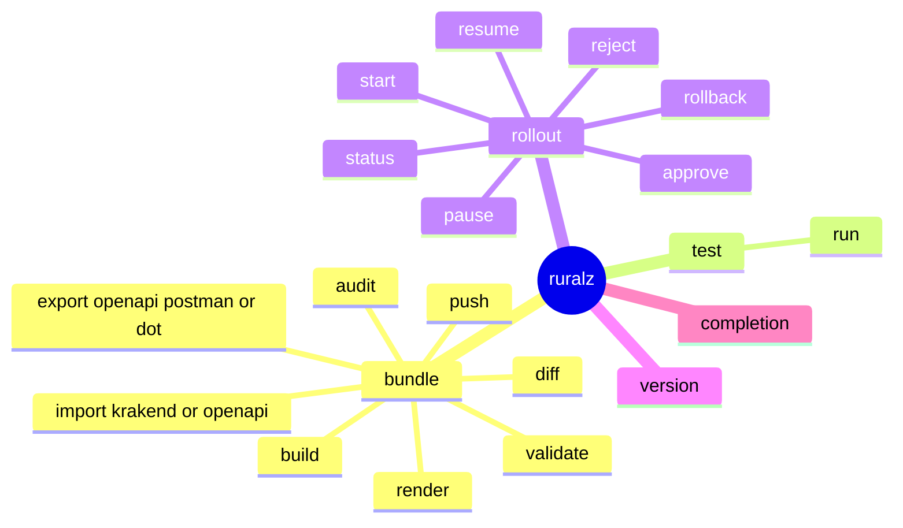
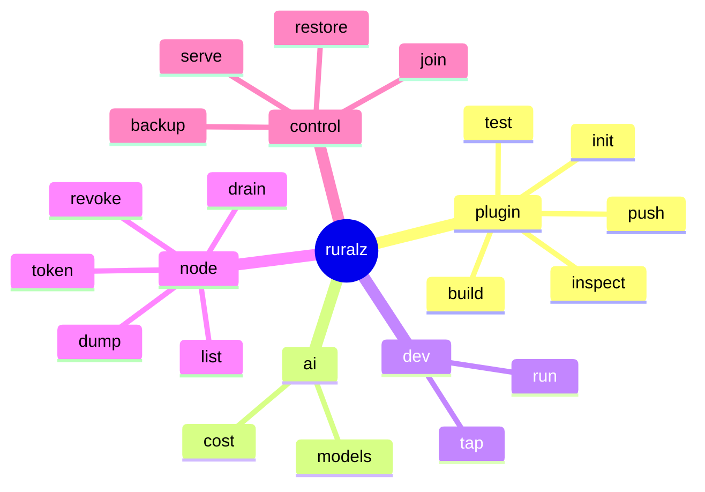
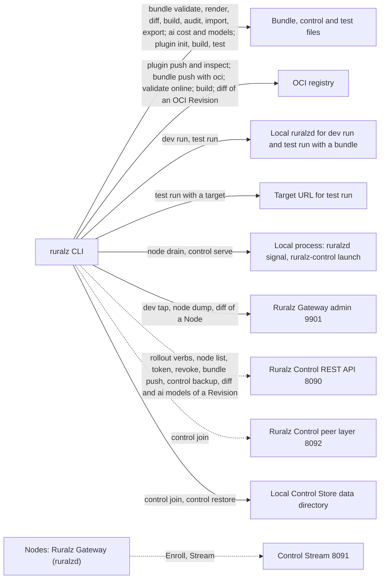

# CLI and API Surface

## Summary

Reference for every operator-facing interface: `ruralz` commands and flags, admin APIs on 9901 (Ruralz Gateway) and 9902 (Ruralz Control), the REST API on 8090, the gRPC service `ruralz.control.v1.ControlStream` on 8091, authentication, output formats and exit codes. It adds verbs and flags, defines the `ruralz test run` case format and decides delegated questions. Everything is Planned (Mx). Readers: operators, CI authors, contributors, Plugin authors.

## Scope and non-goals

In scope: the Summary's list, plus platforms. The [CLI command registry](../_meta/foundation-pack.md#9-cli-command-registry) of the binding [foundation pack](../_meta/foundation-pack.md) ("pack 9") fixes the nouns `bundle`, `rollout`, `plugin`, `ai`, `dev`, `node`, `control` and `test`; this document MAY add verbs and flags; a new noun needs a pack amendment. For OQ-tech-stack-and-libraries-18, [Tech stack and libraries](../engineering/01-tech-stack-and-libraries.md) picks a CLI framework with nested nouns, generated completions and no global state.

Non-goals, with owners:

- Kinds, fields, diagnostics and the diff model: [Configuration model](../architecture/02-configuration-model.md), which wins on conflict ([ADR-0003](../adr/0003-configuration-format.md)).
- Admin path semantics: [Data plane](../architecture/03-data-plane.md#admin-endpoints).
- REST resources, roles, Control Stream messages and `RZ-CP` codes: [Control plane and GitOps](../architecture/04-control-plane-and-gitops.md#api-summary) ([ADR-0007](../adr/0007-control-stream-protocol.md)).
- Plugin packaging: [WASM plugin system](../architecture/05-wasm-plugin-system.md#plugin-commands); credential settings: [Security and identity](../architecture/08-security-and-identity.md#admin-ports).
- Client traffic on 8080 and 8443, declared as Routes.

## CLI command tree

`ruralz` is one static `CGO_ENABLED=0` binary for Linux, macOS and Windows; commands that start or signal a server run only where that server is built ([Platform support](#platform-support)). Commands take the form `ruralz <noun> <verb>`, formats such as `krakend` being arguments, except `ruralz version` and `ruralz completion`. Flags and verbs stay deprecated for 2 minor releases (target) before removal ([Release, versioning and compatibility](../engineering/04-release-versioning-and-compatibility.md)).

*Figure 1: CLI command tree, part 1: configuration, testing and delivery.*



*Figure 2: CLI command tree, part 2: Plugin, AI, development, Node and control.*



### Command table

Every command from pack 9 and other documents, plus `ruralz rollout reject`; Figure 3 shows what each calls. `[DIR]` defaults to `.`; "Bundle flags" are `--env` and `--environments`; `--output` formats are [below](#output-formats-and-exit-codes).

| Command | Purpose | Arguments and command flags | Planned |
|---|---|---|---|
| `ruralz bundle validate` | Offline validation, source-mapped diagnostics | `[DIR]`, Bundle flags, `--online` (Plugin artifact check) | Planned (M1) |
| `ruralz bundle render` | Render one Environment's one-file Bundle | `[DIR]`, Bundle flags, `--effective --route NAME` (resolved Filter Chains), `--api-version VERSION --output-dir DIR` (conversion), `--output-file` | Planned (M1) |
| `ruralz bundle diff` | Compare FROM with TO | `FROM TO` (forms below), Bundle flags, `--from-env`, `--to-env` | Planned (M1); Revision sources Planned (M2) |
| `ruralz bundle build` | Build a Revision, print its digest | `[DIR]`, Bundle flags, `--offline` (no Plugin check), `--output-file` (`ruralz.canonical.v1`) | Planned (M1) |
| `ruralz bundle push` | Send source to Ruralz Control, or a signed Revision to OCI | `[DIR]`, `--env` (required), `--oci REFERENCE`, `--key PATH` (else Sigstore keyless) | Planned (M2) |
| `ruralz bundle import krakend` | KrakenD configuration, with a fidelity report | `FILE`, `--output-dir DIR` | Planned (M2) |
| `ruralz bundle import openapi` | Routes and Upstreams from OpenAPI 3.x | `FILE`, `--output-dir DIR` | Planned (M2) |
| `ruralz bundle export openapi` | OpenAPI 3.x for HTTP Routes | `[DIR]`, Bundle flags, `--output-file` | Planned (M2) |
| `ruralz bundle export postman` | Postman collection of those Routes | `[DIR]`, Bundle flags, `--output-file` | Planned (M2) |
| `ruralz bundle export dot` | DOT graph of Routes, Policies, Upstreams | `[DIR]`, Bundle flags, `--route NAME`, `--output-file` | Planned (M2) |
| `ruralz bundle audit` | Security and best-practice findings | `[DIR]`, Bundle flags | Planned (M2) |
| `ruralz test run` | Run request and expected-response cases | `CASES`, `--bundle DIR` or `--target URL`, Bundle flags, `--secret-overrides FILE`, `--ready-timeout DURATION` | Planned (M2) |
| `ruralz rollout start` | Start a revert Rollout, print its ID | `--cluster NAME`, `--revision sha256:DIGEST` | Planned (M2) |
| `ruralz rollout status` | State, batches, ACKs, NACKs, lagging Nodes | `CLUSTER` or `ROLLOUT_ID`, `--wait`, `--timeout DURATION` (default 60m (target)) | Planned (M2) |
| `ruralz rollout pause` | Enter `paused` | `ROLLOUT_ID` | Planned (M2) |
| `ruralz rollout resume` | Continue its persisted plan | `ROLLOUT_ID` | Planned (M2) |
| `ruralz rollout rollback` | Re-deliver the previous Revision | `ROLLOUT_ID` | Planned (M2) |
| `ruralz rollout approve` | Approve a queued promotion or held revert | `--env NAME` or `--rollout ROLLOUT_ID`, `--digest sha256:DIGEST` | Planned (M2) |
| `ruralz rollout reject` | Discard a queued promotion (OQ-control-plane-and-gitops-17) or held revert | `--env NAME` or `--rollout ROLLOUT_ID`, `--digest sha256:DIGEST`, `--reason TEXT` | Planned (M2) |
| `ruralz plugin init` | Scaffold a Plugin with tests (plugin generator) | `NAME`, `--language rust`, `go`, `typescript` or `csharp` | Planned (M2); TypeScript Planned (M3); C# Planned (M4) |
| `ruralz plugin build` | Compile to WASM, derive Capabilities, generate shims | `[DIR]` | Planned (M2) |
| `ruralz plugin test` | Test on `ruralzd`'s wazero host | `[DIR]` | Planned (M2) |
| `ruralz plugin push` | Publish to OCI and sign | `REFERENCE`, `--key PATH` (else keyless) | Planned (M2) |
| `ruralz plugin inspect` | ABI, Phases, Capabilities, digest, signatures | `REFERENCE` | Planned (M2) |
| `ruralz ai cost` | Cost attribution from provider-reported usage | `FILE...` or standard input, `--group-by` | Planned (M3) |
| `ruralz ai models` | List `AIModel` candidates | `[DIR]` with Bundle flags, or `--revision sha256:DIGEST` | Planned (M3) |
| `ruralz dev run` | Local `ruralzd` with Hot Reload | `[DIR]`, Bundle flags, `--secret-overrides FILE`, `--ephemeral-ports` | Planned (M1) |
| `ruralz dev tap` | Stream redacted `/tap` metadata | `--route NAME` (client-side filter) | Planned (M1) |
| `ruralz node list` | Nodes with active and Last-Known-Good digests | `--cluster NAME` | Planned (M2) |
| `ruralz node drain` | Drain the local `ruralzd` | `--data-dir PATH` (default `RURALZ_DATA_DIR`), `--timeout DURATION` (default 5m (target)) | Planned (M1) |
| `ruralz node dump` | Save `/config/dump`, secrets omitted | `--output-file` | Planned (M1) |
| `ruralz node token` | One-time Enrollment token | `--cluster NAME`, `--output-file` (owner-only permissions) | Planned (M2) |
| `ruralz node revoke` | Revoke an enrollment identity | `NODE_ID` | Planned (M2) |
| `ruralz control serve` | Launch a `ruralz-control` replica | `--data-dir PATH`; arguments after `--` pass through | Planned (M2) |
| `ruralz control join` | Get a new replica's peer certificate | `--data-dir PATH`, `--peer HOST:8092`, `--advertise HOST:8092` (required), `--join-token-file PATH` | Planned (M2) |
| `ruralz control backup` | Snapshot the Control Store and Node revocation list | `--output-file` (required), `--revocation-list-file PATH` | Planned (M2) |
| `ruralz control restore` | Restore into an empty deployment | `--data-dir PATH` with `--prepare`, or with `FILE`, `--advertise HOST:8092`, `--anchor-set PATH`, `--backup-key-file PATH`, `--revocation-list PATH` | Planned (M2) |
| `ruralz version` | Version, commit, flavor, levels | None | Planned (M1) |
| `ruralz completion` | Shell completion script | `bash`, `zsh`, `fish` or `powershell` | Planned (M1) |

### Platform support

Launched or signaled binaries follow [Static builds](../engineering/01-tech-stack-and-libraries.md#static-builds); on a Not planned platform the command exits 2, naming it.

| Commands | Linux | macOS | Windows |
|---|---|---|---|
| All others | As tagged | As tagged | As tagged |
| `ruralz dev run`, `ruralz test run --bundle` | As tagged | Development only, like `ruralzd` | Not planned: no `ruralzd` build; use `--target URL` or WSL |
| `ruralz node drain` | Planned (M1) | Not planned: needs `/proc/locks` | Not planned: no `ruralzd`, no SIGTERM |
| `ruralz control serve`, `ruralz control join`, `ruralz control restore` | Planned (M2) | Development only, like `ruralz-control` | Not planned: no `ruralz-control` build |

### Global flags

Flags mean the same everywhere; tokens come only from files, staying out of shell history.

| Flag | Meaning | Accepted by |
|---|---|---|
| `--output FORMAT` | `text`, `json`, and per command `yaml` or `csv`; per-command defaults [below](#output-formats-and-exit-codes) | Commands that print data |
| `--output-file PATH` | Write data to a file | Document emitters |
| `--env NAME` | Render with that Environment's `spec.overlay` and `spec.variables`; without it and without `--environments`, the process environment supplies `${VAR}` and no overlay applies | Bundle readers |
| `--environments FILE` | Local `Environment` resources; without it, `--env` fetches from Ruralz Control (Planned (M2)) | Same |
| `--control URL` | REST API base, such as `https://control.shop.example:8090` | REST callers |
| `--token-file PATH` | REST API token only | Same |
| `--admin URL` | A Node's admin base, such as `https://node-a.shop.example:9901` | `ruralz dev tap`, `ruralz node dump`, `ruralz bundle diff` |
| `--admin-token-file PATH` | Operator admin token | Same |
| `--ca-file PATH` | Extra trust anchors for 8090 or 9901 | All but `ruralz control join` |
| `--client-cert PATH`, `--client-key PATH` | Client certificate for admin mTLS | Admin commands |

With `--environments` and no `--env`, `ruralz bundle validate` and `ruralz bundle audit` run once per Environment in the file, as forge CI expects, exiting with the worst code; diagnostics and findings gain `environment` (proposed, OQ-cli-and-api-surface-1). Other Bundle readers exit 2 there.

Environment variables replacing `--control`, `--token-file` and `--admin` await a pack section 2 amendment (OQ-cli-and-api-surface-2).

### Bundle verbs in detail

`--online` fetches each Plugin artifact by digest, checks it against `Plugin.spec` and verifies signatures (RZ-CFG-028, RZ-CFG-033); CI SHOULD gate merges on `ruralz bundle build` or `ruralz bundle validate --online` ([Validation and diff semantics](../architecture/02-configuration-model.md#validation-and-diff-semantics)). Bundle readers enforce the default 64 MiB of source and 20,000 resources (target) as RZ-CFG-001; no flag raises them until OQ-control-plane-and-gitops-25 decides.

`ruralz bundle diff FROM TO` resolves each source to canonical form:

| Source form | Meaning | Planned |
|---|---|---|
| Directory, such as `./shop-bundle` | A source Bundle rendered with `--env`, or per side with `--from-env` and `--to-env` | Planned (M1) |
| File | A rendered Bundle or saved `ruralz node dump` output | Planned (M1) |
| Admin URL, such as `https://node-a.shop.example:9901` | A live Node's `/config/dump`, compared by hand | Planned (M1) |
| `rev-<12 hex>` or `sha256:<64 hex>` | A Revision fetched from `revisions` | Planned (M2) |
| `oci://REPOSITORY@sha256:<64 hex>` | A Revision from `ruralz bundle push --oci`, verified by digest and signature | Planned (M2) |

Read commands resolve `rev-<12 hex>` via `GET /api/v1/revisions?digestPrefix=<12 hex>&environment=NAME&limit=2` (proposed, OQ-cli-and-api-surface-3), passing `--env` when given; zero or two matches exit 2. `ruralz rollout start`, `ruralz rollout approve` and `ruralz rollout reject` require full digests, so a prefix collision never acts on the wrong Revision.

Without `--oci`, `ruralz bundle push` uploads the source Bundle with the CLI's digest; Ruralz Control re-renders it, rejects a mismatch (RZ-CFG-027) and refuses it under `requireApproval` unless process configuration allows it. With `--oci` it publishes the rendered, Sigstore-signed Revision for file-mode Nodes ([ADR-0017](../adr/0017-artifact-signing.md)); registry credentials are OQ-cli-and-api-surface-7.

`ruralz bundle render --api-version VERSION --output-dir DIR` converts sources instead: each base and overlay file is rewritten under VERSION into DIR, keeping layout, `overlays/<env>/` and `${VAR}` expressions, unmerged and unsubstituted. It then renders both trees per Environment in the required `--environments`, exiting 1 unless every diff is empty. OQ-configuration-model-7, option (a): comments are lost; conversion is rare.

### Rollout, promotion and Node verbs

`ruralz rollout start` serves reverts, needing an `operator` with step-up TOTP ([Rollout states](../architecture/04-control-plane-and-gitops.md#rollout-states)), and prints the Rollout ID. A revert to an older target, or with `security` impact or a Capability grant, gets `RZ-CP-006` until another `approver` approves, and exits 3. The held revert waits as a `pending` Rollout whose ID is printed (proposed, OQ-cli-and-api-surface-8; contradicts "A Rollout exists only after approval" until control-plane-and-gitops decides). Under option (a) it is the Cluster's active Rollout for `RZ-CP-009` until `ruralz rollout approve --rollout ROLLOUT_ID --digest sha256:DIGEST` (`POST /api/v1/rollouts/{id}/approve`) releases it or `ruralz rollout reject` with the same flags (`/reject`) discards it. Under option (b), exit 3 prints the promotion record ID for `ruralz rollout approve --env`.

`ruralz rollout status` reads a ULID as a Rollout ID, anything else as a Cluster, following its active, else latest, Rollout. `--wait` polls every 5 s, backing off to 30 s (target), honors `Retry-After` on `RZ-CP-010`, and stops at `complete` (exit 0), `rolled-back` or `failed` (1), `paused` (3, with the reason; not terminal, it awaits a person) or `--timeout` (2).

`ruralz rollout approve --env prod` shows the queued record's source, digest and diff impact, then approves it for every Cluster of the Environment, sending the displayed digest on a terminal, else `--digest`, so a record a newer commit replaced is never approved. `ruralz rollout reject` follows the same rules; the server enforces separation of duties (`RZ-CP-007`).

`ruralz node drain` takes OQ-data-plane-4 option (b) for Planned (M1): a local SIGTERM starts a Drain, like a process manager ([ADR-0015](../adr/0015-zero-downtime-upgrades-so-reuseport.md)). The holder of the file lock on `${RURALZ_DATA_DIR}` records its PID and start time there (OQ-cli-and-api-surface-10); the CLI checks it against `/proc/locks` and `/proc/<pid>/stat`, signals only that process and awaits its exit up to `--timeout`. No holder, a stale record, another PID namespace or a denied signal exits 2.

During a Zero-Downtime Upgrade the lock moves at Drain start; the CLI still awaits the signaled process. Under Kubernetes delete the Pod; under systemd, `systemctl stop`. A remote drain is OQ-cli-and-api-surface-4. `ruralz node token` output is a secret, never in a Bundle.

### Ruralz Control replica verbs

`ruralz control serve` runs `ruralz-control` on the Control Store in `--data-dir` (default `RURALZ_DATA_DIR`; layout: OQ-cli-and-api-surface-9).

`ruralz control join` runs on the new replica's host before `ruralz control serve`. It generates a key pair in `--data-dir` and dials `--peer` pinned to the 8092 server CA's SHA-256 fingerprint from the join token, as with Enrollment tokens (proposed, OQ-cli-and-api-surface-9), never unpinned. It redeems the one-time `admin` token from `--join-token-file`, issued by `/api/v1/replicas`, in `Join` with a certificate request whose SAN is `--advertise`, the replica's own peer address, then stores the certificate chain and peer CA beside the key, which stays local.

`Join` only issues the certificate and records a pending member; no voter set changes. When `ruralz control serve` on that directory first connects over 8092, the leader adds it as a non-voter, promoting it to voter once it reaches the leader's commit index, so quorum never counts a stopped replica ([adopted](../architecture/04-control-plane-and-gitops.md#certificates-and-replica-join), OQ-cli-and-api-surface-14). `serve` bootstraps a cluster and creates or loads CAs only on an empty Control Store, never on a directory `join` or `restore` wrote.

OQ-high-availability-and-disaster-recovery-6, option (a): `ruralz control backup --revocation-list-file PATH` also writes the Node revocation list, revoked `node.id`s and certificate serials, signed with the backup's key.

`ruralz control restore` runs only on the host of an empty Control Store, never through REST ([ADR-0006](../adr/0006-control-store-raft-boltdb.md), proposed):

1. `--prepare --data-dir PATH` generates the new online key there, encrypted under the key-encryption key, and prints its public half for offline root signing.
2. `FILE --data-dir PATH --advertise HOST:8092 --anchor-set PATH --backup-key-file PATH` verifies and decrypts the backup, requires a root-signed anchor set holding the prepared key, and opens a higher `storeEpoch` before any delivery. It resets the snapshot's Raft membership to one voter, this replica at `--advertise` under a new server ID, and drops old peer certificates, so it elects itself; others then run `ruralz control join`. With a verified `--revocation-list PATH`, earlier Node certificates stay valid unless listed; without it, every Node re-enrolls. The backup key's source is OQ-cli-and-api-surface-9.

### Local ruralzd launched by the CLI

`ruralz dev run` and `ruralz test run --bundle` launch the `ruralzd` beside `ruralz` or on `PATH`. File-mode `ruralzd` selects no overlay (OQ-configuration-model-10), so the CLI renders for it:

| Concern | Rule |
|---|---|
| Rendering | DIR is rendered for `--env`, or from the process environment, into a private temporary directory. `ruralz dev run` re-renders on each source change, swapping the file by atomic rename; `ruralzd` Hot Reloads it, keeping its active Revision if a render fails |
| Ports | `ruralz test run --bundle`, and `ruralz dev run --ephemeral-ports`, rewrite every listener `port` and `admin.port` to free ports, printing the mapping, so parallel CI jobs never collide; otherwise a busy port exits 2 |
| Secrets | `--secret-overrides FILE` maps a `secretRef` `provider:name` to a local file, copied into the private directory as `provider: file` under `RURALZ_SECRET_ROOT` (proposed: OQ-security-and-identity-22). Any other unresolvable reference keeps `/readyz` at 503: exit 2, RZ-CFG-026 |
| Digest | A rewritten file is a test render, reported as `testDigest` beside the unmodified Revision digest |
| Bind address | Unchanged; loopback-only is OQ-cli-and-api-surface-11 |
| Node state | A temporary `RURALZ_DATA_DIR`, removed on exit, and an operator token via `RURALZ_ADMIN_TOKEN_FILE` (proposed: OQ-security-and-identity-7), its path printed for `ruralz dev tap` |
| Readiness | The CLI awaits 200 from the chosen admin port's `/readyz`; after `--ready-timeout`, default 30 s (target), it prints the reasons and exits 2 |

### Plugin, AI and development verbs

OQ-wasm-plugin-system-7, option (a): `ruralz dev run` loads Plugins only by digest from a registry, possibly local, since `Plugin.spec.image` requires a digest (RZ-CFG-021) and one fetch path keeps development like production. Only `ruralz dev run` verifies signatures under `warn`.

OQ-ai-llm-gateway-13, option (a): `ruralz ai cost` reads access log records' `ai` object, as metrics carry no Consumer label. `--group-by` takes `consumer`, `tier`, `route`, `aimodel` or `provider`. Totals are per currency, unconverted and `approximate`, listing unpriced requests apart; records an errors-only `accessLog.when` skipped are missing (OQ-cli-and-api-surface-6).

`/tap` admits at most 4 subscribers with 1 MiB buffers, costing about 2 µs per sampled event (target) whatever `--route` filters; `ruralz dev tap` exits 2 when refused and warns of dropped events.

### Test case format

OQ-testing-and-quality-strategy-8, option (a): `ruralz test run` reads YAML files marked `format: ruralz.test.v1`. They are not Bundle resources (no `apiVersion` or `kind`) and live outside the Bundle, such as in `tests/`. Registration is OQ-cli-and-api-surface-1; streaming and multi-request cases, OQ-cli-and-api-surface-13.

```yaml
format: ruralz.test.v1
name: orders-summary
cases:
  - name: rejects a request without credentials
    request:
      method: GET
      path: /v1/orders/42/summary
      headers:
        host: api.shop.example
    expect:
      status: 401
      headers:
        content-type: application/problem+json
  - name: serves a token with orders:read
    request:
      method: GET
      path: /v1/orders/42/summary
      headers:
        host: api.shop.example
        # "Bearer <JWT>" for jwt-default, scope orders:read; read at run time, never inlined
        authorization: {file: ./secrets/partner-jwt}
    expect:
      status: 200
      json:                                          # subset match on the decoded body
        order: {id: "42"}                            # aggregate steps merge under `group`
```

| Field | Meaning |
|---|---|
| `format` | Required, `ruralz.test.v1`; unknown top-level fields rejected |
| `name`, `cases[].name` | Required; reported in results |
| `cases[].request` | `method`, `path`, `headers` (a string or `{file: PATH}`), optional `body` (string) or `json` |
| `cases[].expect` | Any of `status`, `headers` (exact), `json` (subset match), `bodyContains` |

`--target URL` needs no admin access.

### KrakenD EE tool mapping

KrakenD makes its plugin generator, end-to-end testing tool, OpenAPI importer and exporter, Postman and DOT generators and dump to disk Enterprise-only ([source](https://www.krakend.io/features/)). Ruralz ships them free (pack section 13) as `ruralz plugin init`, `ruralz test run`, `ruralz bundle import openapi`, `ruralz bundle export` (`openapi`, `postman`, `dot`) and `ruralz node dump`. KrakenD's OpenAPI server has no counterpart; publish `ruralz bundle export openapi` output until a serving design exists (recommended, OQ-vision-and-positioning-11).

### Worked example: pull request and promotion

```bash
# Pull request CI, per Environment (Planned (M1); diff against a Revision and ruralz test run Planned (M2)).
CONTROL="--control https://control.shop.example:8090 --token-file /run/secrets/ruralz-ci-token"
ruralz bundle validate --environments control/environments.yaml --output json ./bundle   # every Environment
ruralz bundle build --env prod --environments control/environments.yaml ./bundle
# diff exits 1 when there are changes, as in every useful pull request; only 2 fails the job.
ruralz bundle diff $CONTROL rev-162af81f5de4 ./bundle --env prod \
  --environments control/environments.yaml --output json > diff.json || test $? -eq 1
ruralz test run --bundle ./bundle --env staging --environments control/environments.yaml ./tests

# After merge (Planned (M2)): run by a human approver at a terminal, not by the pipeline,
# because approval needs step-up TOTP (OQ-cli-and-api-surface-5).
ruralz rollout approve --control https://control.shop.example:8090 --token-file ~/.ruralz/token \
  --env prod --digest sha256:68f782530463d5c1f0e2b9a7c4d8e6f1a3b5c7d9e0f2a4b6c8d0e2f4a6b8c0d2
ruralz rollout status --control https://control.shop.example:8090 --token-file ~/.ruralz/token \
  prod-eu-west --wait --timeout 30m   # 0 complete, 1 rolled-back or failed, 3 paused
```

## Ruralz Gateway admin API

`ruralzd` serves admin on `Gateway.spec.admin.port`, default 9901. This table matches [Admin endpoints](../architecture/03-data-plane.md#admin-endpoints) in Data plane, which owns the semantics; a path added there MUST be added here. `/debug/*` names every path under `/debug/`.

| Path on 9901 | Method | Returns | Authentication | Used by | Planned |
|---|---|---|---|---|---|
| `/healthz` | GET | 200 while the process responds | MAY be open | Liveness probes | Planned (M1) |
| `/readyz` | GET | 200 only with an active validated Revision, every `secretRef` resolved, listeners bound and no Drain; else 503 with JSON reasons; never fails for a lost Control Stream | MAY be open | Probes, local `ruralzd` launcher | Planned (M1) |
| `/metrics` | GET | `ruralz_<component>_<name>_<unit>` metrics (exporter: OQ-tech-stack-and-libraries-16) | Metrics token, operator token or client certificate | Scrapers | Planned (M1) |
| `/debug/*`: `/debug/pprof/` | GET | Go runtime profiles; mutex and block only during a `?seconds=` request | Operator token or client certificate | Profiling | Planned (M1) |
| `/debug/snapshots` | GET | Snapshots with digests and pin counts | Same | Hot Reload debugging | Planned (M1) |
| `/debug/upstreams` | GET | Endpoint sets, health, ejections and breaker states | Same | Incident response | Planned (M1) |
| `/config/dump` | GET | Active Revision in `ruralz.canonical.v1` form with its full digest and Last-Known-Good digest; secrets omitted | Same | `ruralz node dump`, `ruralz bundle diff` | Planned (M1) |
| `/tap` | GET, streaming | Sampled request and response metadata, credentials redacted | Same | `ruralz dev tap` | Planned (M1) |

Admin paths never change configuration or Node state: a leaked admin token cannot alter routing or drain a Node, but can load a Node via profiles and `/tap`, and heap profiles can hold resolved secrets: guard it like a TLS key. `/tap` and `/config/dump` use is logged.

### Ruralz Control admin API on 9902

`ruralz-control` serves `/healthz`, `/readyz`, `/metrics` and `/debug/*` (`/debug/pprof/`) on 9902 under 9901 rules, Planned (M2). Its `/readyz` needs a loaded Control Store, bound 8090 and 8091 and no draining, never failing on quorum loss or staleness ([Control plane and GitOps](../architecture/04-control-plane-and-gitops.md#readiness-on-port-9902)).

### Admin API conventions

Responses are JSON except `/metrics` and `/debug/pprof/`; `/tap` streams one JSON object per sampled exchange. Errors are RFC 9457 problem documents with `code` and `requestId`.

## Ruralz Control REST and gRPC APIs

Besides [9902](#ruralz-control-admin-api-on-9902), Ruralz Control serves the REST API and Ruralz Console on 8090, the Control Stream on 8091 (never used by the CLI) and the peer layer on 8092.

*Figure 3: surfaces commands call; dashed edges need Ruralz Control; version and completion are local.*



### REST API on 8090

The REST API lives under `/api/v1/`, published as OpenAPI and additive within `v1`, for Ruralz Console (`/console`), the CLI, CI and provisioning. [Control plane and GitOps](../architecture/04-control-plane-and-gitops.md#api-summary) owns the resource set; subpaths are proposed here (authoring: OQ-repository-layout-and-conventions-5). Reads need `viewer` unless noted. Everything is Planned (M2).

| Path | Methods | Contents and actions | Write role |
|---|---|---|---|
| `/api/v1/environments`, `/api/v1/environments/{name}` | GET | `Environment` resources, promotion chain, conditions | Read only |
| `/api/v1/clusters`, `/api/v1/clusters/{name}` | GET | `Cluster` resources, promoted digest, Node count, Rollout history | Read only |
| `/api/v1/promotions`, `/api/v1/promotions/{id}` with `/approve`, `/reject`, `/retry` | GET, POST | Queued promotion records (source, Environment, digest) | `approver`; retry: `operator` |
| `/api/v1/revisions`, `/api/v1/revisions/{digest}` with `/content`, `/diff` | GET, POST | Metadata, `ruralz.canonical.v1` content, `ruralz.diff.v1` diff; `?digestPrefix=<12 hex>&environment=NAME&limit=2` lookup (proposed, OQ-cli-and-api-surface-3); POST pushes a source Bundle | `editor` |
| `/api/v1/revisions/{digest}/resources`, `/api/v1/revisions/{digest}/resources/{kind}/{name}` | GET | Bundle kinds inside a Revision (proposed, OQ-cli-and-api-surface-3) | Read only |
| `/api/v1/rollouts`, `/api/v1/rollouts/{id}` with `/pause`, `/resume`, `/rollback`, `/approve`, `/reject` | GET, POST | State, plan, batches, ACK and NACK codes, lagging Nodes; `/approve` releases and `/reject` discards a held revert (OQ-cli-and-api-surface-8) | `operator`; approve: `approver` with step-up |
| `/api/v1/nodes`, `/api/v1/nodes/{nodeId}` with `/revoke` | GET, POST | Digests, version, schema levels, readiness | `security-admin` |
| `/api/v1/enrollment-tokens` | POST | One-time Enrollment token for one Cluster | `security-admin`, or a Cluster-scoped API token |
| `/api/v1/trust` | GET, POST | Anchor sets, online key rotation | `admin`; anchor sets: `security-admin` |
| `/api/v1/drift` | GET, POST | Drift records; re-deliver, quarantine | `operator` |
| `/api/v1/audit` | GET | Entries, chain verification, export | `auditor`, also for reads |
| `/api/v1/changes` | POST | Ruralz Console write-back to Git | `editor` |
| `/api/v1/replicas`, `/api/v1/replicas/{serverId}` | GET, POST, DELETE | Replica health; one-time join token; voter removal | `admin`; DELETE: step-up |
| `/api/v1/revocations`, `/api/v1/revocations/{entryId}` | GET, POST, DELETE | Revocation entries, pending OQ-security-and-identity-4 | `security-admin`, also for reads; writes: step-up |
| `/api/v1/access` | GET, POST, DELETE | Users, role bindings, API tokens | `admin`, also for reads |
| `/api/v1/backup` | GET, POST | Encrypted, signed backups; downloads audited | `admin`, also for reads |
| `/api/v1/hooks/git` | POST | Forge webhook; triggers an authenticated fetch only | Per-source HMAC |

The ten [Configuration model](../architecture/02-configuration-model.md#kind-catalog) kinds map onto these resources; Git stays the source of truth (P5): no path edits Bundle resources.

| Resource | REST representation | Write path |
|---|---|---|
| `Gateway`, `Route`, `Upstream`, `Policy`, `Plugin`, `Consumer`, `AIProvider`, `AIModel` | `/api/v1/revisions/{digest}/resources/{kind}/{name}`, canonical, with conditions `Accepted`, `ResolvedRefs`, `Programmed` | Git, `changes`, or a `revisions` push |
| `Environment` | `/api/v1/environments/{name}` | Git `control/`, or an opted-in CRD |
| `Cluster` | `/api/v1/clusters/{name}` | Same |
| Revision | `/api/v1/revisions/{digest}` | Built from Git, a push or CRDs; never uploaded pre-rendered |
| Rollout | `/api/v1/rollouts/{id}` | A promotion or `ruralz rollout start` |

Conventions:

- Errors are RFC 9457 problem documents with `requestId` and an `RZ-CP` or `RZ-CFG` `code`.
- Digests in paths and bodies are full `sha256:<64 hex>` values; only `digestPrefix` takes 12 hex characters. Unknown request fields are rejected: RZ-CFG-006 for Bundle fields, else 400 (code: OQ-cli-and-api-surface-12).
- Collections list newest first, with a `next` cursor; Rollout, promotion and Node IDs are ULIDs.

### gRPC on 8091: `ruralz.control.v1.ControlStream`

Nodes dial 8091 and speak `ruralz.control.v1.ControlStream`, a snapshot plus delta protocol with xDS-style ACK/NACK, not xDS ([ADR-0007](../adr/0007-control-stream-protocol.md)), built with connect in gRPC mode on both ends ([source](https://github.com/connectrpc/connect-go/blob/main/README.md)); `buf breaking` gates its protos. It has two RPCs:

| RPC | Shape | Messages | Credential | Planned |
|---|---|---|---|---|
| `Enroll` | Unary | `EnrollRequest` (token, `nodeId`, CSR, version, schema levels) to `EnrollResponse` (certificate chain, server CA, trust root, anchor set, Cluster, Environment) | One-time token over TLS with a pinned server CA | Planned (M2) |
| `Stream` | Bidirectional | Down: `Snapshot`, `Delta`, `HeartbeatReply`, `TrustUpdate`, `RevocationUpdate`, `Reconnect`, `RenewResponse`. Up: `Hello`, `Ack`, `Nack`, `Heartbeat`, `RenewRequest` (forwarded to the leader) | Node certificate (mTLS) | Planned (M2) |

Semantics are in [Control Stream](../architecture/04-control-plane-and-gitops.md#control-stream); a regional relay serves the same service, Planned (M4).

### Peer layer on 8092

8092 is not public: it admits only replicas, relays (Planned (M4)) and the token `Join` of `ruralz control join` ([API authentication](#api-authentication)), authorizing by certificate role and rejecting Node certificates. The `postgres` Control Store, Planned (M4), leaves it unused.

## API authentication

Every surface denies by default; only `/healthz` and `/readyz` MAY be open (pack section 8.4; [Trust boundaries](../architecture/01-system-overview.md#trust-boundaries) TB-5, TB-6, TB-9, TB-11).

| Surface | Port | Credential | Authorization | On failure | Planned |
|---|---|---|---|---|---|
| Admin `/healthz`, `/readyz` | 9901, 9902 | None | None | Not applicable | Planned (M1); 9902 Planned (M2) |
| Admin `/metrics` | 9901, 9902 | Metrics or operator token, or client certificate, on every interface including loopback | Read-only | 401 | Planned (M1); 9902 Planned (M2) |
| Admin `/debug/*`, `/config/dump`, `/tap` | 9901 (`/debug/*` also 9902) | Operator token or client certificate; off without an operator token | Read-only | 401 | Planned (M1); 9902 Planned (M2) |
| REST API | 8090 | Session cookie (Ruralz Console) or API token, TLS 1.3 by default | Roles bound globally, per Environment or per Cluster; step-up TOTP for approvals, reverts, trust uploads and Access changes | 401 for failed authentication (code: OQ-cli-and-api-surface-12); `RZ-CP-007` for RBAC or separation-of-duties denials; audited | Planned (M2) |
| Forge webhook | 8090 `/api/v1/hooks/git` | Per-source HMAC | Triggers an authenticated fetch only | `RZ-CP-018` | Planned (M2) |
| Control Stream `Enroll` | 8091 | One-time token, pinned server CA (pack 8.4 amendment proposed: OQ-security-and-identity-31) | One Cluster; token consumed | `RZ-CP-001` (token rejected), `RZ-CP-002` (`node.id` already enrolled); lockout per [Enrollment and mTLS](../architecture/04-control-plane-and-gitops.md#enrollment-and-mtls) | Planned (M2) |
| Control Stream `Stream` (including renewal) | 8091 | Per-Node certificate (mTLS), the only source of `node.id` | That Node and its Cluster | `RZ-CP-002`, `RZ-CP-003` | Planned (M2) |
| Peer layer | 8092 | Peer or relay certificate (mTLS); one-time `admin` token for `Join` (pack 8.4 amendment proposed: OQ-control-plane-and-gitops-15, OQ-security-and-identity-31) | Class by certificate role | Connection refused | Planned (M2); relay Planned (M4) |

### Admin API

Admin credentials are Node process settings, never Bundle fields. [Security and identity](../architecture/08-security-and-identity.md#admin-ports) decided OQ-system-overview-6 (admin ports bind all interfaces for kubelet probes) and proposes `RURALZ_ADMIN_METRICS_TOKEN_FILE`, `RURALZ_ADMIN_TOKEN_FILE` and `RURALZ_ADMIN_TLS_DIR` (OQ-security-and-identity-7). Tokens are compared in constant time, accepted only over TLS or loopback; the CLI sends `--admin-token-file` as a bearer token, never in cleartext beyond loopback, or presents `--client-cert` and `--client-key`.

### REST API

Ruralz Console uses local accounts, TOTP and same-site, CSRF-protected session cookies, Planned (M2); OIDC and SAML SSO is Planned (M5), in the one build (P1). The CLI and CI send scoped, expiring API tokens an `admin` issues under Access. Approvers never approve a change they authored, committed, wrote back, pushed, started or requested, and nobody edits their own bindings. On step-up the CLI prompts for TOTP on a terminal, else exits 2 (OQ-cli-and-api-surface-5).

### Control Stream

`ruralz node token` mints the one-time token, stored hashed, embedding fingerprints that pin the first dial; `ruralz node revoke` closes the stream and refuses renewal ([Enrollment and mTLS](../architecture/04-control-plane-and-gitops.md#enrollment-and-mtls)).

## Output formats and exit codes

Data goes to standard output; progress, warnings and prompts to standard error. Timestamps are RFC 3339 UTC. Human output shows Revisions as `rev-<12 hex>`; JSON always carries the full `sha256:<64 hex>` digest.

| Command | Default output | `--output json` |
|---|---|---|
| `ruralz bundle validate` | One diagnostic per line: `file:line:column severity code Kind/name path: message` | Array of Configuration model diagnostics; `[]` when clean |
| `ruralz bundle diff` | The Configuration model's human diff form | `ruralz.diff.v1` |
| `ruralz bundle render` | YAML (`--output yaml`); a table with `--effective`; files with `--api-version` | Same resources as JSON |
| `ruralz bundle build` | `rev-<12 hex>` and the full digest | `digest`, `revision`, `environment`, `diagnostics` |
| `ruralz bundle audit` | One finding per line | Findings with `severity`, `rule`, `resource`, `message` |
| `ruralz bundle export` | OpenAPI 3.x YAML, Postman JSON or DOT text | OpenAPI as JSON |
| `ruralz test run`, `ruralz plugin test` | One line per case | Cases with `name`, `passed`, `failures`; `ruralz test run --bundle` adds `revision` and `testDigest` |
| `ruralz plugin inspect`, commands reading REST | Tables | The inspected artifact or REST resource |
| `ruralz ai cost` | Table per currency; also `--output csv` | Rows with `currency` and `approximate` |
| `ruralz version` | Text | `version`, `commit`, `flavor`, `apiVersions`, `pluginAbi`, `controlStream` |

The `ruralz version` members take OQ-release-versioning-and-compatibility-6 option (a).

### Diff JSON compatibility

This document owns compatibility of `ruralz.diff.v1`, shaped by the [Configuration model](../architecture/02-configuration-model.md#diff-semantics): changes are additive only, and consumers MUST ignore unknown members. Field operations stay `add`, `remove`, `replace` and `move`, with zero-based positions; a changed meaning needs `ruralz.diff.v2`. First addition: `from` and `to` gain `digest`, the full `sha256:<64 hex>` beside `revision`, so automation never trusts a 12-character prefix.

### Exit codes

Exit codes never change once released. `ruralz bundle validate` and `ruralz bundle diff` both support `--output json`; `ruralz bundle diff` keeps the Configuration model rule (0 no changes, 1 changes, 2 errors).

| Code | Meaning | Examples |
|---|---|---|
| 0 | Success with nothing to report | Valid Bundle, warnings included; no diff; every case passed; `--wait` reached `complete`; `rollout start` created a Rollout |
| 1 | A negative result | Diff with changes; error diagnostic or audit finding; failed case; `--wait` ended `rolled-back` or `failed`; `manual` items from `bundle import krakend`; `plugin build` compile error; `--api-version` conversion that changed a Revision |
| 2 | No result | Usage error, unreadable input or diff source, unresolved `rev-<12 hex>`, authentication or RBAC denial, `RZ-CP` error, missing step-up, `--wait` timeout, unsupported platform, local `ruralzd` not ready, no verified lock holder |
| 3 | Waiting on a person | `--wait` reached `paused`; `rollout start` held for approval (`RZ-CP-006`) |
| 130 | Interrupted by SIGINT | Ctrl-C during `ruralz dev run`, `ruralz dev tap` or `--wait` |

An invalid Bundle is 1 for `validate`, `render`, `build` and `audit`, whose result is validity, and 2 for `diff`, whose result is a difference. Warnings never change the code; with `--output json`, server errors print their problem document.

## Open questions

| ID | Question | Options | Owner | Blocking? |
|---|---|---|---|---|
| OQ-cli-and-api-surface-1 | Should pack section 12 register `ruralz.test.v1`, and diagnostics JSON get an envelope? | (a) Register it; diagnostics stay a bare array, gaining `environment` (proposed); (b) Also `ruralz.diagnostics.v1` | cli-and-api-surface | No |
| OQ-cli-and-api-surface-2 | What may replace `--control`, `--token-file` and `--admin`? | (a) Nothing (current); (b) `RURALZ_CONTROL_URL` and `RURALZ_TOKEN_FILE` by a pack section 2 amendment; (c) A CLI context file | cli-and-api-surface | No |
| OQ-cli-and-api-surface-3 | Should the API summary add `revisions/{digest}/resources` and a `digestPrefix` lookup returning at most 2 matches? | (a) Both (proposed); (b) Clients parse `/content`; Revision sources take full digests only | control-plane-and-gitops | Yes, for the M2 OpenAPI description |
| OQ-cli-and-api-surface-4 | How does `ruralz node drain` reach a remote Control-mode Node? | (a) A Control Stream drain message behind a `nodes/{nodeId}/drain` action; (b) Local SIGTERM only (current); (c) Pod deletion only | control-plane-and-gitops | No |
| OQ-cli-and-api-surface-5 | May an API token satisfy step-up, so pipelines can approve? | (a) No (current); (b) A short-lived approval token per record | security-and-identity | No |
| OQ-cli-and-api-surface-6 | Which records does `ruralz ai cost` read? | (a) JSON access log records (proposed); (b) OpenTelemetry log exports; (c) Either, logging AI usage whatever `accessLog.when` selects | observability | No, until OQ-observability-3 decides |
| OQ-cli-and-api-surface-7 | Where does the CLI read OCI registry credentials? Nodes share the gap (OQ-wasm-plugin-system-6). | (a) The standard container credential file; (b) A flag naming a file | cli-and-api-surface | Yes, for Planned (M2) |
| OQ-cli-and-api-surface-8 | How is a revert held by `RZ-CP-006` recorded, when a Rollout exists only after approval? | (a) A `pending` Rollout, active for `RZ-CP-009`, released by `/approve` or discarded by `/reject` (proposed); (b) A promotion record whose ID exit 3 prints | control-plane-and-gitops | Yes, for Planned (M2) |
| OQ-cli-and-api-surface-9 | What is the `ruralz-control` data directory layout, which key protects backups, and does the join token pin the 8092 server CA? | (a) `RURALZ_DATA_DIR`; a configured backup key with an offline copy; a pinned fingerprint (proposed); (b) Backups encrypted to an operator key | control-plane-and-gitops | Yes, for Planned (M2) |
| OQ-cli-and-api-surface-10 | Where does the lock holder record its PID and start time? | (a) A file under `${RURALZ_DATA_DIR}` (proposed); (b) Beside the readiness Unix socket | data-plane | Yes, for `ruralz node drain` (M1) |
| OQ-cli-and-api-surface-11 | Should a setting bind a CLI-launched `ruralzd` to loopback? | (a) A `RURALZ_*` setting by a pack section 2 amendment (proposed); (b) No; use a host firewall | cli-and-api-surface | No |
| OQ-cli-and-api-surface-12 | Which codes cover an invalid REST request and failed authentication? | (a) Two new `RZ-CP` codes (proposed); (b) Plain 400 and 401 | control-plane-and-gitops | No |
| OQ-cli-and-api-surface-13 | How does `ruralz.test.v1` express gRPC, WebSocket, SSE, repeated requests and TLS or SNI targets? | (a) Additive `protocol`, `repeat`, `tls` members (proposed); (b) `ruralz.test.v2` | cli-and-api-surface | No |

Decided here, option (a) unless noted, for owners to close: OQ-configuration-model-7; OQ-configuration-model-10 (no overlay selector in `ruralzd`); OQ-control-plane-and-gitops-17 (`ruralz rollout reject`); OQ-data-plane-4, option (b) for Planned (M1); OQ-wasm-plugin-system-7; OQ-ai-llm-gateway-13; OQ-release-versioning-and-compatibility-6; OQ-testing-and-quality-strategy-8; OQ-high-availability-and-disaster-recovery-6. Pending pack 8.4 amendments relied on: OQ-security-and-identity-31 (token `Enroll`, token `Join`) and OQ-control-plane-and-gitops-15 (8092 classes and relays).
