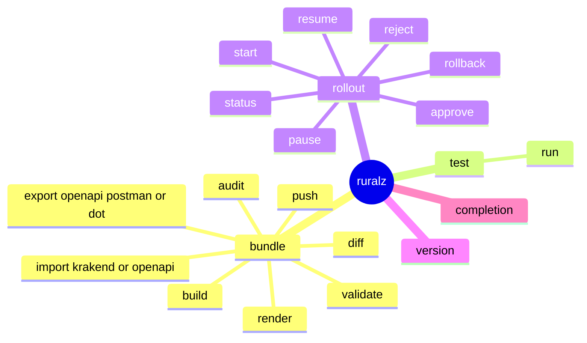
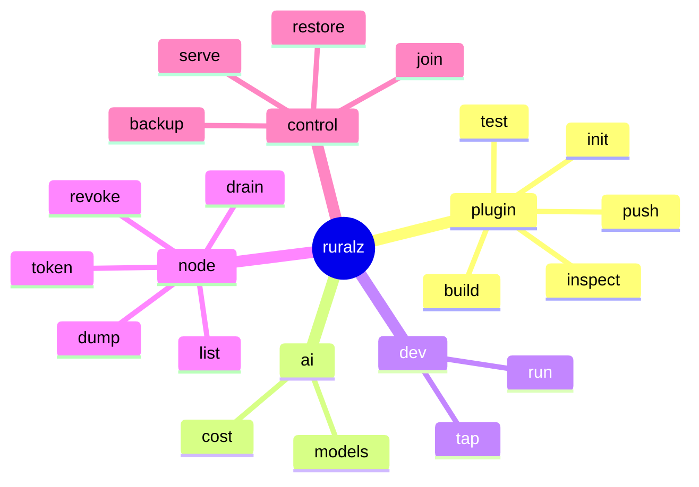
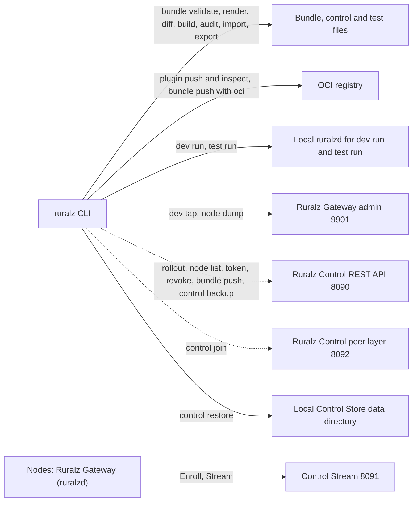

# CLI and API Surface

## Summary

This is the reference for every operator-facing interface of Ruralz: the `ruralz` CLI command tree and its flags, the Ruralz Gateway admin API on port 9901, the Ruralz Control admin API on 9902, the REST API on 8090, the gRPC service `ruralz.control.v1.ControlStream` on 8091, how each is authenticated, and the output formats and exit codes that scripts depend on. It adds verbs and flags under the fixed nouns of the foundation pack, defines the `ruralz test run` case format and answers the CLI questions that other documents delegated here. Nothing is implemented yet; every command and path carries a Planned (Mx) tag. Operators, CI authors, contributors and Plugin authors should read it.

## Scope and non-goals

In scope: the command tree with arguments, flags and the surface each command calls; admin paths; REST resources and gRPC services; authentication; output formats, `ruralz.diff.v1` compatibility and exit codes. The [CLI command registry](../_meta/foundation-pack.md#9-cli-command-registry) of the binding [foundation pack](../_meta/foundation-pack.md) ("pack 9") fixes the nouns `bundle`, `rollout`, `plugin`, `ai`, `dev`, `node`, `control` and `test`; this document MAY add verbs and flags, and a new noun needs a pack amendment.

Non-goals, with owners:

- Kinds, fields, diagnostics and the diff model: [Configuration model](../architecture/02-configuration-model.md), which wins on conflict ([ADR-0003](../adr/0003-configuration-format.md)).
- Admin path semantics and error format: [Data plane](../architecture/03-data-plane.md#admin-endpoints).
- REST resource set, roles, Control Stream messages and `RZ-CP` codes: [Control plane and GitOps](../architecture/04-control-plane-and-gitops.md#api-summary) ([ADR-0007](../adr/0007-control-stream-protocol.md)).
- Plugin packaging: [WASM plugin system](../architecture/05-wasm-plugin-system.md#plugin-commands). Credential settings: [Security and identity](../architecture/08-security-and-identity.md#admin-ports).
- The CLI framework library (OQ-tech-stack-and-libraries-18, [Tech stack and libraries](../engineering/01-tech-stack-and-libraries.md)).
- Client traffic paths on 8080 and 8443: each is a `Route` an operator declares.

## CLI command tree

The CLI is one static binary, `ruralz`, built with `CGO_ENABLED=0` for Linux, macOS and Windows. Every command has the form `ruralz <noun> <verb>`; formats such as `krakend`, `openapi`, `postman` and `dot` are arguments, not verbs. `ruralz version` and `ruralz completion` are the only commands outside that form. The CLI never embeds `ruralzd`: `ruralz dev run` and `ruralz test run` launch a local `ruralzd` binary, while `ruralz plugin test` links the same wazero host so Plugin tests match production limits.

*Figure 1: the `ruralz` CLI command tree, part 1: configuration, testing and delivery nouns.*



*Figure 2: the `ruralz` CLI command tree, part 2: Plugin, AI, development, Node and control nouns.*



### Command table

Every command in full form: pack 9, every command other documents mention, and `ruralz rollout reject`, the one verb added here. "Local" means no network.

| Command | Purpose | Arguments and command flags | Surface it calls | Planned |
|---|---|---|---|---|
| `ruralz bundle validate` | Offline validation with source-mapped diagnostics; `--online` adds the Plugin artifact check | `[DIR]` (default `.`), `--env`, `--environments`, `--online`, `--output json` | Local; OCI registries with `--online` | Planned (M1) |
| `ruralz bundle render` | Render for one Environment into a one-file Bundle; `--effective --route` prints resolved Filter Chains; `--api-version` converts | `[DIR]`, `--env`, `--environments`, `--effective`, `--route NAME`, `--api-version VERSION`, `--output yaml` or `json`, `--output-file` | Local | Planned (M1) |
| `ruralz bundle diff` | Compare two rendered states in the order FROM, TO | `FROM TO` (source forms below), `--env`, `--from-env`, `--to-env`, `--environments`, `--output json` | Local; admin 9901; REST API 8090 and OCI for Revision sources | Planned (M1); Revision sources Planned (M2) |
| `ruralz bundle build` | Produce a Revision and print its digest; runs the online Plugin check unless `--offline` | `[DIR]`, `--env`, `--environments`, `--offline`, `--output json`, `--output-file` (writes the `ruralz.canonical.v1` content) | Local; OCI registries | Planned (M1) |
| `ruralz bundle push` | Send a source Bundle and its expected digest to Ruralz Control, or publish and sign a rendered Revision in an OCI registry | `[DIR]`, `--env` (required), `--oci REFERENCE`, `--key PATH` (else Sigstore keyless) | REST API `revisions`, or OCI | Planned (M2) |
| `ruralz bundle import krakend` | Best-effort import of a rendered KrakenD configuration with a fidelity report | `FILE`, `--output-dir DIR`, `--output json` for the report | Local | Planned (M2) |
| `ruralz bundle import openapi` | Generate Routes and Upstreams from an OpenAPI 3.x document | `FILE`, `--output-dir DIR` | Local | Planned (M2) |
| `ruralz bundle export openapi` | Emit an OpenAPI 3.x document for a rendered Bundle's HTTP Routes | `[DIR]`, `--env`, `--environments`, `--output yaml` or `json`, `--output-file` | Local | Planned (M2) |
| `ruralz bundle export postman` | Emit a Postman collection for the same Routes | `[DIR]`, `--env`, `--environments`, `--output-file` | Local | Planned (M2) |
| `ruralz bundle export dot` | Emit a Graphviz DOT graph of Routes, Policies and Upstreams | `[DIR]`, `--env`, `--environments`, `--route NAME`, `--output-file` | Local | Planned (M2) |
| `ruralz bundle audit` | Report security and best-practice findings, such as Routes without authentication or broad Capabilities | `[DIR]`, `--env`, `--environments`, `--output json` | Local | Planned (M2) |
| `ruralz test run` | Run request and expected-response cases, kept outside the Bundle, against a local `ruralzd` or a URL | `CASES` (file or directory), `--bundle DIR` or `--target URL`, `--env`, `--environments`, `--output json` | Local `ruralzd` on loopback, or the target | Planned (M2) |
| `ruralz rollout start` | Start a Rollout of a Revision to a Cluster, such as a revert | `--cluster NAME`, `--revision sha256:DIGEST` (full digest required) | REST API `rollouts` | Planned (M2) |
| `ruralz rollout status` | Show state, batches, ACKs, NACK codes and lagging Nodes | `CLUSTER` or `ROLLOUT_ID`, `--wait`, `--timeout DURATION`, `--output json` | REST API `rollouts`, `clusters` | Planned (M2) |
| `ruralz rollout pause` | Enter `paused` | `ROLLOUT_ID` | REST API `rollouts` | Planned (M2) |
| `ruralz rollout resume` | Continue a paused Rollout from its persisted plan | `ROLLOUT_ID` | REST API `rollouts` | Planned (M2) |
| `ruralz rollout rollback` | Re-deliver the previous Revision (`rolled-back`) | `ROLLOUT_ID` | REST API `rollouts` | Planned (M2) |
| `ruralz rollout approve` | Approve a queued promotion when `Environment.spec.promotion.requireApproval` is set | `--env NAME`, `--digest sha256:DIGEST` (required without a terminal) | REST API `promotions` | Planned (M2) |
| `ruralz rollout reject` | Discard a queued promotion; added for OQ-control-plane-and-gitops-17 | `--env NAME`, `--digest sha256:DIGEST`, `--reason TEXT` | REST API `promotions` | Planned (M2) |
| `ruralz plugin init` | Scaffold a Plugin project with tests (plugin generator) | `NAME`, `--language rust`, `go`, `typescript` or `csharp` | Local | Planned (M2); TypeScript Planned (M3); C# Planned (M4) |
| `ruralz plugin build` | Compile to WASM, check structure, derive Capabilities, generate shims | `[DIR]` | Local | Planned (M2) |
| `ruralz plugin test` | Run Plugin tests on the same wazero host as `ruralzd` | `[DIR]`, `--output json` | Local | Planned (M2) |
| `ruralz plugin push` | Publish to an OCI registry, sign with Sigstore, print the digest | `REFERENCE`, `--key PATH` (else keyless) | OCI | Planned (M2) |
| `ruralz plugin inspect` | Show ABI, Phases, Capabilities, digest and signatures | `REFERENCE`, `--output json` | OCI | Planned (M2) |
| `ruralz ai cost` | Cost attribution from provider-reported usage and pricing tables | `FILE...` or standard input, `--group-by`, `--output json` or `csv` | Local | Planned (M3) |
| `ruralz ai models` | List `AIModel` resources and their candidates | `[DIR]` with `--env`, or `--revision sha256:DIGEST`, `--output json` | Local; REST API `revisions` | Planned (M3) |
| `ruralz dev run` | Launch a local `ruralzd` on a Bundle directory with Hot Reload | `[DIR]`, `--env`, `--environments` | Local `ruralzd` | Planned (M1) |
| `ruralz dev tap` | Stream redacted traffic metadata from a Node's `/tap` | `--route NAME` (client-side filter), `--output json` | Admin 9901 | Planned (M1) |
| `ruralz node list` | List Nodes with active and Last-Known-Good digests | `--cluster NAME`, `--output json` | REST API `nodes` | Planned (M2) |
| `ruralz node drain` | Drain a Node on the local host | `--data-dir PATH` (default `RURALZ_DATA_DIR`), `--timeout DURATION` | Local process signal | Planned (M1) |
| `ruralz node dump` | Save a Node's active configuration from `/config/dump`, secrets omitted | `--output-file` | Admin 9901 | Planned (M1) |
| `ruralz node token` | Issue a one-time Enrollment token for a Cluster | `--cluster NAME`, `--output-file` (owner-only permissions) | REST API `enrollment-tokens` | Planned (M2) |
| `ruralz node revoke` | Revoke a Node's enrollment identity | `NODE_ID` | REST API `nodes` | Planned (M2) |
| `ruralz control serve` | Run a Ruralz Control replica by launching `ruralz-control` | Arguments after `--` pass to `ruralz-control` unchanged | Local process | Planned (M2) |
| `ruralz control join` | Join a replica to the Raft cluster by redeeming a one-time `admin` token | `--peer HOST:8092`, `--token-file PATH` | Peer layer 8092 `Join` | Planned (M2) |
| `ruralz control backup` | Snapshot the Control Store, including Revision content and audit segments | `--output-file` (required) | REST API `backup` | Planned (M2) |
| `ruralz control restore` | Restore a Control Store snapshot into an empty deployment | `FILE`, `--anchor-set PATH` (required), `--revocation-list PATH` | Local Control Store | Planned (M2) |
| `ruralz version` | Print version, commit, build flavor and supported levels | `--output json` | Local | Planned (M1) |
| `ruralz completion` | Print a shell completion script | `bash`, `zsh`, `fish` or `powershell` | Local | Planned (M1) |

### Global flags

Flags mean the same in every command. Tokens come only from files, never flag values, so they stay out of shell history.

| Flag | Meaning | Accepted by |
|---|---|---|
| `--output FORMAT` | `text` (default), `json`, and per command `yaml` or `csv` | Every command that prints data |
| `--output-file PATH` | Write data to a file instead of standard output | Commands that emit a document |
| `--env NAME` | Render with that Environment's `overlay` and `spec.variables`; without it, the process environment supplies `${VAR}` and no overlay applies | Commands that read a Bundle |
| `--environments FILE` | Local `Environment` resources; without it, `--env` fetches from Ruralz Control (Planned (M2)) | Same |
| `--control URL` | Ruralz Control REST API base, such as `https://control.shop.example:8090` | Commands that call the REST API |
| `--token-file PATH` | API token for the REST API | Same |
| `--admin URL` | A Node's admin API base, such as `https://node-a.shop.example:9901` | `ruralz dev tap`, `ruralz node dump`, Node sources of `ruralz bundle diff` |
| `--admin-token-file PATH` | Operator admin token for 9901 | Same |
| `--ca-file PATH` | Extra trust anchors for 8090 or 9901 TLS | Every networked command |
| `--client-cert PATH`, `--client-key PATH` | Client certificate for admin mTLS | Admin commands |

Environment variables that could stand in for `--control`, `--token-file` and `--admin` need a pack section 2 amendment and stay OQ-cli-and-api-surface-2; until then scripts pass flags.

### Bundle verbs in detail

`ruralz bundle validate` is offline unless `--online` is set, which fetches each Plugin artifact by digest, checks it against `Plugin.spec` and verifies its signature (RZ-CFG-028, RZ-CFG-033). CI SHOULD gate merges on `ruralz bundle build` or `ruralz bundle validate --online` ([Validation and diff semantics](../architecture/02-configuration-model.md#validation-and-diff-semantics)).

`ruralz bundle diff FROM TO` accepts these source forms, each resolved to the canonical form before comparison:

| Source form | Example | Meaning | Planned |
|---|---|---|---|
| Directory | `./shop-bundle` | A source Bundle rendered with `--env` (or `--from-env`, `--to-env` per side, to review a promotion) | Planned (M1) |
| File | `./rendered.yaml`, `./node-a-dump.json` | A rendered Bundle, or a saved `ruralz node dump` output | Planned (M1) |
| Admin URL | `https://node-a.shop.example:9901` | A live Node's `/config/dump`, which is how Drift is shown | Planned (M1) |
| Revision identifier | `rev-162af81f5de4` or `sha256:<64 hex>` | A Revision from Ruralz Control, fetched from `revisions` | Planned (M2) |
| OCI reference | `oci://ghcr.io/acme/shop-revisions@sha256:<64 hex>` | A Revision published by `ruralz bundle push --oci`, verified by digest and signature | Planned (M2) |

Read commands accept the display form `rev-<12 hex>` as a lookup key and fail with exit code 2 when it is ambiguous; commands that change delivery (`ruralz rollout start`, `ruralz rollout approve`, `ruralz rollout reject`) require the full `sha256:<64 hex>` digest, so a prefix collision can never start or approve the wrong Revision.

`ruralz bundle push` without `--oci` uploads the source Bundle and the CLI's digest to Ruralz Control, which re-renders it and rejects a mismatch with RZ-CFG-027; it is refused under `requireApproval` unless process configuration overrides that. With `--oci` it publishes the rendered Revision, signed with Sigstore, for file-mode Nodes ([ADR-0017](../adr/0017-artifact-signing.md)). Registry credentials are OQ-cli-and-api-surface-7.

`ruralz bundle render --api-version ruralz/v1beta1` drops comments. For OQ-configuration-model-7 this document chooses option (a), accept the loss: conversion is rare, its diff is empty by construction, and a comment-preserving verb can come later.

### Rollout, promotion and Node verbs

Rollouts normally start from promotions; `ruralz rollout start` serves reverts, which need an `operator` with step-up TOTP ([Rollout states](../architecture/04-control-plane-and-gitops.md#rollout-states)). `ruralz rollout status --wait` polls until the Rollout is terminal.

`ruralz rollout approve --env prod` shows the queued record's source, digest and diff impact, then approves it for every Cluster of the Environment. Without a terminal, `--digest` MUST equal the record's digest, so an approval never lands on a record a newer commit replaced after review. `ruralz rollout reject` follows the same rules. Separation of duties is enforced server-side (`RZ-CP-007`).

`ruralz node drain` answers OQ-data-plane-4 with option (b) for Planned (M1): on the Node's host it sends SIGTERM to the `ruralzd` process holding the file lock on `${RURALZ_DATA_DIR}`, starting a Drain as a process manager would ([ADR-0015](../adr/0015-zero-downtime-upgrades-so-reuseport.md)), and waits for exit or `--timeout`. A remote drain stays OQ-cli-and-api-surface-4.

The `ruralz node token` output is a secret and never belongs in a Bundle. `ruralz control restore` runs only on the host holding the Control Store data directory, never through the REST API, and requires a root-signed anchor set so that the restored Ruralz Control opens a higher `storeEpoch` before any delivery ([ADR-0006](../adr/0006-control-store-raft-boltdb.md), proposed).

### Plugin, AI and development verbs

For OQ-wasm-plugin-system-7 this document chooses option (a): `ruralz dev run` loads Plugins only by digest from a registry, possibly a local one, because `Plugin.spec.image` requires a digest (RZ-CFG-021) and one fetch path keeps development identical to production. Only `ruralz dev run` verifies signatures under `warn`.

For OQ-ai-llm-gateway-13 this document chooses option (a): `ruralz ai cost` reads access log records with their `ai` object from files or standard input, because metrics carry no Consumer label. `--group-by` takes `consumer`, `tier`, `route`, `aimodel` or `provider`.

### Test case format

For OQ-testing-and-quality-strategy-8 this document chooses option (a): `ruralz test run` reads versioned YAML files identified by `format: ruralz.test.v1`. A test file is not a Bundle resource, has no `apiVersion` or `kind`, and lives outside the Bundle, such as under `tests/` beside `bundle/` and `control/`. Registering the identifier with the other versioned formats in pack section 12 is OQ-cli-and-api-surface-1.

```yaml
format: ruralz.test.v1
name: orders-summary
cases:
  - name: rejects a request without credentials
    request:
      method: GET
      path: /v1/orders/42/summary
      headers:
        host: api.shop.example
    expect:
      status: 401
      headers:
        content-type: application/problem+json
  - name: serves a partner key
    request:
      method: GET
      path: /v1/orders/42/summary
      headers:
        host: api.shop.example
        x-api-key: {file: ./secrets/partner-key}   # read at run time, never inlined
    expect:
      status: 200
      json:                                          # subset match on the decoded body
        id: "42"
```

| Field | Meaning |
|---|---|
| `format` | Required; `ruralz.test.v1`; unknown top-level fields are rejected |
| `name`, `cases[].name` | Required; reported in results |
| `cases[].request` | `method`, `path`, `headers` (a value is a string or `{file: PATH}`), optional `body` (string) or `json` |
| `cases[].expect` | Any of `status`, `headers` (exact values), `json` (subset match), `bodyContains` |

With `--bundle DIR`, `ruralz test run` starts a local `ruralzd` on loopback ports with that Bundle rendered for `--env`; with `--target URL`, it sends requests there and never needs admin access. Results print one line per case, or JSON with `--output json`.

### KrakenD EE tool mapping

KrakenD lists these tools as Enterprise-only ([source](https://www.krakend.io/features/)); in Ruralz each is a free command (pack section 13):

| KrakenD EE tool | Ruralz command | Planned |
|---|---|---|
| Plugin generator | `ruralz plugin init` | Planned (M2) |
| End-to-end testing tool | `ruralz test run` | Planned (M2) |
| OpenAPI importer | `ruralz bundle import openapi` | Planned (M2) |
| OpenAPI exporter | `ruralz bundle export openapi` | Planned (M2) |
| Postman collection generation | `ruralz bundle export postman` | Planned (M2) |
| DOT image generator | `ruralz bundle export dot` | Planned (M2) |
| Dump to disk | `ruralz node dump` | Planned (M1) |
| OpenAPI server | None; OQ-vision-and-positioning-11 | Not planned as a command: it is a Ruralz Gateway feature |

### Worked example: pull request and promotion

```bash
# Pull request CI, per Environment (Planned (M1); diff against a Revision Planned (M2),
# which also needs --control and --token-file)
ruralz bundle validate --env staging --environments control/environments.yaml --output json ./bundle
ruralz bundle build --env prod --environments control/environments.yaml ./bundle
ruralz bundle diff rev-162af81f5de4 ./bundle --env prod --environments control/environments.yaml --output json
ruralz test run --bundle ./bundle --env staging --environments control/environments.yaml ./tests

# After merge: approve the prod promotion and watch its Rollout (Planned (M2))
ruralz rollout approve --env prod --digest sha256:68f782530463d5c1f0e2b9a7c4d8e6f1a3b5c7d9e0f2a4b6c8d0e2f4a6b8c0d2
ruralz rollout status prod-eu-west --wait --timeout 30m
```

## Ruralz Gateway admin API

The admin listener of `ruralzd` binds `Gateway.spec.admin.port`, default 9901, on its own server. This table matches [Admin endpoints](../architecture/03-data-plane.md#admin-endpoints) in Data plane, which owns the semantics; a path added there MUST be added here. `/debug/*` names every path under `/debug/`.

| Path on 9901 | Method | Returns | Authentication | CLI and other consumers | Planned |
|---|---|---|---|---|---|
| `/healthz` | GET | 200 while the process responds | MAY be open | Liveness probes | Planned (M1) |
| `/readyz` | GET | 200 only with an active validated Revision, every `secretRef` resolved, listeners bound and no Drain; else 503 with JSON reasons; never fails for a lost Control Stream | MAY be open | Readiness probes | Planned (M1) |
| `/metrics` | GET | `ruralz_<component>_<name>_<unit>` metrics (exporter: OQ-tech-stack-and-libraries-16) | Metrics token, operator token or client certificate | Scrapers | Planned (M1) |
| `/debug/*`: `/debug/pprof/` | GET | Go runtime profiles; mutex and block profiles only during a `?seconds=` request | Operator token or client certificate | Profiling | Planned (M1) |
| `/debug/snapshots` | GET | Active, retired, closing and ending snapshots with digests and pin counts | Operator token or client certificate | Hot Reload debugging | Planned (M1) |
| `/debug/upstreams` | GET | Endpoint sets, health, ejections and breaker states | Operator token or client certificate | Incident response | Planned (M1) |
| `/config/dump` | GET | The active Revision in `ruralz.canonical.v1` form with its full digest and the Last-Known-Good digest; `secretRef` shown, secrets omitted | Operator token or client certificate | `ruralz node dump`, `ruralz bundle diff`, Drift detection | Planned (M1) |
| `/tap` | GET, streaming | Sampled request and response metadata, credentials redacted | Operator token or client certificate | `ruralz dev tap` | Planned (M1) |

Admin paths never change configuration or Node state, so a leaked admin token cannot alter routing or drain a Node. Only `/tap` and running profiles cost the request path. Every `/tap` and `/config/dump` use is logged.

### Ruralz Control admin API on 9902

`ruralz-control` serves the same pattern on 9902, Planned (M2), with semantics owned by [Control plane and GitOps](../architecture/04-control-plane-and-gitops.md#readiness-on-port-9902).

| Path on 9902 | Method | Returns | Authentication | Planned |
|---|---|---|---|---|
| `/healthz` | GET | 200 while the process responds | MAY be open | Planned (M2) |
| `/readyz` | GET | 200 once the Control Store loaded, 8090 and 8091 are bound and the replica is not draining; never fails on quorum loss or staleness | MAY be open | Planned (M2) |
| `/metrics` | GET | Replica series from every replica, leader series from the leader | As on 9901 | Planned (M2) |
| `/debug/*`: `/debug/pprof/` | GET | Go runtime profiles | As on 9901 | Planned (M2) |

### Admin API conventions

Responses are JSON except `/metrics` and `/debug/pprof/`; `/tap` streams one JSON object per sampled exchange. Errors are RFC 9457 problem documents with `code` and `requestId`. The CLI warns when a Node is outside the skew window of [Release, versioning and compatibility](../engineering/04-release-versioning-and-compatibility.md).

## Ruralz Control REST and gRPC APIs

Ruralz Control exposes three network surfaces besides its admin port: the REST API and Ruralz Console on 8090, the Control Stream on 8091 and the peer layer on 8092. Only the REST API is for people and tools; the CLI never speaks the Control Stream.

*Figure 3: which surface each group of commands calls; dashed edges need Ruralz Control.*



### REST API on 8090

The REST API is versioned under `/api/v1/`, published as OpenAPI and additive within `v1`; Ruralz Console at `/console`, the CLI, CI and provisioning jobs use it. The resource set is [Control plane and GitOps](../architecture/04-control-plane-and-gitops.md#api-summary)'s; the paths below each resource root are this document's proposal for the OpenAPI description (authoring: OQ-repository-layout-and-conventions-5). Reads need `viewer` unless the row says otherwise; write roles match the Ruralz Console Act column. Everything is Planned (M2).

| Path | Methods | Contents and actions | Write role | CLI |
|---|---|---|---|---|
| `/api/v1/environments`, `/api/v1/environments/{name}` | GET | `Environment` resources from `control/`, promotion chain, conditions; read only | None | `--env` without `--environments` |
| `/api/v1/clusters`, `/api/v1/clusters/{name}` | GET | `Cluster` resources, promoted digest, Node count, Rollout history; read only | None | `ruralz rollout status` |
| `/api/v1/promotions`, `/api/v1/promotions/{id}` with actions `/approve`, `/reject`, `/retry` | GET, POST | Queued promotion records (source, Environment, digest) | `approver`; retry: `operator` | `ruralz rollout approve`, `ruralz rollout reject` |
| `/api/v1/revisions`, `/api/v1/revisions/{digest}` with `/content`, `/diff` | GET, POST | Revision metadata (source, Environment, signing key, diff impact), `ruralz.canonical.v1` content, `ruralz.diff.v1` diff; POST is a source Bundle push | `editor` | `ruralz bundle push`, `ruralz bundle diff` |
| `/api/v1/revisions/{digest}/resources`, `/api/v1/revisions/{digest}/resources/{kind}/{name}` | GET | The Bundle kinds inside a Revision (proposed, OQ-cli-and-api-surface-3) | None | `ruralz ai models --revision` |
| `/api/v1/rollouts`, `/api/v1/rollouts/{id}` with actions `/pause`, `/resume`, `/rollback` | GET, POST | State, plan, batches, ACK and NACK codes, lagging Nodes; start and drive | `operator` | `ruralz rollout` verbs |
| `/api/v1/nodes`, `/api/v1/nodes/{nodeId}` with action `/revoke` | GET, POST | Digests, version, schema levels, readiness; revoke | `security-admin` | `ruralz node list`, `ruralz node revoke` |
| `/api/v1/enrollment-tokens` | POST | One-time Enrollment token for one Cluster | `security-admin`, or a Cluster-scoped API token | `ruralz node token` |
| `/api/v1/trust` | GET, POST | Anchor sets, online key rotation | `admin`; anchor set upload: `security-admin` | None |
| `/api/v1/drift` | GET, POST | Drift records; re-deliver, quarantine | `operator` | None; `ruralz node list` shows laggards |
| `/api/v1/audit` | GET | Audit entries, chain verification, export | `auditor`, also for reads | None |
| `/api/v1/changes` | POST | Ruralz Console write-back to a Git branch | `editor` | None |
| `/api/v1/replicas` | GET, POST | Replica health; one-time join token | `admin` | `ruralz control join` redeems it |
| `/api/v1/access` | GET, POST, DELETE | Users, role bindings, API tokens | `admin`, also for reads | None |
| `/api/v1/backup` | GET, POST | Create and download an encrypted, signed Control Store backup; downloads are audited | `admin`, also for reads | `ruralz control backup` |
| `/api/v1/hooks/git` | POST | Forge webhook; triggers an authenticated fetch only | Per-source HMAC | None |

The ten kinds of the [Configuration model](../architecture/02-configuration-model.md#kind-catalog) map onto these resources as follows; Git stays the source of truth (P5), so no path creates or edits a Bundle resource directly.

| Resource | REST representation | Write path |
|---|---|---|
| `Gateway`, `Route`, `Upstream`, `Policy`, `Plugin`, `Consumer`, `AIProvider`, `AIModel` | `/api/v1/revisions/{digest}/resources/{kind}/{name}`, in canonical form with `secretRef` shown and conditions `Accepted`, `ResolvedRefs`, `Programmed` | Git, `changes`, or a `revisions` push |
| `Environment` | `/api/v1/environments/{name}` | Git `control/`, or an opted-in CRD |
| `Cluster` | `/api/v1/clusters/{name}` | Same |
| Revision | `/api/v1/revisions/{digest}` | Built from Git, a push or CRDs; never uploaded pre-rendered |
| Rollout | `/api/v1/rollouts/{id}` | Created by a promotion or `ruralz rollout start` |

Conventions:

- Errors are RFC 9457 problem documents with an `RZ-CP` or `RZ-CFG` `code` and `requestId`; validation errors carry Configuration model diagnostics.
- Digests in paths and bodies are full `sha256:<64 hex>` values; unknown request fields are rejected (RZ-CFG-006 for Bundle fields, else an `RZ-CP` code).
- Collections return newest first with an opaque `next` cursor; Rollout, promotion and Node identifiers are ULIDs.

### gRPC on 8091: `ruralz.control.v1.ControlStream`

Every Node dials `ruralz-control` on 8091 and speaks `ruralz.control.v1.ControlStream`, a snapshot plus delta protocol with xDS-style ACK/NACK, not xDS ([ADR-0007](../adr/0007-control-stream-protocol.md)). It is built with connect in gRPC mode on both ends ([source](https://github.com/connectrpc/connect-go/blob/main/README.md)), and `buf breaking` gates its protos under `api/proto/ruralz/control/v1/`. Ruralz Control never dials a Node.

| RPC | Shape | Messages | Credential | Planned |
|---|---|---|---|---|
| `Enroll` | Unary | `EnrollRequest` (token, `nodeId`, CSR, version, schema levels) to `EnrollResponse` (certificate chain, server CA, trust root, anchor set, Cluster, Environment) | One-time token over TLS with a pinned server CA | Planned (M2) |
| `Stream` | Bidirectional stream | Down: `Snapshot`, `Delta`, `HeartbeatReply`, `TrustUpdate`, `Reconnect`. Up: `Hello`, `Ack`, `Nack`, `Heartbeat` | Node certificate (mTLS) | Planned (M2) |
| Renewal | Node to Ruralz Control and back | `RenewRequest`, `RenewResponse`, forwarded to the leader | Node certificate | Planned (M2) |

The message fields and ACK/NACK semantics are in [Control Stream](../architecture/04-control-plane-and-gitops.md#control-stream). A regional relay serves the same service on 8091 for its Clusters, Planned (M4).

### Peer layer on 8092

8092 is not a public API: it admits only Ruralz Control replicas, relays (Planned (M4)) and the token `Join` of `ruralz control join`, authorizing classes by certificate role and rejecting Node certificates. The `postgres` Control Store, Planned (M4), leaves it unused.

## API authentication

Every surface denies by default. Only `/healthz` and `/readyz` MAY be unauthenticated (pack section 8.4), and no crossing is unauthenticated ([Trust boundaries](../architecture/01-system-overview.md#trust-boundaries) TB-5, TB-6, TB-9, TB-11).

| Surface | Port | Credential | Authorization | On failure | Planned |
|---|---|---|---|---|---|
| Admin `/healthz`, `/readyz` | 9901, 9902 | None | None | Not applicable | Planned (M1); 9902 Planned (M2) |
| Admin `/metrics` | 9901, 9902 | Metrics token, operator token or admitted client certificate, on every interface including loopback | Read-only | 401 | Same |
| Admin `/debug/*`, `/config/dump`, `/tap` | 9901 (`/debug/*` also 9902) | Operator token or admitted client certificate; these paths are off when no operator token is configured | Read-only | 401 | Same |
| REST API | 8090 | Session cookie (Ruralz Console) or API token (CLI, CI, provisioning), over TLS 1.3 by default | Built-in roles bound globally, per Environment or per Cluster; step-up TOTP for approvals, reverts, trust uploads and Access changes | `RZ-CP-007`, audited | Planned (M2) |
| Forge webhook | 8090 `/api/v1/hooks/git` | Per-source HMAC | Triggers an authenticated fetch only | `RZ-CP-018` | Planned (M2) |
| Control Stream `Enroll` | 8091 | One-time token, pinned server CA | One Cluster; token consumed | `RZ-CP-001` | Planned (M2) |
| Control Stream `Stream` and renewal | 8091 | Per-Node certificate (mTLS), the only source of `node.id` | That Node and its Cluster | `RZ-CP-002`, `RZ-CP-003` | Planned (M2) |
| Peer layer | 8092 | Peer or relay certificate (mTLS); one-time `admin` token for `Join` | Class by certificate role | Connection refused | Planned (M2); relay Planned (M4) |

### Admin API

Admin credentials are Node process settings, never Bundle fields. [Security and identity](../architecture/08-security-and-identity.md#admin-ports) decided OQ-system-overview-6: 9901 and 9902 bind all interfaces for kubelet probes, and it proposes `RURALZ_ADMIN_METRICS_TOKEN_FILE`, `RURALZ_ADMIN_TOKEN_FILE` and `RURALZ_ADMIN_TLS_DIR` (OQ-security-and-identity-7). Tokens are compared in constant time and accepted only over TLS or loopback. The CLI sends the operator token from `--admin-token-file` as a bearer token, or presents `--client-cert` and `--client-key`, and refuses to send a token over cleartext to a non-loopback address.

### REST API

People sign in to Ruralz Console with local accounts, TOTP and same-site session cookies with CSRF protection, Planned (M2); OIDC and SAML SSO for Ruralz Console is Planned (M5), in the one build (P1). The CLI and CI use scoped, expiring API tokens that an `admin` issues under Access, sent as bearer tokens from `--token-file`. Approvers can never approve a change they authored, pushed, started or requested, and nobody edits their own bindings. When the REST API demands step-up, the CLI prompts for a TOTP code on a terminal and otherwise fails with exit code 2; whether any API token may satisfy step-up is OQ-cli-and-api-surface-5.

### Control Stream

A Node proves its identity only with the per-Node certificate issued at Enrollment. `ruralz node token` mints the one-time token, stored hashed and embedding the fingerprints that pin the first dial; `ruralz node revoke` closes the stream and refuses renewal. Lifetimes and lockouts are in [Enrollment and mTLS](../architecture/04-control-plane-and-gitops.md#enrollment-and-mtls).

## Output formats and exit codes

Data goes to standard output and everything else (progress, warnings, prompts) to standard error, so `--output json` output can be piped straight into another tool. Timestamps are RFC 3339 in UTC. Human output shows Revisions as `rev-<12 hex>`; JSON always carries the full `sha256:<64 hex>` digest, beside the display form where a format defines one.

| Command | Default output | `--output json` | Other formats |
|---|---|---|---|
| `ruralz bundle validate` | One diagnostic per line: `file:line:column severity code Kind/name path: message` | A JSON array of Configuration model diagnostic objects; `[]` when clean | None |
| `ruralz bundle diff` | The human diff form of the Configuration model | `ruralz.diff.v1` | None |
| `ruralz bundle render` | YAML stream | The same resources as JSON | `--effective` prints a table |
| `ruralz bundle build` | `rev-<12 hex>` and the full digest | Object with `digest`, `revision`, `environment` and `diagnostics` | `--output-file` writes `ruralz.canonical.v1` |
| `ruralz bundle audit` | One finding per line | Array of findings with `severity`, `rule`, `resource`, `message` | None |
| `ruralz bundle export` | OpenAPI 3.x YAML, Postman collection JSON, or DOT text | OpenAPI as JSON | None |
| `ruralz test run`, `ruralz plugin test` | One result line per case | Array of case results with `name`, `passed`, `failures` | None |
| Commands reading the REST API | Tables | The resource as the REST API returns it | None |
| `ruralz plugin inspect` | Table | ABI, Phases, Capabilities, digest and signatures | None |
| `ruralz ai cost` | Table | Array of rows | `csv` |
| `ruralz version` | Text | `version`, `commit`, `flavor`, `apiVersions`, `pluginAbi`, `controlStream` | None |

For OQ-release-versioning-and-compatibility-6 this document chooses option (a): `ruralz version` prints schema levels per apiVersion, the Plugin ABI level and the Control Stream protocol, so pipelines can check skew.

### Diff JSON compatibility

This document owns the compatibility of `ruralz.diff.v1`, whose shape the [Configuration model](../architecture/02-configuration-model.md#diff-semantics) fixes. Changes are additive only: new members may appear in any object, and consumers MUST ignore unknown members. Field operations stay `add`, `remove`, `replace` and `move`, with zero-based positions in JSON; a changed meaning needs `ruralz.diff.v2`. As its first additive field, `from` and `to` gain `digest` with the full `sha256:<64 hex>` beside `revision`, so automation never has to trust a 12-character prefix.

### Exit codes

Exit codes are a stable surface: they never change once released. `ruralz bundle validate` and `ruralz bundle diff` both support `--output json`, and both follow this table, which keeps the Configuration model rule for `ruralz bundle diff` (0 no changes, 1 changes, 2 errors).

| Code | Meaning | Examples |
|---|---|---|
| 0 | Success with nothing to report | Valid Bundle, warnings included; diff with no changes; every test case passed; `rollout status --wait` reached `complete` |
| 1 | The command ran and found a negative result | Diff with changes; `validate`, `render`, `build` or `audit` found an error diagnostic or finding; a test case failed; `rollout status --wait` ended in `rolled-back` or `failed` |
| 2 | The command could not produce a result | Usage error, unreadable input, an invalid or unreachable diff source, an ambiguous `rev-<12 hex>`, authentication or RBAC denial, an `RZ-CP` error, a missing step-up, `--wait` timeout |
| 130 | Interrupted by SIGINT | Ctrl-C during `ruralz dev run`, `ruralz dev tap` or `--wait` |

An invalid Bundle is 1 for `validate`, `render`, `build` and `audit`, whose result is validity, and 2 for `diff`, whose result is the difference. Warnings never change the exit code. With `--output json`, a server error still prints its problem document, so CI can report the `code`.

## Open questions

| ID | Question | Options | Owner | Blocking? |
|---|---|---|---|---|
| OQ-cli-and-api-surface-1 | Should pack section 12 register `ruralz.test.v1` beside `ruralz.canonical.v1` and `ruralz.diff.v1`, and should validation diagnostics JSON get its own envelope identifier? | (a) Register `ruralz.test.v1`; diagnostics stay a bare array (current); (b) Also add `ruralz.diagnostics.v1` with an envelope | cli-and-api-surface | No |
| OQ-cli-and-api-surface-2 | Which environment variables or context file may replace `--control`, `--token-file` and `--admin`? | (a) Flags only (current); (b) `RURALZ_CONTROL_URL` and `RURALZ_TOKEN_FILE` by a pack section 2 amendment; (c) A CLI context file under the user's configuration directory | cli-and-api-surface | No |
| OQ-cli-and-api-surface-3 | Should Control plane and GitOps add read-only Bundle kind paths under `revisions/{digest}/resources` to its API summary? | (a) Add them (proposed); (b) Clients parse `revisions/{digest}/content` | control-plane-and-gitops | Yes, for the M2 OpenAPI description |
| OQ-cli-and-api-surface-4 | How does `ruralz node drain` reach a remote Control-mode Node? | (a) A Control Stream drain message sent through a `nodes/{nodeId}/drain` REST action; (b) Local SIGTERM only (current); (c) Kubernetes Pod deletion only | control-plane-and-gitops | No |
| OQ-cli-and-api-surface-5 | May an API token satisfy step-up for approvals and reverts, so pipelines can approve? | (a) No, only an interactive TOTP (current); (b) A dedicated short-lived approval token per record | security-and-identity | No |
| OQ-cli-and-api-surface-6 | Which access log encoding does `ruralz ai cost` read? | (a) The JSON access log record with its `ai` object (proposed); (b) OpenTelemetry log export files | observability | No, until OQ-observability-3 decides |
| OQ-cli-and-api-surface-7 | Where does the CLI read OCI registry credentials for `ruralz bundle push --oci`, `ruralz plugin push` and `ruralz plugin inspect`? | (a) The standard container registry credential file, through the selected OCI library; (b) Flags naming a credential file only | cli-and-api-surface | Yes, for Planned (M2) |

Decided here, for their owners to close, each with option (a) unless noted: OQ-configuration-model-7; OQ-configuration-model-10 (every listed flag, no overlay selector in `ruralzd`); OQ-control-plane-and-gitops-17 (`ruralz rollout reject`); OQ-data-plane-4, option (b) for Planned (M1), remote case in OQ-cli-and-api-surface-4; OQ-wasm-plugin-system-7; OQ-ai-llm-gateway-13; OQ-release-versioning-and-compatibility-6; OQ-testing-and-quality-strategy-8. OQ-tech-stack-and-libraries-18 needs a framework with nested nouns, generated completions and no global state. For OQ-vision-and-positioning-11 this document recommends publishing the `ruralz bundle export openapi` output until a serving design exists.
