# Roadmap and Milestones

## Summary

This document orders milestones `M0` to `M5` without dates, giving each scope, measurable exit criteria and KrakenD Enterprise Edition (EE) parity. Nothing is implemented. Readers: evaluators and contributors.

## Scope and non-goals

In scope: the [foundation pack](../_meta/foundation-pack.md) section 2 milestones and every item tagged `Planned (Mx)`. The verify-docs milestone check tests coverage; a WARN naming a real item is fixed here.

Non-goals: designs; moving a tag (only its owning document does); row-by-row parity ([KrakenD EE parity matrix](../comparison/01-krakend-ee-parity-matrix.md), which wins on conflict); performance values ([Performance budgets](../architecture/12-performance-budgets-and-benchmarking.md)); release numbering ([Release](../engineering/04-release-versioning-and-compatibility.md)); calendar dates (OQ-roadmap-and-milestones-2).

Codes by owner:

| Code | Owner |
|---|---|
| SM-n success metrics; P1 to P10 principles | [Vision](../vision/01-vision-and-positioning.md#success-metrics) |
| PB-n budgets; RH-1 reference machine; scenarios S1 to S8 and others | [Performance budgets](../architecture/12-performance-budgets-and-benchmarking.md#scenarios) |
| CE-n chaos experiments | [Scalability](../architecture/11-scalability-and-distributed-state.md#chaos-experiments) |
| GD-n game days | [High availability](../operations/04-high-availability-and-disaster-recovery.md#game-days) |
| TB-n trust boundaries | [System overview](../architecture/01-system-overview.md#trust-boundaries) |
| Topology T1 to T10 | [Deployment topologies](../operations/01-deployment-topologies.md#topology-catalog) |
| Threat T13, T20 | [Security and identity](../architecture/08-security-and-identity.md#threat-model-and-trust-boundaries) |
| Objective O8 | [Observability](../architecture/10-observability.md#observability-principles) |
| F-n findings | [Market landscape](../comparison/02-market-landscape-and-table-stakes.md#implications-for-milestones) |
| Gate G1 to G3 | [Tech stack](../engineering/01-tech-stack-and-libraries.md#selection-criteria) |

### How parity is counted

Parity is the cumulative share of the 71 EE-only rows in the 2026-09-23 KrakenD snapshot ([source](https://www.krakend.io/features/)) implemented at a milestone's exit, per the parity matrix (OQ-roadmap-and-milestones-1 closed there; OQ-krakend-ee-parity-matrix-12, option (a)). Not planned: Lua advanced helpers, NTLM authentication, New Relic native SDK.

## M0 Foundations

Pack name: **M0** Foundations. M0 builds the repository, gates and contracts later milestones need. Serves: Contributor.

### M0 scope

| Area | Planned (M0) items |
|---|---|
| License and governance | Apache-2.0 license and ownership; contributions under DCO, no CLA; dependencies and licenses; revenue rules; no feature gating: all features without a license key; trademark policy; `SECURITY.md`, where a reporter uses the private channel ([ADR-0002](../adr/0002-apache-2-license-no-feature-gating.md)) |
| Build | Go 1.26 floor, release toolchain, floor job and guard file; `CGO_ENABLED=0`; build flags; production platforms |
| CI stages 1 to 7 in `pr-fast` | 1. commit hygiene: DCO check, repocheck, no-license-check scan (SM-1); 2. format and lint: golangci-lint linters (`sloglint`), `golang.org/x/net/http2` forbidigo rule, depguard import rules: `github.com/tetratelabs/wazero` only in `internal/pluginhost`; the `github.com/google/cel-go` alias and any Lua runtime banned; 3. generated code drift; 4. cross-build (gate G1); 5. unit tests; 6. supply chain: `go mod verify`, `govulncheck` on every pull request, advisory floor, license gate G2 (what the gate reads; MPL-2.0 named exceptions, [ADR-0006](../adr/0006-control-store-raft-boltdb.md)), crypto denylist gate G3; 7. docs verification. Dependency admission (catalog row, rate limiting, no fasthttp); security scanning; all CI stages green |
| Repository | `internal/`, `pkg/`, `api/` schema; test and docs tooling; `verify-docs.mjs` as docs gate, markdownlint-cli2 pinned to 0.23.x; OQ-repository-layout-and-conventions-1 and -7 |
| Contracts | `ruralz/v1alpha1` envelope; JSON Schema (draft 2020-12) authoring and rendered views with a generation check ([ADR-0003](../adr/0003-configuration-format.md)), published; OpenAPI for `/api/v1/` follows in M2 |

### M0 exit criteria

Exit criteria:

1. `pr-fast` stages 1 to 7 run on their triggers, block merge and complete within 10 minutes (target).
2. The three binaries cross-build with `CGO_ENABLED=0` for linux/amd64 and linux/arm64; the license gate, crypto denylist and `govulncheck` pass on `main`.
3. The no-license-check scan finds 0 gated features (target), per SM-1.
4. Both schema views are generated from one source and published; the drift check fails on any difference.
5. `verify-docs.mjs` reports no error, and each architecture document is `approved` or lists its escalations.
6. OQ-repository-layout-and-conventions-1 and -7, the two Open questions blocking M0, are closed.

KrakenD EE parity at exit: 0 of 71, 0% (target).

## M1 Core parity

Pack name: **M1** Core parity. M1 ships a file-mode Ruralz Gateway with core KrakenD CE Policies, the first EE rows and release `0.1.0`. Serves: KrakenD EE buyer, Security engineer.

### M1 scope

| Area | Planned (M1) items |
|---|---|
| Ruralz Gateway | `ruralzd` Nodes; client listeners: HTTP/1.1 and h2c on 8080 TCP, HTTP/2 over TLS on 8443 TCP, HTTP/2 settings, deadlines, other servers (admin); REST, and plain HTTP for any other content (Multi-protocol "Anything else"); Router match and header handling; Filter Chain executor; Upstream layer; error format; load shedding; admin 9901 (TB-9): `/healthz`, `/readyz`, `/metrics`, `/debug/pprof/`, `/debug/snapshots`, `/debug/upstreams`, `/config/dump`, `/tap` |
| Configuration | `Gateway`, `Route`, `Upstream`, `Policy`, `Consumer`, and `Environment` for CLI renders; YAML 1.2 parser, JSON Schema validator; Bundle merge; restricted profile; env substitution, overlay merge; CLI verbs without `--env` when no Environment exists; `secretRef` `env` and `file`; canonicalization, Revision digest; golden corpus; Go test that meta-validates both schema files and `examples/`; JSON subset fixtures; loader conformance suite; hostile-input and upstream test suites; body buffering |
| CEL | Expressions: CEL module, compile and cost estimator in all CEL places: `Route.spec.match.when`, `Policy.spec.when`, `Route.spec.composition.steps[].pathExpression`, `Route.spec.composition.steps[].when`, `Upstream.spec.retries.retryOn`, `Upstream.spec.circuitBreaker.failureWhen`, `Upstream.spec.loadBalancing.hashKey`, `Gateway.spec.telemetry.accessLog.when`, `authz.cel` `config.rule`, `ratelimit`, `quota` and `cache` `config.key`, `headers` `valueExpression` |
| CLI | `ruralz bundle` verbs `validate`, `render` (`--api-version` conversion MUST yield the same Revision), `diff` from directory, file or admin URL, `build`; `ruralz dev` verbs `run`, `tap`; `ruralz node` verbs `drain`, `dump`; `ruralz version`, `ruralz completion`; `--env` and `--environments FILE` (local `Environment` files); CLI framework; declarative config and GitOps CLI |
| Lifecycle | File mode: topology T2 watching a rendered directory; Hot Reload, Last-Known-Good, Zero-Downtime Upgrade and Drain; topologies T1 development single binary, T5 VM with systemd in file mode |
| Security | `auth.jwt` (JWT, OpenID Connect, OAuth2; JOSE library), `auth.api-key` (removal in file mode), `auth.basic`, `auth.mtls`, `authz.cel` (Security Policies Engine, first part), `authz.ip`, `auth.upstream-oauth2` (client credentials), `cors`; TLS to IdP JWKS endpoint (TB-10), Upstreams, State Store, OTLP (TB-3, TB-4, TB-12; `AIProvider` from M3); digest checks on every Revision and Plugin artifact; redaction unit tests; secret leak tests |
| Traffic and state | `ratelimit` with local token bucket and GCRA ([ADR-0008](../adr/0008-rate-limiting-local-bucket-and-gcra.md)), distributed rate limiting, KrakenD row "Stateful rate limit (Redis backed)", `quota` in `requests`; API governance (`quota`, `overridable: false` Gateway Policies); `cache` (Response Cache), retries, circuit breaker, health checks, catch-all fallback, header and query string routing, wildcard routes, service discovery (`dns`, static `endpoints`) for `http` Upstreams, weighted splits, composition; `memory` and `redis` drivers (tested on Valkey 9.0.1 or newer, Dragonfly), single-Region Cells; `headers`, `transform.request`, `transform.response`, `validation.json-schema` |
| Observability | OpenTelemetry telemetry: traces, export, conventions, resource; traceparent injection with its sampling decision; metrics exposition (`/metrics`) including `ruralz_listener_tls_handshake_duration_seconds`; logs; catalog gates; cardinality test; ULID `node.id`; `ruralz_node_degraded_info` with M1 reasons such as `lkg_boot` and `state_store_breaker_open` |
| Quality | Property tests; protocol conformance suite in `pr-full` (HTTP/1.1, HTTP/2); integration tests; round-trip test; fuzzing; Docker Compose end-to-end test in file mode (quickstart, `--effective --route`, `ruralz bundle diff` against Node `/config/dump`, Zero-Downtime Upgrade); air-gapped start; chaos experiments CE-1 to CE-6, CE-12, CE-15, CE-16; CI stages 9. integration and conformance, 10. regression gates, 11. end-to-end, 12. nightly, 13. release |
| Budgets | PB-1 to PB-4, PB-6 to PB-9, PB-10, PB-11, PB-14, PB-15, PB-16; scenarios S1 plain proxying, S2 reference, S3, S5, S5x, O1, O2, C1, C2, R1, G1; microbenchmarks; soak; alloc/op, size and idle RSS gates; macro p99 and macro latency; absolute budgets and criteria; component and CEL benchmarks; binary and CI size check; nightly and release runs publish records (P10, F-7) |
| Release | Release `0.1.0`: binaries, container images, checksums, SBOM, signatures, provenance, notes, release audit per tag; `cmd/ruralzd`, `cmd/ruralz`, `test/`, `examples/` |

### M1 exit criteria

1. Release `0.1.0` ships `ruralzd` and `ruralz` for every production platform, with 100% of artifacts signed (target), per SM-12.
2. On RH-1 in S2 at half saturation, gateway-added latency is 1 ms or less at p99 and 150 µs or less at p50 (target), per SM-4 and SM-5.
3. S1 reaches 50,000 rps or more on 4 vCPU (target), per PB-4; a Hot Reload of 5,000 Routes takes 500 ms or less (target), per PB-7.
4. The scripted quickstart reaches a first proxied request in 10 minutes or less (target), per SM-7.
5. The golden corpus is byte-exact; conformance passes 100% of cases for shipped features (target); no fuzz crasher is open; every M1 command in pack section 9 has an end-to-end test; CE-1 to CE-6, CE-12, CE-15, CE-16 and GD-1 to GD-5 pass.
6. The parity matrix gives 100% of EE-only rows a milestone or a reasoned Not planned (target), per SM-2.
7. Every Open question blocking an M1 feature is closed: the 32 whose Blocking column names M1 (2026-09-25), plus OQ-configuration-model-8 and OQ-security-and-identity-2, -3, -6, -15 and -18 (`auth.basic`, `auth.mtls`, `source.ip`, `authz.ip`), among them OQ-security-and-identity-21, -22, -24, OQ-repository-layout-and-conventions-6 and OQ-release-versioning-and-compatibility-3; OQ-traffic-management-and-resilience-5 and OQ-scalability-and-distributed-state-3 close only their M1 parts (breaker `minimumLegs`; Response Cache).

KrakenD EE parity at exit: 24 of 71, 34% (target): extended flexible configuration, dump to disk, catch-all, header and query string routing, conditional routing, wildcard routes, URL rewrite, virtual hosts, basic authentication, API keys, multiple identity providers, customizable circuit breaker, service, tiered and stateful rate limits, IP filtering, API governance, request body extractor, request and response template manipulation, response query language and regular expression replacements (`transform.*`), custom access log, linear workflows (OQ-data-plane-3).

## M2 WASM and Control with GitOps

Pack name: **M2** WASM + Control/GitOps. M2 delivers differentiators (1) and (3), Kubernetes packaging and EE tooling commands. Serves: Plugin author, KrakenD CE operator with custom Go plugins, Platform engineer running many Clusters.

### M2 scope

| Area | Planned (M2) items |
|---|---|
| Ruralz Control | `cmd/ruralz-control` replicas; Control Store on Raft ([ADR-0006](../adr/0006-control-store-raft-boltdb.md), proposed): interface, consensus, snapshots, transport, content store, membership, telemetry; Rollouts with canary, gates (OQ-system-overview-9), `autoRollback`, promotions, skew checks; Drift; REST API with its `/api/v1/` OpenAPI description in `api/openapi/` (OQ-cli-and-api-surface-3); RBAC; audit log; published Node count; OTLP export like a Node; OQ-release-versioning-and-compatibility-4, -11, -12 |
| Control Stream | Control mode, Nodes enrolled with Ruralz Control ([ADR-0007](../adr/0007-control-stream-protocol.md)): service, delivery, ACK/NACK, flow control, reconnect, heartbeat, trust, evolution; `Enroll`; `Stream` with renewal; peer layer; forge webhook; TCP 8090 (TB-6), 8091 (TB-5), 8092 (TB-11); `ruralz-control` admin 9902: `/healthz`, `/readyz`, `/metrics`, `/debug/pprof/`; protobuf runtime and code generation; `buf lint`, `buf breaking` |
| Ruralz Console | Control plane with web console at `/console`, built from `console/` in CI stage 8: local accounts, TOTP, roles |
| WASM Plugins | `Plugin` kind and `plugin` Policy; WASM runtime wazero; Plugin ABI v1 and PDK conventions ([ADR-0005](../adr/0005-plugin-abi-v1.md)); Capabilities, Host Functions, limits; Plugin ABI conformance suite; Rust and Go (TinyGo) PDKs in `sdk/`; `api/proto/ruralz/plugin/v1/`, derived output (OQ-repository-layout-and-conventions-2); `rzplg:` State Store keys |
| CLI | `ruralz bundle` verbs `push`, `import krakend`, `import openapi`, `export openapi`, `export postman`, `export dot`, `audit`; `ruralz test run`; `ruralz rollout` verbs `start`, `status`, `pause`, `resume`, `rollback`, `approve`, `reject`; `ruralz node` verbs `list`, `token`, `revoke`; `ruralz control` verbs `serve`, `join`, `backup`, `restore`; `ruralz plugin` verbs `init`, `build`, `test`, `push`, `inspect`; `--env` without `--environments FILE` fetches from Ruralz Control; `rev-<12 hex>` and `sha256:<64 hex>` Revision sources; OQ-cli-and-api-surface-7, -14 |
| Signing and file mode | Topology T2 with OCI pull by `oci://REPOSITORY@sha256:<64 hex>`; signed Plugin artifact; signed Revision in Control mode ([ADR-0017](../adr/0017-artifact-signing.md)); OCI registry integration tests and interoperability job |
| Security | `authz.opa`, `authz.cedar` (authorization engines, engine configuration, engine memory; no Lua), `authz.geoip` refusing clients by country (MaxMind-format reader), `auth.upstream-sigv4`, `secretRef` `kubernetes` and `vault`, JWT signing, GCP authentication; signed revocation list and bloom filter: JWT by jti, subject's older tokens, IdP key, API key hash or `auth.basic` username, client certificate by issuer and serial; also revoked: API key in Control mode, Enrollment identity, operator session or token, Plugin publisher |
| Traffic | Built-in client redirects (OQ-traffic-management-and-resilience-13); `Route` mirroring (OQ-traffic-management-and-resilience-12); `kubernetes` discovery |
| Kubernetes | Topology T4 Kubernetes (Helm, HPA, CRDs): CRD mirror in `ruralz.io/v1alpha1`, CRDs serve every served version ([ADR-0016](../adr/0016-kubernetes-helm-and-crds.md), proposed); `Cluster`; Ruralz Control, including the CRD path (OQ-system-overview-8); `x-ruralz-validations[].rule`; Helm chart in `deploy/` (OQ-deployment-topologies-1); only Ruralz Control watches CRDs (OQ-configuration-model-2, option (a)); no Gateway API conformance (deferred) |
| Operations | Topologies T3 Cluster with Ruralz Control, T5 in Control mode, T6 edge, T7 per-team, T8 multi-cluster, T10 hybrid; degraded states `detached`, `plugin_pool_degraded`, `plugin_parked_bound_low`, `revision_signature_off`, `plugin_signature_off`, `revocation_sequence_gap`, `state_store_memory_multi_node`, `node_count_unknown` |
| Observability | Metrics `ruralz_plugin_*`, `ruralz_node_detached_seconds`, `ruralz_node_revocation_mark_age_seconds` and `ruralz_node_control_stream_reconnects_total` |
| Quality | Container-free integration tests; fencing test; end-to-end canary NACK and Ruralz Control outage cases; chaos tests of exit criterion 4 plus leader failover with every Node reconnecting; CE-7 to CE-10; fuzzing of Control Stream decoding and Plugin Host Functions; SM-6 microbenchmark gate; S4 one header-only Plugin; F1, F2; `authz.opa` and `authz.cedar` costs; reload with Plugins; control-plane scale and accounting; non-Go license gate |

### M2 exit criteria

1. A 100-Node `all-at-once` Rollout converges in 30 s or less at p95 (target), per SM-9 and PB-13; F2 emulates 10,000 Nodes (target) on three replicas and survives one replica stopping.
2. A pooled Plugin Phase call adds 50 µs or less at p99 (target), per SM-6 and PB-5.
3. `ruralz bundle import krakend` imports 90% or more of the SM-8 corpus at full or partial fidelity (target).
4. Chaos tests pass 100% of the System overview failure rows whose features are Planned (M2) or earlier (target): Ruralz Control replicas killed, Raft quorum lost; Node restarted during that outage; Revision with a bad digest or signature; State Store slower than `stateStoreTimeout`, then stopped; Upstream Endpoints reset or slowed; Plugin traps, loops or reaches `limits.maxPluginMemoryBytes`. CE-7 to CE-10, GD-6 to GD-11, GD-13, GD-15 and GD-16 pass. A Zero-Downtime Upgrade from the previous release fails no requests on TCP listeners (target).
5. OpenSSF Scorecard is 8.0 or higher (hypothesis), per SM-12; no Plugin sandbox escape stays unpatched past 30 days (target), per SM-13.
6. Every Open question blocking an M2 feature is closed: the 55 whose Blocking column names M2 (2026-09-25), plus OQ-tech-stack-and-libraries-24 (`authz.geoip`), OQ-security-and-identity-10 (`vault`) and -28 (`auth.upstream-sigv4`), OQ-traffic-management-and-resilience-12 (mirroring), among them OQ-control-plane-and-gitops-1, -13, -25, OQ-security-and-identity-4 (revocation list), OQ-traffic-management-and-resilience-13 (redirects) and OQ-observability-19.

KrakenD EE parity at exit: 36 of 71, 51% (target): plugin generator, end-to-end testing tool, OpenAPI importer and exporter, Postman and DOT generators, Security Policies Engine, client redirects, Revoke Server, GCP and SigV4 authentication, MaxMind GeoIP.

## M3 AI gateway, gRPC, GraphQL, WebSocket and SSE

Pack name: **M3** AI gateway + gRPC/GraphQL/WS/SSE + HTTP/3. M3 delivers differentiator (2) and most of (4); it is the largest milestone (risk R-1). Serves: AI platform engineer.

### M3 scope

| Area | Planned (M3) items |
|---|---|
| AI/LLM gateway | `AIProvider`, `AIModel`, `protocol: ai`; OpenAI-compatible façade (Chat Completions, embeddings, models) and native passthrough, streaming ([ADR-0014](../adr/0014-ai-api-surface.md)): surface decoder, native edits, usage, credentials; model routing, Provider Fallback and load balancing; `AIModel.spec.candidates[].when` |
| AI Policies and tools | Token accounting, Token Budgets (`ai.token-budget`), Rate Limits and Quotas, token-based limits in LLM input plus output tokens; `ai.semantic-cache`; Prompt Cache; `ai.guardrail` guardrail hooks; cost tracking and attribution with `ruralz ai cost` and `ruralz ai models`; MCP gateway and MCP Server with tools generated from existing Routes; A2A proxy as plain HTTP and SSE; `gen_ai` telemetry; data residency routing; tokenizer estimates |
| Protocols | gRPC ingress and gRPC proxying: `match.grpc` or `path` match to a `grpc` Upstream, gRPC-Web and Connect; GraphQL query and mutation, GraphQL subscription, `match.graphql`, other requests to a `graphql` Upstream, federation; `Upgrade: websocket`, direct and multiplexer; Server-Sent Events; REST and plain HTTP over HTTP/3 (HTTP/3 downstream, client UDP 8443), losing QUIC connections on upgrade (OQ-system-overview-18); the Route fixed by header match for every protocol; GraphQL module, limits and transport in `ruralzd`, `ruralz-control` and `ruralz`; TypeScript PDK in `sdk/` |
| Operations | QUIC handshakes in `ruralz_listener_tls_handshake_duration_seconds`; WebSocket session memory of 96 KiB or less (target); Kubernetes Node Service with UDP 8443; `ruralz/v1beta1`, and `ruralz-crds.yaml` changes serving `ruralz.io/v1beta1` with its conversion webhook (OQ-deployment-topologies-13); `ruralz_http_session_duration_seconds`, `ruralz_sse_buffered_total`; degraded reason `semantic_cache_unsupported`; traceparent injection into gRPC legs; threats T13 (cross-tenant cache leakage) and T20 (prompt injection); F-13, F-15; OQ-market-landscape-and-table-stakes-7 (gaps in the Ruralz column: gRPC) |
| Quality | AI stream parsers fuzzing, one target per dialect; AI dialect protocol conformance suite in `pr-full`; Token Budget property test; CE-13, CE-14; AI provider mock returns 429 before first byte; Hot Reload keeps open WebSocket and SSE streams on their starting snapshot; SM-10 scale job; component benchmarks; S6, S6n, S7 gRPC unary, HTTP/3 variant of S3; tokenizer benchmark |

Currency budgets are unscheduled until OQ-ai-llm-gateway-7 is decided; M3 offers token budgets plus cost reporting through `ruralz ai cost`.

### M3 exit criteria

1. Token Budget overshoot is 1% of B or less (hypothesis) in the SM-10 mock scenario.
2. Prompt Cache markers survive native passthrough in 100% of test cases (target), per SM-11.
3. Gateway-added time to first token is 1 ms or less at p99 (target), per PB-12; S6 carries 1,000 streams at 100 chunks per second on 1.2 vCPU or less (target).
4. S7 reaches 30,000 rps or more (target); protocol conformance passes 100% of cases (target) for gRPC, GraphQL, WebSocket, SSE and HTTP/3.
5. Chaos tests pass the LLM provider throttling failure row, with CE-13, CE-14, GD-12 and AI provider mock 429 case.
6. The Open questions blocking M3 features are closed: 12 in AI/LLM gateway, 10 in Multi-protocol, OQ-tech-stack-and-libraries-21, OQ-system-overview-5 with OQ-multi-protocol-3, OQ-scalability-and-distributed-state-3 (Semantic Cache part), OQ-testing-and-quality-strategy-6 and -7, OQ-capacity-planning-1, and OQ-deployment-topologies-13 (conversion webhook port, pack 8.4 amendment).

Measured and published at exit, not gating: SM-14 (hypothesis).

KrakenD EE parity at exit: 54 of 71, 76% (target): all 11 AI Gateway rows, MCP Server, streaming and SSE, gRPC server and client, direct WebSockets, WebSockets multiplexer, token quota enforcement.

## M4 Event protocols, multi-region and benchmark suite

Pack name: **M4** Event protocols + multi-region + bench suite. M4 completes differentiator (4), spreads Cells across Regions and publishes comparative benchmarks (P10).

### M4 scope

| Area | Planned (M4) items |
|---|---|
| Event protocols | `kafka`, `nats` and `mqtt` Upstreams ([ADR-0013](../adr/0013-messaging-client-libraries.md)) with MQTT client and integration tests in `pr-full`; `Upstream.spec.messaging.key`; topic ingress (OQ-configuration-model-11) and async agents; embedded MQTT broker; event rows of the Multi-protocol milestone table; `ruralz_ingress_paused_partitions`, `ruralz_ingress_hold_expiries_total`; traceparent injection into Kafka, NATS and MQTT 5; no Kafka wire proxying |
| Multi-region | Cells across Regions; relay (TB-13): a read-only regional Ruralz Control, peer CA role relay on 8092, server CA on 8091; relay version skew; regional (default), divided and home Region Quota patterns; CE-11, CE-17; topology T9 multi-region with Cells |
| Other | Optional `postgres` Control Store; proxy-wasm adapter on the same host ([ADR-0005](../adr/0005-plugin-abi-v1.md)); C# PDK in `sdk/`; `surface: openai` Responses API; `surface: native` Bedrock `POST /model/{modelId}/invoke` and `/invoke-with-response-stream`, Claude-family bodies only (OQ-ai-llm-gateway-3); request hedging (Traffic management) |
| Bench suite | Competitor baselines for KrakenD CE, Envoy, Apache APISIX and Kong on RH-1 (F-18); S8; `default.pgo` |

Reviewed here, not planned: OQ-scalability-and-distributed-state-1 (GCRA leases; current: per request); Gateway API conformance, deferred beyond M5 by Deployment topologies (OQ-vision-and-positioning-4).

### M4 exit criteria

1. S8 runs nightly for Kafka, NATS and MQTT with published records; messaging integration tests pass 100% of cases (target).
2. The bench suite publishes reproducible S1, S2 and S5 results for Ruralz and each baseline in the Performance budgets [competitor baseline plan](../architecture/12-performance-budgets-and-benchmarking.md#competitor-baseline-plan) (KrakenD CE S5 not run: Redis-backed limits are Enterprise-only).
3. CE-11, CE-17 and GD-14 pass, and losing one Cell's State Store degrades only that Cell.
4. OQ-wasm-plugin-system-8 and -17, OQ-multi-protocol-7, -8, -9, -10 and -18, OQ-control-plane-and-gitops-22, OQ-deployment-topologies-17 (Region relay loss), OQ-system-overview-16 (regional Ruralz Control), OQ-traffic-management-and-resilience-5 (M4 part: hedging) and OQ-performance-budgets-and-benchmarking-7 are closed.

Measured and published at exit, not gating: SM-15 (hypothesis).

KrakenD EE parity at exit: 56 of 71, 79% (target): Kafka async agents, advanced Apache Kafka.

## M5 Long-tail parity

Pack name: **M5** Long-tail parity (SSO/SAML for Console, FIPS build, monetization hooks). M5 closes the remaining EE rows; the FIPS build keeps the same features and license (P1).

### M5 scope

| Area | Planned (M5) items |
|---|---|
| FIPS build | FIPS variant and build flavors from `GOFIPS140`; stage 4 FIPS job fails if quic-go appears; FIPS mode does not cover Wasm, so Plugin cryptography goes through `crypto.use`; OPA v1 gate G3 evidence; UDP 8443 off; vendor-neutral and free signals: FIPS build emits the same OpenTelemetry signals (objective O8) |
| Console and product | Ruralz Console OIDC and SAML SSO (TB-6), `sso.config.changed`; monetization hooks, no full API management suite; A2A-aware gateway; no feature or edition tiers |
| Long-tail EE rows | OpenAPI server, faster JSON decoding, gzip compression, JSON Schema response validation, static web server, SOAP integration, intermediary web proxy, OpenTelemetry SaaS authentication, exporter override, advanced logging: each implemented or marked Not planned |

Reviewed here, not planned: produce-only Kafka proxying, Not planned today, M5 being option (b) of OQ-multi-protocol-11; `1.0.0` timing (OQ-release-versioning-and-compatibility-1).

### M5 exit criteria

1. The same tests pass on `GOFIPS140` artifacts except HTTP/3 cases, and every benchmark scenario but HTTP/3 meets the same budgets (target) except S3 and C2 TLS handshakes, reported until measured because FIPS handshakes may cost more (hypothesis), per [Performance budgets](../architecture/12-performance-budgets-and-benchmarking.md#milestone-plan).
2. 100% of EE-only rows not marked Not planned are implemented, with 10 or fewer Not planned (target), per SM-3.
3. Ruralz Console signs in through OIDC and SAML in the one build, and SSO changes reach the audit log.
4. The Open questions blocking M5 features are closed: OQ-tech-stack-and-libraries-9, OQ-market-landscape-and-table-stakes-8 and OQ-krakend-ee-parity-matrix-1 (SOAP part), -3, -6, -8 and -9.

KrakenD EE parity at exit: 68 of 71, 96% (target), or at least 61 of 71, 86% (target), if SM-3 uses all 10 Not planned slots. Rows: FIPS-140-2 module, API monetization and the 10 long-tail rows.

## Sequencing

Milestones exit in order; spikes and PDKs MAY start early. A slipping item blocks its milestone's exit unless its owning document moves it, and the exit record lists each move.

*Figure 1: relative milestone sequencing M0 to M5 with parallel tracks; axis ticks count relative effort units, not calendar dates.*

```mermaid
gantt
    title Relative sequencing of M0 to M5
    dateFormat X
    axisFormat %j
    todayMarker off
    section Milestones
    M0 Foundations                                  :m0, 0, 2d
    M1 Core parity                                  :m1, after m0, 8d
    M2 WASM + Control/GitOps                        :m2, after m1, 8d
    M3 AI gateway + gRPC/GraphQL/WS/SSE + HTTP/3    :m3, after m2, 9d
    M4 Event protocols + multi-region + bench suite :m4, after m3, 6d
    M5 Long-tail parity                             :m5, after m4, 5d
    section Parallel tracks
    Plugin ABI and wazero spikes                    :t1, after m0, 4d
    RH-1 hardware and load tools                    :t2, after m0, 3d
    gRPC and GraphQL spikes only (R-1)              :t3, after m1, 4d
    FIPS G3 evidence                                :t4, after m1, 10d
    Competitor baseline research                    :t5, after m2, 6d
    SAML library research                           :t6, after m3, 4d
```

## Risks

| ID | Risk | Likelihood | Impact | Mitigation |
|---|---|---|---|---|
| R-1 | M3 bundles AI, four protocols and HTTP/3, and slips whole | High | High | gRPC and GraphQL spikes during M2; per-track exit (OQ-roadmap-and-milestones-3) |
| R-2 | gRPC waits for M3, so earlier evaluations needing it exclude Ruralz | High | Medium | Earlier pass-through (OQ-market-landscape-and-table-stakes-7) |
| R-3 | Go garbage collection breaks 1 ms p99 (target) | Medium | High | M1 macro gate on RH-1, `GOMEMLIMIT` guidance, `default.pgo` in M4 |
| R-4 | RH-1 is unfunded, so no M1 macro gate runs | Medium | High | Decide OQ-performance-budgets-and-benchmarking-2 before M1 |
| R-5 | Pack amendments to sections 8.7, 8.8, 8.10 and 8.11 stall | High | Medium | One amendment round before M1 (OQ-scalability-and-distributed-state-11, OQ-security-and-identity-9) |
| R-6 | wazero has no fuel metering ([source](https://github.com/wazero/wazero/issues/422)); deadline interruption (`WithCloseOnContextDone`) costs 10 to 20x on loop-heavy guests ([source](https://github.com/wazero/wazero/issues/2466)), threatening SM-6 and PB-5 | Medium | High | Deadlines and Host Function call budgets (WASM plugin system's answer to OQ-tech-stack-and-libraries-8); S4 loop-heavy variant gates M2; revisit per [ADR-0004](../adr/0004-wasm-runtime-wazero.md) |
| R-7 | Non-OpenAI token estimates miss SM-10 | Medium | Medium | Provider-reported usage stays authoritative; calibration (OQ-ai-llm-gateway-2) |
| R-8 | Thin maintenance: paho.golang last tagged 2025-09-06 ([source](https://github.com/eclipse-paho/paho.golang)), mochi-mqtt 2025-03-01 ([source](https://github.com/mochi-mqtt/server)); cedar-go has no default-branch commit since 2026-06-01 ([source](https://github.com/cedar-policy/cedar-go)) | Medium | Medium | Internal interfaces; replace or fork if still stale |
| R-9 | APISIX 3.18 gives away a semantic cache and token counters ([source](https://apisix.apache.org/blog/2026/08/20/release-apache-apisix-3.18.0/)) | High | Medium | Compete on one Policy model, native passthrough and Token Budgets |
| R-10 | Few outside contributors; no Plugin ecosystem yet | Medium | Medium | Contribution surface; PDKs and example Plugins in M2 |

## Contribution surface

Contributors sign off under the DCO; an Open question closes by pull request to its owner.

| Milestone | Where outside contributors can help |
|---|---|
| M0 | CI stages, repocheck rules, license gate, tooling research |
| M1 | Built-in Filters, golden and conformance cases, fuzz targets, Grafana dashboards |
| M2 | PDKs, example Plugins, SM-8 import corpus, Ruralz Console pages, Helm chart |
| M3 | Dialect adapters, guardrail Plugins, TypeScript PDK, protocol conformance cases |
| M4 | Messaging tests, C# PDK, proxy-wasm adapter tests, competitor baselines |
| M5 | FIPS test runs, SSO interoperability, monetization integrations, long-tail rows |

## Open questions

| ID | Question | Options | Owner | Blocking? |
|---|---|---|---|---|
| OQ-roadmap-and-milestones-2 | Should milestones carry dates, which the vision Summary and market Scope place here? | (a) Relative order only (current), amending both; (b) target quarters once M0 exits; (c) dates per release only | ruralz-core | No |
| OQ-roadmap-and-milestones-3 | Should M3 exit per track (AI, gRPC and GraphQL, WebSocket and SSE, HTTP/3)? | (a) One exit (current); (b) per-track exits, amending pack section 2; (c) HTTP/3 to M4 | ruralz-core | No |
