# Roadmap and Milestones

## Summary

This document orders the six Ruralz milestones, `M0` to `M5`. For each it states scope, measurable exit criteria and a KrakenD Enterprise Edition (EE) parity percentage, then gives sequencing, risks and where outside contributors can help. Milestones are ordered, not dated: the gantt chart uses relative durations. Ruralz Gateway ships first (M1); Ruralz Control, Ruralz Console and WASM Plugins follow (M2); then AI and streaming protocols (M3), event protocols, multi-region and the bench suite (M4), and long-tail parity (M5). Nothing is implemented; every item is Planned (Mx). Evaluators read it to learn when a need is met, contributors to pick work.

## Scope and non-goals

In scope: the milestones of [foundation pack](../_meta/foundation-pack.md) section 2, the items every document tags `Planned (Mx)`, exit criteria, parity, sequencing, risks and the contribution surface.

Non-goals: designs; moving a tag, which only its owning document does through an Open question; row-by-row parity, owned by the [KrakenD EE parity matrix](../comparison/01-krakend-ee-parity-matrix.md), which wins on conflict; performance values, owned by [Performance budgets and benchmarking](../architecture/12-performance-budgets-and-benchmarking.md); release numbering, owned by [Release, versioning and compatibility](../engineering/04-release-versioning-and-compatibility.md); calendar dates (OQ-roadmap-and-milestones-2).

### How parity is counted

The 2026-09-23 KrakenD snapshot lists 71 EE-only rows ([source](https://www.krakend.io/features/)). A milestone's parity is the cumulative share of those rows implemented at its exit. Rows an architecture document maps count at that milestone; the rest are allocated here provisionally by the nearest registered mechanism, or to M5 (OQ-roadmap-and-milestones-1).

| Milestone | Pack name | EE-only rows added | Cumulative parity |
|---|---|---|---|
| M0 | Foundations | 0 | 0 of 71, 0% (target) |
| M1 | Core parity | 23 | 23 of 71, 32% (target) |
| M2 | WASM + Control/GitOps | 12 | 35 of 71, 49% (target) |
| M3 | AI gateway + gRPC/GraphQL/WS/SSE + HTTP/3 | 18 | 53 of 71, 75% (target) |
| M4 | Event protocols + multi-region + bench suite | 2 | 55 of 71, 77% (target) |
| M5 | Long-tail parity (SSO/SAML for Console, FIPS build, monetization hooks) | 13 | 68 of 71, 96% (target) |
| Not planned | Lua advanced helpers, NTLM authentication, New Relic native SDK, each reasoned by its owning document | 3 | Not applicable |

## M0 Foundations

Pack name: **M0** Foundations. M0 ships no gateway feature; it builds the repository, gates and contracts every later milestone needs.

### M0 scope

| Area | Items, all Planned (M0) |
|---|---|
| License and governance | Apache-2.0 license and ownership, contributions under DCO with no CLA (contributor persona), dependencies, revenue rules, all features without a license key, no-license-check scan (SM-1), trademark policy, `SECURITY.md` where a reporter uses the private channel ([ADR-0002](../adr/0002-apache-2-license-no-feature-gating.md)) |
| Build | Go 1.26 floor, release toolchain, floor job and guard file, `CGO_ENABLED=0`, build flags, production platforms |
| Gates in `pr-fast` | 1. commit hygiene and DCO check in CI stage 1; 2. format and lint; CI cross-build gate (G1); 5. unit tests; 6. supply chain with `govulncheck` and `go mod verify`; 7. docs verification; license gate (G2): what the gate reads, MPL-2.0 licenses as named exceptions ([ADR-0006](../adr/0006-control-store-raft-boltdb.md)); G3 crypto denylist; dependency admission (catalog row, rate limiting, no fasthttp); advisory floor; import rule and banned imports (wazero, cel-go); `golang.org/x/net/http2` forbidigo rule; golangci-lint linters (`sloglint`); repocheck; security scanning; all CI stages green |
| Repository | `internal/`, `pkg/`, `api/`, `sdk/`, test and docs tooling, `verify-docs.mjs` as docs gate, OQ-repository-layout-and-conventions-1 |
| Contracts | `ruralz/v1alpha1` envelope; JSON Schema (draft 2020-12) authoring and rendered views with a generation check ([ADR-0003](../adr/0003-configuration-format.md)); JSON Schema and OpenAPI for `/api/v1/` |

### M0 exit criteria

Exit criteria:

1. Every pull request runs CI stages 1 to 7, and `pr-fast` completes within 10 minutes (target).
2. The three binaries cross-build with `CGO_ENABLED=0` for linux/amd64 and linux/arm64; the license gate, crypto denylist and `govulncheck` pass on `main`.
3. The no-license-check scan finds 0 gated features (target), per SM-1.
4. Both schema views are generated from one source and published; the drift check fails on any difference.
5. `verify-docs.mjs` reports no error, and each architecture document is `approved` or lists its escalations.

KrakenD EE parity at exit: 0 of 71, 0% (target).

## M1 Core parity

Pack name: **M1** Core parity. M1 makes Ruralz Gateway a file-mode gateway with the core Policies KrakenD CE users expect, adds the first EE rows KrakenD charges for, and cuts release `0.1.0`.

### M1 scope

| Area | Items, all Planned (M1) |
|---|---|
| Ruralz Gateway | `ruralzd` Nodes; client listeners for HTTP/1.1, HTTP/2 and h2c on client 8080 TCP and client TCP 8443, HTTP/2 over TLS, HTTP/2 settings, deadlines, other servers; REST and plain HTTP over HTTP/1.1, HTTP/2 or h2c, and anything else; Router match and header handling; Filter Chain executor; Upstream layer; error format; load shedding; admin 9901 TCP (TB-9) with `/healthz`, `/readyz`, `/metrics`, `/debug/pprof/`, `/debug/snapshots`, `/debug/upstreams`, `/config/dump`, `/tap` |
| Configuration | `Gateway`, `Route`, `Upstream`, `Policy`, `Consumer`, and `Environment` for CLI renders; YAML 1.2 parser and JSON Schema validator libraries; Bundle merge; restricted profile; env substitution and overlay merge; the same verbs without `--env`; `secretRef` `env` and `file`; canonicalization and Revision digest; golden corpus; JSON subset fixtures; loader conformance suite; hostile input; upstream suites; body buffering |
| CEL | Expressions: CEL places, CEL module, CEL cost, CEL compile and cost estimator; `Route.spec.match.when`, `Policy.spec.when`, `Route.spec.composition.steps[].pathExpression`, `Route.spec.composition.steps[].when`, `Upstream.spec.retries.retryOn`, `Upstream.spec.circuitBreaker.failureWhen`, `Upstream.spec.loadBalancing.hashKey`, `Gateway.spec.telemetry.accessLog.when`, `authz.cel` `config.rule`, `ratelimit`, `quota` and `cache` `config.key`, `headers` `valueExpression` |
| CLI | `ruralz bundle validate`, `ruralz bundle render` (including `--api-version` conversion that MUST yield the same Revision), `ruralz bundle diff`, `ruralz bundle build`, `ruralz dev run`, `ruralz dev tap`, `ruralz node drain`, `ruralz node dump`, `ruralz version`, `ruralz completion`; CLI framework; declarative config and GitOps CLI; admin URL and directory sources |
| Lifecycle | File mode directory watch, Hot Reload, Last-Known-Good, Zero-Downtime Upgrade and Drain; topologies T1 development single binary and T5 VM with systemd |
| Security | `auth.jwt` (JWT, OpenID Connect, OAuth2 through JOSE and OIDC libraries), `auth.api-key` (API key removal in file mode), `auth.basic`, `auth.mtls`, `authz.cel` (Security Policies Engine, first part), `authz.ip`, `auth.upstream-oauth2` (client credentials), `cors`; IdP (TB-10); Upstream, AIProvider, State Store, OTLP (TB-3, TB-4, TB-12); digest checks on every Revision and Plugin artifact; redaction and secret leak tests; security engineer persona |
| Traffic and state | `ratelimit` with local token bucket and GCRA ([ADR-0008](../adr/0008-rate-limiting-local-bucket-and-gcra.md)), distributed rate limiting, stateful rate limit (Redis backed), `quota` with `requests` unit, `cache` (Response Cache), retries, circuit breaker, health checks, service discovery (DNS, static), weighted splits, composition; `memory` and `redis` drivers (Valkey 9.0.1 or newer, Dragonfly), single-Region Cells; `headers`, `transform.request`, `transform.response`, `validation.json-schema` |
| Observability | OpenTelemetry: traces, export, conventions, resource, traceparent injection for HTTP, metrics exposition, logs, catalog gates, cardinality test; ULID for `node.id` |
| Quality | Property tests; protocol and configuration conformance suites in `pr-full`; integration tests; round-trip test; fuzzing; Docker Compose end-to-end test; air-gapped start; chaos experiments CE-3, CE-4, CE-5, CE-12, CE-15, CE-16; 10. regression gates, 11. end-to-end, 12. nightly, 13. release |
| Budgets | PB-1 to PB-4, PB-6 to PB-9, PB-10, PB-11, PB-14, PB-15, PB-16; S1 plain proxying; S2 reference scenario; S3 HTTP/2 over TLS 1.3; scenarios S5, S5x, O1, O2, C1, C2, R1, G1; microbenchmarks; soak; size and idle RSS; macro p99 and macro latency; alloc/op; absolute budgets and criteria; component benchmarks and benchmarks for CEL; binary and CI size check |
| Release | Release `0.1.0`: binaries, container images, checksums, SBOM, signatures, provenance, release notes, release audit; `cmd/ruralzd`, `cmd/ruralz`, `test/`, `examples/` |

### M1 exit criteria

Exit criteria:

1. Release `0.1.0` ships `ruralzd` and `ruralz` for every production platform, with 100% of artifacts signed (target), per SM-12.
2. On RH-1 in S2 at half saturation, gateway-added latency is 1 ms or less at p99 and 150 µs or less at p50 (target), per SM-4 and SM-5.
3. S1 reaches 50,000 rps or more on 4 vCPU (target), per PB-4; a Hot Reload of 5,000 Routes takes 500 ms or less (target), per PB-7.
4. The scripted quickstart reaches a first proxied request in 10 minutes or less (target), per SM-7.
5. The golden corpus is byte-exact; conformance passes 100% of cases for shipped features (target); no fuzz crasher is open; every M1 command in pack section 9 has an end-to-end test.
6. The parity matrix gives 100% of EE-only rows a milestone or a reasoned Not planned (target), per SM-2.
7. The 30 Open questions whose Blocking column names M1 are closed, plus OQ-configuration-model-8: OQ-data-plane-2, -4, -9; OQ-security-and-identity-1, -7, -21, -22, -24; OQ-traffic-management-and-resilience-1, -2, -5, -6, -11, -16, -19, -20, -21; OQ-observability-2, -16; OQ-scalability-and-distributed-state-2, -3, -10, -11; OQ-performance-budgets-and-benchmarking-1, -2, -6; OQ-repository-layout-and-conventions-6; OQ-testing-and-quality-strategy-2; OQ-release-versioning-and-compatibility-3; OQ-cli-and-api-surface-10.

KrakenD EE parity at exit: 23 rows added, 23 of 71, 32% (target). Mapped: extended flexible configuration, dump to disk, catch-all, header and query string routing, conditional routing, wildcard routes, URL rewrite, virtual hosts, basic authentication, API keys, multiple identity providers, customizable circuit breaker, service, tiered and stateful rate limits, IP filtering. Provisional: request body extractor, request and response template manipulation, response query language and regular expression replacements (`transform.*`), custom access log, linear workflows (OQ-data-plane-3).

## M2 WASM and Control with GitOps

Pack name: **M2** WASM + Control/GitOps. M2 delivers differentiators (1) and (3), sandboxed Plugins and the built-in control plane, plus Kubernetes packaging and the EE tooling commands.

### M2 scope

| Area | Items, all Planned (M2) |
|---|---|
| Ruralz Control | `ruralz-control` replicas; Control Store on Raft ([ADR-0006](../adr/0006-control-store-raft-boltdb.md), proposed): interface, consensus, snapshots, transport, content store, membership, telemetry; Rollouts with canary, gates (OQ-system-overview-9), `autoRollback`, promotions and skew checks; Drift; REST API; RBAC; audit log; published Node count; OQ-release-versioning-and-compatibility-4, -11, -12 |
| Control Stream | Service, delivery, ACK/NACK, flow control, reconnect, heartbeat, trust, evolution ([ADR-0007](../adr/0007-control-stream-protocol.md)); `Enroll`; `Stream` including renewal; peer layer; forge webhook; 8090 TCP (TB-6), 8091 TCP (TB-5), 8092 TCP (TB-11), 9902 TCP; protobuf runtime and code generation; `buf lint` and `buf breaking` |
| Ruralz Console | Control plane with web console at `/console`: local accounts, TOTP, roles |
| WASM Plugins | `Plugin` kind and `plugin` Policy; WASM runtime wazero; Plugin ABI v1 and Plugin PDK conventions ([ADR-0005](../adr/0005-plugin-abi-v1.md)); Capabilities, Host Functions, limits; Plugin ABI conformance suite in `pr-full`; Rust PDK; Go PDK (Go / TinyGo); `sdk/`, `api/proto/ruralz/plugin/v1/`, `api/openapi/`, derived output (OQ-repository-layout-and-conventions-2); State Store keys `rzplg:` for Plugin state; plugin author persona; KrakenD CE operator with custom Go plugins |
| CLI | `ruralz bundle push`, `ruralz bundle import krakend`, `ruralz bundle import openapi`, `ruralz bundle export openapi`, `ruralz bundle export postman`, `ruralz bundle export dot`, `ruralz bundle audit`, `ruralz test run`, `ruralz rollout start`, `ruralz rollout status`, `ruralz rollout pause`, `ruralz rollout resume`, `ruralz rollout rollback`, `ruralz rollout approve`, `ruralz node list`, `ruralz node token`, `ruralz node revoke`, `ruralz control serve`, `ruralz control join`, `ruralz control backup`, `ruralz control restore`, `ruralz plugin init`, `ruralz plugin build`, `ruralz plugin test`, `ruralz plugin push`, `ruralz plugin inspect`; `--environments FILE`; `rev-<12 hex>` or `sha256:<64 hex>` Revision sources; OQ-cli-and-api-surface-7, -14 |
| Signing and file mode | OCI pull by `oci://REPOSITORY@sha256:<64 hex>`; signed Plugin artifact and Revision in Control mode ([ADR-0017](../adr/0017-artifact-signing.md)); OCI registry integration tests and interoperability job |
| Security | `authz.opa`, `authz.cedar` (authorization engines, engine configuration, engine memory; no Lua), `authz.geoip` with a MaxMind-format database reader, `auth.upstream-sigv4`, `secretRef` `kubernetes` and `vault`, JWT signing, GCP authentication; revocation of a JWT by jti, an IdP key, an API key in Control mode, an Enrollment identity, an operator session or token, a Plugin publisher; token revocation bloom filter and signed revocation list; client redirects (OQ-traffic-management-and-resilience-12) |
| Kubernetes | CRD mirror in `ruralz.io/v1alpha1`, CRDs serve every served version ([ADR-0016](../adr/0016-kubernetes-helm-and-crds.md), proposed); `Cluster`; Ruralz Control, including the CRD path (OQ-system-overview-8); `x-ruralz-validations[].rule`; Helm chart in `deploy/` (values: OQ-deployment-topologies-1); `kubernetes` discovery; no Kubernetes Gateway API conformance, deferred; OQ-configuration-model-2 |
| Operations | Topologies T3 Cluster with Ruralz Control, T6 edge, T7 per-team, T8 multi-cluster, T10 hybrid; platform engineer running many Clusters; degraded states `detached`, `plugin_pool_degraded`, `plugin_parked_bound_low`, `revision_signature_off`, `plugin_signature_off`, `revocation_sequence_gap`, `state_store_memory_multi_node`; `/debug/pprof/` |
| Quality | Container-free integration tests; fencing test; chaos tests (quorum loss, leader failover with every Node reconnecting, Ruralz Control replicas killed, Node restarted during that outage, State Store slower than `stateStoreTimeout`, Upstream Endpoints reset or slowed, Plugin traps or reaches `limits.maxPluginMemoryBytes`, Revision with a bad digest or signature); CE-7, CE-10; fuzzing of Control Stream decoding and Plugin Host Functions; SM-6 microbenchmark gate; S4 one header-only Plugin; F1, F2; control-plane scale and accounting; non-Go license gate |

### M2 exit criteria

Exit criteria:

1. A 100-Node `all-at-once` Rollout converges in 30 s or less at p95 (target), per SM-9 and PB-13; F2 emulates 10,000 Nodes (target) on three replicas and survives one replica stopping.
2. A pooled Plugin Phase call adds 50 µs or less at p99 (target), per SM-6 and PB-5.
3. `ruralz bundle import krakend` imports 90% or more of the SM-8 corpus at full or partial fidelity (target).
4. Chaos tests pass 100% of System overview failure rows (target); a Zero-Downtime Upgrade from the previous release fails no requests (target).
5. OpenSSF Scorecard is 8.0 or higher (hypothesis), per SM-12; no Plugin sandbox escape stays unpatched past 30 days (target), per SM-13.
6. Every Open question whose Blocking column names M2 is closed, 41 at this snapshot, among them OQ-control-plane-and-gitops-1, -6, -8, -13, -25; OQ-wasm-plugin-system-4, -6, -14, -16; OQ-security-and-identity-4, -5, -8, -11, -12, -13, -26, -27, -30, -31; OQ-tech-stack-and-libraries-14; OQ-scalability-and-distributed-state-14; OQ-performance-budgets-and-benchmarking-3; OQ-observability-19.

KrakenD EE parity at exit: 12 rows added, 35 of 71, 49% (target): plugin generator, end-to-end testing tool, OpenAPI importer and exporter, Postman and DOT generators, Security Policies Engine, client redirects, Revoke Server, GCP and SigV4 authentication, MaxMind GeoIP.

## M3 AI gateway, gRPC, GraphQL, WebSocket and SSE

Pack name: **M3** AI gateway + gRPC/GraphQL/WS/SSE + HTTP/3. M3 delivers differentiator (2) and most of (4); it is the largest milestone (risk R-1).

### M3 scope

| Area | Items, all Planned (M3) |
|---|---|
| AI/LLM gateway | `AIProvider`, `AIModel`, `protocol: ai`; OpenAI-compatible façade (Chat Completions, embeddings, models) and native passthrough, streaming ([ADR-0014](../adr/0014-ai-api-surface.md)): surface decoder, native edits, usage, credentials; model routing, provider fallback and load balancing; `AIModel.spec.candidates[].when`; AI platform engineer persona |
| AI Policies and tools | Token accounting, Token Budgets (`ai.token-budget`), token-based limits in tokens (LLM input plus output), currency spend budgets; `ai.semantic-cache`; Prompt Cache; `ai.guardrail` guardrail hooks; cost attribution with `ruralz ai cost` and `ruralz ai models`; MCP gateway and MCP Server with tools generated from existing Routes; A2A traffic as plain HTTP and SSE (A2A proxy); `gen_ai` telemetry; data residency routing; tokenizer estimates |
| Protocols | gRPC ingress and proxying: `match.grpc`, `path` match to a `grpc` Upstream, gRPC-Web and Connect; GraphQL query and mutation, GraphQL subscription, other requests to a `graphql` Upstream, federation; `Upgrade: websocket`, direct and multiplexer; Server-Sent Events; REST and plain HTTP over HTTP/3 (HTTP/3 downstream, client UDP 8443), QUIC connections lost on upgrade (OQ-system-overview-18); fixed Route rule; GraphQL module, limits and transport in `ruralzd`, `ruralz-control` and `ruralz`; TypeScript PDK |
| Operations | `ruralz_listener_tls_handshake_duration_seconds`; 96 KiB or less per session (target); Kubernetes Node Service with UDP 8443; `ruralz/v1beta1`; threats T13 (cross-tenant cache leakage) and T20 (prompt injection); CE-13, CE-14; F-13, F-15 and OQ-market-landscape-and-table-stakes-7 (gRPC gaps in the Ruralz column) |
| Quality | AI stream parsers fuzzing per dialect; AI dialect protocol conformance suite; Token Budget property test; SM-10 scale job; component benchmarks; S6, S6n, S7 gRPC unary, HTTP/3 variant of S3 |

### M3 exit criteria

Exit criteria:

1. Token Budget overshoot is 1% of B or less (hypothesis) in the SM-10 mock scenario.
2. Prompt Cache markers survive native passthrough in 100% of test cases (target), per SM-11.
3. Gateway-added time to first token is 1 ms or less at p99 (target), per PB-12; S6 carries 1,000 streams at 100 chunks per second on 1.2 vCPU or less (target).
4. S7 reaches 30,000 rps or more (target); protocol conformance passes 100% of cases (target) for gRPC, GraphQL, WebSocket, SSE and HTTP/3.
5. At least 50 external contributors have merged DCO-signed commits (hypothesis), per SM-14.
6. The 27 Open questions blocking M3 features are closed: 12 in AI/LLM gateway, 10 in Multi-protocol, OQ-tech-stack-and-libraries-21, OQ-system-overview-5, OQ-scalability-and-distributed-state-3 and OQ-testing-and-quality-strategy-6 and -7.

KrakenD EE parity at exit: 18 rows added, 53 of 71, 75% (target): all 11 AI Gateway rows, MCP Server, streaming and SSE, gRPC server and client, direct WebSockets, WebSockets multiplexer, token quota enforcement.

## M4 Event protocols, multi-region and benchmark suite

Pack name: **M4** Event protocols + multi-region + bench suite. M4 completes differentiator (4), spreads Cells across Regions and publishes comparative benchmarks (P10).

### M4 scope

| Area | Items, all Planned (M4) |
|---|---|
| Event protocols | `kafka`, `nats` and `mqtt` Upstreams ([ADR-0013](../adr/0013-messaging-client-libraries.md)) with the MQTT client and integration tests in `pr-full`; `Upstream.spec.messaging.key`; topic ingress (OQ-configuration-model-11) and async agents; embedded MQTT broker; protocol milestone row; no Kafka wire proxying |
| Multi-region | Cells across Regions; relay (TB-13), a read-only regional Ruralz Control with peer CA role relay on 8092 and server CA on 8091; relay version skew; regional (default), divided and home Region Quota patterns; OQ-scalability-and-distributed-state-1 leases; CE-11; topology T9 multi-region with Cells |
| Other | Optional `postgres` Control Store; proxy-wasm adapter, a Ruralz adapter on the same host ([ADR-0005](../adr/0005-plugin-abi-v1.md)); C# PDK; `surface: openai` Responses API; `surface: native` Bedrock `POST /model/{modelId}/invoke`; Gateway API conformance decision (OQ-vision-and-positioning-4) |
| Bench suite | Competitor baselines for KrakenD CE, Envoy, Apache APISIX and Kong on RH-1 (market F-7); S8; `default.pgo` |

### M4 exit criteria

Exit criteria:

1. S8 results are published, and messaging integration tests pass 100% of cases (target).
2. The bench suite publishes reproducible S1, S2 and S5 results for Ruralz and each baseline from this repository.
3. CE-11 and CE-17 pass, and losing one Cell's State Store degrades only that Cell.
4. At least 25 production adopters reference Ruralz publicly (hypothesis), per SM-15.
5. OQ-wasm-plugin-system-8 and -17, OQ-multi-protocol-7, -8, -9, -10 and -18, OQ-control-plane-and-gitops-22, OQ-traffic-management-and-resilience-5 (hedging) and OQ-performance-budgets-and-benchmarking-7 are closed.

KrakenD EE parity at exit: 2 rows added, 55 of 71, 77% (target): Kafka async agents, advanced Apache Kafka.

## M5 Long-tail parity

Pack name: **M5** Long-tail parity (SSO/SAML for Console, FIPS build, monetization hooks). M5 closes the remaining EE rows and ships the FIPS build flavor with the same features and license (P1).

### M5 scope

| Area | Items, all Planned (M5) |
|---|---|
| FIPS build | FIPS variant and build flavors from `GOFIPS140`; FIPS job fails if quic-go appears; FIPS mode does not cover Wasm, so Plugin cryptography goes through `crypto.use`; OPA v1 G3 evidence; 8443 UDP off; vendor-neutral and free signals (O8) |
| Console and product | Ruralz Console OIDC and SAML SSO (TB-6), `sso.config.changed`; monetization hooks, no full API management suite; A2A-aware gateway; no feature or edition tiers; produce-only Kafka proxying option (OQ-multi-protocol-11); `1.0.0` timing (OQ-release-versioning-and-compatibility-1) |
| Long-tail EE rows | OpenAPI server, faster JSON decoding, gzip compression, JSON Schema response validation, static web server, SOAP integration, intermediary web proxy, OpenTelemetry SaaS authentication, exporter override, advanced logging, API governance: each implemented or marked Not planned |

### M5 exit criteria

Exit criteria:

1. The same tests pass on the `GOFIPS140` artifacts except HTTP/3 cases, and every benchmark scenario but HTTP/3 meets the same budgets (target).
2. 100% of EE-only rows not marked Not planned are implemented, with 10 or fewer Not planned (target), per SM-3.
3. Ruralz Console signs in through OIDC and SAML in the one build, and SSO changes reach the audit log.
4. OQ-tech-stack-and-libraries-9 and OQ-market-landscape-and-table-stakes-8 are closed.

KrakenD EE parity at exit: 13 rows added, 68 of 71, 96% (target), or at least 61 of 71, 86% (target), if SM-3 uses all 10 Not planned slots. Rows: FIPS-140-2 module, API monetization and the 11 long-tail rows.

## Sequencing

Milestones exit in order. Work for a later milestone MAY start early, such as spikes and PDKs, but a tag changes only through its owning document. A slipping item either blocks its milestone's exit or is moved by its owning document, and the exit record lists each move. Durations are relative units of effort (hypothesis), not dates.

*Figure 1: relative milestone sequencing M0 to M5 with parallel tracks; units are relative, not calendar dates.*

```mermaid
gantt
    title Relative sequencing of M0 to M5
    dateFormat X
    axisFormat %j
    todayMarker off
    section Milestones
    M0 Foundations                       :m0, 0, 2d
    M1 Core parity                       :m1, after m0, 8d
    M2 WASM + Control/GitOps             :m2, after m1, 8d
    M3 AI + gRPC/GraphQL/WS/SSE + HTTP/3 :m3, after m2, 9d
    M4 Events + multi-region + bench     :m4, after m3, 6d
    M5 Long-tail parity                  :m5, after m4, 5d
    section Parallel tracks
    Plugin ABI and wazero spikes         :t1, after m0, 4d
    RH-1 hardware and load tools         :t2, after m0, 3d
    gRPC pass-through spike              :t3, after t1, 4d
    FIPS G3 evidence                     :t4, after m1, 10d
    Competitor baseline research         :t5, after m2, 6d
    SAML library research                :t6, after m3, 4d
```

| Milestone | Needs from earlier milestones |
|---|---|
| M1 | M0 schema and gates: the loader validates against the published schema |
| M2 | M1 Revision digest, Hot Reload, Last-Known-Good and Filter Chain: Rollouts deliver Revisions, and Plugins run in the chain |
| M3 | M1 State Store and `quota`, M2 `plugin` Policies: Token Budgets reserve in the State Store; guardrails may call Plugins |
| M4 | M2 Ruralz Control, M3 streaming and gRPC: the relay extends the Control Stream; event ingress reuses streaming; the bench suite needs M1 to M3 scenarios |
| M5 | M0 G3 check, M2 RBAC and audit log: FIPS reuses the crypto denylist; SSO extends local accounts |

## Risks

| ID | Risk | Likelihood | Impact | Mitigation |
|---|---|---|---|---|
| R-1 | M3 bundles AI, four protocols and HTTP/3 and slips as a whole | High | High | gRPC and GraphQL spikes during M2; per-track exit (OQ-roadmap-and-milestones-3) |
| R-2 | gRPC waits for M3, so earlier evaluations needing it exclude Ruralz | High | Medium | Earlier pass-through (OQ-market-landscape-and-table-stakes-7) |
| R-3 | Go garbage collection breaks the 1 ms p99 budget (target) | Medium | High | M1 macro gate on RH-1, `GOMEMLIMIT` guidance, `default.pgo` in M4 |
| R-4 | RH-1 is unfunded, so no M1 macro gate runs | Medium | High | Decide OQ-performance-budgets-and-benchmarking-2 before M1 |
| R-5 | Pack amendments to sections 8.7, 8.8, 8.10 and 8.11 stall | High | Medium | One amendment round before M1 (OQ-scalability-and-distributed-state-11, OQ-security-and-identity-9) |
| R-6 | wazero lacks fuel metering, so a CPU-bound Plugin holds a core ([source](https://github.com/wazero/wazero/issues/2466)) | Medium | High | Deadlines, call budgets, fault breakers (OQ-tech-stack-and-libraries-8); S4 variants gate M2 |
| R-7 | Non-OpenAI token estimates miss SM-10 | Medium | Medium | Provider-reported usage stays authoritative; calibration (OQ-ai-llm-gateway-2) |
| R-8 | Thin maintenance: paho.golang last tagged 2025-09-06 ([source](https://github.com/eclipse-paho/paho.golang)), mochi-mqtt 2025-03-01 ([source](https://github.com/mochi-mqtt/server)), cedar-go idle since 2026-06-01 ([source](https://github.com/cedar-policy/cedar-go)) | Medium | Medium | Internal interfaces; replace or fork if still stale |
| R-9 | APISIX 3.18 already gives away a semantic cache and token counters ([source](https://apisix.apache.org/blog/2026/08/20/release-apache-apisix-3.18.0/)) | High | Medium | Compete on one Policy model, native passthrough and Token Budgets |
| R-10 | FIPS HTTP/3 contradicts one feature set (OQ-market-landscape-and-table-stakes-8) | High | Low | Settle the pack amendment before M5 |
| R-11 | Few outside contributors; the Plugin ecosystem starts at zero | Medium | Medium | The contribution surface below; PDKs and example Plugins in M2 |

## Contribution surface

Contributors sign off under the DCO, with no CLA; work that closes an Open question starts as a pull request to its owning document.

| Milestone | Where outside contributors can help |
|---|---|
| M0 | CI stages, repocheck rules, license gate, research rows for load tools and CI linters |
| M1 | Built-in Filters, golden and conformance cases, fuzz targets, the quickstart script, `ruralz bundle` diagnostics, Grafana dashboards |
| M2 | Rust and Go PDKs, example Plugins, `ruralz bundle import krakend` fidelity cases and the SM-8 corpus, exporters, Ruralz Console pages, the Helm chart |
| M3 | Dialect adapters and fixtures, guardrail Plugins, the TypeScript PDK, gRPC, GraphQL and WebSocket conformance cases |
| M4 | Messaging integration tests, the C# PDK, proxy-wasm adapter tests, competitor baseline configurations, chaos experiments |
| M5 | FIPS test runs, SAML and OIDC interoperability, monetization integrations, long-tail parity rows |

## Open questions

| ID | Question | Options | Owner | Blocking? |
|---|---|---|---|---|
| OQ-roadmap-and-milestones-1 | Do the provisional parity allocations hold (M1 transform, access log and workflow rows; 11 long-tail rows at M5)? | (a) Adopt in the parity matrix; (b) move rows one by one; (c) mark some Not planned within SM-3's limit of 10 | krakend-ee-parity-matrix | Yes, for M1 exit criterion 6 |
| OQ-roadmap-and-milestones-2 | Should milestones carry calendar dates, which the vision document places here? | (a) Relative order only (current); (b) target quarters once M0 exits; (c) dates per release only | ruralz-core | No |
| OQ-roadmap-and-milestones-3 | Should M3 exit per track (AI, gRPC and GraphQL, WebSocket and SSE, HTTP/3)? | (a) One exit (current); (b) per-track exits, amending pack section 2; (c) HTTP/3 to M4 | ruralz-core | No |
