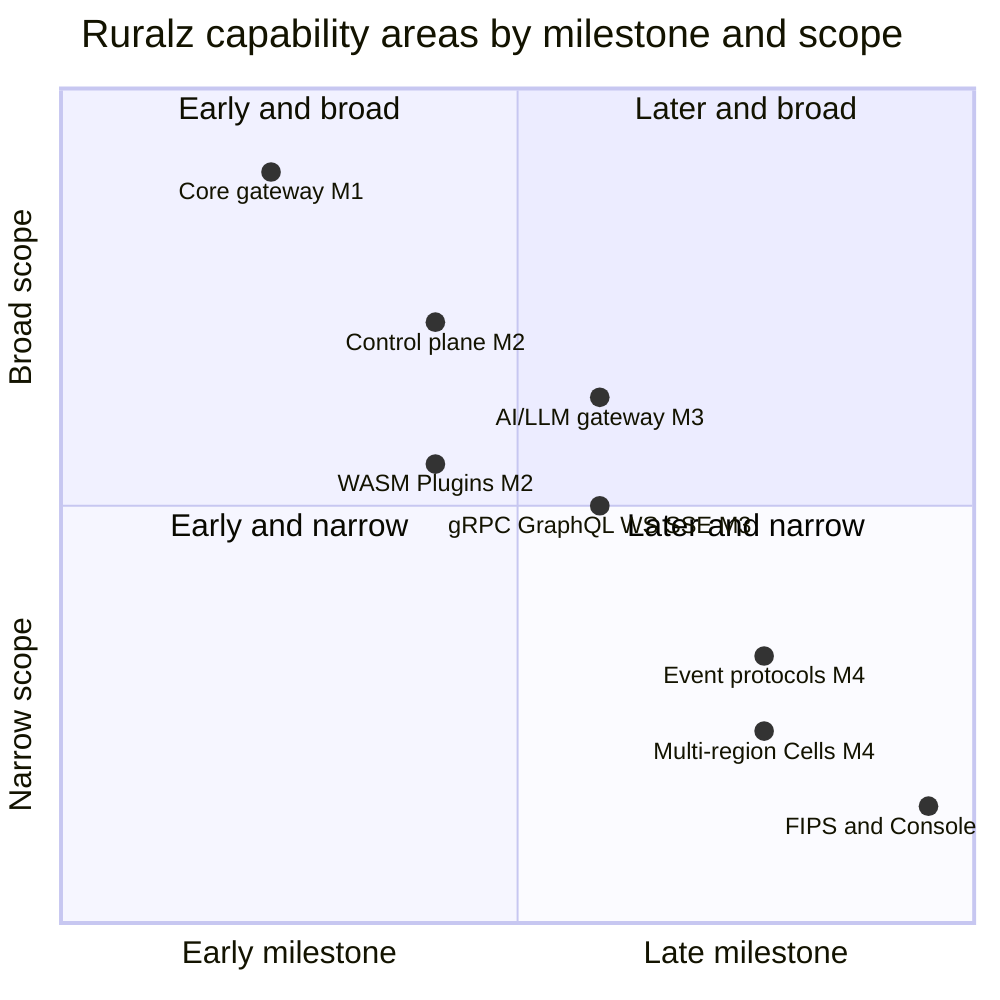

# Vision and Positioning

## Summary

This document explains why Ruralz exists, who it serves and how it is positioned: an open-source API gateway where every feature, including the control plane and console, is free (Apache-2.0, no feature gating). It fixes the four differentiators and the principles `P1` to `P10`, which every document inherits, and records the license, business model, non-goals and success metrics. Evaluators should read it to judge fit; it commits to milestone order, and dates live in the [Roadmap](../roadmap/01-roadmap-and-milestones.md). Architects should read it before the [System Overview](../architecture/01-system-overview.md), because design documents MUST NOT contradict `P1` to `P10`. Nothing here is implemented: every capability carries a `Planned (Mx)` tag.

## Scope and non-goals

In scope: the sections below, as of 2026-09-25, with the license per [ADR-0002](../adr/0002-apache-2-license-no-feature-gating.md). Terms follow the frozen [foundation pack](../_meta/foundation-pack.md).

Out of scope: architecture ([System Overview](../architecture/01-system-overview.md)); the capability-by-capability list (the [Feature Catalog](../features/01-feature-catalog.md)); dates ([Roadmap and milestones](../roadmap/01-roadmap-and-milestones.md)); authoritative performance numbers ([Performance budgets and benchmarking](../architecture/12-performance-budgets-and-benchmarking.md)).

## Problem and why now

### The problem

Teams running APIs in production need more than a reverse proxy: authentication and authorization, stateful Rate Limits and Quotas shared across Nodes, a way to run custom logic safely, governance for AI traffic, a control plane that rolls configuration out from Git, and native support for the protocols their services actually speak. When those capabilities sit behind a license key, a paid edition or a hosted-only service, a team either pays per feature or assembles a partial platform from separate tools, and it learns the true cost only after its traffic depends on the gateway.

Platform teams now need safe custom logic, AI governance, GitOps and protocol breadth at once, in one Policy model, self-hosted and, where required, air-gapped. Ruralz is designed to provide all of it as one Apache-2.0 project in which no capability is reserved for a paid build.

### What Ruralz answers

Each need maps to one of the four differentiators or to the core gateway:

- **Safe custom logic.** Custom code runs as a sandboxed WASM Plugin with deny-by-default Capabilities, never as a native module loaded into the Node process (P6).
- **AI governance.** LLM traffic is API traffic: providers are Upstreams behind `AIProvider` and `AIModel`, governed by the same Policies, Consumers and State Store as other traffic (P8).
- **Configuration you can audit.** Git is the source of truth; Ruralz Control builds signed, immutable Revisions and reports anything that differs as Drift (P5).
- **Protocol breadth without editions.** Every protocol maps onto the same `Route`, `Policy` and Filter Chain model (P7), in the same build.
- **No lock-in by license.** No binary refuses to start, turns read-only or degrades over a license state, because no license state exists (P1).

### Why now

- **Custom logic needs a sandbox.** Native extension mechanisms couple custom code to one compiler toolchain and share the Node's address space; a WASM sandbox with declared limits removes both problems, and the wazero runtime lets a Go data plane host it with `CGO_ENABLED=0`.
- **AI traffic needs the same governance as API traffic.** Token Budgets, Provider Fallback, Prompt Cache marker preservation and cost attribution belong on the request path next to authentication and Rate Limits, not in a separate proxy with its own policy language.
- **Unified façades must not break caching.** Translating a provider's native request into a common shape can drop provider features such as `cache_control` markers, so Ruralz offers native passthrough beside its OpenAI-compatible façade ([ADR-0014](../adr/0014-ai-api-surface.md)).
- **The supply-chain bar has risen.** EU Cyber Resilience Act reporting for manufacturers began on 2026-09-11 ([source](https://digital-strategy.ec.europa.eu/en/policies/cra-reporting)); signed Revisions and Plugins ([ADR-0017](../adr/0017-artifact-signing.md)), SBOMs and provenance are part of the design from `M1`.

## Personas

| Persona | Audience | Need | Ruralz answer |
|---|---|---|---|
| Platform engineer running many Clusters | operators, architects | One control plane for many Clusters and Environments, driven from Git | Ruralz Control and Ruralz Console with RBAC, audit log and Drift, Planned (M2) |
| API team lead evaluating a gateway | evaluators, architects | Production features without per-feature licensing or an expiry date | Every capability in the [Feature Catalog](../features/01-feature-catalog.md), free and self-hosted, Planned (M1) to Planned (M5) |
| AI platform engineer | ai-platform-engineers | Model routing, Provider Fallback, token limits and cost attribution for LLM traffic | `AIProvider`, `AIModel`, Token Budget in the State Store, Semantic Cache, Planned (M3) |
| Plugin author | plugin-authors | Custom logic in a familiar language without rebuilding the gateway | Plugin ABI v1, deny-by-default Capabilities, `ruralz plugin init` and `ruralz plugin test`, Planned (M2) |
| Security engineer | security-engineers | Secrets out of configuration, auditable changes, signed artifacts, FIPS | `secretRef`, Planned (M1); Capabilities, audit log, Revision and Plugin signing ([ADR-0017](../adr/0017-artifact-signing.md)), Planned (M2); FIPS build and Ruralz Console SSO/SAML, Planned (M5) |
| Contributor | contributors | A project whose license will not change under them | DCO, no CLA, Apache-2.0 everywhere ([ADR-0002](../adr/0002-apache-2-license-no-feature-gating.md)), Planned (M0) |

## Positioning

### Positioning statement

Ruralz is an open-source API gateway where every feature, including the control plane and console, is free (Apache-2.0, no feature gating): no license keys, no license files and no "enterprise" build. It is for platform, API and AI platform teams that want production gateway capabilities, safe extensibility, GitOps and protocol breadth from one self-hosted project. Its design centers on the four differentiators: (1) **WASM plugin system**, (2) **AI/LLM gateway**, (3) **built-in control plane + GitOps**, (4) **multi-protocol native**.

### The four differentiators

| # | Differentiator | What Ruralz plans | Owning document | Milestone |
|---|---|---|---|---|
| 1 | WASM plugin system | Sandboxed Plugins on Plugin ABI v1, pulled from OCI by digest and Sigstore-signed ([ADR-0017](../adr/0017-artifact-signing.md)), in any Phase including `onChunk` | [WASM plugin system](../architecture/05-wasm-plugin-system.md) | Planned (M2); proxy-wasm adapter Planned (M4) ([ADR-0005](../adr/0005-plugin-abi-v1.md)) |
| 2 | AI/LLM gateway | `AIProvider` and `AIModel`, an OpenAI-compatible façade plus native passthrough ([ADR-0014](../adr/0014-ai-api-surface.md)), Token Budgets and Semantic Cache in the State Store | [AI/LLM gateway](../architecture/06-ai-llm-gateway.md) | Planned (M3) |
| 3 | built-in control plane + GitOps | Ruralz Control builds and signs Revisions from Git and runs Rollouts over the Control Stream; Ruralz Console, RBAC, audit log, Drift | [Control plane and GitOps](../architecture/04-control-plane-and-gitops.md) | Planned (M2) |
| 4 | multi-protocol native | HTTP/1.1 to HTTP/3, gRPC, GraphQL federation, WebSocket, SSE, Kafka, NATS and MQTT through per-protocol Phase mappings (P7) | [Multi-protocol](../architecture/07-multi-protocol.md) | gRPC, GraphQL, WebSocket, SSE and HTTP/3 Planned (M3); Kafka, NATS, MQTT Planned (M4) |

### What is free

Everything is free. The groups below show the breadth; the [Feature Catalog](../features/01-feature-catalog.md) lists every capability and takes precedence on milestones.

| Capability group | In Ruralz | Milestone |
|---|---|---|
| Authentication | Core `Policy` types `auth.jwt`, `auth.api-key`, `auth.basic` and `auth.mtls`, with multiple identity providers per Route | Planned (M1) |
| Rate Limits and Quotas | `ratelimit` and `quota`: local token bucket plus GCRA in the State Store ([ADR-0008](../adr/0008-rate-limiting-local-bucket-and-gcra.md)) | Planned (M1) |
| IP filtering and GeoIP | Built-in `authz.ip`, Planned (M1), and `authz.geoip`, Planned (M2) ([pack section 10](../_meta/foundation-pack.md#10-policy-type-registry)) | Planned (M1) to Planned (M2) |
| Authorization engines | `authz.cel`, Planned (M1); `authz.opa` and `authz.cedar`, Planned (M2) ([ADR-0011](../adr/0011-expressions-and-authorization-engines.md)) | Planned (M1) to Planned (M2) |
| Bundle and Plugin tooling | CLI commands ([pack section 9](../_meta/foundation-pack.md#9-cli-command-registry)): `ruralz node dump`, Planned (M1); `ruralz bundle import openapi`, `ruralz bundle export`, `ruralz test run`, `ruralz plugin init`, Planned (M2); serving OpenAPI documents per OQ-vision-and-positioning-11 | Planned (M1) to Planned (M2) |
| Control plane | Ruralz Control, Ruralz Console, RBAC, audit log, Drift, canary Rollouts | Planned (M2) |
| AI/LLM gateway | `AIProvider`, `AIModel`, Provider Fallback, Token Budget (`ai.token-budget`), Semantic Cache, cost attribution | Planned (M3) |
| Streaming protocols | gRPC, GraphQL federation, WebSocket, SSE, HTTP/3 | Planned (M3) |
| MCP Server | Tools generated from existing Routes; surface per OQ-vision-and-positioning-12 | Planned (M3) |
| Event protocols | Kafka, NATS and MQTT Upstreams and topic ingress | Planned (M4) |
| Enterprise hardening | FIPS build, Ruralz Console SSO/SAML, monetization hooks | Planned (M5) |

### Open-source model

Ruralz is developed in the open in one monorepo under Apache-2.0, with DCO sign-off and no CLA. Revington owns the copyright and the Ruralz trademark and earns revenue only from Ruralz Cloud and commercial support, neither of which delivers a feature the public build lacks ([Open source and business model](#open-source-and-business-model)). A feature arrives for everyone at its milestone, or it is `Not planned` with a reason in the Feature Catalog.

*Figure 1: Ruralz capability areas by delivery milestone and scope; points are plans, nothing is shipped.*

The x position is 0.05 + 0.18 × the milestone number. Scope is maintainer judgment (hypothesis) of the share of Ruralz deployments expected to use the area: the core gateway serves every deployment, while multi-region Cells and the FIPS build serve a few.

### Where Ruralz does not lead

- **Nothing ships yet.** Every capability is a plan until its milestone exits and the Feature Catalog marks it implemented.
- **Gateway API conformance is deferred.** Ruralz ships a Helm chart and CRDs mirroring its kinds, Planned (M2), and defers Kubernetes Gateway API conformance (non-goal 7, OQ-vision-and-positioning-4).
- **Go tail latency.** Garbage-collector pauses may hurt a Go data plane's p99 (hypothesis); P10 requires published benchmarks against the [Performance budgets](../architecture/12-performance-budgets-and-benchmarking.md).
- **The Plugin ecosystem starts at zero.** PDKs and example Plugins arrive in `M2`, and the ecosystem grows only with contributors.

## Principles

These principles bind every Ruralz document; [System Overview](../architecture/01-system-overview.md#design-principles) design rules are their consequences. Changing one requires an ADR.

| ID | Principle | Statement |
|---|---|---|
| P1 | Everything is free | Every feature, including Ruralz Control and Ruralz Console, ships under Apache-2.0 with one feature set in every public build, including the FIPS build. No code path checks a Ruralz license, license key or Revington entitlement. |
| P2 | The gateway stands alone | Ruralz Gateway serves traffic from a Bundle directory or an OCI pull, with no control plane present. Ruralz Control is never on an enrolled Node's serving path; in Control mode, a Node without Last-Known-Good stays not ready until it enrolls and receives its first Revision ([pack section 8.11](../_meta/foundation-pack.md#811-node-durable-state)), and seeding from an OCI-published Revision during an outage is [OQ-system-overview-12](../architecture/01-system-overview.md#open-questions). |
| P3 | No control-plane or peer dependency on the request path | No request waits on Ruralz Control, the Control Store or another Node's process; each Policy makes at most one blocking, timed State Store round trip before the response is committed, with usage settlement and cache stores asynchronous, bounded and droppable. Other remote calls, such as a Semantic Cache embedding call to an `AIProvider`, are declared on the Policy with a timeout and `failureMode` (P9). |
| P4 | Nodes are disposable | Nodes hold no durable state beyond their enrollment identity, Last-Known-Good configuration and disposable Plugin caches, and join or leave a Cluster without coordinating with other Nodes. Enrollment is one-time and off the request path (file mode, including OCI pulls, needs none), and per-Node Rate Limit ceilings come from the Policy or a Node count Ruralz Control publishes, never from peers. |
| P5 | Git is the source of truth | A declarative Bundle renders into one immutable, content-addressed Revision per Environment, loaded from a directory or OCI digest in file mode or delivered as a Rollout with ACK/NACK in Control mode. When Ruralz Control manages a Cluster, anything that differs from Git is reported as Drift. |
| P6 | Custom code is sandboxed | Plugins run in a WASM sandbox with deny-by-default Capabilities and declared limits (`memoryBytes`, `timeout`; further limits are owned by [WASM plugin system](../architecture/05-wasm-plugin-system.md)); within them, a faulty Plugin fails its own Filter, not the Node. A Node-wide cap on aggregate Plugin memory, Gateway `spec.limits.maxPluginMemoryBytes` ([pack section 8.11](../_meta/foundation-pack.md#811-node-durable-state)), refuses new instances when reached and never crashes the Node. |
| P7 | Protocols are native | Every protocol maps onto the same `Route`, `Policy` and Filter Chain model through a documented Phase mapping: a session maps to the request Phases, each message to `onChunk`, and inapplicable Phases are skipped and listed in [Multi-protocol](../architecture/07-multi-protocol.md). No protocol is a separate product or edition. |
| P8 | AI traffic is API traffic | LLM providers are Upstreams behind `AIProvider` and `AIModel`, governed by the same Policies, Consumers and State Store as other traffic. A Token Budget atomically reserves estimated prompt tokens plus an output cap (the client's `max_tokens`, else `AIModel` `limits.maxOutputTokens`, which a Token-Budgeted `AIModel` MUST set, written into the upstream request's output-token limit), admits only when the remaining budget covers the full reservation, and settles with authoritative provider-reported usage ([ADR-0014](../adr/0014-ai-api-surface.md), [pack section 8.9](../_meta/foundation-pack.md#89-token-budgets-adr-0014)). |
| P9 | Fail static, degrade by declaration | Nodes keep serving their active Revision when Ruralz Control is unavailable and boot Last-Known-Good after a restart. Each Policy type with a remote dependency has a documented default `failureMode`, overridable only where the [Configuration model](../architecture/02-configuration-model.md#policy) registry allows: authentication and authorization always fail closed, and Rate Limits fail open by default ([ADR-0008](../adr/0008-rate-limiting-local-bucket-and-gcra.md)). |
| P10 | Measured, not claimed | Every performance figure is either a tagged target or a reproducible benchmark published from this repository. OpenTelemetry signals and a metric for every degraded state are part of every build. |

## Open source and business model

### License and ownership

All Ruralz components are Apache-2.0: `ruralzd`, `ruralz-control`, Ruralz Console, the `ruralz` CLI, SDKs, the Helm chart and the documentation, in the monorepo `github.com/ravindu-rev/ruralz`. The copyright line is "Copyright 2026 Revington", and "Ruralz" is a trademark of Revington (revington.co). [ADR-0002](../adr/0002-apache-2-license-no-feature-gating.md) records this as repository policy, Planned (M0).

### No feature gating

- Ruralz MUST NOT ship license keys, license files, Revington entitlement checks or a separate "enterprise" build.
- No binary may refuse to start, turn read-only or degrade over a license state.
- Every Filter, Host Function and API MUST work self-hosted and air-gapped, with no Revington-operated service: `AIProvider` pricing tables ship in configuration, and an air-gapped Semantic Cache uses a local embedding `AIProvider` such as `ollama`.
- Commercial support MUST NOT deliver private features; such work lands upstream under Apache-2.0.

### Revenue

Revington earns revenue from exactly two lines: **Ruralz Cloud** (see [Managed cloud](#managed-cloud)) and **commercial support**. Control-plane and identity capabilities stay in the public build: RBAC, audit log and Ruralz Control are Planned (M2), and Ruralz Console SSO/SAML is Planned (M5).

### Why Apache-2.0 and not copyleft or source-available

A permissive license with no edition split lets anyone run, embed and extend Ruralz without a legal review of which build they hold, and a license that never changes is what users and contributors can plan around.

- **Patent grant.** Apache-2.0 Section 3 grants each contributor's patent license ([source](https://www.apache.org/licenses/LICENSE-2.0)).
- **DCO, no CLA.** A DCO certifies that each commit is contributed under the project license ([source](https://developercertificate.org/)), so Revington gets no rights beyond Apache-2.0 and every released version stays Apache-2.0. Future versions stay Apache-2.0 because of P1 and [ADR-0002](../adr/0002-apache-2-license-no-feature-gating.md), not a legal barrier; OQ-vision-and-positioning-9 is the structural safeguard.
- **Trademark protects the name.** Apache-2.0 grants no trademark rights ([source](https://www.apache.org/licenses/LICENSE-2.0)); a policy modeled on ASF nominative use ([source](https://www.apache.org/foundation/marks/)) governs "Ruralz" (OQ-vision-and-positioning-2).
- **State Store licensing stays separate.** Ruralz reaches Redis or Valkey over the network; Valkey is BSD-3-Clause ([source](https://www.linuxfoundation.org/press/linux-foundation-launches-open-source-valkey-community)).

## Product non-goals

Within `M0` to `M5`, Ruralz deliberately does not attempt the following:

1. **No service mesh.** Ruralz is a north-south and AI gateway: no sidecar, no east-west mesh.
2. **No full API management suite.** A developer portal, API catalog and billing engine are Not planned because they are separate products; monetization hooks (Planned (M5)) and `ruralz bundle export openapi` (Planned (M2)) let portals integrate.
3. **No Go `plugin` or shared-object loading, and no Lua.** Custom logic is a WASM Plugin or inline CEL ([ADR-0011](../adr/0011-expressions-and-authorization-engines.md)), avoiding toolchain coupling between custom code and the Ruralz Gateway build.
4. **No LLM application platform.** Ruralz governs AI traffic; it hosts no models, retrieval pipelines or evaluations.
5. **No durable event storage.** Kafka, NATS and MQTT Routes (Planned (M4)) mediate and govern traffic; they do not replace a broker.
6. **No curated WAF rule sets.** Ruralz bundles no OWASP rule set; WAF engines integrate as Plugins.
7. **No Kubernetes Gateway API conformance**, deferred by [ADR-0016](../adr/0016-kubernetes-helm-and-crds.md) (proposed); a Helm chart and CRDs mirroring the kinds are Planned (M2).
8. **No feature or edition tiers.** Every public build, including the FIPS build (Planned (M5)), has the same features (P1), and no capability is limited by Node count.

## Success metrics

Every metric is measured from public data or CI; [Performance budgets and benchmarking](../architecture/12-performance-budgets-and-benchmarking.md) owns authoritative performance values and the reference hardware; latency rows match the [System Overview](../architecture/01-system-overview.md).

SM-4 and SM-5 use one reference scenario: HTTP/1.1 keep-alive, 1 KiB body, JWT validation and a local token bucket, no Plugins or State Store Policy, at half of saturation RPS (target). Both exclude Upstream and State Store time, since a same-zone State Store round trip alone may reach 1 ms at p99 (hypothesis).

| ID | Metric | How it is measured | Value | Milestone |
|---|---|---|---|---|
| SM-1 | Features behind a license key or edition | Code search and release audit on every tag | 0 features (target) | Planned (M0), permanent |
| SM-2 | Feature Catalog rows with a milestone or a reasoned `Not planned` | Count in the [Feature Catalog](../features/01-feature-catalog.md) | 100% of rows (target) | Planned (M1) |
| SM-3 | Feature Catalog rows implemented at their milestone's exit | Feature Catalog status after each milestone | 100% of rows tagged that milestone or earlier and not marked `Not planned` (target) | Planned (M1) to Planned (M5) |
| SM-4 | Gateway-added latency p99, reference scenario | Benchmark suite on reference hardware | 1 ms or less (target) | Planned (M1) |
| SM-5 | Gateway-added latency p50, reference scenario | Benchmark suite on reference hardware | 150 µs or less (target) | Planned (M1) |
| SM-6 | WASM Plugin Phase call overhead, pooled instance, deadline interruption enabled, p99 | Per-Phase microbenchmark in CI | 50 µs or less (target) | Planned (M2) |
| SM-7 | Time from download to first proxied request | Scripted quickstart in CI on a clean machine | 10 minutes or less (target) | Planned (M1) |
| SM-8 | OpenAPI 3.x documents imported by `ruralz bundle import openapi` that validate and render without manual edits | Public OpenAPI corpus in the monorepo, run in CI | 90% or more (target) | Planned (M2) |
| SM-9 | Rollout convergence in a 100-Node Cluster | `all-at-once` Rollout, Plugins cached: Revision recorded by Ruralz Control to `complete` (last ACK) | 30 s or less at p95 (target) | Planned (M2) |
| SM-10 | Token Budget overshoot under concurrent streaming | Mock provider; B = 1,000,000 tokens, 200 concurrent streams, 2,000-token prompts, `max_tokens` = 4,096, reservations per P8; the mock reports prompt usage 2% above the gateway estimate and drops usage on 5% of streams | Overshoot at most the sum of per-stream estimate error, and 1% of B or less (hypothesis) | Planned (M3) |
| SM-11 | Prompt Cache marker preservation on native passthrough | Conformance tests for `cache_control` and equivalents | 100% of test cases (target) | Planned (M3) |
| SM-12 | Supply-chain posture | Signed images and SBOM per release; OpenSSF Scorecard | 100% of releases signed from M1 (target); Scorecard 8.0 or higher from M2 (hypothesis) | Planned (M1) to Planned (M2) |
| SM-13 | Unpatched Plugin sandbox escapes | Security advisories log | 0 older than 30 days (target) | Planned (M2) |
| SM-14 | External contributors with merged DCO-signed commits | Git history, excluding Revington employees | 50 or more (hypothesis) | Planned (M3) |
| SM-15 | Production adopters who publicly reference Ruralz | Public adopters file with verified entries | 25 or more (hypothesis) | Planned (M4) |

SM-10's 2% estimate error is an assumption (hypothesis): Anthropic publishes no tokenizer, and Claude Opus 4.7 and later produce about 30% more tokens for the same text ([source](https://platform.claude.com/docs/en/build-with-claude/token-counting)); see OQ-vision-and-positioning-15. A stream reporting no usage is charged its full reservation and emits a degraded-state metric (P10). SM-14 and SM-15 are re-baselined after `M1` (OQ-vision-and-positioning-7).

## Managed cloud

**Ruralz Cloud** is Revington's planned managed offering and one of its two revenue lines. It has not launched and has no milestone in `M0` to `M5` (timing: OQ-vision-and-positioning-3). Only this section describes it; the hybrid topology in [Deployment topologies](../operations/01-deployment-topologies.md) covers the operational layout.

### What it will be

Revington would operate `ruralz-control`, its Control Store and Ruralz Console, and customers' own Ruralz Gateway Nodes would enroll and dial the Control Stream over mTLS; optionally, Revington would also run Nodes and the State Store in chosen Regions. Ruralz Cloud would run the public images `ghcr.io/ravindu-rev/ruralzd` and `ghcr.io/ravindu-rev/ruralz-control`, with no fork and no private patches.

### Rules for Ruralz Cloud

- **Tenancy.** Ruralz Cloud MUST run one dedicated `ruralz-control` and Control Store per customer, so Ruralz Control needs no multi-tenancy. Provisioning and billing are separate Revington services that read only public interfaces: the REST API, metrics and OpenTelemetry signals.
- **No cloud-only features.** Ruralz Cloud MUST NOT offer any feature, Filter, Host Function, API or kind that a self-hosted Ruralz Control lacks. No document may describe a cloud-only hook.
- **Exit.** Customers MUST be able to leave without losing configuration or control-plane state. Bundles live in the customer's Git repository; Control Store state (Rollout history, RBAC, audit log, enrollment, Revisions) leaves through `ruralz control backup` and `ruralz control restore`. State Store counters, such as Token Budget usage, reset on migration. Nodes re-enroll while their active Revision keeps traffic flowing.
- **Pricing.** Customers pay for operations, availability, Regions and support, never for features.

### Open points

The pricing unit is OQ-vision-and-positioning-1. Revington may be a Cyber Resilience Act manufacturer for Ruralz Cloud ([source](https://digital-strategy.ec.europa.eu/en/policies/cra-reporting)), pending legal review (OQ-vision-and-positioning-6).

## Open questions

| ID | Question | Options | Owner | Blocking? |
|---|---|---|---|---|
| OQ-vision-and-positioning-1 | Which pricing unit does Ruralz Cloud use? | Per Node-hour; per Cluster; per million requests; tiers by Region count | Revington product | No |
| OQ-vision-and-positioning-2 | How strict is the trademark policy for modified builds and "compatible with Ruralz" claims? | ASF-style nominative use; ban for modified builds; certification | Revington legal | No |
| OQ-vision-and-positioning-3 | When does Ruralz Cloud launch? | After M2; after M3; after M4 | Revington product | No |
| OQ-vision-and-positioning-4 | Should Kubernetes Gateway API conformance be scheduled ([ADR-0016](../adr/0016-kubernetes-helm-and-crds.md))? | Keep deferred beyond M5; Planned (M4); Planned (M5) | deployment-topologies | No |
| OQ-vision-and-positioning-6 | What is Revington's CRA role? | Manufacturer for Ruralz Cloud only; steward for the project; both | Revington legal | No |
| OQ-vision-and-positioning-7 | What baselines replace the adoption hypotheses SM-14 and SM-15? | Re-baseline after M1; keep; download counts | ruralz-core | No |
| OQ-vision-and-positioning-9 | Should Ruralz stay Revington-stewarded or move to a neutral foundation? | Revington with open governance; a foundation after M3 | Revington leadership | No |
| OQ-vision-and-positioning-11 | Should Ruralz Gateway serve OpenAPI documents beyond the [CLI and API surface](../reference/01-cli-and-api-surface.md) export? | Serve from Ruralz Gateway; publish only the `ruralz bundle export openapi` output; Not planned | CLI and API surface owner | No |
| OQ-vision-and-positioning-12 | What surface does the MCP Server take, given no MCP kind or Policy type exists? | An `AIModel` or `Route` feature; a Policy type; a Plugin | AI/LLM gateway owner | No |
| OQ-vision-and-positioning-15 | How accurate are prompt estimates per provider for Token Budget reservations (P8, SM-10)? | Count endpoints with per-model correction; local tokenizers; both | AI/LLM gateway owner | No |
