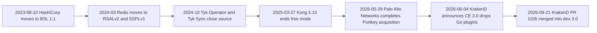
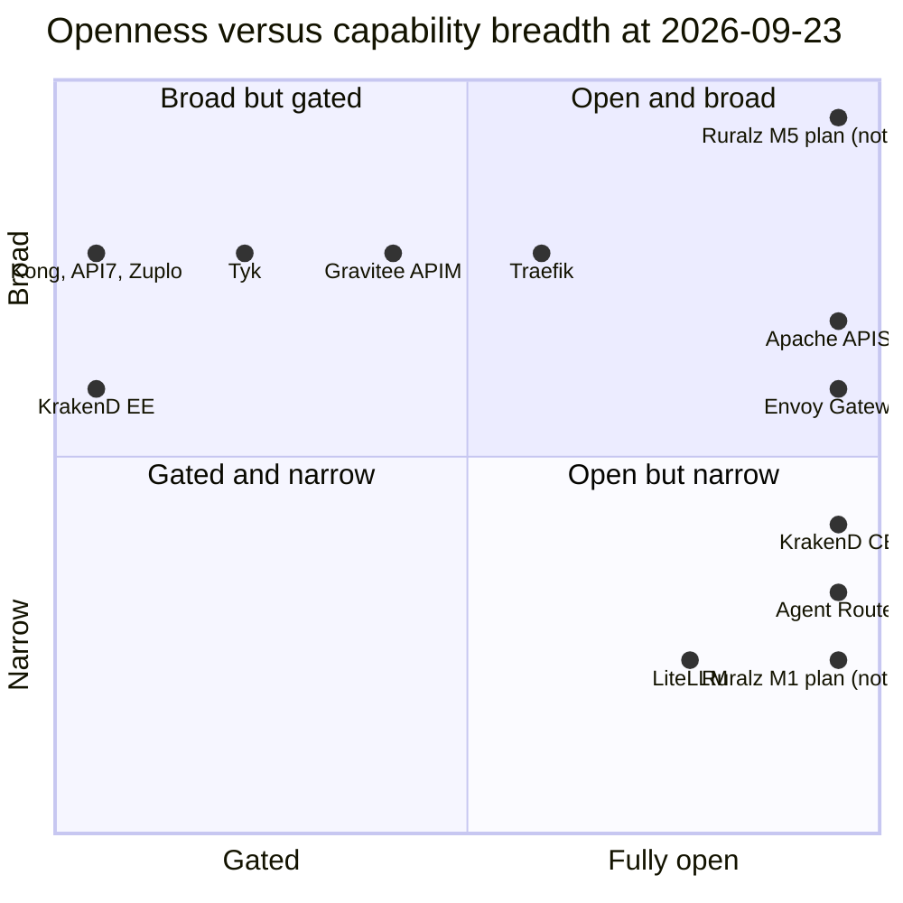

# Vision and Positioning

## Summary

This document explains why Ruralz exists, who it serves and how it is positioned: "KrakenD Enterprise, but better, and fully free." It fixes the four differentiators and the principles `P1` to `P10`, which every document inherits, and records the license, business model, non-goals and success metrics. Evaluators should read it to judge fit; it commits to milestone order, and dates live in the [Roadmap](../roadmap/01-roadmap-and-milestones.md). Architects should read it before the [System Overview](../architecture/01-system-overview.md), because design documents MUST NOT contradict `P1` to `P10`. Nothing here is implemented: every capability carries a `Planned (Mx)` tag, and anything unscheduled points to an open question.

## Scope and non-goals

In scope: the sections below, as of 2026-09-23, positioned mainly against KrakenD Community Edition (CE) and Enterprise Edition (EE), with the license per [ADR-0002](../adr/0002-apache-2-license-no-feature-gating.md). Terms follow the frozen [foundation pack](../_meta/foundation-pack.md).

Out of scope: architecture ([System Overview](../architecture/01-system-overview.md)); row-by-row parity (the [KrakenD EE parity matrix](../comparison/01-krakend-ee-parity-matrix.md)); the full landscape ([Market landscape and table stakes](../comparison/02-market-landscape-and-table-stakes.md)); dates ([Roadmap and milestones](../roadmap/01-roadmap-and-milestones.md)); authoritative performance numbers ([Performance budgets and benchmarking](../architecture/12-performance-budgets-and-benchmarking.md)).

## Problem and why now

### The problem

Teams choosing an API gateway face a false choice: an open-source core that lacks what production traffic needs, or an enterprise edition that runs only with a valid license. KrakenD is the clearest case. KrakenD CE is Apache-2.0 ([source](https://github.com/krakend/krakend-ce)), but the AI Gateway category, gRPC, SSE, WebSockets, API keys, stateful rate limiting, the Security Policies Engine and OpenAPI tooling are Enterprise-only ([source](https://www.krakend.io/features/)). KrakenD EE will not start without a valid license file and shuts down when it expires ([source](https://www.krakend.io/docs/enterprise/overview/license-file/)).

Platform teams now need safe custom logic, AI governance, GitOps and protocol breadth at once. KrakenD has no WASM Plugin runtime, no control plane, no console beyond the stateless Designer, no GraphQL federation and no HTTP/3 ([source](https://www.krakend.io/features/)). Most other vendors sell the missing pieces as a commercial layer. The main exceptions are Apache APISIX, whose AI plugins are Apache-2.0 ([source](https://github.com/apache/apisix)) and gained a semantic cache and distributed token counters in 3.18 ([source](https://apisix.apache.org/blog/2026/08/20/release-apache-apisix-3.18.0/)), and Envoy Gateway, whose free control plane is Kubernetes-native ([source](https://gateway.envoyproxy.io/docs/concepts/)) and whose standalone mode is experimental ([source](https://gateway.envoyproxy.io/docs/tasks/operations/standalone-deployment-mode/)).

### Two licensing events that frame 2026

**KrakenD CE 3.0 drops Go plugins.** On 2026-06-04 KrakenD announced that from 3.0, KrakenD CE and the Lura Project no longer support Go plugins while EE keeps them, citing toolchain coupling and support burden ([source](https://www.krakend.io/blog/dropping-plugins-support-on-community/)). Pull request #1106 merged the change into `dev-3.0` on 2026-09-21 ([source](https://github.com/krakend/krakend-ce/pull/1106)). The free edition's only compiled-code extension point moves to the paid edition; KrakenD CE keeps Lua and CEL ([source](https://www.krakend.io/features/)).

**Kong 3.10 removes the free Enterprise mode.** Kong's 3.10 release-note text, quoted in discussion #14628, says: "Free mode is no longer available. Running Kong Gateway without a license will now behave the same as running it with an expired license." ([source](https://github.com/Kong/kong/discussions/14628)). Kong's breaking-changes page still calls free mode deprecated, due for removal "in a future 3.x version" ([source](https://developer.konghq.com/gateway/breaking-changes/)). Kong/kong open-source releases stop at 3.9.x ([source](https://github.com/Kong/kong/releases)).

### The wider pattern

Both events continue a series in which free software became gated, closed or source-available.

*Figure 1: licensing and ownership events before the 2026-09-23 snapshot.*

Sources for Figure 1: HashiCorp ([source](https://www.hashicorp.com/blog/hashicorp-adopts-business-source-license)), Redis ([source](https://redis.io/legal/licenses/)), Tyk ([source](https://github.com/TykTechnologies/tyk-operator)) ([source](https://github.com/TykTechnologies/tyk-sync)), Kong ([source](https://github.com/Kong/kong/discussions/14628)) ([source](https://developer.konghq.com/gateway/version-support-policy/)), Portkey ([source](https://www.paloaltonetworks.com/company/press/2026/palo-alto-networks-completes-acquisition-of-portkey-to-secure-ai-agents)), KrakenD ([source](https://www.krakend.io/blog/dropping-plugins-support-on-community/)) ([source](https://github.com/krakend/krakend-ce/pull/1106)).

### Why now

- **Extensibility has a gap.** Kong removed beta WASM in 3.11.0.0 ([source](https://developer.konghq.com/gateway/breaking-changes/)), APISIX's proxy-wasm is experimental ([source](https://apisix.apache.org/docs/apisix/wasm/)) and Tyk documents no WASM ([source](https://tyk.io/docs/api-management/plugins/overview)). Envoy Gateway's Wasm ([source](https://gateway.envoyproxy.io/docs/api/extension_types/)) runs outside Kubernetes only in its experimental standalone mode.
- **AI gateways are consolidating.** Palo Alto Networks owns Portkey ([source](https://www.paloaltonetworks.com/company/press/2026/palo-alto-networks-completes-acquisition-of-portkey-to-secure-ai-agents)); Helicone is in maintenance mode ([source](https://www.helicone.ai/blog/joining-mintlify)).
- **Translating AI proxies break caching.** LiteLLM ([source](https://github.com/BerriAI/litellm/issues/41424)) and Portkey ([source](https://github.com/Portkey-AI/gateway/issues/1579)) drop `cache_control` on some routes, so buyers need native passthrough beside a unified façade.
- **The supply-chain bar has risen.** EU Cyber Resilience Act reporting for manufacturers began on 2026-09-11 ([source](https://digital-strategy.ec.europa.eu/en/policies/cra-reporting)).

## Personas

| Persona | Audience | Situation at the snapshot | Ruralz answer |
|---|---|---|---|
| KrakenD CE operator with custom Go plugins | operators, evaluators | CE 3.0 removes Go plugins ([source](https://www.krakend.io/blog/dropping-plugins-support-on-community/)) | Plugins on Plugin ABI v1, Planned (M2); `ruralz bundle import krakend` with declared fidelity levels, Planned (M2) |
| KrakenD EE buyer | evaluators, architects | EE stops when its license file expires ([source](https://www.krakend.io/docs/enterprise/overview/license-file/)) | Every EE capability except rows the [parity matrix](../comparison/01-krakend-ee-parity-matrix.md) marks Not planned, Planned (M1) to Planned (M5) |
| Platform engineer running many Clusters | operators, architects | Tyk Operator and Tyk Sync are closed source ([source](https://github.com/TykTechnologies/tyk-operator)) ([source](https://github.com/TykTechnologies/tyk-sync)) | Ruralz Control and Ruralz Console, Planned (M2) |
| AI platform engineer | ai-platform-engineers | Kong's AI load balancing ([source](https://developer.konghq.com/plugins/ai-proxy-advanced/)) and token rate limiting ([source](https://developer.konghq.com/plugins/ai-rate-limiting-advanced/)) are AI Gateway Enterprise | `AIProvider`, `AIModel`, Token Budget in the State Store, Semantic Cache, Planned (M3) |
| Plugin author | plugin-authors | Kong's WASM beta is gone ([source](https://developer.konghq.com/gateway/breaking-changes/)) | Plugin ABI v1, deny-by-default Capabilities, `ruralz plugin init` and `ruralz plugin test`, Planned (M2) |
| Security engineer | security-engineers | FIPS and the Security Policies Engine are KrakenD EE-only ([source](https://www.krakend.io/features/)) | `secretRef`, Planned (M1); Capabilities, audit log, Revision and Plugin signing ([ADR-0017](../adr/0017-artifact-signing.md)), Planned (M2); FIPS build and Ruralz Console SSO/SAML, Planned (M5) |
| Contributor | contributors | Tyk AI Studio requires the Tyk CLA ([source](https://github.com/TykTechnologies/ai-studio)) | DCO, no CLA, Apache-2.0 everywhere ([ADR-0002](../adr/0002-apache-2-license-no-feature-gating.md)), Planned (M0) |

[Migration from KrakenD](../comparison/03-migration-from-krakend.md) owns the migration path.

## Positioning versus KrakenD EE and the market

### Positioning statement

Ruralz is "KrakenD Enterprise, but better, and fully free": every feature, including the control plane and console, is Apache-2.0, with no feature gating, no license keys and no "enterprise" build. "Better" means the four differentiators: (1) **WASM plugin system**, (2) **AI/LLM gateway**, (3) **built-in control plane + GitOps**, (4) **multi-protocol native**.

### The four differentiators

| # | Differentiator | What Ruralz plans | KrakenD CE and EE at the snapshot | Owning document | Milestone |
|---|---|---|---|---|---|
| 1 | WASM plugin system | Sandboxed Plugins on Plugin ABI v1, pulled from OCI by digest and Sigstore-signed ([ADR-0017](../adr/0017-artifact-signing.md)), in any Phase including `onChunk` | Go plugins (EE-only from CE 3.0) and Lua; no WASM ([source](https://www.krakend.io/features/)) | [WASM plugin system](../architecture/05-wasm-plugin-system.md) | Planned (M2); proxy-wasm adapter Planned (M4) ([ADR-0005](../adr/0005-plugin-abi-v1.md)) |
| 2 | AI/LLM gateway | `AIProvider` and `AIModel`, an OpenAI-compatible façade plus native passthrough ([ADR-0014](../adr/0014-ai-api-surface.md)), Token Budgets and Semantic Cache in the State Store | AI Gateway is EE-only ([source](https://www.krakend.io/features/)) | [AI/LLM gateway](../architecture/06-ai-llm-gateway.md) | Planned (M3) |
| 3 | built-in control plane + GitOps | Ruralz Control builds and signs Revisions from Git and runs Rollouts over the Control Stream; Ruralz Console, RBAC, audit log, Drift | No control plane; no console beyond the Designer ([source](https://www.krakend.io/features/)) | [Control plane and GitOps](../architecture/04-control-plane-and-gitops.md) | Planned (M2) |
| 4 | multi-protocol native | HTTP/1.1 to HTTP/3, gRPC, GraphQL federation, WebSocket, SSE, Kafka, NATS and MQTT through per-protocol Phase mappings (P7) | No HTTP/3 or GraphQL federation; gRPC, SSE and WebSockets EE-only ([source](https://www.krakend.io/features/)) | [Multi-protocol](../architecture/07-multi-protocol.md) | gRPC, GraphQL, WebSocket, SSE and HTTP/3 Planned (M3); Kafka, NATS, MQTT Planned (M4) |

### Versus KrakenD EE: what becomes free

These rows cover 39 of the 71 EE-only rows on the KrakenD feature matrix ([source](https://www.krakend.io/features/)). Milestones are provisional (OQ-vision-and-positioning-5); the [parity matrix](../comparison/01-krakend-ee-parity-matrix.md) covers all 71 and takes precedence.

| KrakenD EE-only group | In Ruralz | Milestone |
|---|---|---|
| API keys, basic authentication, multiple identity providers per Route | Free, core `Policy` types `auth.api-key`, `auth.basic` and `auth.jwt` | Planned (M1) |
| Stateful, tiered and service rate limiting | Free, `ratelimit`: local token bucket plus GCRA in the State Store ([ADR-0008](../adr/0008-rate-limiting-local-bucket-and-gcra.md)) | Planned (M1) |
| IP filtering and GeoIP | Free, built-in `authz.ip`, Planned (M1), and `authz.geoip`, Planned (M2) ([pack section 10](../_meta/foundation-pack.md#10-policy-type-registry)) | Planned (M1) to Planned (M2) |
| Security Policies Engine | Free: `authz.cel`, Planned (M1); `authz.opa` and `authz.cedar`, Planned (M2) ([ADR-0011](../adr/0011-expressions-and-authorization-engines.md)) | Planned (M1) to Planned (M2) |
| OpenAPI importer, exporter and server; Postman and DOT generators; dump to disk; end-to-end testing tool; plugin generator | Free CLI commands ([pack section 9](../_meta/foundation-pack.md#9-cli-command-registry)): `ruralz bundle import openapi`, `ruralz bundle export`, `ruralz test run`, `ruralz plugin init`, Planned (M2); `ruralz node dump`, Planned (M1); serving per OQ-vision-and-positioning-11 | Planned (M1) to Planned (M2) |
| All 11 AI Gateway rows | Free, `AIProvider`, `AIModel`, Token Budget | Planned (M3) |
| gRPC server and client; streaming and SSE; direct WebSockets and multiplexer | Free, native protocols | Planned (M3) |
| Token quota enforcement and quota management | Free, Token Budget (`ai.token-budget`) | Planned (M3) |
| MCP Server | Free; surface per OQ-vision-and-positioning-12 | Planned (M3) |
| Kafka async agents and advanced Apache Kafka | Free, event protocols | Planned (M4) |
| FIPS-140-2 cryptography module | Free FIPS build | Planned (M5) |
| API monetization | Free monetization hooks | Planned (M5) |

### The market

| Segment | Products (openness; breadth) | Licensing posture at the snapshot | Gap Ruralz targets |
|---|---|---|---|
| Enterprise-edition gateways | KrakenD CE (1.0; 0.4) and EE (0; 0.6), Kong Gateway Enterprise (0; 0.8), Tyk (0.2; 0.8) | KrakenD EE's license file gates startup ([source](https://www.krakend.io/docs/enterprise/overview/license-file/)); unlicensed Kong 3.10+ behaves as expired ([source](https://github.com/Kong/kong/discussions/14628)); Tyk's `ee` folder is commercial ([source](https://github.com/TykTechnologies/tyk)) | The same breadth without a license key |
| Foundation-governed open source | Apache APISIX (1.0; 0.7), Envoy Gateway (1.0; 0.6) | Apache-2.0 ([source](https://github.com/apache/apisix)) ([source](https://github.com/envoyproxy/gateway)); APISIX's multi-cluster control plane, SSO and audit are in commercial API7 Gateway (0; 0.8) ([source](https://docs.api7.ai/api7-gateway/enterprise-features/overview)) | APISIX: a free multi-cluster control plane and production-grade WASM Plugins. Envoy Gateway: production-grade operation outside Kubernetes |
| Open core | Gravitee APIM (0.4; 0.8) | LLM, MCP and A2A proxies, event entrypoints and connectors, and audit trail are Enterprise-only ([source](https://documentation.gravitee.io/apim/introduction/enterprise-edition.md)) | AI and event protocols without an edition split |
| SaaS and edge | Zuplo (0; 0.8), Traefik Proxy and Hub (0.6; 0.8) | Zuplo self-hosting is Enterprise-only ([source](https://zuplo.com/pricing)); Traefik's central control plane and AI Gateway are paid in Hub ([source](https://traefik.io/pricing)) | Self-hosting with no feature penalty |
| AI-only gateways | LiteLLM (0.8; 0.2), Portkey (not plotted), Agent Router (1.0; 0.3) | LiteLLM's SSO, audit logs and RBAC are enterprise features ([source](https://docs.litellm.ai/docs/enterprise)); Portkey's semantic caching is hosted and enterprise only ([source](https://github.com/Portkey-AI/gateway)); Agent Router is Apache-2.0 ([source](https://github.com/theagentrouter/agent-router)) | AI and API traffic under one Policy model |

*Figure 2: market positioning by openness and capability breadth as of 2026-09-23, scored with the rubric below.*

Openness is 0 for a proprietary or key-gated core, otherwise 1.0 minus 0.2 per category sold only in a paid layer (control plane, console with SSO or audit, AI, streaming and event protocols, extensibility). Breadth is 0.2 for full core gateway features plus 0.2 per differentiator shipped, 0.1 if partial or experimental. Ruralz scores openness 1.0 (P1) and breadth 1.0 at M5 and 0.2 at M1 (core only). Points sit at 0.05 + 0.9 × score to keep labels inside the chart; scores are maintainer judgment from cited evidence, not measurement.

### Where Ruralz does not lead

- **Nothing ships yet.** Competitors have years of production use.
- **APISIX gives AI features away** under Apache-2.0, including the 3.18 semantic cache ([source](https://apisix.apache.org/blog/2026/08/20/release-apache-apisix-3.18.0/)). Ruralz competes on integration: Token Budgets on the same State Store, native passthrough, one Policy model.
- **Gateway API conformance is behind.** Envoy Gateway, NGINX Gateway Fabric, Traefik Proxy and Gravitee report 1.6.1 ([source](https://gateway-api.sigs.k8s.io/implementations/)); Ruralz defers it (non-goal 7).
- **Go tail latency.** Garbage-collector pauses may hurt a Go data plane more than C++ Envoy (hypothesis); P10 requires published benchmarks.
- **The Plugin ecosystem starts at zero.**

## Principles

These principles bind every Ruralz document; [System Overview](../architecture/01-system-overview.md#design-principles) design rules are their consequences. Changing one requires an ADR.

| ID | Principle | Statement |
|---|---|---|
| P1 | Everything is free | Every feature, including Ruralz Control and Ruralz Console, ships under Apache-2.0 with one feature set in every public build, including the FIPS build. No code path checks a Ruralz license, license key or Revington entitlement. |
| P2 | The gateway stands alone | Ruralz Gateway serves traffic from a Bundle directory or an OCI pull, with no control plane present. Ruralz Control is never on an enrolled Node's serving path; in Control mode, a Node without Last-Known-Good stays not ready until it enrolls and receives its first Revision ([pack section 8.11](../_meta/foundation-pack.md#811-node-durable-state)), and seeding from an OCI-published Revision during an outage is [OQ-system-overview-12](../architecture/01-system-overview.md#open-questions). |
| P3 | No control-plane or peer dependency on the request path | No request waits on Ruralz Control, the Control Store or another Node's process; each Policy makes at most one blocking, timed State Store round trip before the response is committed, with usage settlement and cache stores asynchronous, bounded and droppable. Other remote calls, such as a Semantic Cache embedding call to an `AIProvider`, are declared on the Policy with a timeout and `failureMode` (P9). |
| P4 | Nodes are disposable | Nodes hold no durable state beyond their enrollment identity, Last-Known-Good configuration and disposable Plugin caches, and join or leave a Cluster without coordinating with other Nodes. Enrollment is one-time and off the request path (file mode, including OCI pulls, needs none), and per-Node Rate Limit ceilings come from the Policy or a Node count Ruralz Control publishes, never from peers. |
| P5 | Git is the source of truth | A declarative Bundle renders into one immutable, content-addressed Revision per Environment, loaded from a directory or OCI digest in file mode or delivered as a Rollout with ACK/NACK in Control mode. When Ruralz Control manages a Cluster, anything that differs from Git is reported as Drift. |
| P6 | Custom code is sandboxed | Plugins run in a WASM sandbox with deny-by-default Capabilities and declared limits (`memoryBytes`, `timeout`; further limits are owned by [WASM plugin system](../architecture/05-wasm-plugin-system.md)); within them, a faulty Plugin fails its own Filter, not the Node. A Node-wide cap on aggregate Plugin memory, Gateway `spec.limits.maxPluginMemoryBytes` ([pack section 8.11](../_meta/foundation-pack.md#811-node-durable-state)), refuses new instances when reached and never crashes the Node. |
| P7 | Protocols are native | Every protocol maps onto the same `Route`, `Policy` and Filter Chain model through a documented Phase mapping: a session maps to the request Phases, each message to `onChunk`, and inapplicable Phases are skipped and listed in [Multi-protocol](../architecture/07-multi-protocol.md). No protocol is a separate product or edition. |
| P8 | AI traffic is API traffic | LLM providers are Upstreams behind `AIProvider` and `AIModel`, governed by the same Policies, Consumers and State Store as other traffic. A Token Budget atomically reserves estimated prompt tokens plus an output cap (the client's `max_tokens`, else `AIModel` `limits.maxOutputTokens`, which a Token-Budgeted `AIModel` MUST set, written into the upstream request's output-token limit), admits only when the remaining budget covers the full reservation, and settles with authoritative provider-reported usage ([ADR-0014](../adr/0014-ai-api-surface.md), [pack section 8.9](../_meta/foundation-pack.md#89-token-budgets-adr-0014)). |
| P9 | Fail static, degrade by declaration | Nodes keep serving their active Revision when Ruralz Control is unavailable and boot Last-Known-Good after a restart. Each Policy type with a remote dependency has a documented default `failureMode`, overridable only where the [Configuration model](../architecture/02-configuration-model.md#policy) registry allows: authentication and authorization always fail closed, and Rate Limits fail open by default ([ADR-0008](../adr/0008-rate-limiting-local-bucket-and-gcra.md)). |
| P10 | Measured, not claimed | Every performance figure is either a tagged target or a reproducible benchmark published from this repository. OpenTelemetry signals and a metric for every degraded state are part of every build. |

## Open source and business model

### License and ownership

All Ruralz components are Apache-2.0: `ruralzd`, `ruralz-control`, Ruralz Console, the `ruralz` CLI, SDKs, the Helm chart and the documentation, in the monorepo `github.com/ravindu-rev/ruralz`. The copyright line is "Copyright 2026 Revington", and "Ruralz" is a trademark of Revington (revington.co). [ADR-0002](../adr/0002-apache-2-license-no-feature-gating.md) records this as repository policy, Planned (M0).

### No feature gating

- Ruralz MUST NOT ship license keys, license files, Revington entitlement checks or a separate "enterprise" build.
- No binary may refuse to start, turn read-only or degrade over a license state, unlike KrakenD EE ([source](https://www.krakend.io/docs/enterprise/overview/license-file/)) and Kong ([source](https://developer.konghq.com/gateway/entities/license/)).
- Every Filter, Host Function and API MUST work self-hosted and air-gapped, with no Revington-operated service: `AIProvider` pricing tables ship in configuration, and an air-gapped Semantic Cache uses a local embedding `AIProvider` such as `ollama`.
- Commercial support MUST NOT deliver private features; such work lands upstream under Apache-2.0.

### Revenue

Revington earns revenue from exactly two lines: **Ruralz Cloud** (see [Managed cloud](#managed-cloud)) and **commercial support**. Ruralz gives away what others charge for: admin console SSO, paid at Kong Konnect Enterprise ([source](https://konghq.com/pricing)); SSO, custom roles and audit trail, paid at Gravitee EE ([source](https://documentation.gravitee.io/apim/introduction/enterprise-edition)); advanced RBAC and audit logging, paid at Tyk AI Studio EE ([source](https://github.com/TykTechnologies/ai-studio)); and multi-cluster control planes, paid at Traefik Hub ([source](https://traefik.io/pricing)). In Ruralz, RBAC, audit log and Ruralz Control are Planned (M2), and Ruralz Console SSO/SAML is Planned (M5).

### Why Apache-2.0 and not copyleft or source-available

Relicensing costs trust: Redis said its 2024 move "hurt our relationship with the Redis community" ([source](https://redis.io/blog/agplv3/)), and HashiCorp's BSL move produced the OpenTofu fork ([source](https://www.linuxfoundation.org/press/opentofu-announces-general-availability)).

- **Patent grant.** Apache-2.0 Section 3 grants each contributor's patent license ([source](https://www.apache.org/licenses/LICENSE-2.0)).
- **DCO, no CLA.** A DCO certifies that each commit is contributed under the project license ([source](https://developercertificate.org/)), so Revington gets no rights beyond Apache-2.0 and every released version stays Apache-2.0. Future versions stay Apache-2.0 because of P1 and [ADR-0002](../adr/0002-apache-2-license-no-feature-gating.md), not a legal barrier; OQ-vision-and-positioning-9 is the structural safeguard.
- **Trademark protects the name.** Apache-2.0 grants no trademark rights ([source](https://www.apache.org/licenses/LICENSE-2.0)); a policy modeled on ASF nominative use ([source](https://www.apache.org/foundation/marks/)) governs "Ruralz" (OQ-vision-and-positioning-2).
- **State Store licensing stays separate.** Ruralz reaches Redis or Valkey over the network; Valkey is BSD-3-Clause ([source](https://www.linuxfoundation.org/press/linux-foundation-launches-open-source-valkey-community)).

## Product non-goals

Within `M0` to `M5`, Ruralz deliberately does not attempt the following:

1. **No service mesh.** Ruralz is a north-south and AI gateway: no sidecar, no east-west mesh.
2. **No full API management suite.** A developer portal, API catalog and billing engine are Not planned because they are separate products; monetization hooks (Planned (M5)) and `ruralz bundle export openapi` (Planned (M2)) let portals integrate.
3. **No Go `plugin` or shared-object loading, and no Lua.** Custom logic is a WASM Plugin or inline CEL ([ADR-0011](../adr/0011-expressions-and-authorization-engines.md)), avoiding the toolchain coupling KrakenD cited ([source](https://www.krakend.io/blog/dropping-plugins-support-on-community/)).
4. **No LLM application platform.** Ruralz governs AI traffic; it hosts no models, retrieval pipelines or evaluations.
5. **No durable event storage.** Kafka, NATS and MQTT Routes (Planned (M4)) mediate and govern traffic; they do not replace a broker.
6. **No curated WAF rule sets.** Ruralz bundles no OWASP rule set; WAF engines integrate as Plugins.
7. **No Kubernetes Gateway API conformance**, deferred by [ADR-0016](../adr/0016-kubernetes-helm-and-crds.md) (proposed); a Helm chart and CRDs mirroring the kinds are Planned (M2).
8. **No feature or edition tiers.** Every public build, including the FIPS build (Planned (M5)), has the same features (P1), and no capability is limited by Node count.

## Success metrics

Every metric is measured from public data or CI; [Performance budgets and benchmarking](../architecture/12-performance-budgets-and-benchmarking.md) owns authoritative performance values and the reference hardware; latency rows match the [System Overview](../architecture/01-system-overview.md).

SM-4 and SM-5 use one reference scenario: HTTP/1.1 keep-alive, 1 KiB body, JWT validation and a local token bucket, no Plugins or State Store Policy, at half of saturation RPS (target). Both exclude Upstream and State Store time, since a same-zone State Store round trip alone may reach 1 ms at p99 (hypothesis).

| ID | Metric | How it is measured | Value | Milestone |
|---|---|---|---|---|
| SM-1 | Features behind a license key or edition | Code search and release audit on every tag | 0 features (target) | Planned (M0), permanent |
| SM-2 | KrakenD EE-only rows with a milestone or a reasoned "Not planned" | Count in the [parity matrix](../comparison/01-krakend-ee-parity-matrix.md) | 100% of EE-only rows (target) | Planned (M1) |
| SM-3 | KrakenD EE-only rows implemented | Parity matrix status after each milestone | 100% of rows not marked Not planned, with 10 or fewer Not planned rows (target) | Planned (M5) |
| SM-4 | Gateway-added latency p99, reference scenario | Benchmark suite on reference hardware | 1 ms or less (target) | Planned (M1) |
| SM-5 | Gateway-added latency p50, reference scenario | Benchmark suite on reference hardware | 150 µs or less (target) | Planned (M1) |
| SM-6 | WASM Plugin Phase call overhead, pooled instance, deadline interruption enabled, p99 | Per-Phase microbenchmark in CI | 50 µs or less (target) | Planned (M2) |
| SM-7 | Time from download to first proxied request | Scripted quickstart in CI on a clean machine | 10 minutes or less (target) | Planned (M1) |
| SM-8 | KrakenD configurations imported by `ruralz bundle import krakend` | Corpus per OQ-vision-and-positioning-13; full-fidelity share reported separately | 90% or more at full or partial fidelity (target) | Planned (M2) |
| SM-9 | Rollout convergence in a 100-Node Cluster | `all-at-once` Rollout, Plugins cached: Revision recorded by Ruralz Control to `complete` (last ACK) | 30 s or less at p95 (target) | Planned (M2) |
| SM-10 | Token Budget overshoot under concurrent streaming | Mock provider; B = 1,000,000 tokens, 200 concurrent streams, 2,000-token prompts, `max_tokens` = 4,096, reservations per P8; the mock reports prompt usage 2% above the gateway estimate and drops usage on 5% of streams | Overshoot at most the sum of per-stream estimate error, and 1% of B or less (hypothesis) | Planned (M3) |
| SM-11 | Prompt Cache marker preservation on native passthrough | Conformance tests for `cache_control` and equivalents | 100% of test cases (target) | Planned (M3) |
| SM-12 | Supply-chain posture | Signed images and SBOM per release; OpenSSF Scorecard | 100% of releases signed from M1 (target); Scorecard 8.0 or higher from M2 (hypothesis) | Planned (M1) to Planned (M2) |
| SM-13 | Unpatched Plugin sandbox escapes | Security advisories log | 0 older than 30 days (target) | Planned (M2) |
| SM-14 | External contributors with merged DCO-signed commits | Git history, excluding Revington employees | 50 or more (hypothesis) | Planned (M3) |
| SM-15 | Production adopters who publicly reference Ruralz | Public adopters file with verified entries | 25 or more (hypothesis) | Planned (M4) |

SM-10's 2% estimate error is an assumption (hypothesis): Anthropic publishes no tokenizer, and Claude Opus 4.7 and later produce about 30% more tokens for the same text ([source](https://platform.claude.com/docs/en/build-with-claude/token-counting)); see OQ-vision-and-positioning-15. A stream reporting no usage is charged its full reservation and emits a degraded-state metric (P10). SM-14 and SM-15 are re-baselined after `M1` (OQ-vision-and-positioning-7).

## Managed cloud

**Ruralz Cloud** is Revington's planned managed offering and one of its two revenue lines. It has not launched and has no milestone in `M0` to `M5` (timing: OQ-vision-and-positioning-3). Only this section describes it; the hybrid topology in [Deployment topologies](../operations/01-deployment-topologies.md) covers the operational layout.

### What it will be

Revington would operate `ruralz-control`, its Control Store and Ruralz Console, and customers' own Ruralz Gateway Nodes would enroll and dial the Control Stream over mTLS; optionally, Revington would also run Nodes and the State Store in chosen Regions. Ruralz Cloud would run the public images `ghcr.io/ravindu-rev/ruralzd` and `ghcr.io/ravindu-rev/ruralz-control`, with no fork and no private patches.

### Rules for Ruralz Cloud

- **Tenancy.** Ruralz Cloud MUST run one dedicated `ruralz-control` and Control Store per customer, so Ruralz Control needs no multi-tenancy. Provisioning and billing are separate Revington services that read only public interfaces: the REST API, metrics and OpenTelemetry signals.
- **No cloud-only features.** Ruralz Cloud MUST NOT offer any feature, Filter, Host Function, API or kind that a self-hosted Ruralz Control lacks. No document may describe a cloud-only hook.
- **Exit.** Customers MUST be able to leave without losing configuration or control-plane state. Bundles live in the customer's Git repository; Control Store state (Rollout history, RBAC, audit log, enrollment, Revisions) leaves through `ruralz control backup` and `ruralz control restore`. State Store counters, such as Token Budget usage, reset on migration. Nodes re-enroll while their active Revision keeps traffic flowing.
- **Pricing.** Customers pay for operations, availability, Regions and support, never for features.

### Market reference points

Kong Konnect Plus prices per gateway plus USD 200 per extra million requests ([source](https://konghq.com/pricing)); API7 Cloud prices per million calls ([source](https://api7.ai/pricing)); Zuplo reserves self-hosting for Enterprise ([source](https://zuplo.com/pricing)), a gating model Ruralz Cloud rejects. The pricing unit is OQ-vision-and-positioning-1. Revington may be a Cyber Resilience Act manufacturer for Ruralz Cloud ([source](https://digital-strategy.ec.europa.eu/en/policies/cra-reporting)), pending legal review (OQ-vision-and-positioning-6).

## Open questions

| ID | Question | Options | Owner | Blocking? |
|---|---|---|---|---|
| OQ-vision-and-positioning-1 | Which pricing unit does Ruralz Cloud use? | Per Node-hour; per Cluster; per million requests; tiers by Region count | Revington product | No |
| OQ-vision-and-positioning-2 | How strict is the trademark policy for modified builds and "compatible with Ruralz" claims? | ASF-style nominative use; ban for modified builds; certification | Revington legal | No |
| OQ-vision-and-positioning-3 | When does Ruralz Cloud launch? | After M2; after M3; after M4 | Revington product | No |
| OQ-vision-and-positioning-4 | Does the conformance gap justify scheduling Gateway API conformance ([ADR-0016](../adr/0016-kubernetes-helm-and-crds.md))? | Keep deferred beyond M5; Planned (M4); Planned (M5) | deployment-topologies | No |
| OQ-vision-and-positioning-5 | Are the milestones in the KrakenD EE summary table final? | Adopt as written; defer to the parity matrix row by row | ruralz-core | No |
| OQ-vision-and-positioning-6 | What is Revington's CRA role? | Manufacturer for Ruralz Cloud only; steward for the project; both | Revington legal | No |
| OQ-vision-and-positioning-7 | What baselines replace the adoption hypotheses SM-14 and SM-15? | Re-baseline after M1; keep; download counts | ruralz-core | No |
| OQ-vision-and-positioning-8 | How often is the competitor snapshot refreshed? | Each milestone; quarterly; on licensing events | ruralz-core | No |
| OQ-vision-and-positioning-9 | Should Ruralz stay Revington-stewarded or move to a neutral foundation? | Revington with open governance; a foundation after M3 | Revington leadership | No |
| OQ-vision-and-positioning-11 | Should Ruralz Gateway serve OpenAPI documents, like KrakenD's OpenAPI server, beyond the [CLI and API surface](../reference/01-cli-and-api-surface.md) export? | Serve from Ruralz Gateway; publish only the `ruralz bundle export openapi` output; Not planned | CLI and API surface owner | No |
| OQ-vision-and-positioning-12 | What surface does the MCP Server take, given no MCP kind or Policy type exists? | An `AIModel` or `Route` feature; a Policy type; a Plugin | AI/LLM gateway owner | No |
| OQ-vision-and-positioning-13 | Which public KrakenD configuration corpus measures SM-8, and who curates it? | Curated repository in the monorepo; community submissions; both | Migration from KrakenD owner | No |
| OQ-vision-and-positioning-15 | How accurate are prompt estimates per provider for Token Budget reservations (P8, SM-10)? | Count endpoints with per-model correction; local tokenizers; both | AI/LLM gateway owner | No |
